# Agentic Coding Workflow

> Operational hub for the DAG-based feature-branch agent pipeline.
> Detailed architecture lives in [`tools/autonomous-factory/docs/`](../tools/autonomous-factory/docs/) — this file provides configuration, commands, and operational reference.

---

## Table of Contents

- [Overview](#overview)
- [Project Structure](#project-structure)
- [Architecture](#architecture)
- [Pipeline Commands](#pipeline-commands)
- [Git Operations](#git-operations)
- [CI/CD Integration](#cicd-integration)
- [ChatOps Commands](#chatops-commands)
- [Remote Terraform State](#remote-terraform-state)
- [Sample App Authentication](#sample-app-authentication)
- [Safety Guardrails](#safety-guardrails)
- [Running the Orchestrator](#running-the-orchestrator)
- [Temporal (local development)](#temporal-local-development)
- [Spec File](#spec-file)
- [Environment Setup](#environment-setup)

---

## Overview

This project uses a **DAG-based feature-branch pipeline** for autonomous feature implementation. A deterministic TypeScript orchestrator (`tools/autonomous-factory/src/entry/watchdog.ts` + supporting modules) drives the pipeline — reading state, spinning up `@github/copilot-sdk` sessions per specialist task, and advancing through phases until the feature is complete. Independent items within each phase run in parallel.

**Key design principles:**

- **Deterministic orchestration** — A TypeScript `while` loop replaces the previous LLM-based orchestrator. State transitions are code, not prompts.
- **DAG scheduling** — Pre-deploy items follow a dependency graph: `schema-dev` → `backend-dev` + `frontend-dev` (parallel) → tests → deploy → verify → finalize.
- **Linear branch model** — All work happens on a single `feature/<slug>` branch. The PR to the base branch (default: `main`, configurable via `BASE_BRANCH` env var) is the **final administrative step**.
- **SDK sessions** — Each specialist task gets its own Copilot SDK session with a tailored system prompt, model, and optional MCP servers. Stateless and disposable.
- **Structural intelligence** — `roam-code` v11.2 (Python AST semantic graph, 102 MCP tools) provides codebase exploration, preflight validation, and change review. Phase 0 builds the index before any agent runs.
- **Deterministic state** — All progress tracked in `_STATE.json` via the `PipelineKernel` + `JsonFileStateStore` adapter. Agents emit `report_outcome` commands; the kernel is the sole writer.
- **Safety-first** — Hard limits on retries (10), redevelopment cycles (5), phase gating, and wrapped git operations.

---

## Project Structure

Items marked `(auto)` are generated by tooling; `(manual)` are created by the team; `(git-ignored)` are not committed.

```
<repo-root>/
│
├── package.json                                    (manual)  Root workspace — pipeline + agent scripts
├── .nvmrc                                          (manual)  Node >=22
├── .roamignore                                     (manual)  Patterns to exclude from roam-code index
│
├── .devcontainer/
│   └── devcontainer.json                           (manual)  Must include --shm-size=2gb, --ipc=host
│
├── .github/
│   ├── AGENTIC-WORKFLOW.md                         (manual)  THIS FILE — operational hub
│   ├── copilot-instructions.md                     (manual)  Routing rules (always injected into Copilot)
│   └── workflows/
│       ├── agentic-feature.yml                     (manual)  Orchestrator CI entry point
│       ├── ci-integration.yml                      (manual)  Unit tests + build checks (feature branches)
│       ├── dagent-chatops.yml                      (manual)  ChatOps: /dagent hold + /dagent resume
│       ├── deploy-backend.yml                      (manual)  Azure Functions deployment
│       ├── deploy-frontend.yml                     (manual)  Azure Static Web Apps deployment
│       ├── deploy-infra.yml                        (manual)  Terraform plan + apply
│       ├── elevated-infra-deploy.yml               (manual)  ChatOps: /dagent apply-elevated (privileged TF)
│       ├── regression-tests.yml                    (manual)  Post-deploy safety net
│       └── schema-drift.yml                        (manual)  Schema validation on PRs
│
├── .roam/                                          (git-ignored)
│   └── index.db                                    (auto)    Roam-code SQLite semantic graph
│
├── tools/autonomous-factory/                       (manual)  Orchestrator engine (hexagonal / Command-Sourced Kernel)
│   ├── src/
│   │   ├── entry/                                            Composition root + thin entry points
│   │   │   ├── watchdog.ts                                   Single-feature CLI entry (`npm run agent:run`)
│   │   │   ├── main.ts                                       Wires ports/adapters, kernel, and the reactive loop
│   │   │   ├── bootstrap.ts                                  Preflight + APM compile + config freeze
│   │   │   ├── supervise.ts / supervisor.ts                  Multi-feature supervisor (`npm run agent:supervise`)
│   │   │   └── cli.ts                                        Shared CLI argument parsing
│   │   ├── kernel/                                           Command-sourced Pipeline Kernel (sole state writer)
│   │   │   ├── pipeline-kernel.ts                            Synchronous Command → CommandResult + Effects
│   │   │   ├── commands.ts / effects.ts / rules.ts           Typed commands, effects, and DefaultKernelRules
│   │   │   ├── effect-executor.ts                            Persists Effects to ports (state, telemetry, …)
│   │   │   └── admin.ts                                      Pure reducer behind CLI admin verbs
│   │   ├── domain/                                           Pure functions — no I/O
│   │   │   ├── scheduling.ts / dag-graph.ts                  DAG math (next-available, barrier cascade)
│   │   │   ├── transitions.ts                                completeItem / failItem / resetNodes / …
│   │   │   ├── failure-routing.ts / error-signature.ts       Triage routing + stable fingerprints
│   │   │   └── dangling-invocations.ts                       Crash-recovery for sealed/unsealed dispatches
│   │   ├── ports/                                            I/O interfaces (StateStore, VersionControl,
│   │   │                                                     CiGateway, ArtifactBus, InvocationFilesystem,
│   │   │                                                     InvocationLogger, HookExecutor, Telemetry, …)
│   │   ├── adapters/                                         I/O implementations
│   │   │   ├── json-file-state-store.ts                      JSON persistence with POSIX lock
│   │   │   ├── git-shell-adapter.ts / github-ci-adapter.ts   git + gh CLI integrations
│   │   │   ├── copilot-session-runner.ts                     Wraps `@github/copilot-sdk`
│   │   │   ├── file-artifact-bus.ts                          Materialises declared consumes/produces
│   │   │   ├── file-invocation-filesystem.ts                 Per-invocation inputs/outputs/logs trees
│   │   │   ├── file-invocation-logger.ts                     Multiplex JSONL + plain-text sinks
│   │   │   ├── secret-redactor.ts                            Adapter-side secret redaction
│   │   │   └── feature-paths.ts                              Per-feature path resolver
│   │   ├── loop/                                             Reactive DAG driver
│   │   │   ├── pipeline-loop.ts                              The deterministic `while` loop
│   │   │   ├── signal-handler.ts                             SIGINT/SIGTERM lifecycle
│   │   │   └── dispatch/                                     NodeContext builder, batch dispatcher,
│   │   │                                                     result translator, invocation-ledger hooks
│   │   ├── handlers/                                         Handler plugin system
│   │   │   ├── copilot-agent.ts                              LLM agent session via Copilot SDK
│   │   │   ├── local-exec.ts                                 Shell-script handler (push, publish, e2e, …)
│   │   │   ├── github-ci-poll.ts                             GitHub Actions polling for pinned SHA
│   │   │   ├── triage-handler.ts                             Multi-tier failure classification
│   │   │   ├── approval.ts                                   Human ChatOps gate (e.g. elevated apply)
│   │   │   ├── registry.ts                                   Handler resolution + inference
│   │   │   ├── middleware.ts / middlewares/                  Per-dispatch middleware chain
│   │   │   ├── support/                                      copilot-agent helpers (context, limits,
│   │   │   │                                                 post-session, auto-skip, contract gate,
│   │   │   │                                                 contract recovery prompt, result processor)
│   │   │   └── types.ts                                      NodeHandler / NodeContext / NodeResult
│   │   ├── harness/                                          Per-session safety wiring
│   │   │   ├── tool-harness.ts                               Tool-call logging + cognitive circuit breaker
│   │   │   ├── rbac.ts / shell-guards.ts / sandbox.ts        Zero-Trust execution policy
│   │   │   └── outcome-tool.ts                               `report_outcome` SDK tool definition
│   │   ├── apm/                                              APM compiler + context loader
│   │   │   ├── compiler.ts / context-loader.ts               Manifest → cached `context.json`
│   │   │   ├── types.ts                                      Zod schemas for all APM types
│   │   │   ├── agents.ts                                     Generic agent prompt assembler
│   │   │   ├── artifact-catalog.ts                           Declared artifact-kind registry
│   │   │   ├── artifact-io-validator.ts                      Validates consumes/produces against catalog
│   │   │   ├── compile-node-io-contract.ts                   Per-node I/O contract compilation
│   │   │   └── instruction-lint.ts                           Instruction-fragment linter
│   │   ├── triage/                                           Error classification engine
│   │   │   ├── retriever.ts                                  RAG substring matcher
│   │   │   ├── llm-router.ts                                 LLM fallback router
│   │   │   ├── contract-classifier.ts                        Declarative L0 pattern matcher
│   │   │   ├── jsonpath-predicate.ts                         JSONPath predicate evaluation
│   │   │   ├── error-fingerprint.ts                          Stable SHA-256 error signature
│   │   │   └── handoff-builder.ts                            triage-handoff.json synthesis
│   │   ├── lifecycle/                                        preflight, hooks, archive, auto-skip
│   │   ├── reporting/                                        _SUMMARY / _TERMINAL-LOG / node-report
│   │   ├── telemetry/                                        Structured logger + JSONL sinks
│   │   ├── session/                                          Workflow node helpers, dag-utils
│   │   ├── contracts/ · paths/ · viz/                        Node I/O contract types · path constants · viz helpers
│   │   ├── cli/pipeline-state.ts                             Admin CLI (init / status / resume / recover-* / reset-scripts)
│   │   ├── app-types.ts                                      Shared TypeScript app/runtime types
│   │   └── types.ts                                          Shared TypeScript interfaces
│   ├── agent-commit.sh                                       Scoped git commit wrapper
│   ├── agent-branch.sh                                       Feature branch creation/management
│   ├── poll-ci.sh                                            CI workflow polling utility
│   ├── setup-roam.sh                                         Roam-code installation bootstrap
│   ├── build-instructions.mjs                                APM compile CLI entry point
│   └── docs/                                                 Subsystem deep-dive documentation
│
└── apps/<app-name>/                                (manual)  Per-app workspace
    ├── .apm/                                                 APM context configuration
    │   ├── apm.yml                                 (manual)  Master manifest (single source of truth)
    │   ├── instructions/                           (manual)  Rule fragments (.md files)
    │   │   ├── always/                                       Rules injected into ALL agents
    │   │   ├── backend/                                      Backend-specific rules
    │   │   ├── frontend/                                     Frontend-specific rules
    │   │   ├── infra/                                        Infrastructure rules
    │   │   └── tooling/                                      Roam-code, telemetry, efficiency rules
    │   ├── mcp/                                    (manual)  MCP server declarations
    │   ├── skills/                                 (manual)  Skill definitions
    │   ├── agents/                                 (manual)  Agent identity definitions
    │   └── .compiled/                              (git-ignored)
    │       └── context.json                        (auto)    Compiled output consumed by orchestrator
    │
    ├── .dagent/                                          Active feature workspace
    │   ├── _kickoff/
    │   │   └── spec.md                             (auto)    Staged by `stage-spec` node from --spec-file
    │   ├── <SLUG>_STATE.json                       (auto)    Machine-readable pipeline state
    │   ├── <SLUG>_TRANS.md                         (auto)    Human-readable transition log
    │   ├── <SLUG>_SUMMARY.md                       (auto)    Execution summary (after completion)
    │   └── screenshots/                            (auto)    Playwright captures
    │
    └── .dagent/<slug>/                            (tracked) Pipeline state, telemetry, per-invocation artifacts
```

---

## Architecture

> This is the **operational** view — pipeline items, timeouts, and workflow types for running the system. For the conceptual bridge from traditional SDLC, see [07-mental-model.md](../tools/autonomous-factory/docs/07-mental-model.md). For the full engine architecture see [tools/autonomous-factory/README.md](../tools/autonomous-factory/README.md).

```mermaid
flowchart LR
    subgraph INFRA["Wave 1: Infrastructure"]
        SD["schema-dev"] --> IA["infra-architect"] --> PI["push-infra"] --> DPR["create-draft-pr"] --> PIP["poll-infra-plan"]
    end

    subgraph GATE["Approval Gate"]
        AIA["⏸ await-infra-approval"] --> IH["infra-handoff"]
    end

    subgraph PRE["Wave 2: Pre-Deploy"]
        BD["backend-dev"]
        FD["frontend-dev"]
        BD --> BUT["backend-unit-test"]
        FD --> FUT["frontend-unit-test"]
    end

    subgraph DEP["Deploy"]
        PA["push-app"] --> PAC["poll-app-ci"]
    end

    subgraph POST["Post-Deploy"]
        IT["integration-test"]
        LU["live-ui"]
    end

    subgraph FIN["Finalize"]
        CC["code-cleanup"] --> DA["docs-archived"] --> DARC["doc-architect"] --> PPR["publish-pr"]
    end

    PIP --> AIA
    SD & IH --> BD & FD
    BUT & FUT --> PA
    PAC --> IT & LU
    IT & LU --> CC

    style INFRA fill:#e8f5e9
    style GATE fill:#fff9c4,stroke:#f9a825,stroke-width:2px
    style PRE fill:#e3f2fd
    style DEP fill:#fff9c4
    style POST fill:#fff3e0
    style FIN fill:#f3e5f5
```



**19 pipeline items · 6 phases · Two-wave DAG with infra-first approval gate.** Sample-app ships two workflows in [`apps/sample-app/.apm/workflows.yml`](../apps/sample-app/.apm/workflows.yml): `full-stack` (the diagram above) and `backend` (skips `frontend-dev`, `frontend-unit-test`, `live-ui`). Commerce-storefront ships a single `storefront` workflow with no infra wave. Apps may declare additional workflows in their own `workflows.yml`.

### Session Timeouts

| Item Type | Timeout | Examples |
|-----------|---------|----------|
| Infrastructure Dev | 20 min | schema-dev, infra-architect |
| Application Dev | 20 min | backend-dev, frontend-dev |
| Unit Tests | 10 min | backend-unit-test, frontend-unit-test |
| Infra Deploy | 15 min | push-infra, poll-infra-plan, create-draft-pr |
| Approval Gate | ∞ | await-infra-approval (human gate — no timeout) |
| Infra Handoff | 20 min | infra-handoff |
| App Deploy | 15 min | push-app, poll-app-ci |
| Post-Deploy | 20 min | integration-test, live-ui |
| Finalization | 20 min | code-cleanup, docs-archived, doc-architect |
| Script Handlers | 15 min | publish-pr (and all script-type items) |

> **Note:** Timeouts are declared per-node via `timeout_minutes` in `.apm/workflows.yml`. The groupings above are approximate — check the workflow definition for exact values.

### Workflow Type Filtering

Workflows are declared per-app under `<app>/.apm/workflows.yml`. Each workflow lists exactly the nodes that run; unlisted nodes are simply absent from `_STATE.json`. The two sample-app workflows are:

| Item | `full-stack` | `backend` |
|------|:------------:|:---------:|
| schema-dev | run | run |
| infra-architect | run | run |
| push-infra | run | run |
| create-draft-pr | run | run |
| poll-infra-plan | run | run |
| await-infra-approval | run | run |
| infra-handoff | run | run |
| backend-dev | run | run |
| frontend-dev | run | **skip** |
| backend-unit-test | run | run |
| frontend-unit-test | run | **skip** |
| push-app | run | run |
| poll-app-ci | run | run |
| integration-test | run | run |
| live-ui | run | **skip** |
| code-cleanup | run | run |
| docs-archived | run | run |
| doc-architect | run | run |
| publish-pr | run | run |

The `storefront` workflow lives in [`apps/commerce-storefront/.apm/workflows.yml`](../apps/commerce-storefront/.apm/workflows.yml) and uses a different node set (no infra wave; adds `spec-compiler`, `baseline-analyzer`, `e2e-author`, `qa-adversary`, `e2e-runner`, `storefront-debug`). Authoring a new workflow is a `workflows.yml` change — no engine code touch.

### Auto-Skip Optimization

Before spawning a session, the orchestrator checks `git diff --name-only` against the `config.directories` mapping. If the agent's domain has no file changes since the base branch, the item is auto-completed without running an SDK session.

---

## Pipeline Commands

Exposed as npm scripts in the root `package.json`, delegating to [`tools/autonomous-factory/src/cli/pipeline-state.ts`](../tools/autonomous-factory/src/cli/pipeline-state.ts) (which wraps the [`PipelineKernel`](../tools/autonomous-factory/src/kernel/pipeline-kernel.ts) + [`JsonFileStateStore`](../tools/autonomous-factory/src/adapters/json-file-state-store.ts) adapter).

> **Kernel is the sole writer.** State-mutating outcomes (`complete`, `fail`, `doc-note`, `set-url`, `set-note`, `handoff-artifact`, `reset-ci`, `reset-infra-plan`, `redevelop-infra`) were removed in Phase A.6. Agents emit kernel commands via the `report_outcome` SDK tool — there are no shell-level outcome verbs to call by hand.

**Multi-app:** Set `APP_ROOT=<app-path>` (e.g., `APP_ROOT=apps/sample-app`) before running pipeline commands so state files resolve under `<app>/.dagent/` instead of the repo root.

| Command | Syntax | Effect |
|---|---|---|
| `pipeline:init` | `npm run pipeline:init <slug> <workflow>` | **Admin escape hatch.** Creates `_STATE.json` + `_TRANS.md` from the compiled workflow DAG. Not needed on the happy path — `agent:run --workflow <name>` seeds state in-process when absent. `<workflow>` must match a name in `<app>/.apm/workflows.yml` (e.g. `full-stack`, `backend`, `storefront`). |
| `pipeline:status` | `npm run pipeline:status <slug>` | Prints full state JSON to stdout. |
| `pipeline:next` | `npm run pipeline:next <slug>` | Returns the next actionable item (or `"status": "complete"`). Read-only. |
| `pipeline:reset-scripts` | `npm run pipeline:reset-scripts <slug> <category>` | Resets script-type nodes in `<category>` (e.g. `deploy`) to `pending` for re-push. **Exit code 2** at the configured cycle ceiling. |
| `pipeline:resume` | `npm run pipeline:resume <slug>` | Resume after a successful elevated apply — re-enables salvaged items and the standard CI poll. Used by `elevated-infra-deploy.yml` success path. |
| `pipeline:recover-elevated` | `npm run pipeline:recover-elevated <slug> <msg>` | Recover after a failed elevated apply — fails the deploy poll and resets the responsible dev item. Used by `elevated-infra-deploy.yml` failure path. |
| `pipeline:recover-dangling` | `npm run pipeline:recover-dangling <slug>` | Reconcile invocations that crashed mid-dispatch (no seal, no failure). Idempotent; used during crash recovery. |
| `pipeline:lint` | `npm run pipeline:lint` | Static checks over `apm.yml`/`workflows.yml` (handler inference, dead patterns, …). |
| `pipeline:viz` | `npm run pipeline:viz` | Renders the workflow DAG to a Mermaid diagram. |
| `pipeline:lineage` / `pipeline:trace` | `npm run pipeline:lineage <slug>` | Prints the per-invocation artifact lineage tree. |
| `pipeline:next-available` | *(programmatic only — used by the loop)* | Returns every item whose DAG dependencies are satisfied. Powers parallel batch dispatch. |
| `pipeline:reset-for-dev` | *(programmatic only — used by triage)* | Resets the targeted dev items + downstream deploy items for redevelopment. Halts at the configured cycle ceiling. |

The programmatic API used by the orchestrator is the [`PipelineKernel`](../tools/autonomous-factory/src/kernel/pipeline-kernel.ts) (sole state writer) driven by typed Commands, paired with the [`JsonFileStateStore`](../tools/autonomous-factory/src/adapters/json-file-state-store.ts) adapter for persistence. DAG-aware scheduling is exposed via `getNextBatch()` (pure `schedule()` in [`src/domain/scheduling.ts`](../tools/autonomous-factory/src/domain/scheduling.ts)); the dependency graph is persisted into `_STATE.json` at init time from each app's [`workflows.yml`](../apps/sample-app/.apm/workflows.yml).

**Valid item keys** are workflow-specific. The full-stack list for sample-app: `schema-dev`, `infra-architect`, `push-infra`, `create-draft-pr`, `poll-infra-plan`, `await-infra-approval`, `infra-handoff`, `backend-dev`, `frontend-dev`, `backend-unit-test`, `frontend-unit-test`, `push-app`, `poll-app-ci`, `integration-test`, `live-ui`, `code-cleanup`, `docs-archived`, `doc-architect`, `publish-pr` (plus `create-branch` and `stage-spec` scaffolding nodes).

---

## Git Operations

All agents use wrapper scripts — raw `git add/commit/push` is prohibited.

### `tools/autonomous-factory/agent-commit.sh`

All paths are relative to `APP_ROOT` (defaults to repo root if unset). When the manifest defines `commitScopes`, the orchestrator passes explicit paths as arguments, overriding these defaults.

| Scope | Default Staged Paths (relative to `APP_ROOT`) |
|---|---|
| `backend` | `backend/`, `packages/`, `infra/`, `.dagent/` |
| `frontend` | `frontend/`, `packages/`, `e2e/`, `.dagent/` |
| `infra` | `infra/`, `.dagent/` |
| `cicd` | `.github/`, `.dagent/` |
| `docs` | `docs/`, `archive/`, `.dagent/`, `README.md`, `frontend/README.md`, `.github/` |
| `pipeline` | `.dagent/` |
| `pr` | `archive/`, `.dagent/`, `PR_BODY.md` |
| `e2e` | `e2e/`, `.dagent/` |
| `all` | All directories (backend, frontend, infra, packages, e2e, .dagent, docs, archive) |

> **Cross-Scope Commits:** CI/CD files (`.github/workflows/`) are NOT covered by `backend` or `frontend` scopes. If an agent modifies a workflow file, it MUST use a separate `cicd` scope commit or the change will remain uncommitted and cause repeated deployment failures. See [git-operations.md](../apps/sample-app/.apm/instructions/always/git-operations.md) for the full scoping reference.

Usage: `bash tools/autonomous-factory/agent-commit.sh <scope> "<message>" [explicit-paths...]`

**Auto-staging:** `agent-commit.sh` automatically stages `package-lock.json` whenever any `package.json` is in the staged changeset. This prevents lockfile desync that causes `npm ci` failures in CI.

**Pre-commit rebase:** Before staging, `agent-commit.sh` runs `git pull --rebase origin <branch>` to minimize merge conflicts when parallel agents (e.g., `backend-dev` and `frontend-dev`) commit to the same branch.

### `tools/autonomous-factory/agent-branch.sh`

| Command | Effect |
|---|---|
| `create-feature <slug>` | Stash → checkout main → pull → create `feature/<slug>` |
| `push` | Validates not on main, checks commits ahead, retry with `--force-with-lease` on failure (handles post-revert diverged history) |
| `cleanup` | Deletes local `feature/` branches |
| `revert` | **Clean-slate reset** — hard-resets the current feature branch to `origin/${BASE_BRANCH}`. Preserves pipeline state files (`_STATE.json`, `_TRANS.md`, `_kickoff/spec.md`, `_SUMMARY.md`, `_CHANGES.json`) by stashing them to a temp dir before `git reset --hard` + `git clean -fd`, then restoring. Used when a dev agent is stuck in a hallucination loop |

### `tools/autonomous-factory/poll-ci.sh`

| Exit Code | Meaning |
|---|---|
| `0` | All CI workflows passed |
| `1` | One or more CI workflows failed, or one or more were manually cancelled |
| `2` | Timeout (configurable via `POLL_MAX_RETRIES`, default 10 retries × 30s) |

Usage: `bash tools/autonomous-factory/poll-ci.sh`

The orchestrator sets `POLL_MAX_RETRIES=60` for ~30 min polling. Default remains 10 (~5 min) for manual use.

**Failure log capture:** On failure (exit 1), the script fetches truncated runner logs via `gh run view <RUN_ID> --log-failed | tail -n 250` and echoes them to stdout. The orchestrator captures these logs and passes them to `triage.ts` for deterministic fault-domain routing.

**Cancelled run handling:** Manually cancelled runs are tracked separately and treated as failures (exit 1) with a `CI_RUN_CANCELLED_MANUALLY` marker. Triage routes these to the environment fault domain (retry only, no dev reset).

### Script Node Pre/Post Hooks

All script-type nodes support `pre` and `post` hooks — shell commands that run before and after the handler body.

- **`pre`** — Runs before the main command on every attempt (including first). If it exits non-zero, the node fails immediately without running the expensive body. Use for: killing stale processes, validating environment health (e.g. SSR smoke check). Timeout: 2 minutes.
- **`post`** — Runs after the handler body completes successfully. Use for: cleanup, validation hooks. For local-exec nodes, post-hook failure is non-fatal. For poll/agent nodes, post-hook failure triggers triage rerouting.

```yaml
e2e-runner:
  type: script
  script_type: local-exec
  command: "npx playwright test e2e/${featureSlug}.spec.ts"
  pre: |
    pkill -f 'node.*ssr' 2>/dev/null || true
    npm start &
    # poll dev server, exit 0 if healthy, exit 1 if broken
  post: |
    pkill -f 'node.*ssr' 2>/dev/null || true
```

Previous fields `smoke_command`, `cleanup_command`, and `post_run_hook` have been replaced by `pre` and `post`. The `result_processor` and `result_processor_defaults` config blocks have been removed — the kernel applies zero-config output sanitization (test stat extraction + head/tail truncation), and fault classification is handled by the triage system's 4-tier cascade (RAG + LLM router).

---

## CI/CD Integration

All deploy workflows trigger on both `main` and `feature/**` branches. A concurrency group (`azure-shared-env`, `cancel-in-progress: false`) ensures only one deployment runs at a time against the shared Azure environment. All Azure auth uses **OIDC federated credentials** — zero stored client secrets.

### Workflows

| Workflow | Trigger | Role in Pipeline |
|---|---|---|
| `ci-integration.yml` | Push to `feature/**` | Standalone unit tests (Jest), type-checking (tsc), and builds for schemas, backend, and frontend. Concurrency: `ci-${{ github.ref }}`, `cancel-in-progress: false` (queues, never cancels). Polled by `poll-ci.sh`; failures feed into the `resetForDev` triage loop |
| `elevated-infra-deploy.yml` | PR comment: `/dagent apply-elevated` | Elevated Terraform apply with OIDC via `secops-elevated` environment. Requires manual reviewer approval. On success: updates state + posts local resume instructions. On failure: sets recovery state + posts local resume instructions. Acts as a "dumb secure runner" — human resumes orchestrator locally |
| `dagent-chatops.yml` | PR comment: `/dagent hold` or `/dagent resume` | Pipeline control — hold cancels all running workflows; resume re-triggers the agentic pipeline |
| `deploy-backend.yml` | Push to `main` or `feature/**` on `backend/**`, `packages/schemas/**` | Build + deploy Azure Functions |
| `deploy-frontend.yml` | Push to `main` or `feature/**` on `frontend/**`, `packages/schemas/**` | Build + deploy Azure Static Web Apps |
| `deploy-infra.yml` | Push/PR on `infra/**` | Terraform plan (PRs) + apply (main/feature push). Variables injected via `TF_VAR_*` env vars from GitHub Secrets (no `.tfvars` file in CI). |
| `regression-tests.yml` | `workflow_run` on deploy success (main only) | Integration tests + Playwright E2E against live infra |
| `agentic-feature.yml` | `workflow_dispatch` | Runs the full SDK orchestrator in CI (120 min timeout) |
| `schema-drift.yml` | PRs touching schema files | Validation only — no deploy |
| `deploy-storefront.yml` | Push to `main` or `feature/**` on `apps/commerce-storefront/**` | PWA Kit build + Salesforce Managed Runtime deploy |

### GitHub Secrets & Variables

All secrets are configured in **Settings > Secrets and variables > Actions**.

#### Secrets (Required)

| Secret | Used By | How to Obtain |
|--------|---------|---------------|
| `AZURE_CICD_CLIENT_ID` | All deploy + regression workflows | Terraform output `cicd_client_id` from `infra/cicd.tf`. This is the Azure AD application (service principal) client ID used for OIDC authentication. |
| `AZURE_TENANT_ID` | All deploy + regression workflows | Azure Portal: **Entra ID > Overview > Tenant ID**. The directory where your service principal lives. |
| `AZURE_SUBSCRIPTION_ID` | All deploy + regression workflows | Azure Portal: **Subscriptions > [your subscription] > Subscription ID**. Also passed as `TF_VAR_subscription_id` to Terraform. |
| `COPILOT_PAT` | `agentic-feature.yml`, `elevated-infra-deploy.yml`, `dagent-chatops.yml` | GitHub: **Settings > Developer settings > Personal access tokens > Tokens (classic)**. Scopes required: `copilot`, `repo`, `read:org`. Used by SDK sessions, `dagent-chatops.yml` workflow re-triggers, and `elevated-infra-deploy.yml` git push to feature branch. |
| `AZURE_ELEVATED_CLIENT_ID` | `elevated-infra-deploy.yml` | Terraform output `elevated_cicd_client_id` from `infra/cicd.tf`. The elevated SP has Contributor + User Access Administrator (RG-scoped), Key Vault Secrets Officer (KV-scoped), and Graph API `Application.ReadWrite.All`. Used only within the `secops-elevated` environment. |
| `SWA_DEPLOYMENT_TOKEN` | `deploy-frontend.yml` | Azure Portal: **Static Web Apps > [your app] > Manage deployment token**. One token per SWA instance. |
| `APIM_PUBLISHER_EMAIL` | `deploy-infra.yml` | Publisher contact email for APIM notifications (e.g., `admin@example.com`). Passed as `TF_VAR_apim_publisher_email`. |
| `FRONTEND_URL` | `deploy-infra.yml` | SWA URL with trailing slash (e.g., `https://your-swa.azurestaticapps.net/`). Passed as `TF_VAR_frontend_url`. Leave empty for initial deploy. |
| `AUTH_MODE` | `deploy-infra.yml` | `demo` or `entra`. Passed as `TF_VAR_auth_mode`. |
| `DEMO_CREDENTIALS` | `deploy-infra.yml` | JSON object: `{"username":"demo","password":"demopass"}`. Passed as `TF_VAR_demo_credentials`. Required when `AUTH_MODE=demo`. |

#### Secrets (Frontend Build-Time — Baked into Bundle)

| Secret | Used By | How to Obtain |
|--------|---------|---------------|
| `NEXT_PUBLIC_API_BASE_URL` | `deploy-frontend.yml` | The APIM gateway URL (e.g., `https://your-apim.azure-api.net`). Must match `config.environment.APIM_URL` in [`apm.yml`](../apps/sample-app/.apm/apm.yml). |
| `NEXT_PUBLIC_AUTH_MODE` | `deploy-frontend.yml` | Auth strategy: `entra` (Entra ID SSO) or `demo` (bypass auth for testing). |
| `NEXT_PUBLIC_ENTRA_CLIENT_ID` | `deploy-frontend.yml` | Azure Portal: **App registrations > [frontend app] > Application (client) ID**. The Entra app registration for frontend auth. |
| `NEXT_PUBLIC_ENTRA_TENANT_ID` | `deploy-frontend.yml` | Same as `AZURE_TENANT_ID` (or a different tenant if frontend auth is separate). |
| `NEXT_PUBLIC_ENTRA_REDIRECT_URI` | `deploy-frontend.yml` | Your SWA URL (e.g., `https://your-app.azurestaticapps.net`). Must match the redirect URI configured in the Entra app registration. |

#### Secrets (Live Testing URLs)

| Secret | Used By | How to Obtain |
|--------|---------|---------------|
| `FUNCTION_APP_URL` | `regression-tests.yml` | The deployed Azure Function App URL (e.g., `https://your-func-app.azurewebsites.net`). Must match `config.environment.BACKEND_URL` in [`apm.yml`](../apps/sample-app/.apm/apm.yml). |
| `SWA_URL` | `regression-tests.yml` | The deployed SWA URL (e.g., `https://your-app.azurestaticapps.net`). Must match `config.environment.FRONTEND_URL` in [`apm.yml`](../apps/sample-app/.apm/apm.yml). |

#### Variables (Non-Secret — Visible in Logs)

Configure in **Settings > Secrets and variables > Actions > Variables**.

| Variable | Used By | How to Obtain |
|----------|---------|---------------|
| `AZURE_FUNCTION_APP_NAME` | `deploy-backend.yml`, `regression-tests.yml` | The Azure Function App resource name (e.g., `my-func-app-dev`). Must match `config.environment.FUNC_APP_NAME` in [`apm.yml`](../apps/sample-app/.apm/apm.yml). |
| `AZURE_RESOURCE_GROUP` | `regression-tests.yml` | The Azure resource group name (e.g., `rg-dev-ecom`). Must match `config.environment.RESOURCE_GROUP` in [`apm.yml`](../apps/sample-app/.apm/apm.yml). |

### OIDC Federated Credentials (Zero-Secret Auth)

The CI/CD pipeline authenticates to Azure using OIDC — GitHub Actions presents a signed JWT to Azure AD, which exchanges it for a short-lived access token. No client secrets are stored anywhere.

**How it works:**

1. Terraform (`infra/cicd.tf`) creates Azure AD applications + service principals (standard + elevated)
2. Federated credential rules on each app trust GitHub's OIDC issuer for specific subjects
3. Workflows call `azure/login@v2` with `client-id`, `tenant-id`, `subscription-id`
4. GitHub's OIDC provider issues a JWT → Azure AD validates it → returns a short-lived token

**Standard SP** — used by all deploy/regression workflows:

| Subject Pattern | Purpose |
|----------------|--------|
| `repo:<org>/<repo>:ref:refs/heads/main` | Main branch deploys |
| `repo:<org>/<repo>:ref:refs/heads/feature/*` | Feature branch deploys (agentic pipeline) |
| `repo:<org>/<repo>:environment:development` | Environment-scoped deploys |

**Elevated SP** — used only by `elevated-infra-deploy.yml` within the `secops-elevated` environment:

| Subject Pattern | Purpose |
|----------------|--------|
| `repo:<org>/<repo>:environment:secops-elevated` | Privileged Terraform applies requiring manual approval |

The elevated SP has **Contributor + User Access Administrator** roles on the resource group, **Key Vault Secrets Officer** on the Key Vault, and **Microsoft Graph `Application.ReadWrite.All`** (admin-consented) — sufficient for creating role assignments, managing OIDC identities, reading/writing KV secrets, and managing Azure AD app registrations during Terraform applies. It is also registered as an owner of all Terraform-managed app registrations.

### Linking CI/CD Secrets to APM Config

Several CI/CD secrets must stay in sync with the APM manifest ([`apps/sample-app/.apm/apm.yml`](../apps/sample-app/.apm/apm.yml)):

| GitHub Secret/Variable | `apm.yml` Field | Used By |
|------------------------|----------------|---------|
| `FUNCTION_APP_URL` | `config.environment.BACKEND_URL` | `integration-test` agent, `regression-tests.yml` |
| `SWA_URL` | `config.environment.FRONTEND_URL` | `live-ui` agent, `regression-tests.yml` |
| `NEXT_PUBLIC_API_BASE_URL` | `config.environment.APIM_URL` | Frontend build, `deploy-frontend.yml` |
| `AZURE_FUNCTION_APP_NAME` | `config.environment.FUNC_APP_NAME` | `deploy-backend.yml`, `regression-tests.yml`, cloud telemetry |
| `AZURE_RESOURCE_GROUP` | `config.environment.RESOURCE_GROUP` | `regression-tests.yml`, cloud telemetry |

> When you change Azure resource names or URLs, update **both** the GitHub secret/variable **and** the `apm.yml` config. The orchestrator reads URLs from `apm.yml`; CI workflows read from GitHub secrets.

### Bootstrap Sequence (First-Time Setup)

1. **Provision Azure infrastructure** — Run Terraform locally or via `deploy-infra.yml`:
   ```bash
   cd apps/sample-app/infra
   terraform init
   terraform plan -var-file=dev.tfvars
   terraform apply
   ```
   This creates the full sample app stack: Resource Group, Storage Account, Key Vault, Log Analytics, App Insights, Service Plan, Function App (Flex Consumption), Static Web App, API Management, Entra ID app registrations, OIDC-federated CI/CD service principals (standard + elevated), and RBAC role assignments. All state is stored remotely — see [Remote Terraform State](#remote-terraform-state). For the complete resource inventory, see [`apps/sample-app/infra/README.md`](../apps/sample-app/infra/README.md#deployed-resources).

2. **Extract Terraform outputs** → configure GitHub:
   ```bash
   # Secrets (Settings > Secrets and variables > Actions > Secrets)
   terraform output cicd_client_id          # → AZURE_CICD_CLIENT_ID
   terraform output elevated_cicd_client_id # → AZURE_ELEVATED_CLIENT_ID
   # Azure Portal: Entra ID > Overview      # → AZURE_TENANT_ID
   # Azure Portal: Subscriptions            # → AZURE_SUBSCRIPTION_ID
   # Azure Portal: SWA > Manage deployment  # → SWA_DEPLOYMENT_TOKEN
   terraform output function_app_url        # → FUNCTION_APP_URL
   terraform output swa_url                 # → SWA_URL
   terraform output apim_url               # → NEXT_PUBLIC_API_BASE_URL

   # Terraform variable secrets (used by deploy-infra.yml as TF_VAR_* env vars)
   # APIM_PUBLISHER_EMAIL  → your publisher email
   # FRONTEND_URL          → your SWA URL with trailing slash (or empty for initial deploy)
   # AUTH_MODE             → "demo" or "entra"
   # DEMO_CREDENTIALS      → {"username":"demo","password":"demopass"} (if demo mode)

   # Variables (Settings > Secrets and variables > Actions > Variables)
   terraform output function_app_name       # → AZURE_FUNCTION_APP_NAME
   terraform output resource_group_name     # → AZURE_RESOURCE_GROUP
   ```

3. **Create GitHub PAT** for Copilot SDK:
   - GitHub: **Settings > Developer settings > Personal access tokens > Tokens (classic)**
   - Scopes: `copilot`, `repo`, `read:org`
   - Store as `COPILOT_PAT` secret

4. **Update `apm.yml`** with deployed resource names and URLs:
   ```yaml
   config:
     urls:
       swa: "https://your-actual-swa.azurestaticapps.net"
       functionApp: "https://your-actual-func.azurewebsites.net"
       apim: "https://your-actual-apim.azure-api.net"
     azureResources:
       functionAppName: "your-actual-func-app"
       resourceGroup: "your-actual-rg"
       appInsightsName: "your-actual-appinsights"
   ```

5. **Configure auth mode** — Choose demo or Entra ID:

   **Demo mode (default — required for pipeline E2E):**
   - Set `auth_mode = "demo"` in `infra/dev.tfvars` (already the default)
   - Set `NEXT_PUBLIC_AUTH_MODE=demo` in GitHub Secrets
   - The pipeline's `integration-test` and `live-ui` agents authenticate with demo credentials (`demo` / `demopass`) — no Entra ID configuration needed
   - Demo token is auto-generated by Terraform (`random_uuid`) and stored in Key Vault

   **Entra ID mode (production):**
   - Terraform creates the Entra ID App Registration automatically (`azuread_application.main` in `apim.tf`)
   - Set `auth_mode = "entra"` in `infra/dev.tfvars` and run `terraform apply`
   - Copy `entra_client_id` and `entra_tenant_id` from Terraform outputs
   - Store as GitHub Secrets: `NEXT_PUBLIC_ENTRA_CLIENT_ID`, `NEXT_PUBLIC_ENTRA_TENANT_ID`
   - Set `NEXT_PUBLIC_AUTH_MODE=entra` and `NEXT_PUBLIC_ENTRA_REDIRECT_URI` (your SWA URL)
   - APIM policies automatically switch from `check-header` to `validate-jwt`

6. **Create `secops-elevated` GitHub Environment:**
   - **Settings > Environments > New environment** → name: `secops-elevated`
   - Add **Required reviewers** (at least one team member who can approve privileged deploys)
   - Set **Deployment branches** → Selected branches → add `feature/*` and `main`

7. **Verify** — Push to a feature branch. All deploy workflows should trigger and authenticate via OIDC.

---

## ChatOps Commands

PR-comment commands for human-in-the-loop pipeline control. Triggered by `issue_comment` events on pull requests.

| Command | Workflow | What it does |
|---|---|---|
| `/dagent apply-elevated` | `elevated-infra-deploy.yml` | Runs `terraform apply` with elevated privileges (Contributor + UAA). Requires `secops-elevated` environment approval. On success: updates state, posts local resume instructions. On failure: sets recovery state, posts local resume instructions. Human resumes orchestrator locally. |
| `/dagent apply-elevated -target=<resource>` | `elevated-infra-deploy.yml` | Same as above but with targeted apply (optional — omit for full apply). |
| `/dagent hold` | `dagent-chatops.yml` | Cancels all running agentic + elevated workflows. Pipeline pauses for manual review. |
| `/dagent resume` | `dagent-chatops.yml` | Re-triggers the agentic pipeline from scratch. |

**When to use:**

- The pipeline creates a Draft PR when it encounters an infrastructure error (e.g., role assignments, OIDC creation) that the standard SP can't handle. The PR body tells you to run `/dagent apply-elevated`.
- If an elevated apply fails and auto-recovery isn't solving it, comment `/dagent hold` to pause everything and review the diff manually.
- After making manual fixes, comment `/dagent resume` to restart the pipeline.

**`secops-elevated` environment:** All elevated applies run inside a GitHub Environment that requires manual reviewer approval before the OIDC token is issued. This is the security gate — no elevated Terraform runs without a human approving.

### Elevated Apply Recovery Flow

```
/dagent apply-elevated
       ↓
  secops-elevated approval
       ↓
  terraform apply (elevated SP)
       │
       ├── ✅ success → kernel CompleteItem + ResumeAfterElevated → commit & push state → human resumes locally
       │
       └── ❌ failure → pipeline:recover-elevated → commit & push state → human resumes locally
                                                                            ↓
                                                                  @infra-architect wakes up to diagnose
```

---

## Remote Terraform State

Terraform state is stored in an Azure Storage Account, shared by all CI workflows and local runs. All sample app infrastructure is fully managed — `terraform plan` with no config changes should produce `No changes.` State locking uses Azure blob leases to prevent concurrent modifications.

| Setting | Value |
|---|---|
| Resource Group | `rg-sample-app-dev` |
| Storage Account | `stsampleapptfstate001` |
| Container | `tfstate` |
| State Key | `sample-app.dev.tfstate` |
| Auth | `use_azuread_auth = true` (Azure AD — no storage keys) |

Both the standard and elevated service principals have `Storage Blob Data Contributor` on the storage account. The backend block is in [`apps/sample-app/infra/main.tf`](../apps/sample-app/infra/main.tf).

---

## Sample App Authentication

The sample app uses a **dual-mode auth system** that supports both demo credentials and Entra ID, controlled by the `AUTH_MODE` / `NEXT_PUBLIC_AUTH_MODE` environment variable.

### Why Two Modes?

| Mode | Purpose | Auth Flow |
|------|---------|-----------|
| **`demo`** | Pipeline integration testing | Login form → `POST /auth/login` → demo token in sessionStorage → `X-Demo-Token` header → APIM `check-header` policy |
| **`entra`** | Production deployment | MSAL redirect → Entra ID → JWT in localStorage → `Authorization: Bearer` header → APIM `validate-jwt` policy |

**Demo mode is required for the pipeline to run end-to-end.** The `integration-test` agent validates live backend endpoints and the `live-ui` agent runs Playwright E2E tests against the deployed app. Both authenticate using demo credentials (`demo` / `demopass`) — without demo mode, these agents cannot authenticate and post-deploy verification fails.

**Entra ID mode is the production target.** When deploying for real users, switch to Entra ID for enterprise SSO. The Terraform infrastructure provisions the Entra ID App Registration (`azuread_application.main`) in both modes — switching only changes which APIM policy is active.

### Switching Between Modes

**Demo → Entra ID:**
1. Set `auth_mode = "entra"` in `apps/sample-app/infra/dev.tfvars`
2. Run `terraform apply` — APIM policies switch from `check-header` to `validate-jwt`
3. Copy outputs: `entra_client_id`, `entra_tenant_id`
4. Update GitHub Secrets: `NEXT_PUBLIC_AUTH_MODE=entra`, `NEXT_PUBLIC_ENTRA_CLIENT_ID`, `NEXT_PUBLIC_ENTRA_TENANT_ID`

**Entra ID → Demo:**
1. Set `auth_mode = "demo"` in `apps/sample-app/infra/dev.tfvars`
2. Add `demo_credentials = { username = "demo", password = "demopass" }` to tfvars
3. Run `terraform apply`
4. Update GitHub Secrets: `NEXT_PUBLIC_AUTH_MODE=demo`

### Defense-in-Depth Auth Chain

Both modes enforce a layered auth chain — no single bypass grants access:

```
Demo:  X-Demo-Token → APIM check-header → Function Key → Function authLevel:"function"
Entra: MSAL JWT     → APIM validate-jwt → Function Key → Function authLevel:"function"
```

### Auth-Related Files

| Layer | File | Purpose |
|-------|------|---------|
| Backend | `backend/src/functions/fn-demo-login.ts` | Demo login endpoint (timing-safe credential validation) |
| Backend | `backend/src/functions/fn-hello.ts` | Sample protected endpoint (auth handled by APIM) |
| Frontend | `frontend/src/app/providers.tsx` | Dual-mode auth provider switch |
| Frontend | `frontend/src/lib/apiClient.ts` | Auth header injection (`X-Demo-Token` or `Bearer`) |
| Frontend | `frontend/src/lib/authConfig.ts` | MSAL/Entra ID configuration |
| Infra | `infra/apim.tf` | APIM policies (dual-mode), Entra ID App Registration |
| Infra | `infra/dev.tfvars` | `auth_mode` flag |
| E2E | `e2e/fixtures/demo-auth.fixture.ts` | Programmatic login for Playwright tests |

---

## Safety Guardrails

| Rule | Enforcement |
|---|---|
| **10 retries per item** | Kernel `FailItem` reducer returns `halted: true` / exits with code 2 after 10 failures |
| **3 re-deploy cycles per feature** | `resetForRedeploy` returns `halted: true` after 3 cycles (configurable via `max_redeploy_cycles` in `workflows.yml`) |
| **5 redevelopment cycles per feature** | `resetForDev` halts after 5 post-deploy→dev reroute cycles |
| **E2E test gate** | `frontend-unit-test` verifies Playwright tests compile; `live-ui` verifies they exist and runs them |
| **Session timeouts** | Orchestrator enforces 10/15/20/30 min timeouts per specialist session |
| **Cognitive circuit breaker** | Per-agent tool call limits declared in `apm.yml` (`toolLimits: { soft, hard }`). Soft limit injects a frustration prompt into the tool result via `tool.execution_complete` so the LLM can self-correct. Hard limit force-disconnects the session. Resolution: per-agent `toolLimits` → `config.defaultToolLimits` (60/80) → code fallback (30/40) |
| **Cross-session summary merge** | `_SUMMARY.md` telemetry parsed once at boot (`parsePreviousSummary`) and unconditionally added to current session totals — monotonic accumulation across restarts |
| **Phase gating** | Kernel `CompleteItem` reducer rejects if prior phases are incomplete |
| **No cross-agent delegation** | Specialist system prompts prohibit invoking other agents; orchestrator controls sequencing |
| **No direct state edits** | Kernel is the sole writer; agents emit kernel commands via the `report_outcome` SDK tool. `_TRANS.md` is auto-generated |
| **No raw git commands** | All agents must use `agent-commit.sh` and `agent-branch.sh` |
| **No push to main** | `agent-branch.sh push` validates branch is not `main` |
| **Clean-slate revert** | When a dev agent fails ≥ 3 times on the same item (or ≥ 3 persisted redevelopment cycles), the orchestrator injects a warning advising the agent to run `agent-branch.sh revert` and rebuild from scratch. Circuit breaker grants one bypass so the revert opportunity can fire before halting |
| **Fast-fail on fatal errors** | Auth/SDK failures abort immediately instead of burning all 10 retries |
| **Pre-flight checks** | Junk files, APIM routes, .dagent artifacts, Azure CLI auth — all validated before first agent session |
| **DefaultAzureCredential only** | Zero API keys in code; enforced in all agent system prompts |
| **Manifest validation** | On startup, validates `--app` path exists, manifest is present, and passes Zod schema validation |
| **Graceful shutdown** | `SIGINT` handler stops SDK client cleanly |
| **Single Azure environment** | Concurrency group `azure-shared-env` serializes all deployments |

---

## Running the Orchestrator

### Multi-App Support (`--app` flag)

The orchestrator is **app-agnostic**. The `--app` flag tells it which app directory to operate on. Each app must provide:
- **`.apm/apm.yml`** — APM manifest declaring agents, instruction includes, MCP servers, skills, and runtime config (URLs, directories, test commands)

```bash
# Required: --app, --workflow, --spec-file
npm run agent:run -- --app apps/sample-app --workflow full-stack --spec-file /tmp/spec.md my-feature

# Equals-form also works:
npm run agent:run -- --app=apps/sample-app --workflow=full-stack --spec-file=/tmp/spec.md my-feature
```

On startup the orchestrator validates:
1. The `--app` directory exists
2. `<app>/.apm/apm.yml` exists and passes Zod schema validation (`ApmManifestSchema`)
3. `--workflow` resolves to a workflow name in the compiled APM context
4. `--spec-file` exists on disk

### APM Manifest (`.apm/apm.yml`)

Each app's APM manifest declares context-delivery configuration:

| Field | Required | Purpose |
|---|---|---|
| `name` | Yes | App identifier |
| `tokenBudget` | Yes | Max token estimate per agent's assembled instructions |
| `agents` | Yes | Maps agent keys to instruction includes, MCP servers, and skills (e.g., `backend-dev: { instructions: [always, backend], mcp: [roam-code] }`) |
| `generatedInstructions` | No | IDE instruction files to generate via `apm compile` |

### Locally (devcontainer)

One command per feature. The pipeline seeds `_STATE.json` in-process (via `--workflow`) and runs `create-branch` + `stage-spec` as its first two DAG nodes before any agent work.

```bash
# 1. Write your spec anywhere accessible to the process
vim /tmp/<slug>-spec.md

# 2. Run the orchestrator (single command)
npm run agent:run -- \
  --app apps/sample-app \
  --workflow full-stack \
  --spec-file /tmp/<slug>-spec.md \
  <slug>
```

Required flags: `--app`, `--workflow`, `--spec-file`, plus the positional `<slug>`. `--base-branch` is optional (defaults to `$BASE_BRANCH` or `main`).

**Resuming an interrupted run** is the same command. `agent-branch.sh create-feature` resumes existing branches; `stage-spec.sh` re-copies the spec; the kernel picks up from the persisted `_STATE.json`.

**Admin escape hatch.** `npm run pipeline:init <slug> <workflow>` still exists for corner cases (e.g. pre-seeding state without running the orchestrator). The happy path does not need it.

### Using a Custom Base Branch

By default, the pipeline creates feature branches from `main` and targets PRs to `main`. Override via flag or env var:

```bash
npm run agent:run -- \
  --app apps/sample-app \
  --workflow full-stack \
  --spec-file /tmp/spec.md \
  --base-branch release/v2 \
  my-feature

# Or: export BASE_BRANCH=release/v2 before invoking.
```

The resolved base branch is threaded through `watchdog.ts`, `agent-branch.sh` (as `$BASE_BRANCH`), the `create-branch` DAG node, and the `publish-pr` agent.

### In CI (GitHub Actions)

```bash
gh workflow run "Agentic Feature Pipeline" \
  -f feature-slug=my-feature \
  -f app-path=apps/sample-app \
  -f workflow-type=Full-Stack \
  -f base-branch=release/v2
```

Requires the `COPILOT_PAT` secret configured in the repository.

---

## Temporal (local development)

Used when working on the Temporal-based pipeline (`tools/autonomous-factory/src/temporal/`). The legacy `npm run agent:run` path does not require any of this. See [tools/autonomous-factory/docs/temporal-migration/README.md](../tools/autonomous-factory/docs/temporal-migration/README.md) for full migration context.

### Prereqs

A devcontainer rebuild is required after the Temporal CLI install and the `ajv` postinstall shim were added. Verify with:

```bash
temporal --version
```

### Start a local Temporal cluster

Two run modes — pick one:

```bash
# (a) Foreground dev server — recommended for ad-hoc work.
#     In-memory persistence; Ctrl-C discards everything.
temporal server start-dev
# Frontend at localhost:7233, Web UI at localhost:8233.

# (b) Docker-compose stack — matches CI; required for integration tests
#     that need durable history.
docker compose -f infra/temporal/docker-compose.yml up -d
```

### Build + run the worker

```bash
cd tools/autonomous-factory
npm run temporal:worker
```

**Workers run from compiled JS, NOT `tsx`.** Webpack inside `@temporalio/worker` (used to bundle workflow code) is incompatible with `tsx`'s global module-resolution hook. The npm script handles this end-to-end (`tsc -p tsconfig.temporal.json` → `dist/temporal/` → `node dist/temporal/worker/main.js`) — do not run worker entry points through `tsx`.

### Run the hello workflow end-to-end

```bash
npm run temporal:hello
```

### Run integration tests

```bash
npm run temporal:test:integration
```

### Tear down

```bash
docker compose -f infra/temporal/docker-compose.yml down
```

---

## Spec File

The spec file is the **only manual input** the pipeline requires. It is NOT auto-generated.

**Provided via:** `--spec-file <path>` CLI flag. The path can live anywhere readable by the orchestrator process (e.g. `/tmp/my-feature-spec.md`, a separate docs repo, an issue export).

**Staged by the pipeline.** The first DAG node that touches the filesystem is `stage-spec`, which copies `$SPEC_FILE` into `<app>/.dagent/<slug>/_kickoff/spec.md`. Downstream agents consume it via the materialize-inputs middleware as `inputs/spec.md` — no agent reads the CLI-supplied path directly.

### Template

```markdown
# Feature: [Name]

## Goal
[Desired outcome in 1-2 sentences]

## Requirements
- [ ] Requirement 1
- [ ] Requirement 2

## Scope
- **Backend:** [Which functions/services are affected]
- **Frontend:** [Which pages/components are affected]
- **Infra:** [Any Terraform changes needed]

## APIM Operations (required for any new endpoint)
| Route | Method | OpenAPI Spec File | Status |
|-------|--------|-------------------|--------|
| `/api/example` | `GET` | `infra/api-specs/api-generation.openapi.yaml` | `[ ] TODO` |

## Acceptance Criteria
1. [Criterion 1]
2. [Criterion 2]
```

The orchestrator reads the spec via the `stage-spec` DAG node, which copies `$SPEC_FILE` to `path.join(appRoot, ".dagent", slug, "_kickoff", "spec.md")`. Every `consumes_kickoff: [spec]` node then receives it as `inputs/spec.md` in its per-invocation directory.

---

## Environment Setup

### DevContainer Requirements

The DevContainer must be configured for Playwright browser testing:

```jsonc
{
  "runArgs": [
    "--shm-size=2gb",   // Chromium crashes at Docker's 64MB /dev/shm default
    "--ipc=host"        // Required for headless browser stability
  ]
}
```

**Required tooling:**
- **Node.js >=22** (from `.nvmrc`)
- **Python 3.11** (for roam-code)
- **Azure CLI** with `application-insights` extension
- **GitHub CLI** (`gh`) for SDK auth and CI polling
- **Playwright Chromium** (installed via `npx playwright install chromium`)

**Required auth (after DevContainer startup):**

```bash
# 1. GitHub CLI — required for Copilot SDK auth and CI polling
gh auth login

# 2. Azure CLI — required for integration tests, deployment verification, and pre-flight checks
#    IMPORTANT: Use the --scope flag below. The azuread Terraform provider needs
#    Microsoft Graph access. A plain `az login` will fail with AADSTS50076
#    (MFA required for Graph) when running terraform plan/apply.
az login --scope https://graph.microsoft.com/.default
az account set --subscription "<your-subscription-id>"
```

The watchdog runs the configured `hooks.preflightAuth` command (e.g., `az account show` for Azure) as a pre-flight check and warns early if cloud CLI auth is missing. GitHub CLI auth is checked implicitly when the Copilot SDK initializes.
