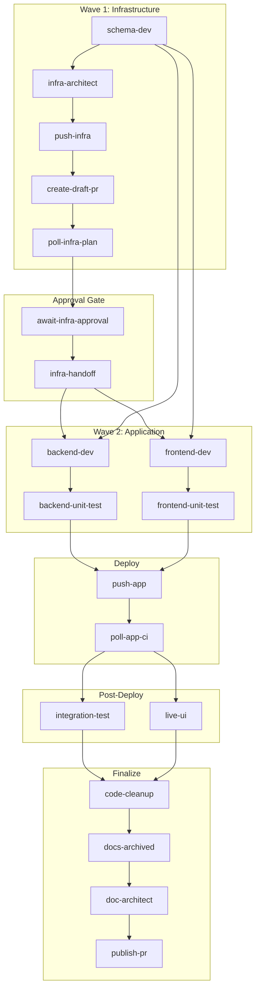
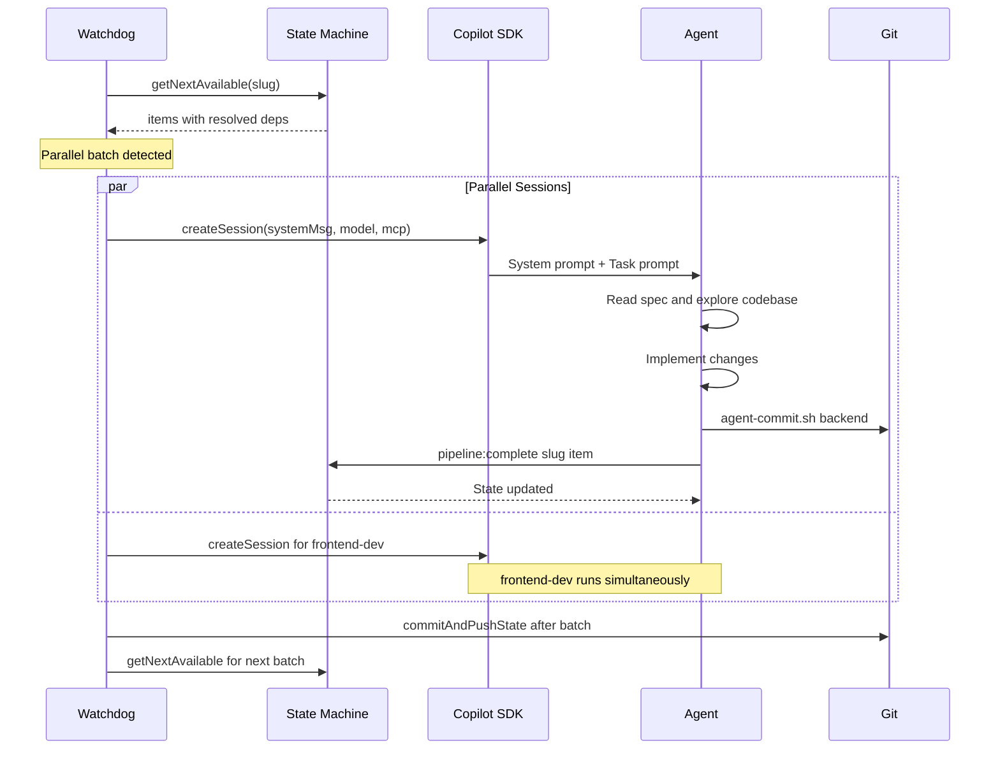
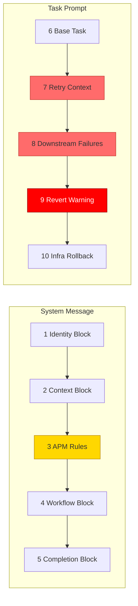
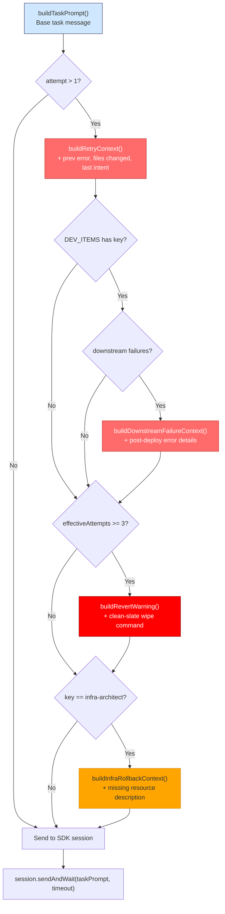
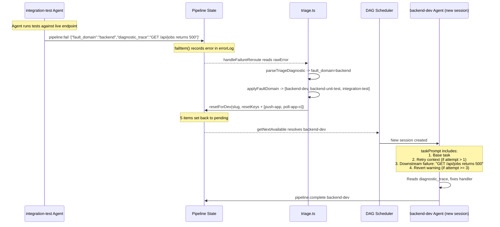
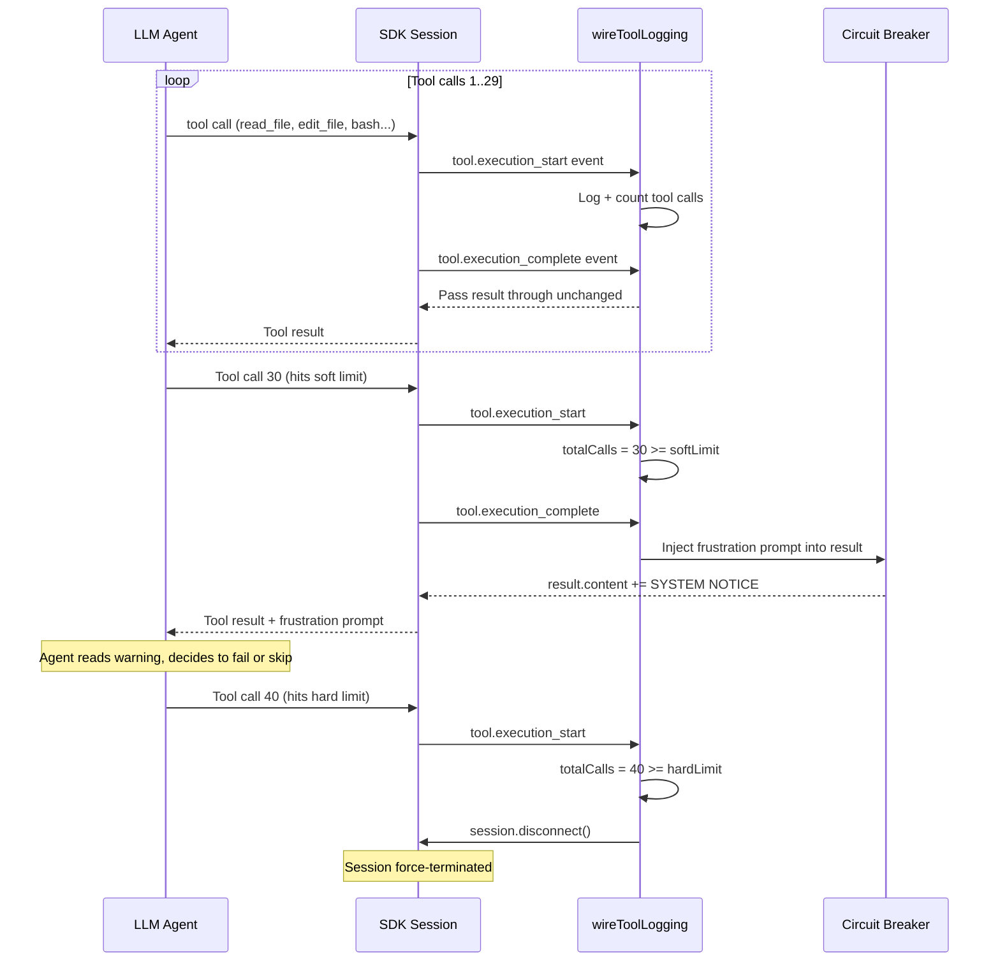
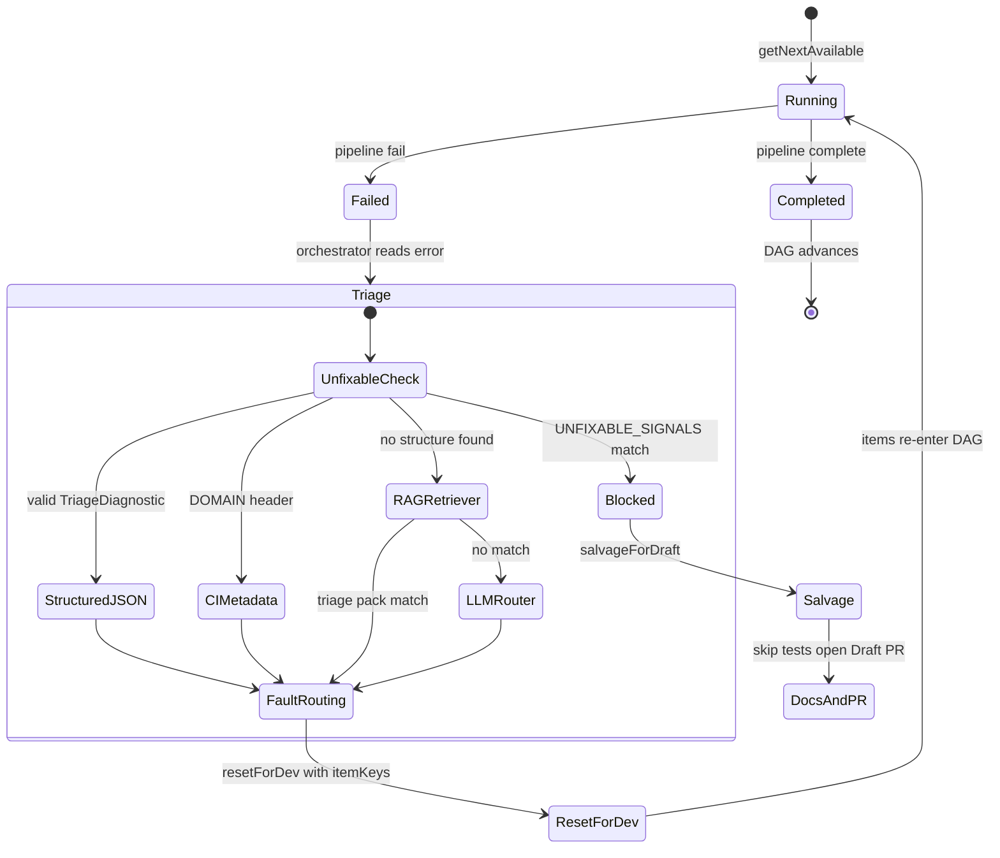
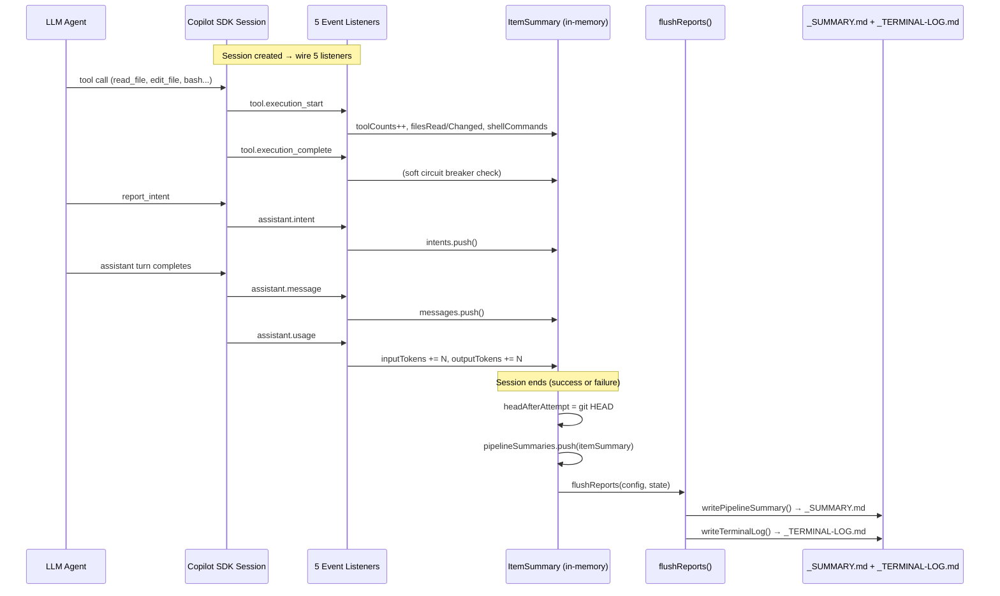
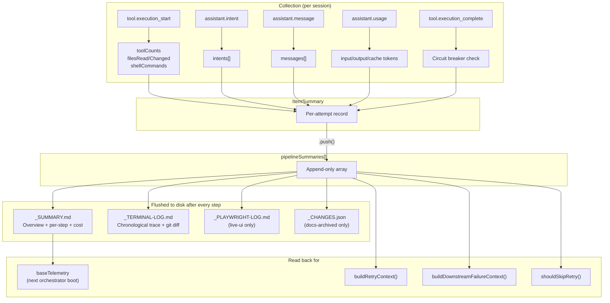

# How Agents Communicate with the DAG — Architecture Deep-Dive

## 1. The DAG: Structure and Purpose

The pipeline is a **Directed Acyclic Graph** of 19 items defined in `tools/autonomous-factory/pipeline-state.mjs`, organized into a **Two-Wave model** (infra first, app second) with 6 phases.



The DAG dependency map lives in `ITEM_DEPENDENCIES` at `pipeline-state.mjs` L94–118. The key insight: `backend-dev` and `frontend-dev` **run in parallel** because they share the same dependency set (`schema-dev` + `infra-handoff`). Similarly, `backend-unit-test` and `frontend-unit-test` are parallelizable.

Workflow types (`Backend`, `Frontend`, `Full-Stack`, `Infra`, `App-Only`, `Backend-Only`) control which items are marked `N/A` at init via `NA_ITEMS_BY_TYPE` at `pipeline-state.mjs` L81–90 — e.g., a `Backend` workflow skips `frontend-dev`, `frontend-unit-test`, and `live-ui`.

## 2. State: the Single Source of Truth

The **State** (`_STATE.json`) is owned exclusively by `pipeline-state.mjs` and serves 4 critical purposes:

| Purpose | How |
|---|---|
| **DAG resolution** | `getNextAvailable()` (L761–806) scans all items, checks if every dependency is `done` or `na`, returns **all parallelizable items** |
| **Phase gating** | `completeItem()` (L276–312) validates no items in prior phases are incomplete |
| **Failure routing** | `failItem()` records structured errors; `resetForDev()` resets items for redevelopment cycles with **cascading post-deploy resets** — when deploy items are reset, any `done` post-deploy items are also reset to prevent stale verification results |
| **Concurrency control** | `withLock()` (L217–236) uses POSIX `mkdirSync` as an atomic mutex to prevent TOCTOU races when parallel agents complete simultaneously |

State transitions are **strictly deterministic** — agents never edit state files directly. They can only call:

```bash
npm run pipeline:complete <slug> <item-key>
npm run pipeline:fail <slug> <item-key> <message>
npm run pipeline:doc-note <slug> <item-key> <note>
```

## 3. The Orchestrator Loop: How Agents Talk to the DAG

Agents **never see the DAG**. The orchestrator (`tools/autonomous-factory/src/watchdog.ts`) is the sole mediator:



Key architectural decisions:

1. **Agents are stateless** — each gets a fresh `CopilotClient` session with no memory of prior sessions
2. **The watchdog is a `while(true)` loop** (`watchdog.ts` L288–380) that terminates on `complete`, `blocked`, or `halt`
3. **State commits are centralized** — `commitAndPushState()` (`watchdog.ts` L218–290) runs **after** each parallel batch, eliminating git contention between parallel agents. A **push guard** inspects `git diff --name-only origin/<branch>..HEAD` — if any files outside `in-progress/` or `archive/` are unpushed, the push is deferred to the deterministic `push-app`/`push-infra` step, preventing premature deploy-workflow triggers from stale code pushes
4. **Deterministic bypasses** — `push-infra`, `push-app`, `poll-infra-plan`, `poll-app-ci` skip the SDK entirely and run shell scripts directly (`session-runner.ts` L660, L728). A `DEPLOY_ITEMS` guard at L485 with a `throw new Error()` safety net ensures no deploy item ever falls through to an LLM session. Note: `create-draft-pr` is *not* in `DEPLOY_ITEMS` — it requires an LLM agent session for PR creation.

## 4. Agent Prompt Assembly: What Each Agent Receives

Each agent's prompt is assembled from **10 layers** in two groups:



### Layer-by-Layer Breakdown

#### Layer 1–2: Identity + Context (LOW importance for correctness, HIGH for orientation)

Defined per-agent in `tools/autonomous-factory/src/agents.ts`. Example from `backendDevPrompt()` at L199–210:

```typescript
`# Backend & Infrastructure Developer
You are a senior backend developer specializing in **Azure Functions v4 with TypeScript**...
# Context
- Feature: ${ctx.featureSlug}
- Spec: ${ctx.specPath}
- Repo root: ${ctx.repoRoot}
- App root: ${ctx.appRoot}`
```

The `AgentContext` interface (`agents.ts` L23–38) is populated from the APM manifest's `config.environment` dictionary — a generic key-value map where keys are app-defined (e.g., `BACKEND_URL`, `FRONTEND_URL`, `FUNC_APP_NAME`). Test commands and commit scopes are also manifest-driven. No cloud-provider-specific fields in the interface.

#### Layer 3: APM Compiled Rules (HIGHEST importance — gold box above)

This is the **single most important layer**. The APM compiler (`tools/autonomous-factory/src/apm-compiler.ts`) reads `apps/<app>/.apm/apm.yml` and:

1. Resolves instruction references — a directory ref like `backend` loads ALL `.md` files in `.apm/instructions/backend/` alphabetically; a file ref like `tooling/roam-tool-rules.md` loads that single file
2. Concatenates them into a single `rulesBlock` prefixed with `## Coding Rules\n\n`
3. Validates token count against the budget (8000 tokens for sample-app)

From `apps/sample-app/.apm/apm.yml` L8–9:

```yaml
backend-dev:
  instructions: [always, backend, tooling/roam-tool-rules.md, tooling/roam-efficiency.md]
```

This means `backend-dev` gets: all files from `instructions/always/` + all files from `instructions/backend/` + `roam-tool-rules.md` + `roam-efficiency.md`. Injected via `${apmContext.agents["backend-dev"].rules}`.

#### Layer 4: Workflow (HIGH importance for agent behavior)

The step-by-step numbered workflow unique per agent type (`agents.ts` L220–264). Includes: read spec, use roam tools for codebase orientation, implement, run security audit, run local quality gate, commit with proper scope, leave doc-note for docs-archived.

#### Layer 5: Completion Block (CRITICAL for DAG communication)

Generated by `completionBlock()` at `agents.ts` L68–142. This is **the only mechanism** by which agents communicate back to the DAG:

```bash
# Success:
npm run pipeline:complete <slug> <item-key>
# Failure (structured JSON for post-deploy items):
npm run pipeline:fail <slug> <item-key> '{"fault_domain":"backend","diagnostic_trace":"..."}'
```

For `infra-architect`, the completion block also includes a mandatory Terraform validation gate — the agent must run `terraform plan` locally before marking complete.

#### Layers 6–10: Task Prompt with Context Injection (CRITICAL for self-healing)

Context injection is the mechanism that makes the pipeline **self-healing** rather than retry-and-hope. It works by appending structured context fragments to the `taskPrompt` string **before** it is sent to the SDK session — so the LLM agent receives the injected context as part of its user message on the very first turn.

All injection logic lives in `tools/autonomous-factory/src/context-injection.ts` — pure string builders with zero SDK coupling. The orchestration point is in `runAgentSession()` at `session-runner.ts` L965–1100, where injections are evaluated in sequence and appended to `taskPrompt`.

##### When does injection happen?

Injection happens in `runAgentSession()` **after** `buildTaskPrompt()` creates the base message and **before** `session.sendAndWait()` sends it to the LLM. The decision tree:



On first attempt (`attemptCounts[key] === 1`), **no context is injected** — the agent gets only the base task prompt. Injection only activates when an item is being retried.

##### The 4 Injection Types in Detail

**1. Retry Context** — `buildRetryContext()` (`context-injection.ts` L19–44)

Triggered when `attemptCounts[itemKey] > 1` (any item being retried). The orchestrator searches `pipelineSummaries` in reverse to find the most recent failed attempt for this item, then appends:

```markdown
## Previous Attempt Context (attempt 2)
The previous session failed: Cannot read property 'id' of undefined
Files already modified: backend/src/functions/fn-generate.ts, backend/src/functions/__tests__/fn-generate.test.ts
Last reported intent: "Implementing the /generate endpoint"
Pipeline operations that already succeeded:
  - bash tools/autonomous-factory/agent-commit.sh backend "feat(backend): add generate endpoint"

Start by checking what was already done (git status, run tests) rather than re-reading the full codebase from scratch.
```

This prevents the agent from wasting tokens re-reading files it already modified. The data comes from `ItemSummary` — `filesChanged`, `intents`, `shellCommands` captured by `wireToolLogging()` during the previous session.

Two critical details:
- If `atRevertThreshold` is true (effective attempts ≥ 3 for dev items), the incremental advice ("Start by checking what was already done...") is **omitted** — because the revert warning (below) tells the agent to wipe everything, making incremental advice counterproductive.
- If the previous attempt **timed out** (error contains "Timeout"), the retry context switches to **scope reduction mode**: "Start by checking what was already done: `git status`, run tests. Focus ONLY on unfinished work — do NOT re-read the full codebase." This prevents the common failure pattern where a retrying agent wastes its entire budget re-exploring files that were already modified.

**2. Downstream Failure Context** — `buildDownstreamFailureContext()` (`context-injection.ts` L51–97)

Triggered **only for `DEV_ITEMS`** (`backend-dev`, `frontend-dev`, `schema-dev`, `infra-architect`) when `pipelineSummaries` contains failed entries from `POST_DEPLOY_ITEMS` (`live-ui`, `integration-test`, `poll-app-ci`, `poll-infra-plan`). This is the core of the redevelopment cycle — it tells the dev agent **exactly what broke in production**:

```markdown
## Redevelopment Context (CRITICAL)
The following post-deploy verification steps failed. Fix the root cause in your code:

### integration-test (attempt 1)
Outcome: failed
Error: {"fault_domain":"backend","diagnostic_trace":"API endpoint GET /api/jobs returns 500 — response body: {\"error\":\"Cannot read property 'id' of undefined\"}"}
Pipeline ops:
  - npm run pipeline:fail my-feature integration-test '{"fault_domain":"backend",...}'

Focus on the errors above — they describe exactly what broke in production.
```

If the error involves CI/CD workflow files (`.github/workflows/`), an additional **Commit Scope Warning** is appended telling the agent to use the `cicd` commit scope instead of `backend` or `frontend` — because workflow files are outside the default commit scopes and would be silently dropped.

**3. Revert Warning** — `buildRevertWarning()` (`context-injection.ts` L103–112)

Triggered when `effectiveDevAttempts >= 3` for `DEV_ITEMS` only. `effectiveDevAttempts` is the **maximum** of in-memory attempt count and persisted redevelopment cycle count from the state's `errorLog` (computed by `computeEffectiveDevAttempts()` at `context-injection.ts` L141–154). This survives orchestrator restarts:

```markdown
## 🚨 CRITICAL SYSTEM WARNING
You have failed to fix this feature 3 times. You are likely trapped in a hallucination loop.
RECOMMENDED ACTION: Run `bash tools/autonomous-factory/agent-branch.sh revert` to physically
wipe the codebase clean back to the main branch. Then, re-explore the codebase and build
this feature using a completely different architectural approach.
```

This is the nuclear option — it tells the agent to `git reset --hard` to the base branch and start over. It works alongside the circuit breaker: `shouldSkipRetry()` (using normalized traces via `normalizeDiagnosticTrace()`) detects identical errors without code changes and normally halts the pipeline, but for DEV items it grants **one bypass** (`circuitBreakerBypassed` set in `session-runner.ts` L376–378) so the revert warning gets a chance to fire.

**4. Infra Rollback Context** — `buildInfraRollbackContext()` (`context-injection.ts` L119–134)

Triggered **only for `infra-architect`** when the state's `errorLog` contains entries with `itemKey === "redevelop-infra"`. This happens when a Wave 2 app agent (e.g., `backend-dev`) discovers that deployed infrastructure is missing a resource it needs and calls `npm run pipeline:redevelop-infra`:

```markdown
## ⚠️ INFRASTRUCTURE REJECTED BY APPLICATION TEAM
The previous application deployment wave failed because the following infrastructure
was missing or misconfigured:

> Missing Cosmos container — backend needs 'jobs' container for bulk processing

You MUST update your Terraform code to fulfill this requirement before completing this task.
```

##### The End-to-End Redevelopment Cycle

The most common path through context injection is the **redevelopment cycle** — when a post-deploy test fails and the fix needs to loop back to a dev agent:



Step by step:

1. **`integration-test` agent** runs tests against the live endpoint and discovers a 500 error
2. Agent calls `pipeline:fail` with a structured `TriageDiagnostic` JSON (`fault_domain: "backend"`)
3. **`handleFailureReroute()`** in `session-runner.ts` reads the error and calls `triageFailure()`
4. **`triageFailure()`** in `triage.ts` parses the JSON, extracts `fault_domain`, and calls `applyFaultDomain("backend")` → returns `["backend-dev", "backend-unit-test", "integration-test"]`
5. **`resetForDev()`** in `pipeline-state.mjs` sets those items + `push-app` + `poll-app-ci` back to `"pending"`, cascades any `done` post-deploy items back to `"pending"`, records a `"reset-for-dev"` entry in `errorLog`, and checks the 5-cycle limit
6. The **watchdog loop** calls `getNextAvailable()` again — `backend-dev` is now pending with all its DAG dependencies still `"done"`, so it's immediately runnable
7. **`runItemSession()`** creates a new session for `backend-dev` with `attemptCounts[backend-dev] = 2`
8. Context injection kicks in: `buildRetryContext()` appends the previous failure details, `buildDownstreamFailureContext()` appends the exact integration-test error including `"GET /api/jobs returns 500"`
9. The agent reads the injected diagnostic, **knows exactly what to fix**, and doesn't waste tokens exploring

##### The Cognitive Circuit Breaker — Runtime Injection

There are **two more injection types** that don't happen at prompt assembly time — they happen **during** the session via SDK event hooks. The first is the cognitive circuit breaker in `wireToolLogging()` at `session-runner.ts` L1345–1440:



These work differently from the prompt-time injections — they **mutate the tool result content** that the SDK returns to the LLM on the `tool.execution_complete` event:

```typescript
// Mutate the result content that will be sent back to the LLM
if (event.data.result && typeof event.data.result.content === "string") {
  event.data.result.content += frustrationPrompt;
}
```

The frustration prompt is:
```
⚠️ SYSTEM NOTICE: You have executed 30 tool calls in this session (soft limit: 30).
You appear to be stuck in a debugging loop. If you are fighting a persistent testing
framework limitation, document it with pipeline:doc-note and test.skip() the test.
If this is a real implementation bug, use `npm run pipeline:fail` to trigger a
redevelopment cycle. DO NOT continue debugging — decide now.
```

This is injected **into the content visible to the LLM**, not just logged to console (which the agent can't see). Per-agent tool limits are configurable in `apm.yml` via `toolLimits: { soft: N, hard: M }` — e.g., `live-ui` gets `soft: 50, hard: 65` because Playwright browser testing legitimately requires more tool calls.

##### The Pre-Timeout Wrap-Up Signal — Runtime Injection

A second runtime injection fires at **80% of the session timeout** (e.g., 16 minutes into a 20-minute DEV session). Like the frustration prompt, it mutates `tool.execution_complete` result content:

```
⏰ SYSTEM NOTICE: Session timeout approaching — ~240s remaining.
You MUST wrap up NOW. Commit whatever work you have completed so far via
agent-commit.sh, then call pipeline:complete if the feature is functional,
or pipeline:fail with a diagnostic if it is not.
Do NOT start new exploratory work. Prioritize: commit → test → complete/fail.
```

This gives the LLM a window to gracefully commit and report status before the hard timeout kills the session. Without this, timed-out sessions produce zero diagnostic context — the circuit breaker sees "Timeout after 1200000ms" with no indication of what was accomplished.

##### The Change Manifest — Docs-Expert Injection

One final injection mechanism: `writeChangeManifest()` (`context-injection.ts` L161–198) runs **before** the `docs-archived` session. Instead of appending to the task prompt, it writes a `_CHANGES.json` file that the docs-archived agent reads during its workflow. This file contains:

```json
{
  "feature": "my-feature",
  "stepsCompleted": [
    {
      "key": "backend-dev",
      "agent": "@backend-dev",
      "filesChanged": ["backend/src/functions/fn-jobs.ts"],
      "docNote": "Added SSE streaming to /jobs endpoint via new fn-jobs.ts"
    }
  ],
  "allFilesChanged": ["backend/src/functions/fn-jobs.ts", "frontend/src/app/jobs/page.tsx"],
  "summaryIntents": ["Implementing the /jobs endpoint", "Adding SSE streaming support"]
}
```

The `docNote` values come from dev agents calling `npm run pipeline:doc-note` before `pipeline:complete` — this is the "Pass the Baton" pattern where each agent leaves structured notes for downstream agents.

##### Summary of All 7 Injection Points

| # | Injection | Where | When | Target | Mechanism |
|---|---|---|---|---|---|
| 1 | Retry context | `context-injection.ts` | `attempt > 1` | Any retried item | Append to `taskPrompt` |
| 2 | Downstream failure | `context-injection.ts` | Dev item after post-deploy fail | `DEV_ITEMS` only | Append to `taskPrompt` |
| 3 | Revert warning | `context-injection.ts` | `effectiveAttempts >= 3` | `DEV_ITEMS` only | Append to `taskPrompt` |
| 4 | Infra rollback | `context-injection.ts` | `infra-architect` after `redevelop-infra` | `infra-architect` only | Append to `taskPrompt` |
| 5 | Frustration prompt | `session-runner.ts` | Tool calls >= soft limit | Any agent in-session | Mutate `tool.execution_complete` result |
| 6 | Pre-timeout wrap-up | `session-runner.ts` | 80% of session timeout elapsed | Any agent in-session | Mutate `tool.execution_complete` result |
| 7 | Change manifest | `context-injection.ts` | Before `docs-archived` session | `docs-archived` only | Write `_CHANGES.json` file |

Session creation happens at `session-runner.ts` L997–1005:

```typescript
const session = await client.createSession({
  model: agentConfig.model,
  workingDirectory: repoRoot,
  onPermissionRequest: approveAll,
  systemMessage: { mode: "replace", content: agentConfig.systemMessage },
  ...(agentConfig.mcpServers ? { mcpServers: agentConfig.mcpServers } : {}),
});
```

The `ITEM_ROUTING` map (`agents.ts` L1679–1770) binds each pipeline item key to its prompt builder + MCP server resolution.

## 5. The Self-Healing Feedback Loop

The most sophisticated part — the **triage, reroute, and recover** cycle:



The triage system in `tools/autonomous-factory/src/triage.ts` evaluates failures through Tiers 0–4:

0. **Unfixable signals** — halt immediately (Azure AD errors, state locks, permission denied)
1. **Structured JSON** — agent emits `{"fault_domain":"backend","diagnostic_trace":"..."}`, routed by `fault_domain`. A **Defense-in-Depth validation layer** (`validateFaultDomain()`) checks the triage knowledge base via `retrieveTopMatches()` for cicd-domain matches — if deterministic signals prove the root cause involves `.github/workflows/` files, the original domain is *kept* (so the dev agent runs and can fix the workflow) but deploy items (`push-app`, `poll-app-ci`) are *augmented* into the reset list. Returns `ValidationResult { domain, augmentWithDeploy }`, not a domain override.
2. **CI `DOMAIN:` header** — job-based routing from `poll-ci.sh` metadata
3. **Local RAG retriever** — `retrieveTopMatches()` in `triage/retriever.ts` performs case-insensitive substring matching against pre-compiled triage pack signatures (`.apm/triage-packs/*.json`), ranked by specificity (longest `error_snippet` wins). Cost: $0, latency: <1ms.
4. **LLM Router fallback** — `askLlmRouter()` in `triage/llm-router.ts` classifies novel errors via Copilot SDK with strict domain enum injection. Novel classifications are persisted to `_NOVEL_TRIAGE.jsonl` (Data Flywheel) for humans to generalize into triage pack signatures. Falls back to `{ fault_domain: "blocked" }` on timeout or hallucination.

### Fault Domain Routing

| `fault_domain` | Items reset |
|---|---|
| `backend` | `backend-dev` + `backend-unit-test` + failing item |
| `frontend` | `frontend-dev` + `frontend-unit-test` + failing item |
| `both` | All dev + test items |
| `backend+infra` | `backend-dev` + `backend-unit-test` + failing item |
| `frontend+infra` | `frontend-dev` + `frontend-unit-test` + failing item |
| `deployment-stale` | `push-app` + `poll-app-ci` + failing item (code is correct — only re-deploy needed) |
| `cicd` | `push-app` + `poll-app-ci` + failing item (workflow file issue — only used when agent itself classifies as cicd) |

> **CI/CD Augmentation:** When validation detects CI/CD root-cause indicators (via `CICD_ROOT_CAUSE_INDICATORS` or cicd-domain triage KB matches) in an error classified as another domain (e.g., `backend+infra`), the original domain's reset keys are kept *and* `push-app` + `poll-app-ci` are added. This ensures the dev agent runs to fix the `.github/workflows/` file (using dual-scope commit instructions from Fix C) and the deploy pipeline re-runs to verify.
| `infra` | `infra-architect` + failing item |
| `environment` | Failing item only (not a code bug — retry may resolve) |
| `blocked` | Empty — pipeline halts, triggers Graceful Degradation to Draft PR |

### Safety Rails

- **Circuit breaker** (`session-runner.ts` L229–310) — `normalizeDiagnosticTrace()` (L229) strips dynamic metadata (git SHAs, timestamps, run IDs, line numbers) from diagnostic traces before comparison, preventing false negatives where semantically identical errors differ only in build-specific entropy. `shouldSkipRetry()` (L260) then compares normalized traces + checks if only pipeline state files changed since last attempt. For DEV items stuck in **timeout loops**, triggers `salvageForDraft()` instead of halting — opens a Draft PR for human review rather than losing all work
- **Cognitive circuit breaker** (`session-runner.ts` L1345–1440) — soft limit injects frustration prompt into tool results; hard limit force-disconnects. **Pre-timeout wrap-up** fires at 80% of session timeout to give the agent a chance to commit and report status
- **Self-mutating validation hooks** — the orchestrator delegates deployment verification to **self-mutating bash scripts** that agents dynamically extend as they provision new infrastructure or endpoints:
  - `runValidateApp()` (`session-runner.ts`) — runs after `poll-app-ci` succeeds. Delegates to `hooks.validateApp` (`.apm/hooks/validate-app.sh`). If the hook exits `1`, the item fails with `deployment-stale` fault domain and triggers triage reroute — blocking expensive post-deploy agents from booting up. `@backend-dev` and `@frontend-dev` append endpoint checks to this hook as they create new routes
  - `runValidateInfra()` (`session-runner.ts`) — runs after `infra-handoff` agent session completes. Delegates to `hooks.validateInfra` (`.apm/hooks/validate-infra.sh`). If the hook exits `1`, the item fails with `infra` fault domain → triage resets `["infra-architect", "infra-handoff"]`. `@infra-architect` appends resource reachability checks to this hook as it provisions new data-plane resources
- **Post-deploy propagation delay** — 60-second wait before all post-deploy items on every attempt. Deployments can take 30–90s to propagate after workflow success
- **Max limits** — 10 retries per item, 5 redevelopment cycles, 3 re-deploy cycles (configurable via `max_redeploy_cycles` in `workflows.yml`)

## 6. What Matters Most vs. Least

### Most Important (correctness-critical)

1. **`ITEM_DEPENDENCIES` DAG** — defines parallelism and ordering. A wrong edge = stuck pipeline or premature execution
2. **APM rules injection** (`apmContext.agents[key].rules`) — domain-specific coding knowledge that keeps agents correct
3. **Completion block** — the only agent-to-DAG communication channel. Structured JSON is enforced by Zod at the triage layer
4. **Context injection** — retry + downstream failures are what make the system self-healing
5. **Cognitive circuit breaker** — prevents runaway compute

### Less Important (nice-to-have, operational)

1. **Agent identity blocks** ("You are a senior backend developer...") — orientation-only
2. **Tool logging/labeling** — observability, not correctness
3. **Feature archiving** — cleanup after PR creation
4. **Roam preamble in task prompt** — helpful but optional; agents fall back to grep/read if roam MCP is unavailable
5. **Playwright log capture** — diagnostic only

### The "Secret Sauce" — Separation of LLM vs. Determinism

| LLM decides | Deterministic code decides |
|---|---|
| What code to write | Which agent runs next (DAG) |
| How to classify an error (`fault_domain`) | Where to route the fix (`triageFailure`) |
| Whether to call `pipeline:complete` or `pipeline:fail` | When to halt, revert, or salvage |
| What intent to report | When circuit breaker fires |

The LLM is a **worker bee** — it gets narrow, well-scoped instructions and reports through a structured contract. The DAG state machine is the **brain** — it decides what runs next, when to retry, when to give up, and how to self-heal.

## 7. Telemetry: How Agent Logs Are Scraped

Every agent session — whether it completes, fails, or gets circuit-broken — produces a structured `ItemSummary` record. These records feed the reporting system, the self-healing context injection, and the circuit breaker. Here's the full pipeline: collection → accumulation → flush → reuse.

### The ItemSummary Record

Defined in `types.ts` L96–137, `ItemSummary` captures everything about one attempt at one DAG item:

| Field | Type | Captured by |
|---|---|---|
| `key`, `label`, `agent`, `phase` | `string` | Set at creation from `NextAction` |
| `attempt` | `number` | From `attemptCounts[key]` |
| `startedAt`, `finishedAt`, `durationMs` | timing | Set before/after `sendAndWait()` |
| `outcome` | `"completed"\|"failed"\|"error"` | Set from post-session state re-read or on SDK exception |
| `intents` | `string[]` | `wireIntentLogging()` — `assistant.intent` events |
| `messages` | `string[]` | `wireMessageCapture()` — `assistant.message` events |
| `filesRead` | `string[]` | `wireToolLogging()` — `read_file`/`view` tool calls |
| `filesChanged` | `string[]` | `wireToolLogging()` — `write_file`/`edit_file`/`create_file` tool calls + `extractShellWrittenFiles()`. **Git-diff fallback:** after session disconnect, if `filesChanged` is empty, `getAgentDirectoryPrefixes()` (L110) scopes a `git diff --name-only <preStepRef>..HEAD` to the agent's directories to catch files written by tools the SDK didn't instrument |
| `shellCommands` | `ShellEntry[]` | `wireToolLogging()` — `bash`/`write_bash` tool calls (first line, ≤200 chars) |
| `toolCounts` | `Record<string, number>` | `wireToolLogging()` — per-category counter (file-read, file-write, shell, search, intent) |
| `errorMessage` | `string?` | Set on failure, SDK exception, or hard circuit breaker |
| `headAfterAttempt` | `string?` | `git rev-parse HEAD` after session — used by `shouldSkipRetry()` |
| `inputTokens`, `outputTokens`, `cacheReadTokens`, `cacheWriteTokens` | `number` | `wireUsageTracking()` — `assistant.usage` events (accumulated via `+=`) |

Supporting types: `ShellEntry` (L139–144) has `{ command, timestamp, isPipelineOp }` where `isPipelineOp` is true for `pipeline:complete/fail` and `agent-commit.sh` calls. `PlaywrightLogEntry` (L147–153) has `{ timestamp, tool, args, success, result }`.

### The 5 Event Listeners

All 5 are wired in `runAgentSession()` at `session-runner.ts` L1016–1020, immediately after `client.createSession()`:

```typescript
wireToolLogging(session, itemSummary, repoRoot, agentToolLimits);
const playwrightLog = wirePlaywrightLogging(session, next.key);
wireIntentLogging(session, itemSummary);
wireMessageCapture(session, itemSummary);
wireUsageTracking(session, itemSummary);
```

#### 1. `wireToolLogging()` — `session-runner.ts` L1345–1440

Subscribes to **two** events:

- **`tool.execution_start`** (L1351): On every tool call:
  1. Logs a human-readable line to console using `TOOL_LABELS` (e.g., `📄 Read → backend/src/functions/fn-hello.ts`)
  2. Categorizes the tool via `TOOL_CATEGORIES` map (e.g., `read_file` → `"file-read"`, `bash` → `"shell"`), increments `itemSummary.toolCounts[category]`
  3. File tracking: `write_file`/`edit_file`/`create_file` → pushes to `filesChanged`; `read_file`/`view` → pushes to `filesRead` (both deduped)
  4. Shell capture: `bash`/`write_bash` → extracts first line (≤200 chars), detects `isPipelineOp` via regex `/pipeline:(complete|fail|set-note|set-url)|agent-commit\.sh/`, pushes `ShellEntry` to `shellCommands`
  5. Shell file write detection: calls `extractShellWrittenFiles()` (L82–95) which matches against 7 `SHELL_WRITE_PATTERNS` (L66–74) — `sed -i`, `tee`, `cat >`, `echo >`, `printf >`, `cp`, `mv` — and captures target file paths, resolved relative to repo root, excluding `_STATE.json` and `_TRANS.md`
  6. **Cognitive circuit breaker (hard)**: if `totalCalls >= hardLimit` (default 40), sets `outcome = "error"`, records error message, calls `session.disconnect()` to force-terminate

- **`tool.execution_complete`** (L1408): Soft circuit breaker — if `totalCalls >= softLimit` (default 30) and not yet fired, mutates `event.data.result.content` to append the frustration prompt. This is the only listener that **modifies** SDK data rather than just reading it.

#### 2. `wirePlaywrightLogging()` — `session-runner.ts` L1477–1520

Only active when `itemKey === "live-ui"`. Returns a local `PlaywrightLogEntry[]` array (not written into `ItemSummary`).

- **`tool.execution_start`** (L1483): Filters for tools starting with `"playwright-"`, creates entry with `{ timestamp, tool, args }`, logs with 🎭 prefix
- **`tool.execution_complete`** (L1499): Finds the open entry (no `success` yet), sets `success` and `result` (truncated to 500 chars)

The array is consumed after the session by `writePlaywrightLog()` in `reporting.ts` L143–177, which writes `<slug>_PLAYWRIGHT-LOG.md` with per-action sections showing ✅/❌ status, arguments, and results.

#### 3. `wireIntentLogging()` — `session-runner.ts` L1524–1528

- **`assistant.intent`**: Pushes `event.data.intent` to `itemSummary.intents`. These are high-level agent self-reports like "Implementing the /generate endpoint".

#### 4. `wireMessageCapture()` — `session-runner.ts` L1531–1537

- **`assistant.message`**: Pushes whitespace-normalized `event.data.content` to `itemSummary.messages`. Captures the full text of every assistant turn.

#### 5. `wireUsageTracking()` — `session-runner.ts` L1540–1555

- **`assistant.usage`**: Accumulates `inputTokens`, `outputTokens`, `cacheReadTokens`, `cacheWriteTokens` via `+=`. Skips zero-usage events.



### Accumulation and Flushing

After every session (success, failure, circuit-break, auto-skip, deterministic bypass), the same sequence runs:

1. `itemSummary.headAfterAttempt = git rev-parse HEAD` — snapshot for circuit breaker dedup
2. `pipelineSummaries.push(itemSummary)` — append to the in-memory `PipelineRunState` array
3. `flushReports(config, state)` (`session-runner.ts` L1564–1570) — calls two report writers:

#### `writePipelineSummary()` — `reporting.ts` L252–412

Writes `<appRoot>/in-progress/<slug>_SUMMARY.md`. Sections:

1. **Overview table** — total steps, duration, files changed, total tokens, estimated cost (USD). All values are **monotonically merged** with `baseTelemetry` (see below).
2. **Steps** — per-step detail grouped by phase: tool usage breakdown, intents, files changed, pipeline operations (commits, state mutations), final agent summary (last message snippet)
3. **Scope of Changes** — all changed files grouped by directory
4. **Failure Log** — table of step/attempt/error/resolution for each failed attempt
5. **Cost Analysis** — per-step token breakdown with `inputTokens × rate + outputTokens × rate` → USD

#### `writeTerminalLog()` — `reporting.ts` L418–655

Writes `<appRoot>/in-progress/<slug>_TERMINAL-LOG.md`. Contains everything in `_SUMMARY.md` plus:

- Git commit history (`git log <base>..HEAD`)
- Git diff stat vs base branch
- Chronological interleaved execution trace per step (shell commands with timestamps + intents)
- Files read listing per step

Both reports atomically overwrite their file on every flush — the latest version always reflects all sessions in the current run.

### Monotonic Accumulation Across Restarts

When the orchestrator starts, `watchdog.ts` L337–352 calls `parsePreviousSummary()` (`reporting.ts` L200–248) to read the existing `_SUMMARY.md` and extract its overview numbers via regex into a `PreviousSummaryTotals` struct (steps, completed, failed, duration, files, tokens, cost). This becomes `baseTelemetry`.

On every flush, `writePipelineSummary()` adds `baseTelemetry` to the current session's totals:

```typescript
const mergedSteps = summaries.length + (base?.steps ?? 0);
const mergedTokens = totalTokens + (base?.tokens ?? 0);
const mergedCost = totalCost + (base?.costUsd ?? 0);
```

This guarantees metrics never go backwards even if the orchestrator restarts mid-pipeline — the new run's fresh `pipelineSummaries[]` starts empty, but the persisted totals from the previous run are loaded and added back.

### Downstream Consumers

The `pipelineSummaries[]` array and the flushed files serve **4 downstream purposes** beyond human-readable reports:

| Consumer | What it reads | Purpose |
|---|---|---|
| `shouldSkipRetry()` | `errorMessage` + `headAfterAttempt` from last attempt for same key | Circuit breaker — detect identical error loops |
| `buildRetryContext()` | Last `ItemSummary` for same key (reverse scan) — `errorMessage`, `filesChanged`, `intents`, `shellCommands` | Tell retrying agent what was already tried |
| `buildDownstreamFailureContext()` | All summaries where `POST_DEPLOY_ITEMS.has(key)` and `outcome !== "completed"` | Tell dev agent what broke in production |
| `writeChangeManifest()` | All completed summaries — `filesChanged`, plus `docNote` from `_STATE.json` | Build `_CHANGES.json` for docs-archived agent |

### Doc-Notes: Agent → State → Manifest

Doc-notes follow a separate path from telemetry. When a dev agent calls `npm run pipeline:doc-note <slug> <key> <note>`, `pipeline-state.mjs` writes the note to `state.items[key].docNote` in `_STATE.json`. These are **not** captured in `ItemSummary`. Instead, `writeChangeManifest()` reads them from `_STATE.json` when building `_CHANGES.json` for the `docs-archived` agent, combining them with `filesChanged` from `pipelineSummaries`.



## Key Source Files

| File | Role |
|---|---|
| `tools/autonomous-factory/pipeline-state.mjs` | DAG definition, state machine, all mutations |
| `tools/autonomous-factory/src/watchdog.ts` | Main orchestrator loop |
| `tools/autonomous-factory/src/session-runner.ts` | Dispatch kernel — routes items to handler plugins |
| `tools/autonomous-factory/src/handlers/` | Handler plugin system (copilot-agent, git-push, github-ci-poll, github-pr-publish, local-exec) |
| `tools/autonomous-factory/src/session/` | Session submodules (shared, readiness-probe, triage-dispatcher, session-events, script-executor) |
| `tools/autonomous-factory/src/agents.ts` | Agent prompt factory |
| `tools/autonomous-factory/src/apm-compiler.ts` | APM manifest compiler (rules assembly) |
| `tools/autonomous-factory/src/tool-harness.ts` | Tool call harness & cognitive circuit breaker |
| `tools/autonomous-factory/src/context-injection.ts` | Retry/downstream/revert prompt augmentation |
| `tools/autonomous-factory/src/triage.ts` | Structured error triage and fault routing |
| `tools/autonomous-factory/src/triage/` | Triage subsystem (retriever, llm-router, error-fingerprint) |
| `tools/autonomous-factory/src/reporting.ts` | Report writers: `_SUMMARY.md`, `_TERMINAL-LOG.md`, `_PLAYWRIGHT-LOG.md` |
| `tools/autonomous-factory/src/archive.ts` | Feature file archiving logic |
| `tools/autonomous-factory/src/types.ts` | Shared TypeScript interfaces (`ItemSummary`, `ShellEntry`, `PlaywrightLogEntry`) |
| `tools/autonomous-factory/src/state.ts` | Thin async wrappers over `pipeline-state.mjs` |
| `apps/sample-app/.apm/apm.yml` | APM manifest (agent declarations, budgets, MCP) |
