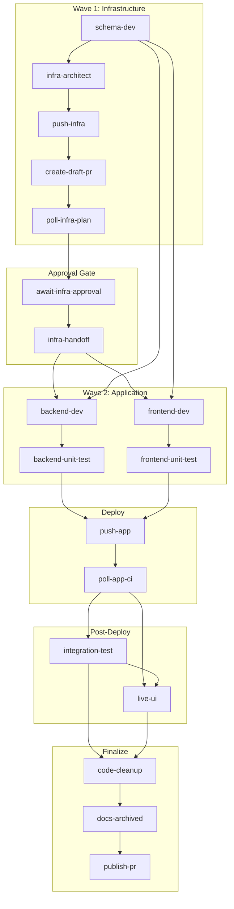
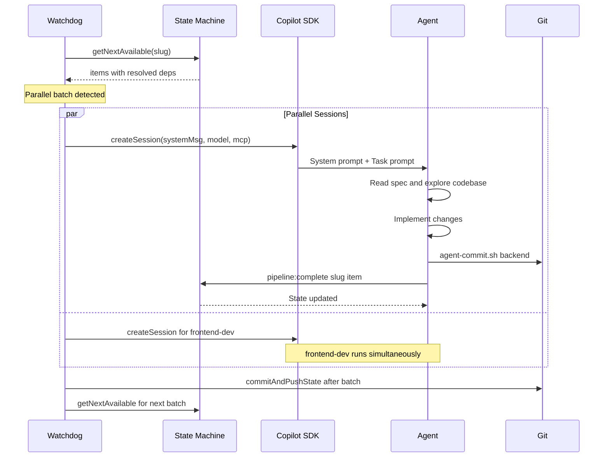
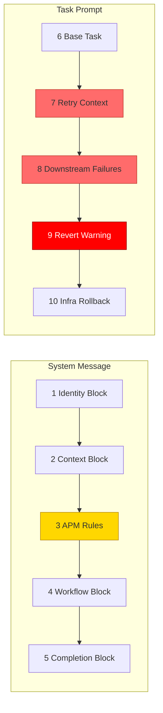
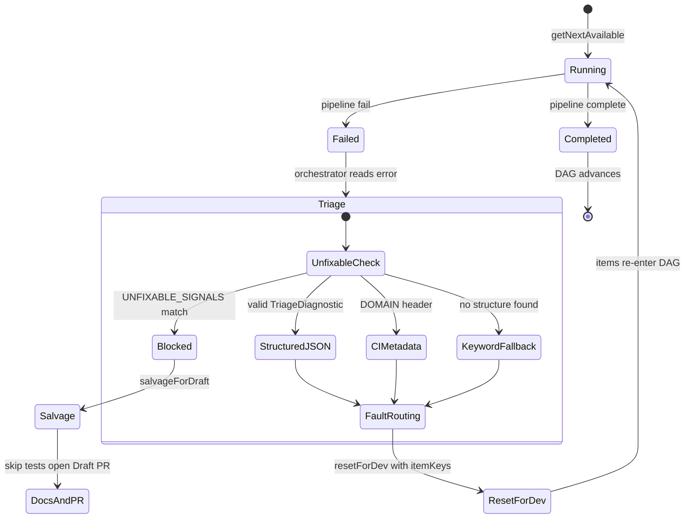

# How Agents Communicate with the DAG — Architecture Deep-Dive

## 1. The DAG: Structure and Purpose

The pipeline is a **Directed Acyclic Graph** of 19 items defined in `tools/autonomous-factory/pipeline-state.mjs` (L52–75), organized into a **Two-Wave model** (infra first, app second) with 6 phases.



The DAG dependency map lives in `ITEM_DEPENDENCIES` at `pipeline-state.mjs` L94–118. The key insight: `backend-dev` and `frontend-dev` **run in parallel** because they share the same dependency set (`schema-dev` + `infra-handoff`). Similarly, `backend-unit-test` and `frontend-unit-test` are parallelizable.

Workflow types (`Backend`, `Frontend`, `Full-Stack`, `Infra`) control which items are marked `N/A` at init via `NA_ITEMS_BY_TYPE` at `pipeline-state.mjs` L81–90 — e.g., a `Backend` workflow skips `frontend-dev`, `frontend-unit-test`, and `live-ui`.

## 2. State: the Single Source of Truth

The **State** (`_STATE.json`) is owned exclusively by `pipeline-state.mjs` and serves 4 critical purposes:

| Purpose | How |
|---|---|
| **DAG resolution** | `getNextAvailable()` (L761–806) scans all items, checks if every dependency is `done` or `na`, returns **all parallelizable items** |
| **Phase gating** | `completeItem()` (L276–312) validates no items in prior phases are incomplete |
| **Failure routing** | `failItem()` records structured errors; `resetForDev()` resets items for redevelopment cycles |
| **Concurrency control** | `withLock()` (L217–236) uses POSIX `mkdirSync` as an atomic mutex to prevent TOCTOU races when parallel agents complete simultaneously |

State transitions are **strictly deterministic** — agents never edit state files directly. They can only call:

```bash
npm run pipeline:complete <slug> <item-key>
npm run pipeline:fail <slug> <item-key> <message>
npm run pipeline:doc-note <slug> <item-key> <note>
```

## 3. The Orchestrator Loop: How Agents Talk to the DAG

Agents **never see the DAG**. The orchestrator (`tools/autonomous-factory/src/watchdog.ts`) is the sole mediator:



Key architectural decisions:

1. **Agents are stateless** — each gets a fresh `CopilotClient` session with no memory of prior sessions
2. **The watchdog is a `while(true)` loop** (`watchdog.ts` L288–380) that terminates on `complete`, `blocked`, or `halt`
3. **State commits are centralized** — `commitAndPushState()` (`watchdog.ts` L218–264) runs **after** each parallel batch, eliminating git contention between parallel agents
4. **Deterministic bypasses** — `push-infra`, `push-app`, `poll-infra-plan`, `poll-app-ci` skip the SDK entirely and run shell scripts directly (`session-runner.ts` L487–560)

## 4. Agent Prompt Assembly: What Each Agent Receives

Each agent's prompt is assembled from **10 layers** in two groups:



### Layer-by-Layer Breakdown

#### Layer 1–2: Identity + Context (LOW importance for correctness, HIGH for orientation)

Defined per-agent in `tools/autonomous-factory/src/agents.ts`. Example from `backendDevPrompt()` at L199–210:

```typescript
`# Backend & Infrastructure Developer
You are a senior backend developer specializing in **Azure Functions v4 with TypeScript**...
# Context
- Feature: ${ctx.featureSlug}
- Spec: ${ctx.specPath}
- Repo root: ${ctx.repoRoot}
- App root: ${ctx.appRoot}`
```

The `AgentContext` interface (`agents.ts` L23–48) is populated from the APM manifest's `config` section — URLs, resource names, test commands are all manifest-driven, not hardcoded.

#### Layer 3: APM Compiled Rules (HIGHEST importance — gold box above)

This is the **single most important layer**. The APM compiler (`tools/autonomous-factory/src/apm-compiler.ts`) reads `apps/<app>/.apm/apm.yml` and:

1. Resolves instruction references — a directory ref like `backend` loads ALL `.md` files in `.apm/instructions/backend/` alphabetically; a file ref like `tooling/roam-tool-rules.md` loads that single file
2. Concatenates them into a single `rulesBlock` prefixed with `## Coding Rules\n\n`
3. Validates token count against the budget (6000 tokens for sample-app)

From `apps/sample-app/.apm/apm.yml` L8–9:

```yaml
backend-dev:
  instructions: [always, backend, tooling/roam-tool-rules.md, tooling/roam-efficiency.md]
```

This means `backend-dev` gets: all files from `instructions/always/` + all files from `instructions/backend/` + `roam-tool-rules.md` + `roam-efficiency.md`. Injected via `${apmContext.agents["backend-dev"].rules}`.

#### Layer 4: Workflow (HIGH importance for agent behavior)

The step-by-step numbered workflow unique per agent type (`agents.ts` L220–264). Includes: read spec, use roam tools for codebase orientation, implement, run security audit, run local quality gate, commit with proper scope, leave doc-note for docs-expert.

#### Layer 5: Completion Block (CRITICAL for DAG communication)

Generated by `completionBlock()` at `agents.ts` L68–142. This is **the only mechanism** by which agents communicate back to the DAG:

```bash
# Success:
npm run pipeline:complete <slug> <item-key>
# Failure (structured JSON for post-deploy items):
npm run pipeline:fail <slug> <item-key> '{"fault_domain":"backend","diagnostic_trace":"..."}'
```

For `infra-architect`, the completion block also includes a mandatory Terraform validation gate — the agent must run `terraform plan` locally before marking complete.

#### Layers 6–10: Task Prompt with Context Injection (CRITICAL for self-healing)

Built by `buildTaskPrompt()` (`agents.ts` L1732–1757) and augmented by `tools/autonomous-factory/src/context-injection.ts`:

| Injection | When | What | Importance |
|---|---|---|---|
| **Retry context** | `attempt > 1` | Previous error, files changed, last intent | HIGH — prevents starting from scratch |
| **Downstream failure** | Dev item re-entered after post-deploy fail | Exact test failures, HTTP status codes | CRITICAL — the signal that drives fixes |
| **Revert warning** | `effectiveAttempts >= 3` | Clean-slate wipe instruction | EMERGENCY — breaks hallucination loops |
| **Infra rollback** | `infra-architect` after `redevelop-infra` | What resource was missing | HIGH — targeted fix guidance |

Session creation happens at `session-runner.ts` L800–810:

```typescript
const session = await client.createSession({
  model: agentConfig.model,
  workingDirectory: repoRoot,
  onPermissionRequest: approveAll,
  systemMessage: { mode: "replace", content: agentConfig.systemMessage },
  ...(agentConfig.mcpServers ? { mcpServers: agentConfig.mcpServers } : {}),
});
```

The `ITEM_ROUTING` map (`agents.ts` L1614–1700) binds each pipeline item key to its prompt builder + MCP server resolution.

## 5. The Self-Healing Feedback Loop

The most sophisticated part — the **triage, reroute, and recover** cycle:



The triage system in `tools/autonomous-factory/src/triage.ts` L69–106 uses a 4-tier evaluation:

1. **Unfixable signals** — halt immediately (Azure AD errors, state locks, permission denied)
2. **Structured JSON** — agent emits `{"fault_domain":"backend","diagnostic_trace":"..."}`, deterministic routing by `fault_domain`
3. **CI `DOMAIN:` header** — job-based routing from `poll-ci.sh` metadata
4. **Keyword fallback** — legacy pattern matching for SDK crashes / malformed output

### Fault Domain Routing

| `fault_domain` | Items reset |
|---|---|
| `backend` | `backend-dev` + `backend-unit-test` + failing item |
| `frontend` | `frontend-dev` + `frontend-unit-test` + failing item |
| `both` | All dev + test items |
| `backend+infra` | `backend-dev` + `infra-architect` + tests |
| `environment` | Pipeline halt (no agent fix possible) |

### Safety Rails

- **Circuit breaker** (`session-runner.ts` L195–238) — skips retry if identical error + no code changed since last attempt
- **Cognitive circuit breaker** (`session-runner.ts` L1088–1175) — soft limit injects frustration prompt into tool results; hard limit force-disconnects
- **Max limits** — 10 retries per item, 5 redevelopment cycles, 10 re-deploy cycles

## 6. What Matters Most vs. Least

### Most Important (correctness-critical)

1. **`ITEM_DEPENDENCIES` DAG** — defines parallelism and ordering. A wrong edge = stuck pipeline or premature execution
2. **APM rules injection** (`apmContext.agents[key].rules`) — domain-specific coding knowledge that keeps agents correct
3. **Completion block** — the only agent-to-DAG communication channel. Structured JSON is enforced by Zod at the triage layer
4. **Context injection** — retry + downstream failures are what make the system self-healing
5. **Cognitive circuit breaker** — prevents runaway compute

### Less Important (nice-to-have, operational)

1. **Agent identity blocks** ("You are a senior backend developer...") — orientation-only
2. **Tool logging/labeling** — observability, not correctness
3. **Feature archiving** — cleanup after PR creation
4. **Roam preamble in task prompt** — helpful but optional; agents fall back to grep/read if roam MCP is unavailable
5. **Playwright log capture** — diagnostic only

### The "Secret Sauce" — Separation of LLM vs. Determinism

| LLM decides | Deterministic code decides |
|---|---|
| What code to write | Which agent runs next (DAG) |
| How to classify an error (`fault_domain`) | Where to route the fix (`triageFailure`) |
| Whether to call `pipeline:complete` or `pipeline:fail` | When to halt, revert, or salvage |
| What intent to report | When circuit breaker fires |

The LLM is a **worker bee** — it gets narrow, well-scoped instructions and reports through a structured contract. The DAG state machine is the **brain** — it decides what runs next, when to retry, when to give up, and how to self-heal.

## Key Source Files

| File | Role |
|---|---|
| `tools/autonomous-factory/pipeline-state.mjs` | DAG definition, state machine, all mutations |
| `tools/autonomous-factory/src/watchdog.ts` | Main orchestrator loop |
| `tools/autonomous-factory/src/session-runner.ts` | Per-item SDK session lifecycle |
| `tools/autonomous-factory/src/agents.ts` | Agent prompt factory, `ITEM_ROUTING` map |
| `tools/autonomous-factory/src/apm-compiler.ts` | APM manifest compiler (rules assembly) |
| `tools/autonomous-factory/src/context-injection.ts` | Retry/downstream/revert prompt augmentation |
| `tools/autonomous-factory/src/triage.ts` | Structured error triage and fault routing |
| `tools/autonomous-factory/src/types.ts` | Shared TypeScript interfaces |
| `tools/autonomous-factory/src/state.ts` | Thin async wrappers over `pipeline-state.mjs` |
| `apps/sample-app/.apm/apm.yml` | APM manifest (agent declarations, budgets, MCP) |
