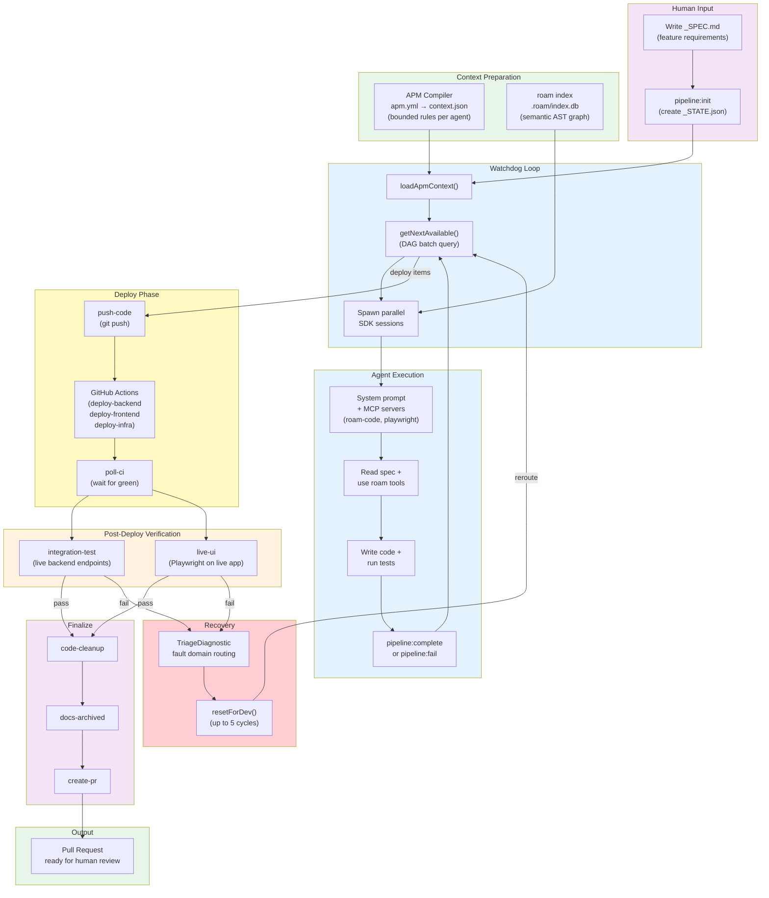
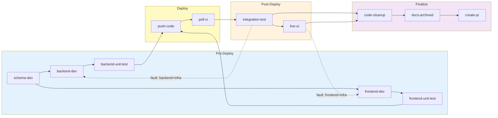

# I Built a Deterministic Agentic Coding Pipeline. Then I Found Out Stripe Built the Same Thing.

**TL;DR:** I built a headless, DAG-scheduled AI coding pipeline — 12 specialist agents, self-healing recovery, real browser testing — that takes a feature spec and delivers a tested PR with zero human interaction. Then I read Stripe's Minions blog post and realized we independently converged on the same architectural pattern. [The repo is open.](https://github.com/rkaliupin/DAGent)

---

## The 80/20 Insight

We have incredible AI coding tools. GitHub Copilot, Cursor, Claude Code — they're transformative for human-in-the-loop development. Fantastic for the 20% of work that requires judgment, creativity, and architectural thinking.

But what about the other 80%?

The feature that needs a new API endpoint, a database migration, a frontend form, unit tests, integration tests, E2E tests, a Terraform resource, a deployment, and a PR. The pipeline doesn't just *run* those tests — it *writes* them. Every step is well-understood. The patterns exist in your codebase. The rules are documented. The tests define success.

This work doesn't need a human co-pilot. It needs a **factory**.

So I built one. Then I found out [Stripe built the same thing](https://stripe.dev/blog/minions-stripes-one-shot-end-to-end-coding-agents-part-2) — and ships 1,300+ PRs per week with it.

---

## The Architecture: Why Convergence Matters

The core insight I arrived at — and that Stripe arrived at independently — is this: **LLMs are great reasoners but unreliable orchestrators.** Give them a focused task with clear boundaries, and they excel. Ask them to coordinate a 12-step pipeline with failure recovery and CI/CD integration, and they hallucinate steps, skip phases, and burn tokens in loops.

The system separates two concerns that most agentic tools conflate:

- **Control plane (deterministic)** — A TypeScript `while` loop reads a DAG state machine, resolves dependencies, and spawns agent sessions. No LLM decides what happens next. The state machine does.
- **Execution plane (LLM)** — Each specialist agent receives a bounded context (rules, MCP tools, skills) and reasons about its domain. Backend-dev writes backend services. Frontend-dev writes React components. Live-ui runs Playwright against the deployed app. Each agent is trusted to *think*, but not to *orchestrate*.

### End-to-End Flow

The purple boxes are human touchpoints (write a spec, review a PR). Everything in between is autonomous:



When post-deploy verification fails, the pipeline doesn't stop. It triages the failure, resets the right agents, and loops back — bounded by circuit breakers.

### The Stripe Convergence

Two teams, working independently — one inside a $95B fintech company, one as an independent engineer — arrived at the same architectural pattern:

| Design Decision | My Pipeline | Stripe Minions |
|-----------------|:-----------:|:--------------:|
| **Orchestration** | Deterministic TypeScript loop with DAG state machine | "Blueprints" — state machines with interwoven deterministic and agentic nodes |
| **Agent specialization** | 12 domain-specific agents with per-agent prompts | Task-specific agents with curated tool subsets |
| **Context management** | APM compiler with token budgets + modular rules | Scoped rules (Cursor format) + MCP tools via "Toolshed" (~500 tools) |
| **CI integration** | Deterministic deploy bypasses (no LLM) → poll CI → auto-fix → re-push (bounded cycles) | Push → CI run → autofix → agent fix → second CI run (bounded to 2 iterations) |
| **Failure recovery** | Structured triage → compound fault domains → targeted reroute + dedup circuit breakers | CI failures route back to agent nodes for local remediation |
| **Safety boundary** | Circuit breakers: 10 retries, 5 reroute cycles, session timeouts | 2 CI iteration limit; quarantined devboxes with no production access |

> **Deterministic orchestration wrapping LLM execution, configured per project, with bounded failure recovery and CI/CD as a first-class pipeline phase.**

This isn't coincidence. This is the pattern.

---

## The Pipeline DAG

12 items across 4 phases, scheduled by an explicit dependency graph — not inferred by an LLM at runtime. Items within a batch run in parallel. A Full-Stack feature executes in ~6 batches instead of 12 serial steps:



The dashed arrows show the self-healing reroute — now with **compound fault domains** (`backend+infra`, `frontend+infra`) that tell the triage engine exactly which layers failed. Test agents are pipeline steps, not afterthoughts — `backend-unit-test` and `frontend-unit-test` **write new tests** for the code that dev agents just created. Post-deploy, `integration-test` runs first; `live-ui` runs only after integration tests pass — there's no point spending 17 minutes of Playwright against a backend that's already failing. The full testing lifecycle in one pipeline run: **write code → write tests → deploy → validate against live infra → self-heal on failure.**

The deploy phase itself (`push-code`, `poll-ci`) runs as **deterministic bypasses** — the orchestrator executes `agent-commit.sh` and `poll-ci.sh` directly without spinning up an LLM session. Agent fallback kicks in only if the scripts fail. Mechanical operations don't need reasoning.

Four workflow types (`Backend`, `Frontend`, `Full-Stack`, `Infra`) prune irrelevant items at init.

---

## What Makes It Work

### 1. APM: Agent Package Manager — Context That Doesn't Rot

Here's the dirty secret of agent prompting: **context pollution kills agent quality silently.** When you stuff a single system prompt with every rule for your entire project, the agent's attention degrades. Backend rules compete with frontend rules. The prompt grows with every convention, and there's no mechanism to tell you when you've crossed from "helpful" to "noise."

This is the problem [Microsoft's APM](https://github.com/microsoft/apm) solves. You declare agents, their instruction includes, MCP servers, and skills in a single `apm.yml` manifest. The compiler assembles per-agent context from modular rule fragments and enforces a hard token budget.

| Without APM (monolithic prompt) | With APM (compiled per-agent context) |
|---|---|
| One giant `.cursorrules` or `CLAUDE.md` for all agents | 28 modular `.md` files organized by domain |
| Backend agent sees frontend rules it can't use | Backend-dev gets `[always, backend, infra, tooling/roam-tool-rules.md]` — 4,800 tokens of relevant context |
| No limit on prompt size — degrades silently | 6,000-token budget enforced at compile time — `ApmBudgetExceededError` fails the build |
| Adding a new convention bloats every agent | Adding `infra/cors-rules.md` only affects agents that include `infra` |
| Switching projects requires rewriting everything | Point `--app` at a new directory with its own `apm.yml` — same engine, different project |

The manifest is declarative:

```yaml
# apm.yml — each agent declares exactly which rules it needs
agents:
  backend-dev:
    instructions: [always, backend, infra, tooling/roam-tool-rules.md, tooling/roam-efficiency.md]
    mcp: [roam-code]
    skills: [test-backend-unit]
  frontend-dev:
    instructions: [always, frontend, tooling/roam-tool-rules.md, tooling/roam-efficiency.md]
    mcp: [roam-code]
    skills: [test-frontend-unit, build-frontend]
  poll-ci:
    instructions: [always]    # minimal context — this agent just watches CI
    mcp: []
    skills: []
```

If any agent's assembled rules exceed the token budget, **compilation fails** — a fatal `ApmBudgetExceededError` that blocks the pipeline from starting. The same way type systems prevent runtime errors by failing at compile time, APM prevents context degradation by failing at assembly time.

**The practical result:** backend-dev gets ~4,800 tokens of tightly scoped rules. Poll-ci gets ~800 tokens. No agent carries dead weight.

### 2. Self-Healing Recovery with Live Browser Testing

When post-deploy tests fail (and they will), the pipeline doesn't retry blindly. The failing agent emits a structured diagnostic:

```json
{ "fault_domain": "frontend+infra", "diagnostic_trace": "CORS 403 on /api/generate — APIM not routing to backend origin" }
```

The triage engine maps the fault domain to the correct development agents, resets them to `pending`, injects the error context into their next prompt, and re-enters the loop. **Compound fault domains** like `frontend+infra` and `backend+infra` reduce blast radius — a CORS failure resets only frontend-dev and frontend-unit-test, not the entire pipeline. Environment-level faults (IAM permission errors, missing service principals) are detected by signal matching and halt the pipeline rather than wasting redevelopment cycles on problems code changes can't fix.

Circuit breakers prevent infinite loops: 5 redevelopment cycles, 10 retries per item, hard session timeouts. A **deduplication circuit breaker** goes further — if an agent fails with the same error and no code has changed since the last attempt, the pipeline halts immediately rather than burning tokens on an identical retry.

**Shift-left validation** catches deployment-blocking errors before code leaves the dev phase. Backend-dev validates that compiled artifacts actually load as Azure Function entry points before marking its work complete. A missing export or CJS/ESM format mismatch is caught in development — not 20 minutes later during deployment.

What triggers recovery is real infrastructure validation. The `live-ui` agent doesn't execute a pre-written test suite — it **creates Playwright E2E scenarios** tailored to the feature it just built, runs them with headless Chromium against the deployed app. It authenticates through the real auth flow, validates CORS headers, routing, and rendered DOM state — all against production-like infrastructure, not mocked endpoints. The `integration-test` agent does the same at the API layer, catching deployment-specific failures (missing env vars, incorrect route bindings, Terraform-created resources not yet propagated) that unit tests structurally cannot.

Screenshots are captured for visual evidence. If any generated test fails, the recovery loop triages and fixes — the pipeline doesn't just flag the failure, it resolves it.

### 3. Structural Code Intelligence (Roam-Code)

This is the technology decision that had the biggest impact on agent reliability. Without it, agents are blind. With it, they see structure.

When a coding agent needs to modify a function, the default approach is text search — grep for the name, read matching files, hope you found all the callers. This is broken for three reasons: it's probabilistic (grep can't distinguish call sites from comments), it has no concept of blast radius (how many files will break?), and it can't enforce governance (no mechanism to verify a change is safe before committing).

[Roam-code](https://github.com/Cranot/roam-code) solves all three. It pre-indexes your entire codebase into a **semantic AST graph** using tree-sitter (27 languages, 102 MCP tools). Instead of text search, agents ask structural questions:

| What the agent needs | Text search (grep) | Graph query (roam-code) |
|---|---|---|
| Find all callers of `generateSku` | String match — comments, imports, and calls indiscriminately | `roam_context` — only call sites, with file paths and line numbers |
| "What breaks if I change this type?" | No answer | `roam_preflight` — blast radius: affected files, consumers, test coverage |
| "Which tests cover this code path?" | `grep -r` — misses indirect coverage | `roam_affected_tests` — follows the call graph |
| "Is this change safe to commit?" | No answer | `roam_check_rules` — deterministic SEC/PERF/COR audit against the AST diff |

Agents in this pipeline are **forbidden from using grep for code exploration.** Every structural question goes through the graph. The result: ~5x fewer tokens consumed and structural guarantees that text-based search cannot provide. Before any agent can mark its work done, it must pass `roam_check_rules` — a deterministic governance gate, not a prompt-based suggestion. The same graph also powers documentation freshness: `roam_doc_staleness` identifies which docs reference symbols that changed, so the docs agent updates only what's actually stale.

### 4. Agents Never Touch Git or State

This is a deliberate design choice that most agentic tools get wrong.

Agents **cannot** run raw `git add`, `git commit`, or `git push`. They cannot edit `_STATE.json`. They cannot skip pipeline phases. Every side-effect goes through a deterministic wrapper:

| What the agent wants to do | What it actually calls | Why it matters |
|---|---|---|
| Commit code | `agent-commit.sh <scope> "<msg>"` | Scoped staging — `backend` scope only stages `backend/`, `packages/`, `infra/`. Pre-commit rebase prevents push conflicts. Can't accidentally commit `.env` files |
| Push to remote | `agent-branch.sh push` | Validates branch is not `main`. Retries once on network failure. Rejects if no commits ahead |
| Deploy phase (push-code) | Deterministic bypass — no LLM session | Orchestrator runs `agent-commit.sh all` + `agent-branch.sh push` directly. Agent fallback only on script failure |
| Wait for CI (poll-ci) | Deterministic bypass — no LLM session | Orchestrator runs `poll-ci.sh` directly with a 20-minute timeout. No tokens spent on waiting |
| Mark work done | `npm run pipeline:complete` | Phase-gated — rejects if prior phase has incomplete items. State mutation is atomic and logged |
| Record failure | `npm run pipeline:fail` | Appends to error log. Auto-halts after 10 failures (circuit breaker) |

An agent with raw `git push --force` access is an unacceptable risk. An agent that can skip the testing phase because it "thinks" the code is correct defeats the purpose of the pipeline. Every operation goes through deterministic wrappers that provide the same auditability and blast radius containment that enterprises expect from their human CI/CD pipelines.

Stripe's Minions take this further — quarantined devboxes with no production access. Same principle: **trust the LLM to reason, but don't trust it to operate.**

---

## How It Compares to Claude Code Agent Teams

Anthropic's experimental Agent Teams feature — multiple Claude Code instances coordinating as teammates — solves a different problem. The strongest architecture uses both: **Agent Teams for discovery, deterministic pipelines for delivery.**

| Dimension | This Pipeline | Claude Code Agent Teams |
|-----------|:---:|:---:|
| **Orchestration** | Deterministic (code decides) | LLM-based (Claude decides) |
| **State persistence** | JSON state file — survives crashes | In-memory |
| **Failure recovery** | Structured triage + circuit breakers | Lead must notice and redirect |
| **Reproducibility** | Same spec → same execution path | Non-deterministic decomposition |
| **Best for** | Autonomous feature delivery | Collaborative exploration |

Use Agent Teams to explore a problem space, research architecture options, or review code with multiple perspectives. Feed the findings into a spec. Run this pipeline to execute deterministically, deploy, test, and ship.

---

## The 80/20 Boundary

I believe enterprise agentic coding is converging on this model: **80% of the work** — pattern-following, test-definable — will be handled by deterministic pipelines configured per project. **20%** — conceptual design, architectural decisions, ambiguous requirements — stays with human engineers empowered by tools like Copilot, Cursor, and Claude Code.

The boundary isn't fixed. As pipelines get smarter and codebases get better instrumented, the 80% expands. But the 20% never disappears — it's the work that requires judgment, taste, and accountability. The work where you want a human name on the commit.

Stripe's Minions demonstrate this pattern at massive scale (1,300+ PRs/week). This pipeline demonstrates it at the architecture level — proving the pattern works with open tooling (GitHub Actions, Copilot SDK, Playwright, Terraform) rather than proprietary infrastructure.

---

## Try It. Break It. Tell Me What's Wrong.

The [entire pipeline is open source](https://github.com/rkaliupin/DAGent). It includes the orchestrator (`tools/autonomous-factory/`), the APM system (`apps/sample-app/.apm/`), 6 CI/CD workflows, and comprehensive documentation with 13 architecture diagrams. Every run produces a deterministic audit trail — state files, transition logs, per-step metrics, terminal traces, and Playwright logs — all archived per feature.

### It's a Blueprint — Not a Finished Product

The orchestration engine is generic — the watchdog, state machine, APM compiler, triage engine, and DAG scheduler don't know anything about Azure. But the sample app's instruction fragments and CI workflows are Azure-specific. For modern coding agents, adapting this to your stack (Rails, Django, Spring) means rewriting the files in `.apm/instructions/` and `.github/workflows/` — exactly the files designed to be swapped per project.

### Quick Start

```bash
# 1. Clone and open in DevContainer (VS Code / Codespaces)

# 2. Create a feature spec
mkdir -p apps/sample-app/in-progress
vim apps/sample-app/in-progress/my-feature_SPEC.md

# 3. Initialize pipeline state
export APP_ROOT=apps/sample-app
npm run pipeline:init my-feature Full-Stack

# 4. Run the orchestrator
npm run agent:run -- --app apps/sample-app my-feature

# 5. Review the PR when the pipeline completes
```

Prerequisites: GitHub CLI auth (`gh auth status`), Azure CLI auth (for live deploy/test), DevContainer with `--shm-size=2gb`, and an `apm.yml` config.

### What I'm Looking For

- **Architects** — Does the DAG + APM + triage pattern generalize to your stack? What's missing?
- **Platform engineers** — Would you adopt this for your team? What would need to change?
- **AI/ML engineers** — How would you improve the context management? The failure triage?
- **Developer tooling teams** — Is this the right abstraction layer? Should parts of this be a product?

---

## What's Next

**Near-term:** Extract Azure-specific rules into pluggable "stack packs" so the core engine ships clean. Build reference packs for AWS (Lambda + CDK), GCP (Cloud Functions + Pulumi), and vanilla Docker/K8s.

**Mid-term:** Cloud-hosted parallel execution — kick off multiple features simultaneously, each on its own branch, with automatic conflict resolution grounded in merged PRs.

**Long-term:** Pipeline analytics from the deterministic audit trail. Which instruction fragments cause the most recovery cycles? Which agents burn the most tokens? Which feature types sail through vs. struggle? The feedback loop that turns a pipeline into a platform.

---

*If you're building deterministic agent orchestration or evaluating this pattern for your org, I'd love to compare notes. [The repo](https://github.com/rkaliupin/DAGent) is open and I'm actively developing it.*
