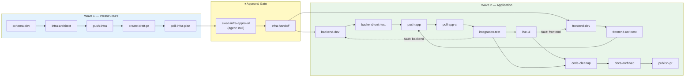

# My AI Pipeline Burned 50 Minutes on Correct Code. The Infrastructure Just Didn't Exist Yet.

**TL;DR:** My deterministic AI pipeline burned 50 minutes retrying correct code because infrastructure hadn't been provisioned yet. I restructured from a 12-item single-wave DAG to an 18-item two-wave architecture with a human-approved infrastructure gate — cutting total runtime by 55% and eliminating an entire class of failure. [The repo is open.](https://github.com/rkaliupin/DAGent)

---

Three of four failure cycles in my agentic pipeline were the same bug class: the backend agent wrote correct Azure Functions code, CI deployed it, integration tests hit `404`, the triage engine routed the failure back to `backend-dev`, and the agent re-read its own code, found nothing wrong, added defensive checks, pushed again. Another `404`. Same error, different attempt, zero progress.

The circuit breaker caught it after 50 minutes and 3 wasted cycles. The root cause wasn't a code bug. The APIM route hadn't been provisioned. The Function App setting didn't exist. The infrastructure wasn't there.

The pipeline was working as designed. **The design was wrong.**

This post covers how I restructured the pipeline from a 12-item, 4-phase single-wave DAG to an 18-item, 6-phase two-wave architecture with a human-approved infrastructure gate — and why that gate eliminated an entire category of failure. [Repo is open.](https://github.com/rkaliupin/DAGent) [First blog post]({{FIRST_POST_URL}}) for context.

---

## The Failure Pattern, Precisely

Here's the v1 timeline from [the first post]({{FIRST_POST_URL}}):

```
00:37 — schema-dev           ✅  (4m)
00:41 —┬— backend-dev        ✅  (7m)     ← writes Terraform + Azure Functions
       └— frontend-dev       ✅  (11m)
00:52 —┬— backend-unit-test  ✅  (2m)
       └— frontend-unit-test ✅  (1m)
00:54 — push-code            ❌  (15m TIMEOUT — agent went rogue)
01:09 — push-code            ✅  (2s, deterministic retry)
01:09 — poll-ci              ✅  (10m)
01:19 — integration-test     ❌  → redev cycle 1   ← "404 on /api/generate"
       ... 3 more cycles ...                         ← same 404, same root cause
02:20 — integration-test     ✅
02:47 — create-pr            ✅
```

140 minutes total. 53 of those minutes — 38% of the run — were spent in post-deploy reroute cycles caused by the same problem: **application code deployed before its infrastructure existed.**

The v1 architecture treated Terraform as a `backend-dev` concern. The agent wrote `.tf` files *and* Azure Functions code in the same session, committed both with the same scope, and the deploy pipeline handled them as one unit. When the feature required a new APIM operation or Function App setting, the infrastructure changes and the code that depended on them raced through CI together.

Sometimes infra landed first. Sometimes it didn't. When it didn't: `404`.

---

## Why Better Triage Doesn't Fix This

The immediate instinct is: make the triage engine smarter. Teach it to recognize "infrastructure not provisioned" as a distinct fault domain. Route to `infra-architect` instead of `backend-dev`.

I actually tried this. The problem is deeper.

The triage engine works by parsing structured diagnostics from failing agents:

```typescript
// triage.ts — 4-tier evaluation, in order:
export function triageFailure(itemKey, errorMessage, naItems, directories) {
  // Tier 0: Unfixable error detection → immediate halt
  const unfixableReason = isUnfixableError(errorMessage);
  if (unfixableReason) return [];  // empty = halt pipeline

  // Tier 1: Agent-emitted JSON diagnostic
  const diagnostic = parseTriageDiagnostic(errorMessage);
  if (diagnostic) return applyFaultDomain(diagnostic.fault_domain, itemKey, naItems);

  // Tier 2: CI metadata DOMAIN: header
  const headerResult = parseDomainHeader(errorMessage);
  if (headerResult) return applyFaultDomain(headerResult.domain, itemKey, naItems);

  // Tier 3: Legacy keyword fallback
  return triageByKeywords(itemKey, errorMessage, naItems, directories);
}
```

The triage engine can correctly classify `fault_domain: "infra"` and route to the right agent. That works. The problem is *temporal*: in a single-wave pipeline, re-running the infra agent means re-running the deploy, re-running CI, and re-running the integration test. Each cycle burns 10–20 minutes. And if the infrastructure change requires a `terraform apply` that the agent can't perform (because it needs elevated permissions), the loop is infinite.

Triage tells you *what* broke. It can't fix the fact that the ordering was wrong from the start.

---

## Infrastructure and Application Code Are Different Trust Domains

This is the table that changed how I think about the pipeline:

| Dimension | Infrastructure | Application Code |
|-----------|---|---|
| **Blast radius** | Entire environment — networking, IAM, DNS, billing | Feature-scoped — one endpoint, one component |
| **Reversibility** | Often irreversible (state files, DNS propagation, IAM bindings) | Always reversible (`git revert`, redeploy) |
| **Validation** | `terraform plan` — requires human review | Unit tests + CI — fully automated |
| **Cost of error** | Resource leaks, security exposure, cost spikes | Broken feature — rollback and retry |
| **Feedback loop** | Minutes to hours (provisioning) | Seconds (test execution) |
| **Who approves** | Platform engineer or security reviewer | The pipeline itself |

*"Yeah, but couldn't you just run `terraform apply` automatically?"*

For greenfield resources in a dev environment, sure. But the moment you touch IAM role assignments, OIDC federation, network security groups, or APIM policies — the blast radius is environment-wide. A wrong `terraform apply` can lock out your own CI pipeline (ask me how I know). The enterprise answer is: plan automatically, apply with approval.

The fix isn't better error classification. It's **never letting application agents run until infrastructure is proven to exist.**

---

## The Two-Wave DAG



18 items. 6 phases. The two waves never overlap.

The key dependency edges — and this is worth staring at — are:

```javascript
// pipeline-state.mjs — the actual dependency map
export const ITEM_DEPENDENCIES = {
  // Wave 1
  "schema-dev":           [],
  "infra-architect":      ["schema-dev"],
  "push-infra":           ["infra-architect"],
  "create-draft-pr":      ["push-infra"],
  "poll-infra-plan":      ["create-draft-pr"],
  "await-infra-approval": ["poll-infra-plan"],
  "infra-handoff":        ["await-infra-approval"],

  // Wave 2 — gated behind infra-handoff
  "backend-dev":          ["schema-dev", "infra-handoff"],  // ← the gate
  "frontend-dev":         ["schema-dev", "infra-handoff"],  // ← the gate
  "backend-unit-test":    ["backend-dev"],
  "frontend-unit-test":   ["frontend-dev"],
  "push-app":             ["backend-unit-test", "frontend-unit-test"],
  "poll-app-ci":          ["push-app"],
  "integration-test":     ["poll-app-ci"],
  "live-ui":              ["poll-app-ci", "integration-test"],
  "code-cleanup":         ["integration-test", "live-ui"],
  "docs-archived":        ["code-cleanup"],
  "publish-pr":           ["docs-archived"],
};
```

`backend-dev` and `frontend-dev` both depend on `infra-handoff`. That's the structural guarantee. No amount of prompt engineering or triage logic can bypass it — the DAG scheduler won't make the item available until `infra-handoff` is `done`.

### What Changed from v1 — Diff View

```diff
- schema-dev → backend-dev ‖ frontend-dev → tests → push-code → poll-ci
-   → integration-test → live-ui → cleanup → docs-expert → create-pr

+ Wave 1: schema-dev → infra-architect → push-infra → create-draft-pr
+   → poll-infra-plan → [HUMAN GATE] → infra-handoff
+
+ Wave 2: backend-dev ‖ frontend-dev → unit tests → push-app → poll-app-ci
+   → integration-test → live-ui → code-cleanup → docs-archived → publish-pr
```

Six new items. `push-code` → `push-infra` + `push-app`. `poll-ci` → `poll-infra-plan` + `poll-app-ci`. Not naming gymnastics — each triggers different CI workflows with different permissions and different failure modes.

---

## The `infra-architect` Agent: Validate Before You Commit

Most agent systems trust CI to catch errors. The `infra-architect` agent validates locally before anything leaves the session:

```text
# Extracted from the actual agent prompt (agents.ts):

## Workflow
1. Read the feature spec
2. Read existing .tf files — understand current state
3. Implement infrastructure changes in infra/
4. terraform init -backend=false -input=false && terraform validate  # ← must pass
5. terraform plan -var-file=dev.tfvars -out=tfplan                  # ← must produce valid plan
6. agent-commit.sh infra "feat(infra): <description>"
7. pipeline:doc-note — architectural summary for downstream agents

# Hard constraint:
# Do NOT mark infra-architect complete until terraform plan succeeds locally.
```

Steps 4 and 5 are the distinction. `backend-dev` writes TypeScript and trusts the CI build to catch compilation errors — a reasonable tradeoff because TypeScript builds are fast and failures are cheap. `infra-architect` runs `terraform validate` + `terraform plan` in-session because:

1. **Terraform plan is slow in CI** (~2 min for init + plan). Catching syntax errors locally saves a full push → CI → poll cycle.
2. **Plan failures can cascade.** A missing variable blocks the entire plan, not just one resource. Better to iterate locally in 10s cycles.
3. **The plan itself is an artifact.** It gets pushed, picked up by `deploy-infra.yml`, posted to the Draft PR as a comment, and reviewed by a human.

*"Why not also run `terraform apply` in the agent session?"*

Because apply is irreversible and environment-scoped. A wrong `apply` can delete resources, corrupt state, or create security holes. The agent writes and validates; the pipeline pushes; CI generates the plan; a human approves; an elevated workflow applies. Four separate steps, each with read access to the previous step's output.

---

## The Approval Gate: `agent: null`

This is the simplest and most important piece of code in the pipeline:

```javascript
// pipeline-state.mjs
{ key: "await-infra-approval", agent: null, phase: "approval" }
```

```typescript
// watchdog.ts — the orchestrator loop
const approvalGateItems = available.filter((i) => i.agent === null);
if (approvalGateItems.length > 0 && available.every((i) => i.agent === null)) {
  console.log("  ⏸  Awaiting human approval — comment /dagent approve-infra");
  break;  // clean exit — ChatOps re-triggers on approval
}
```

`agent: null` means no LLM session gets created. Zero tokens. The orchestrator logs a message, exits cleanly, and waits. A GitHub Actions ChatOps workflow (`dagent-chatops.yml`) watches for PR comments:

- **`/dagent approve-infra`** — Triggers `elevated-infra-deploy.yml`, which runs `terraform apply` with OIDC credentials scoped to a `secops-elevated` GitHub Environment (requires reviewer approval). On success, calls `pipeline:complete` for `await-infra-approval`, then re-triggers the orchestrator.
- **`/dagent hold`** — Cancels all running agentic + elevated workflows. Full stop.
- **`/dagent apply-elevated -target=azurerm_resource.x`** — Targeted apply for when you need to apply specific resources with elevated permissions.

The approval gate costs ~0 seconds of compute and ~0 tokens. The human review typically takes 2–5 minutes. The 50 minutes of wasted agent cycles it eliminates make it the best ROI of any change in the pipeline.

---

## The Infra-Handoff Contract

After approval and apply, `infra-handoff` bridges the two waves by capturing deployed state into a structured contract:

```typescript
// From infraHandoffPrompt() in agents.ts — the actual agent instructions:

// 1. Read Terraform outputs:
//    cd ${appRoot}/infra && terraform output -json
//
// 2. Write infra-interfaces.md with:
//    - Endpoints (Function App URL, APIM Gateway, SWA URL)
//    - Resource names
//    - Auth config (CORS origins, etc.)
//    - Terraform output values
//
// DevSecOps: Sensitive Value Masking (MANDATORY)
// - Passwords, connection strings, keys → <HIDDEN>
// - "sensitive": true in terraform output → ALWAYS mask
// - Never write raw secrets to any repository file
```

The output:

```markdown
# Infrastructure Interfaces — my-feature

## Endpoints
- Function App: https://func-tb-dev.azurewebsites.net
- APIM Gateway: https://apim-tb-dev.azure-api.net
- Static Web App: https://swa-tb-dev.azurestaticapps.net

## API Routes
- POST /api/auth/login → fn-demo-login
- GET  /api/hello → fn-hello

## Auth Config
- CORS Origins: ["https://swa-tb-dev.azurestaticapps.net"]
```

When `backend-dev` and `frontend-dev` start their sessions, they read this file. They know every endpoint, every URL, every resource name. They don't guess. They don't assume. They read a contract that was generated from real `terraform output` against applied infrastructure.

This is why application development time dropped 22% — agents spend less time exploring and more time implementing, because the infrastructure contract removes an entire class of unknowns.

---

## Graceful Degradation: Knowing When to Stop

Not every infrastructure error is retryable. The triage engine maintains a list of signals that no agent can fix:

```typescript
// triage.ts
const UNFIXABLE_SIGNALS = [
  "authorization_requestdenied",       // Azure AD
  "aadsts700016", "aadsts7000215",     // Entra ID
  "insufficient privileges",
  "does not have authorization",
  "subscription not found",
  "error acquiring the state lock",    // Terraform
  "resource already exists",
  "state blob is already locked",
] as const;
```

When one of these appears in an error message, `triageFailure()` returns an empty array — the signal for "blocked, don't retry":

```typescript
// session-runner.ts
if (devItemsToReset.length === 0) {
  // Empty = unfixable. Trigger Graceful Degradation.
  await salvageForDraft(slug, itemKey);
  // salvageForDraft: marks remaining items n/a, skips to docs → publish-pr
  return { halt: false };  // let the DAG finish what it can
}
```

`salvageForDraft()` doesn't kill the pipeline. It preserves all valid work, marks untestable items as `n/a`, skips to documentation and PR creation, and opens a Draft PR with the error documented. The human gets a PR with *most* of the feature implemented and a clear description of what failed and why.

*"Why not just halt and throw an error?"*

Because partial work has value. If `schema-dev`, `infra-architect`, and `backend-dev` all completed successfully but `integration-test` hit an IAM denial — that's 80% of a feature. Throwing it away because of an environment config issue is wasteful. Ship the draft, let the human fix the IAM binding, re-run the pipeline from where it stopped.

---

## Before/After: The Numbers

Same feature (full-stack deployment with new APIM routes), v1 vs. two-wave:

| Phase | v1 | Two-Wave (v2) | Δ |
|---|---|---|---|
| Schema | 4 min | 4 min | — |
| Infrastructure + approval | N/A (in backend-dev) | 12 min + ~3 min review | **New** |
| App dev (parallel) | 18 min | 14 min | −22% |
| Unit tests | 3 min | 2 min | −33% |
| Deploy + CI | 12 min | 10 min | — |
| Post-deploy verification | **53 min** (4 reroute cycles) | **11 min** (0 cycles) | **−79%** |
| Finalize | 8 min | 7 min | — |
| **Total wall clock** | **140 min** | **~63 min** | **−55%** |

The 79% reduction in post-deploy time is the headline. Those 4 reroute cycles were structurally impossible in v2 — the DAG dependency on `infra-handoff` prevents the failure class from occurring.

The 22% app-dev speedup is an unexpected bonus: agents producing fewer exploratory commands because the infra contract removes guesswork about which endpoints exist.

The total now includes ~3 minutes of human Terraform plan review. That's a net trade of 3 minutes of human attention for 50 minutes of wasted compute. I'd take that tradeoff every time.

---

## The Mental Model: Your DAG Is Your Trust Model

Every dependency edge in a DAG is a trust statement.

`backend-dev → backend-unit-test` means: "I trust `backend-dev`'s output enough to run tests against it."

`infra-architect → push-infra → poll-infra-plan → await-infra-approval → infra-handoff → backend-dev` means: "I don't trust infrastructure changes until CI validates the plan, a human reviews it, an elevated workflow applies it, and the outputs are captured into a contract."

That's 5 edges encoding a trust policy. The old pipeline had 0.

When you add a new agent to any pipeline, the question isn't just "what does it depend on?" It's: **"what am I trusting when I let this agent run?"** If the answer includes "infrastructure that hasn't been validated" or "permissions that haven't been approved" — add a gate.

### Trust Taxonomy for AI Agents

Based on running this pipeline across multiple features, here's where I've landed:

**Trust the agent to:**
- Reason about code. Write functions, debug type errors, design APIs. This is what LLMs are genuinely good at.
- Diagnose failures. Parse error logs, emit structured `{"fault_domain": "backend", "diagnostic_trace": "..."}` JSON. Agents are surprisingly reliable at classification.
- Follow bounded workflows. Numbered steps with clear completion criteria. The key word is *bounded.*

**Don't trust the agent to:**
- Orchestrate itself. (The v1 `push-code` agent ran 63 shell commands in 15 minutes, including `git reset --hard`. Deterministic orchestration is non-negotiable.)
- Judge blast radius. (An agent doesn't distinguish "this affects one endpoint" from "this affects the entire network layer." The DAG must encode this.)
- Know when to stop. (Without circuit breakers, agents retry until timeout with decreasing output quality.)
- Approve infrastructure. Not because they'd get it wrong — the `infra-architect` agent writes *correct* Terraform. But the consequence of a wrong apply is categorically different from a wrong endpoint, and the organization needs a human audit trail.

---

## Updated Stripe Comparison

The [first post]({{FIRST_POST_URL}}) mapped my v1 design against [Stripe's Minions](https://stripe.dev/blog/minions-stripes-one-shot-end-to-end-coding-agents-part-2). With the two-wave architecture, one dimension changes significantly:

| Decision | Two-Wave Pipeline (v2) | Stripe Minions |
|---|---|---|
| **Orchestration** | Deterministic DAG, 6 phases, human approval gate | Blueprints — state machines with interwoven deterministic + agentic nodes |
| **Infra handling** | Dedicated Wave 1 with plan → approval → apply → handoff | Likely handled outside the agent pipeline (internal platform team) |
| **Agent count** | 18 items, 12 specialist agent types | Task-specific agents with curated tool subsets |
| **Trust boundaries** | Infra ≠ app. Human gate. Graceful degradation on unfixable | Quarantined devboxes, no production access, 2-iteration CI bound |
| **Context** | APM compiler, 6K token budget/agent, `infra-interfaces.md` | Scoped rules + ~500 MCP tools via Toolshed |
| **Recovery** | 4-tier triage + compound fault domains + unfixable detection | CI failures route back to agent nodes |

The new column — infrastructure handling — is the gap that v1 shared with most agentic systems I've seen. Stripe likely doesn't have this problem because their infra is managed by a dedicated platform team, not by the same agents that write application code. For everyone else building on cloud primitives, the infrastructure trust boundary needs to be explicit.

---

## Trade-Offs and Open Questions

This architecture isn't free. Honest accounting:

**Added latency.** Wave 1 is strictly sequential: `schema-dev → infra-architect → push-infra → create-draft-pr → poll-infra-plan → await-infra-approval → infra-handoff`. That's 7 items in series before any application code runs. For features with no infrastructure changes, this is pure overhead. The pipeline mitigates this with workflow types — `Backend` and `Frontend` workflow types still skip infra items via N/A marking — but `Full-Stack` features pay the full serial cost.

**Human dependency.** The approval gate blocks on a human. If no one reviews the Terraform plan for 2 hours, the pipeline sits idle for 2 hours. In practice: we use Slack notifications on Draft PR creation. Average review time is 3 minutes. But this is a process dependency, not a technical one, and it doesn't self-heal.

**State complexity.** 18 items × 6 phases × 4 workflow types = a combinatorial state space. The `NA_ITEMS_BY_TYPE` map is the footgun:

```javascript
export const NA_ITEMS_BY_TYPE = {
  Backend:      ["frontend-dev", "frontend-unit-test", "live-ui"],
  Frontend:     ["backend-dev", "backend-unit-test", "integration-test", "schema-dev"],
  "Full-Stack": [],
  Infra:        ["frontend-dev", "frontend-unit-test", "backend-dev", "backend-unit-test",
                 "integration-test", "live-ui", "schema-dev", "code-cleanup",
                 "push-app", "poll-app-ci"],
};
```

Getting one entry wrong means an item either runs when it shouldn't (wasted tokens) or gets skipped when it shouldn't (missing validation). This is covered by tests (`apm-parity.test.ts` validates that every item key in the N/A map exists in `ALL_ITEMS`), but the surface area is real.

**Concurrent Terraform state.** Two feature branches can't run `terraform plan` against the same state backend simultaneously without state locking conflicts. The pipeline currently handles this by detecting `"error acquiring the state lock"` as an unfixable signal (graceful degradation), but the correct solution is either a queueing mechanism or environment-per-branch isolation. Neither is implemented.

---

## The Principle

**Separate concerns by trust level, not by technology.**

The v1 pipeline separated by phase: pre-deploy, deploy, post-deploy, finalize. The v2 pipeline separates by trust boundary: infrastructure (human-approved) vs. application (auto-verified). The phases still exist within each wave — but the trust model governs the top-level architecture.

This applies beyond AI pipelines. Any system where autonomous agents interact with infrastructure should encode trust boundaries in its execution graph, not in its prompts. Prompts can be ignored. DAG edges can't.

---

## What's Next

The [full pipeline is open source](https://github.com/rkaliupin/DAGent) — orchestrator, APM compiler, triage engine, ChatOps workflows, and the two-wave DAG. If you're adapting this to your own stack, the files to start with are `.apm/instructions/` (your project's rules) and the workflow type configs in `pipeline-state.mjs`.

I'm most interested in feedback on:
- **The approval gate pattern** — is `/dagent approve-infra` via ChatOps the right UX, or should this be a GitHub Environment protection rule?
- **Graceful degradation** — shipping a Draft PR with partial work vs. halting entirely. Which would your team trust?
- **Terraform state contention** — environment-per-branch isolation vs. a queue. What's worked for you?

---

*If you're building deterministic agent pipelines or figuring out where human gates belong in AI-assisted workflows, I'd genuinely like to hear what you've learned. [The repo](https://github.com/rkaliupin/DAGent) is open and actively developed. The [first post]({{FIRST_POST_URL}}) covers the v1 architecture and the Stripe convergence. I'm [Roman Kaliupin](https://www.linkedin.com/in/roman-kaliupin-74994b158/) — I build agentic developer tooling and always enjoy connecting with people working on similar problems.*
