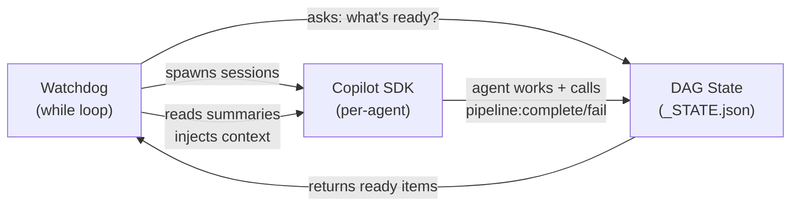
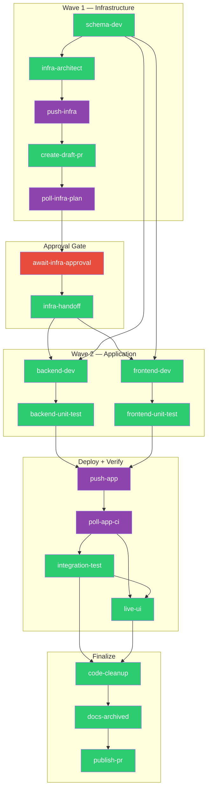
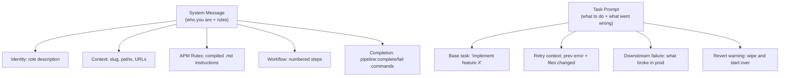
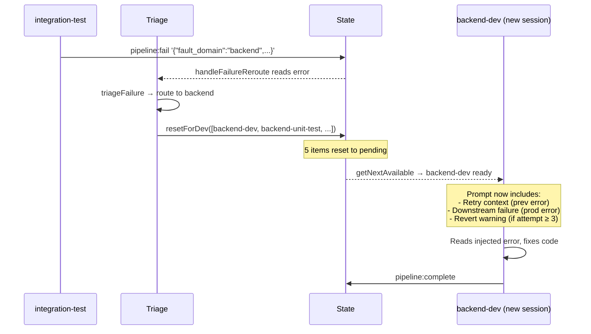
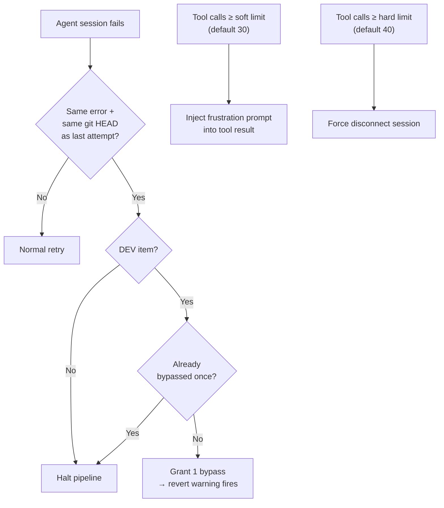

# How the Agentic Pipeline Works

## Bottom Line

A `while` loop asks a DAG "what's ready?", spawns one AI agent per ready item, and waits. Each agent writes code, then calls `pipeline:complete` or `pipeline:fail`. The DAG advances. If a post-deploy test fails, the system triages the error, resets the responsible dev item, and injects the exact failure into the next agent's prompt. No human touches anything until the PR is opened.

Three parts, three responsibilities:

| Part | Responsibility | Decides |
|---|---|---|
| **Watchdog** (`watchdog.ts`) | Loop, spawn, advance | *When* to run agents |
| **DAG State** (`_STATE.json`) | Track item status, enforce order | *What* runs next |
| **Agent Sessions** (`session-runner.ts`) | Build prompts, manage SDK lifecycle | *How* agents are configured |



That's the whole system. Everything below zooms deeper into each part.

> **Key files at this level:** The loop lives in [watchdog.ts](tools/autonomous-factory/src/watchdog.ts#L358) (`while (true)`). State lives in [pipeline-state.mjs](tools/autonomous-factory/pipeline-state.mjs). Session lifecycle lives in [session-runner.ts](tools/autonomous-factory/src/session-runner.ts).

---

## Level 2 — The DAG

You already know the system has 3 parts. Now: what does the DAG actually look like?

19 items across 6 phases, organized as a **Two-Wave model** — infrastructure deploys first, then application code builds on top of it.



**What you need to know to reason about this:**

- **Green nodes** (schema-dev, backend-dev, frontend-dev) are *AI coding agents* — they get an SDK session with a full prompt.
- **Purple nodes** (push-\*, poll-\*) are *deterministic* — shell scripts with no LLM involved. Push runs `agent-commit.sh` + `git push`. Poll watches GitHub Actions.
- **Red node** (await-infra-approval) is a *human gate* — the pipeline pauses until a human approves the Terraform plan.
- Items with shared dependencies **run in parallel**. `backend-dev` and `frontend-dev` both depend on `schema-dev` + `infra-handoff`, so they execute simultaneously.

**What controls which items exist:** Workflow type. A `Backend`-only feature skips `frontend-dev`, `frontend-unit-test`, and `live-ui` (marked `N/A` at init). The DAG shape adapts, but its edges never change.

> **Key code at this level:**
> - Item list: `ALL_ITEMS` — [pipeline-state.mjs#L51](tools/autonomous-factory/pipeline-state.mjs#L51)
> - Dependency edges: `ITEM_DEPENDENCIES` — [pipeline-state.mjs#L95](tools/autonomous-factory/pipeline-state.mjs#L95)
> - Workflow-based N/A items: `NA_ITEMS_BY_TYPE` — [pipeline-state.mjs#L79](tools/autonomous-factory/pipeline-state.mjs#L79)
> - DAG resolution: `getNextAvailable()` — [pipeline-state.mjs#L761](tools/autonomous-factory/pipeline-state.mjs#L761) — scans all items, returns everything whose deps are `done`/`na`
> - Completion: `completeItem()` — [pipeline-state.mjs#L280](tools/autonomous-factory/pipeline-state.mjs#L280) — validates phase gating
> - Failure: `failItem()` — [pipeline-state.mjs#L320](tools/autonomous-factory/pipeline-state.mjs#L320) — records error, checks retry limit
> - Concurrency lock: `withLock()` — [pipeline-state.mjs#L219](tools/autonomous-factory/pipeline-state.mjs#L219) — POSIX `mkdirSync` atomic mutex

---

## Level 3 — What Each Agent Receives

You now know *which* agents exist and *when* they run. Next question: what goes into an agent's prompt?

Every agent gets two strings: a **system message** (who you are, what rules to follow) and a **task prompt** (what to do right now). Both are assembled from modular pieces:



**Only three of these actually matter for correctness:**

| Layer | Why it matters |
|---|---|
| **APM Rules** (gold) | Domain-specific coding instructions compiled from `.apm/instructions/` markdown files. This is what keeps agents from writing wrong code patterns. Without this, agents hallucinate framework usage. |
| **Completion Block** (red) | The *only way* an agent talks back to the DAG. Contains the exact `npm run pipeline:complete` and `pipeline:fail` commands. Without this, the pipeline stalls. |
| **Context Injections** (red, task side) | What makes the system self-healing. Only appear on retries. Covered in Level 4. |

The rest (identity, context, workflow steps) provide orientation but don't affect correctness. An agent with wrong identity text still writes correct code if the APM rules are right.

### How APM rules get assembled

The `.apm/apm.yml` manifest declares which instruction files each agent gets:

```yaml
backend-dev:
  instructions: [always, backend, tooling/roam-tool-rules.md]
```

The APM compiler resolves this: `always` → all `.md` files in `.apm/instructions/always/`, `backend` → all `.md` files in `.apm/instructions/backend/`, etc. Concatenated, validated against a 6000-token budget, then injected as `## Coding Rules` in the system message.

> **Key code at this level:**
> - Prompt factory: [agents.ts](tools/autonomous-factory/src/agents.ts) — all prompt builders live here
> - Per-agent routing: `ITEM_ROUTING` — [agents.ts#L1614](tools/autonomous-factory/src/agents.ts#L1614) — maps each item key to its prompt builder
> - Config assembly: `getAgentConfig()` — [agents.ts#L1710](tools/autonomous-factory/src/agents.ts#L1710) — returns systemMessage + model + mcpServers
> - Task prompt: `buildTaskPrompt()` — [agents.ts#L1732](tools/autonomous-factory/src/agents.ts#L1732) — builds per-session user message
> - Completion contract: `completionBlock()` — [agents.ts#L74](tools/autonomous-factory/src/agents.ts#L74) — the `pipeline:complete/fail` commands
> - Agent context: `AgentContext` interface — [agents.ts#L23](tools/autonomous-factory/src/agents.ts#L23) — slug, paths, URLs, test commands
> - Example prompt: `backendDevPrompt()` — [agents.ts#L196](tools/autonomous-factory/src/agents.ts#L196)
> - APM compiler: `compileApm()` — [apm-compiler.ts#L118](tools/autonomous-factory/src/apm-compiler.ts#L118) — resolves instruction refs, validates token budget
> - APM manifest: [apps/sample-app/.apm/apm.yml](apps/sample-app/.apm/apm.yml) — agent declarations, instruction includes

---

## Level 4 — Self-Healing: What Happens When Things Break

You now know the DAG shape, what agents receive, and how they report back. The remaining question: what happens when an agent fails, or worse, when the *deployed code* fails?

### The core mechanism: context injection

On first attempt, an agent gets only the base task. On *retries*, the orchestrator appends structured context to the task prompt — telling the agent exactly what went wrong and what was already tried.

There are **4 injection types**, each triggered by a different condition:

| Injection | Trigger | What it tells the agent |
|---|---|---|
| **Retry context** | Same item retried (`attempt > 1`) | Previous error message, files already changed, last intent. "Start from where you left off." |
| **Downstream failure** | Dev item re-runs after a post-deploy test failed | The exact production error (e.g., "GET /api/jobs returns 500"). "Fix the root cause." |
| **Revert warning** | 3+ failed attempts on a dev item | "You're in a loop. Run `agent-branch.sh revert` to wipe everything and start over with a different approach." |
| **Infra rollback** | `infra-architect` re-runs after app team rejected infra | "The application deployment failed because infrastructure X was missing. Add it." |

### The redevelopment cycle end-to-end

This is the most common self-healing path. Follow one example:



1. `integration-test` runs against a live endpoint, gets a 500 error
2. Agent calls `pipeline:fail` with structured JSON: `{"fault_domain":"backend","diagnostic_trace":"GET /api/jobs returns 500"}`
3. `handleFailureReroute()` calls `triageFailure()`, which reads `fault_domain` and maps it to items: `[backend-dev, backend-unit-test, integration-test]`
4. `resetForDev()` resets those items plus the deploy pipeline (`push-app`, `poll-app-ci`) back to pending
5. Watchdog loop's next `getNextAvailable()` returns `backend-dev` — it's pending and its dependencies are still done
6. New `backend-dev` session gets the base task *plus* the downstream failure context with the exact error message
7. Agent reads "GET /api/jobs returns 500", fixes the handler, completes. Pipeline continues forward.

### Triage routing: how errors map to fixes

`triageFailure()` uses a 4-tier evaluation:

1. **Unfixable signals** (Azure AD, permission denied) → pipeline halts, opens a Draft PR for human remediation
2. **Structured JSON** with `fault_domain` → deterministic routing by domain
3. **CI `DOMAIN:` header** → job-based routing from poll-ci metadata
4. **Keyword fallback** → pattern matching ("terraform" → infra, "build" → app)

| `fault_domain` | Items reset |
|---|---|
| `backend` | backend-dev + backend-unit-test + failing item |
| `frontend` | frontend-dev + frontend-unit-test + failing item |
| `both` | All dev + test items |
| `backend+infra` | backend-dev + infra-architect + tests |
| `environment` | Pipeline halt (no agent fix possible) |

### Safety rails: preventing runaway agents

Two separate circuit breakers protect against loops:



**Identical-error circuit breaker** (top): If an agent fails with the exact same error *and* the same git HEAD (meaning it changed nothing), retrying is pointless. For dev items, one bypass is granted so the revert warning can fire and the agent gets a chance to wipe-and-rebuild.

**Cognitive circuit breaker** (bottom): Counts tool calls during a live session. At the soft limit, a frustration prompt is injected *into the tool result* (not console — the LLM actually reads it). At the hard limit, the session is force-disconnected.

Hard limits: 10 retries per item, 5 redevelopment cycles per feature, 10 re-deploy cycles.

> **Key code at this level:**
> - Context injection builders — all in [context-injection.ts](tools/autonomous-factory/src/context-injection.ts):
>   - `buildRetryContext()` — [L15](tools/autonomous-factory/src/context-injection.ts#L15)
>   - `buildDownstreamFailureContext()` — [L43](tools/autonomous-factory/src/context-injection.ts#L43)
>   - `buildRevertWarning()` — [L99](tools/autonomous-factory/src/context-injection.ts#L99)
>   - `buildInfraRollbackContext()` — [L115](tools/autonomous-factory/src/context-injection.ts#L115)
>   - `computeEffectiveDevAttempts()` — [L137](tools/autonomous-factory/src/context-injection.ts#L137) — merges in-memory + persisted cycle counts
>   - `writeChangeManifest()` — [L155](tools/autonomous-factory/src/context-injection.ts#L155) — writes `_CHANGES.json` for docs-expert
> - Triage — all in [triage.ts](tools/autonomous-factory/src/triage.ts):
>   - `triageFailure()` — [L69](tools/autonomous-factory/src/triage.ts#L69) — 4-tier evaluation
>   - `applyFaultDomain()` — [L209](tools/autonomous-factory/src/triage.ts#L209) — maps domain → item keys
>   - `UNFIXABLE_SIGNALS` — [L23](tools/autonomous-factory/src/triage.ts#L23) — Azure AD, permission denied, etc.
>   - `parseTriageDiagnostic()` — [L112](tools/autonomous-factory/src/triage.ts#L112) — extracts structured JSON from error strings
> - Failure rerouting: `handleFailureReroute()` — [session-runner.ts#L980](tools/autonomous-factory/src/session-runner.ts#L980)
> - State mutations:
>   - `resetForDev()` — [pipeline-state.mjs#L627](tools/autonomous-factory/pipeline-state.mjs#L627) — resets items for redevelopment
>   - `salvageForDraft()` — [pipeline-state.mjs#L358](tools/autonomous-factory/pipeline-state.mjs#L358) — graceful degradation to Draft PR
> - Circuit breakers:
>   - Identical-error: `shouldSkipRetry()` — [session-runner.ts#L195](tools/autonomous-factory/src/session-runner.ts#L195)
>   - Cognitive (soft+hard): `wireToolLogging()` — [session-runner.ts#L1078](tools/autonomous-factory/src/session-runner.ts#L1078)

---

## Level 5 — The In-Memory Runtime State

*Only read this if you need to understand or modify `session-runner.ts`.*

`PipelineRunState` is the in-memory counterpart to `_STATE.json`. It holds ephemeral data that doesn't need to survive a process crash:

```typescript
interface PipelineRunState {
  pipelineSummaries: ItemSummary[];     // append-only log of every attempt
  attemptCounts: Record<string, number>; // retry counter per item
  circuitBreakerBypassed: Set<string>;   // one-time bypass tracker
  preStepRefs: Record<string, string>;   // git HEAD before each step
  baseTelemetry: PreviousSummaryTotals;  // metric baseline from prior run
}
```

Where each field is read and written:

| Field | Written | Read by | Purpose |
|---|---|---|---|
| `pipelineSummaries` | `.push()` after every session | `shouldSkipRetry` (compare errors), `buildRetryContext` (prev attempt), `buildDownstreamFailureContext` (prod failures), `writeChangeManifest` (docs input) | Append-only telemetry log |
| `attemptCounts` | `++` on every `runItemSession` entry | Circuit breaker (> 2), retry injection (> 1), revert warning (≥ 3) | In-memory retry counter |
| `circuitBreakerBypassed` | `.add()` on first DEV bypass | Circuit breaker — skip if already used | Ensures revert warning fires exactly once |
| `preStepRefs` | `= git HEAD` before each step | `tryAutoSkip` (diff against current HEAD) | Skip test/deploy items if no relevant code changed |
| `baseTelemetry` | Once at boot | `flushReports` (add to current totals) | Monotonic metric accumulation across restarts |

**Why two state systems?** `_STATE.json` is the durable DAG state that survives crashes — which items are done, fail counts, cycle counts. `PipelineRunState` is per-run telemetry and behavioral guards. Restarting the orchestrator resets `PipelineRunState` (attempt counts reset, bypasses reset) but `_STATE.json` persists where the pipeline left off.

### `runItemSession` → `runAgentSession` flow

`runItemSession` is the entry point. It runs three gates before delegating:

1. **Circuit breaker gate**: If `attemptCounts > 2` and `shouldSkipRetry` detects same error + same HEAD → halt (or grant one bypass for dev items)
2. **Auto-skip gate**: `tryAutoSkip` diffs `preStepRefs[key]..HEAD` — if no relevant files changed, skip re-running tests
3. **Deterministic bypass**: `push-*` and `poll-*` items run shell scripts directly, no SDK session

Everything else enters `runAgentSession`, which:
1. Builds `AgentContext` from config + APM manifest
2. Calls `getAgentConfig()` → system message, model, MCP servers
3. Creates an SDK session + wires event listeners (tool logging, circuit breaker, intent capture)
4. Assembles the task prompt + all applicable context injections
5. Calls `sendAndWait()` (agent works for 5–60+ minutes)
6. Pushes `itemSummary` to `pipelineSummaries`, flushes reports
7. Re-reads `_STATE.json` to check if the agent called `pipeline:complete` or `pipeline:fail`
8. If failed + post-deploy/test item → `handleFailureReroute()` triggers triage and redevelopment

> **Key code at this level:**
> - `PipelineRunState` interface — [session-runner.ts#L245](tools/autonomous-factory/src/session-runner.ts#L245)
> - `PipelineRunConfig` interface — [session-runner.ts#L263](tools/autonomous-factory/src/session-runner.ts#L263)
> - Entry point: `runItemSession()` — [session-runner.ts#L286](tools/autonomous-factory/src/session-runner.ts#L286) — gates + routing
> - Agent engine: `runAgentSession()` — [session-runner.ts#L764](tools/autonomous-factory/src/session-runner.ts#L764) — SDK lifecycle
> - Auto-skip: `tryAutoSkip()` — [session-runner.ts#L403](tools/autonomous-factory/src/session-runner.ts#L403)
> - Deterministic bypasses: `runPushCode()` — [session-runner.ts#L485](tools/autonomous-factory/src/session-runner.ts#L485), `runPollCi()` — [session-runner.ts#L553](tools/autonomous-factory/src/session-runner.ts#L553)
> - Report flush: `flushReports()` — [session-runner.ts#L1262](tools/autonomous-factory/src/session-runner.ts#L1262)
> - Report writer: `writePipelineSummary()` — [reporting.ts#L247](tools/autonomous-factory/src/reporting.ts#L247)
> - Telemetry type: `PreviousSummaryTotals` — [reporting.ts#L185](tools/autonomous-factory/src/reporting.ts#L185)
> - Auto-skip helpers: [auto-skip.ts](tools/autonomous-factory/src/auto-skip.ts) — `getMergeBase()` [L12](tools/autonomous-factory/src/auto-skip.ts#L12), `getAutoSkipBaseRef()` [L26](tools/autonomous-factory/src/auto-skip.ts#L26), `getGitChangedFiles()` [L46](tools/autonomous-factory/src/auto-skip.ts#L46)
> - State commit after batch: `commitAndPushState()` — [watchdog.ts#L219](tools/autonomous-factory/src/watchdog.ts#L219)
> - Feature archiving: `archiveFeatureFiles()` — [watchdog.ts#L114](tools/autonomous-factory/src/watchdog.ts#L114)

---

## Quick Reference

### Key source files

| File | What it does |
|---|---|
| `tools/autonomous-factory/pipeline-state.mjs` | DAG definition, state mutations, `getNextAvailable()` |
| `tools/autonomous-factory/src/watchdog.ts` | Main loop — spawn, wait, advance |
| `tools/autonomous-factory/src/session-runner.ts` | Per-item lifecycle, circuit breakers, context injection orchestration |
| `tools/autonomous-factory/src/agents.ts` | Prompt factory — `ITEM_ROUTING` map, all prompt builders |
| `tools/autonomous-factory/src/apm-compiler.ts` | APM manifest → compiled rules + token validation |
| `tools/autonomous-factory/src/context-injection.ts` | Retry/downstream/revert/infra prompt builders |
| `tools/autonomous-factory/src/triage.ts` | Error triage → fault domain → item reset routing |
| `apps/sample-app/.apm/apm.yml` | Agent declarations, instruction refs, MCP servers, tool limits |

### The design principle

The LLM is a **worker** — it gets narrow instructions and reports through a structured contract (`pipeline:complete/fail`). The DAG state machine is the **brain** — it decides what runs next, when to retry, when to reroute, and when to give up. All routing and recovery logic is deterministic code, never LLM judgment.
