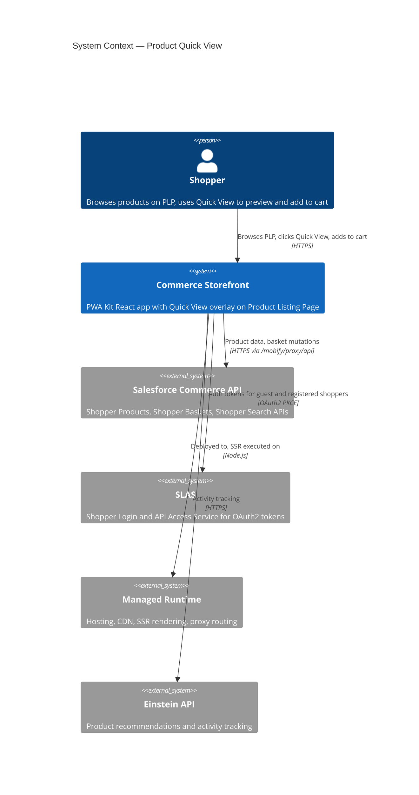
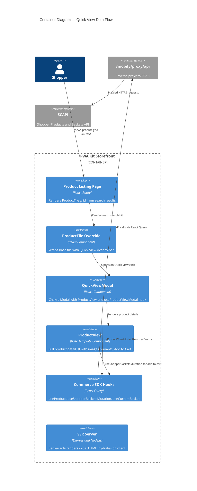
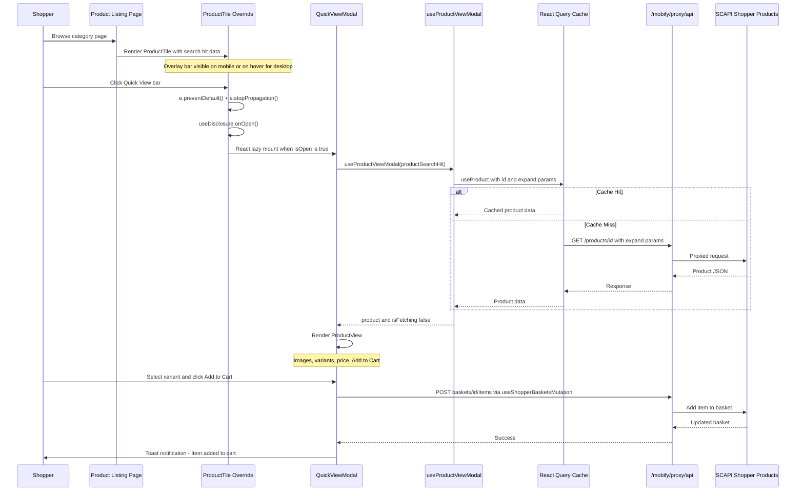
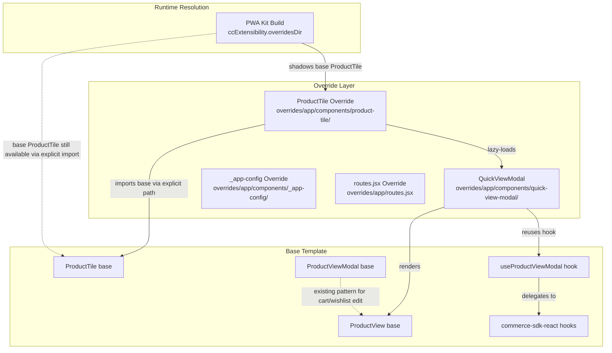
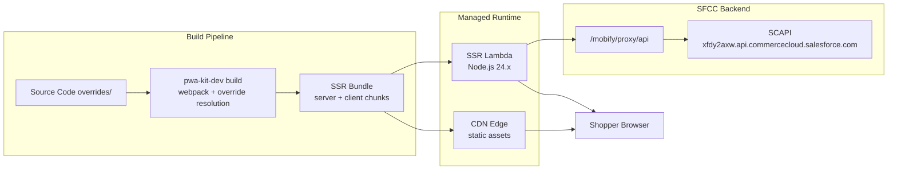

# Architecture Report: Product Quick View

**Feature:** `product-quick-view`
**App:** `apps/commerce-storefront`
**Date:** 2026-04-13
**Status:** Implementation Complete

---

## 1. C4 Context Diagram

The Product Quick View feature operates within the Salesforce PWA Kit ecosystem.
The storefront is a server-side rendered React application deployed to Managed Runtime,
with all commerce data flowing through SCAPI (Shopper Commerce API) via a proxy layer.



## 2. C4 Container Diagram



## 3. Component Inventory

### 3.1 New Components (Created)

| Component | Path | Purpose | Lines |
|---|---|---|---|
| **ProductTile (Override)** | `overrides/app/components/product-tile/index.jsx` | Wraps base ProductTile with Quick View overlay bar. Manages useDisclosure state. Lazy-loads QuickViewModal via React.lazy. | ~179 |
| **QuickViewModal** | `overrides/app/components/quick-view-modal/index.jsx` | Chakra Modal that fetches full product data via useProductViewModal hook, renders ProductView with loading/error/success states. Includes QuickViewErrorBoundary. | ~149 |
| **EyeIcon** | Inline in product-tile/index.jsx | Lightweight SVG eye icon replacing @chakra-ui/icons dependency. SSR-safe. | ~8 |
| **QuickViewErrorBoundary** | Inline in quick-view-modal/index.jsx | Class-based React error boundary. Catches ProductView render failures without crashing PLP. | ~28 |

### 3.2 Reused Base Template Components (Unmodified)

| Component / Hook | Source | Role in Feature |
|---|---|---|
| `OriginalProductTile` | `@salesforce/retail-react-app/app/components/product-tile` | Base tile rendering (image, name, price, swatches). Rendered inside the override wrapper. |
| `ProductView` | `@salesforce/retail-react-app/app/components/product-view` | Full product detail UI inside modal. Handles variant selection, cart mutations, toast notifications internally. |
| `useProductViewModal` | `@salesforce/retail-react-app/app/hooks/use-product-view-modal` | Fetches full ShopperProduct data with correct expand params (images, promotions, availability). |
| `useShopperBasketsMutation` | `@salesforce/commerce-sdk-react` | Add-to-cart mutation (invoked internally by ProductView). |
| `useProduct` | `@salesforce/commerce-sdk-react` | Core product data fetching hook (invoked by useProductViewModal). |

### 3.3 Test Files (Created)

| File | Path | Coverage |
|---|---|---|
| ProductTile Override Tests | `overrides/app/components/product-tile/index.test.js` | Overlay bar rendering, interaction, accessibility, visual states |
| QuickViewModal Tests | `overrides/app/components/quick-view-modal/index.test.js` | Modal shell (loading/error/success), ProductView integration, accessibility |

---

## 4. Data Flow

### 4.1 Quick View Lifecycle



### 4.2 SDK Hook Chain

```
ProductTile (override)
  |-- QuickViewModal (React.lazy)
       |-- useProductViewModal(productSearchHit)
       |    |-- useProduct(productId, { expand: [images, promotions, availability] })
       |         |-- React Query -> /mobify/proxy/api -> SCAPI Shopper Products
       |-- useIntl() -> i18n for aria-label and error messages
       |-- ProductView (base template)
            |-- useDerivedProduct() -> variant/inventory state derivation
            |-- useShopperBasketsMutation('addItemToBasket') -> cart mutation
            |-- useCurrentBasket() -> current basket context
            |-- useToast() -> success/error notifications
```

---

## 5. PWA Kit Override Architecture



### Key Override Decisions

| Decision | Mechanism |
|---|---|
| Shadow ProductTile across entire app | File at `overrides/app/components/product-tile/index.jsx` auto-replaces base |
| Still access original ProductTile | Explicit import: `from '@salesforce/retail-react-app/app/components/product-tile'` |
| No route changes needed | Quick View is a modal overlay on existing PLP route — no new URLs |
| No config changes needed | Feature uses existing SCAPI credentials and proxy configuration |

---

## 6. SSR Safety Architecture

The feature is designed to be SSR-safe with zero hydration mismatches:

| Concern | Solution |
|---|---|
| **Modal hooks during SSR** | QuickViewModal loaded via React.lazy() + guarded by `{isOpen && ...}`. Never mounts during server render. |
| **useDisclosure initial state** | Initializes isOpen: false on both server and client. No mismatch. |
| **useProductViewModal during SSR** | Only called when QuickViewModal mounts (client-only). Zero server-side API calls per tile. |
| **useToast during SSR** | Only called inside ProductView which is inside the lazy-loaded modal. Never executes on server. |
| **Overlay bar rendering** | Pure CSS styling with responsive opacity/transform. Renders identically on server and client. |
| **EyeIcon SVG** | Inline SVG component — no external dependency, deterministic render. |

---

## 7. Accessibility Architecture

| Feature | Implementation |
|---|---|
| **Overlay bar semantics** | `Box as="button"` renders native button element. Focusable via Tab. Enter/Space triggers click. |
| **Keyboard reveal** | `_focus` pseudo makes bar visible when Tab-focused on desktop, bypassing hover requirement. |
| **Modal aria-label** | Dynamic: "Quick view for {productName}" with fallback to "product". |
| **Bar aria-label** | Dynamic: "Quick View {productName}". |
| **Focus trapping** | Chakra Modal traps focus. Tab cycling stays within modal. |
| **Escape to close** | Chakra Modal handles Escape key natively. |
| **Focus restoration** | On close, focus returns to trigger element (Chakra default behavior). |
| **Color contrast** | White text on rgba(0,0,0,0.6) exceeds WCAG AA 4.5:1 ratio. |

---

## 8. Deployment Topology



**Bundle Impact:**
- QuickViewModal is code-split via React.lazy() — not included in the main PLP chunk
- Modal JS only downloaded when shopper clicks Quick View for the first time
- ProductTile override adds approximately 4KB (uncompressed) to the base tile chunk
- No new npm dependencies — reuses existing @salesforce/retail-react-app and @salesforce/commerce-sdk-react
