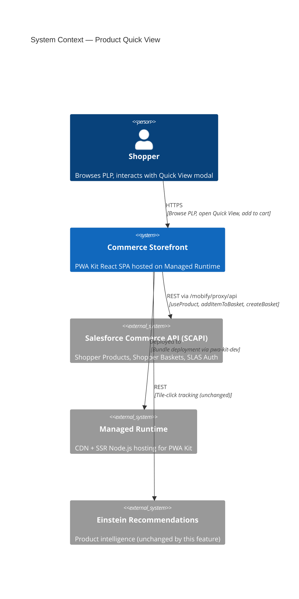
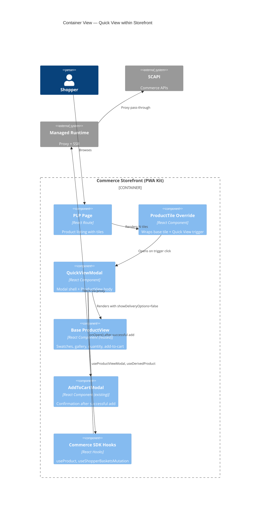
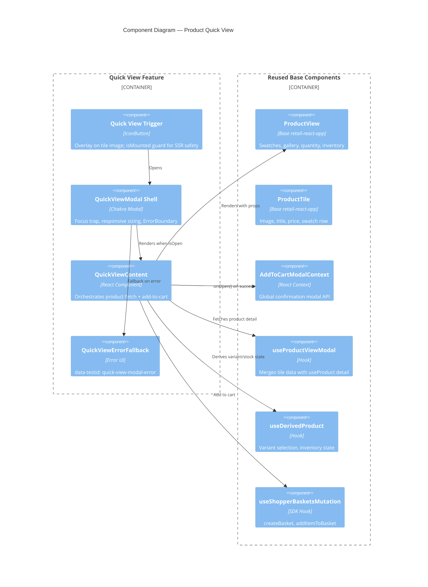
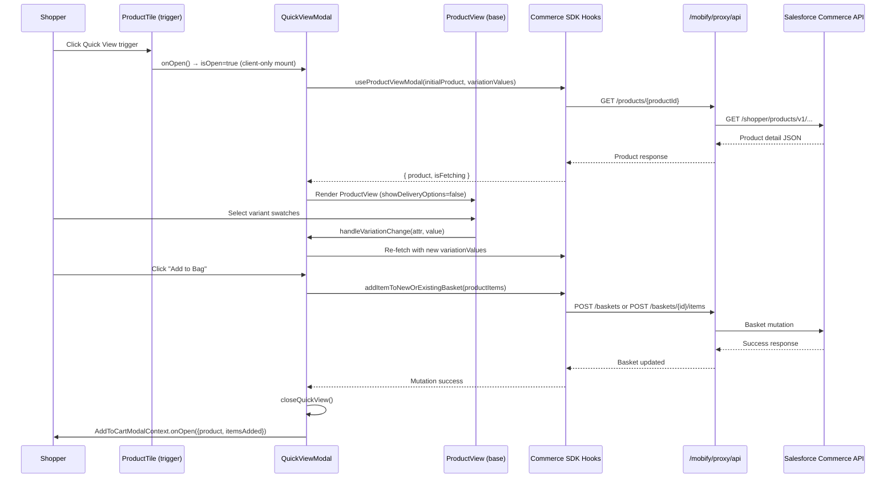
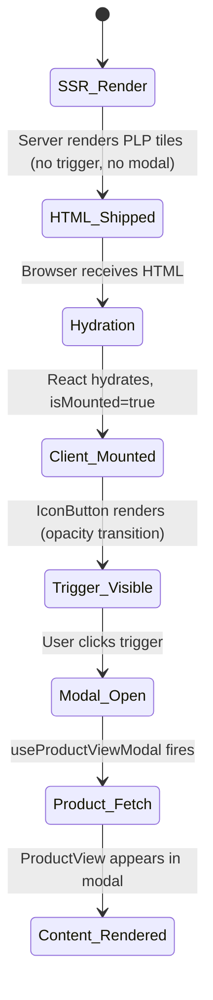

# Product Quick View — Architecture Report

> **Feature:** product-quick-view  
> **Date:** 2026-04-29  
> **Author:** Executive Architect (doc-architect node)

---

## 1. C4 Context Diagram

The Product Quick View feature operates within the existing PWA Kit commerce storefront architecture. It introduces no new external system integrations — it reuses the established SCAPI proxy chain.

## 2. C4 Container Diagram

## 3. C4 Component Diagram — Quick View Feature

## 4. Component Inventory

### New Components (Override Surface)

| Component | Path | Purpose |
|---|---|---|
| `QuickViewModal` | `overrides/app/components/quick-view-modal/index.jsx` | Modal shell + body orchestrating product view in a dialog |
| `QuickViewContent` | (same file, internal) | Fetches product data, manages variation state, handles add-to-cart |
| `QuickViewErrorFallback` | (same file, internal) | ErrorBoundary fallback with `-error` testid |
| `ProductTile` (override) | `overrides/app/components/product-tile/index.jsx` | Wraps base tile with Quick View trigger overlay |

### Modified Components

| Component | Path | Change |
|---|---|---|
| `routes.jsx` | `overrides/app/routes.jsx` | Removed unused `my-new-route` placeholder |

### Deleted Components

| Component | Path | Reason |
|---|---|---|
| `MyNewRoute` | `overrides/app/pages/my-new-route/index.jsx` | Scaffold cleanup (unused) |

### Reused Base Components (Unmodified)

| Component | Package | Role in Feature |
|---|---|---|
| `ProductView` | `@salesforce/retail-react-app` | Full product detail UI (swatches, gallery, quantity, price) |
| `ProductTile` (base) | `@salesforce/retail-react-app` | Base tile rendering (image, title, price) |
| `AddToCartModal` | `@salesforce/retail-react-app` | Confirmation modal after successful basket mutation |
| `useProductViewModal` | `@salesforce/retail-react-app` | Product data fetching + tile-to-detail merge |
| `useDerivedProduct` | `@salesforce/retail-react-app` | Variant selection, inventory, orderable logic |
| `useAddToCartModalContext` | `@salesforce/retail-react-app` | Context API for global add-to-cart confirmation |
| `useShopperBasketsMutationHelper` | `@salesforce/commerce-sdk-react` | Basket mutations (create + addItem) |

## 5. Data Flow Diagram

## 6. SSR / Hydration Strategy

**Key SSR decisions:**
- Trigger uses `isMounted` pattern — absent from server HTML, appears post-hydration
- Modal contents gated on `{isOpen && <QuickViewModal>}` — `useProduct` never fires during SSR
- Lazy-loaded via `React.lazy()` — modal chunk only fetched on first trigger click
- Zero hydration mismatch: server HTML has no trigger/modal markup

## 7. API Dependency Map

| API Endpoint | SDK Hook | Trigger | Auth |
|---|---|---|---|
| `GET /shopper/products/v1/organizations/{orgId}/products/{productId}` | `useProduct` (via `useProductViewModal`) | Modal opens | SLAS guest/registered |
| `POST /shopper/baskets/v2/organizations/{orgId}/baskets` | `useShopperBasketsMutation('createBasket')` | Add to cart (no basket exists) | SLAS guest/registered |
| `POST /shopper/baskets/v2/organizations/{orgId}/baskets/{basketId}/items` | `useShopperBasketsMutation('addItemToBasket')` | Add to cart (basket exists) | SLAS guest/registered |

All API calls route through the `/mobify/proxy/api` reverse proxy configured in `config/default.js`. No direct external calls are made from the browser.

---

*Generated by doc-architect node · 2026-04-29*
