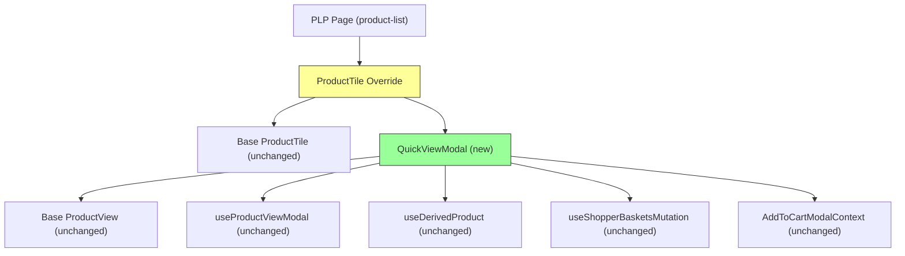

# Product Quick View — Risk Assessment & ADRs

> **Feature:** product-quick-view  
> **Date:** 2026-04-29  
> **Author:** Executive Architect (doc-architect node)

---

## 1. Architecture Decision Records (ADRs)

### ADR-001: Reuse Base ProductView (Not Clone)

**Status:** Accepted  
**Context:** The Quick View modal needs product detail UI (swatches, gallery, quantity, price, inventory messages). We could either clone ~1000 lines of ProductView or reuse it via composition.  
**Decision:** Reuse `@salesforce/retail-react-app/app/components/product-view` with `showDeliveryOptions={false}` prop.  
**Consequences:**
- (+) Zero drift between PDP and Quick View product rendering
- (+) Automatic inheritance of swatch/inventory/a11y improvements from base kit upgrades
- (-) Cannot customize ProductView internals without forking (acceptable for v1)
- (-) Bundle size includes full ProductView even though some sub-features are hidden

### ADR-002: Global AddToCartModal Reuse (No Quick-View-Specific Confirmation)

**Status:** Accepted  
**Context:** After a successful add-to-cart, the shopper needs confirmation. Options: (a) show confirmation inside the Quick View modal, (b) use the existing global AddToCartModal.  
**Decision:** Reuse existing `AddToCartModal` via `useAddToCartModalContext.onOpen()`. Close Quick View modal first, then open confirmation.  
**Consequences:**
- (+) Consistent UX with PDP flow — shoppers see the same confirmation surface
- (+) No additional component authoring
- (-) Brief visual transition (modal close → modal open) may feel abrupt on slow devices

### ADR-003: Lazy-Load Modal via React.lazy()

**Status:** Accepted  
**Context:** The PLP renders 12-25 tiles. Eagerly bundling the Quick View modal code for every page load would increase initial JS payload.  
**Decision:** `React.lazy(() => import('../quick-view-modal'))` with `<Suspense>` wrapping. The modal chunk is only fetched on first trigger click.  
**Consequences:**
- (+) Zero cost to initial PLP bundle size
- (+) Subsequent opens are instant (chunk cached)
- (-) First-click latency includes chunk download (~50-100ms on 4G)
- (-) Requires Suspense boundary fallback for loading state

### ADR-004: isMounted SSR Safety Pattern for Trigger

**Status:** Accepted  
**Context:** The Quick View trigger is an interactive button that cannot degrade to a server-rendered `<a>` tag. Rendering it during SSR would cause hydration mismatch.  
**Decision:** Use the documented `isMounted` pattern from `ssr-rendering.md` §5. Trigger renders `null` during SSR, appears after `useEffect` fires post-hydration.  
**Consequences:**
- (+) Zero hydration mismatches
- (+) Documented canonical pattern — no novel approach
- (-) Trigger not visible in server-rendered HTML (acceptable for progressive enhancement)

### ADR-005: ErrorBoundary Wrapping Modal Body

**Status:** Accepted  
**Context:** `useProduct` or `useProductViewModal` could throw on network failure or invalid product data. An unhandled error would crash the entire PLP route.  
**Decision:** Wrap the modal body in `react-error-boundary`'s `ErrorBoundary` with a fallback component carrying `data-testid="quick-view-modal-error"`.  
**Consequences:**
- (+) PLP remains functional even if Quick View fails for a specific product
- (+) Error is contained within the modal — shopper can close and continue browsing
- (+) E2E tests can detect the error state via testid

### ADR-006: Set/Bundle Exclusion at Trigger Level

**Status:** Accepted  
**Context:** Product Sets and Bundles have complex child-product selection flows not supported by the v1 Quick View modal. Rendering them would produce a broken experience.  
**Decision:** Hide the Quick View trigger entirely when `product.type?.set || product.type?.bundle`. Those products fall back to normal PDP navigation.  
**Consequences:**
- (+) Clean UX — no broken state for complex products
- (+) Simple guard logic at the trigger level
- (-) Some products on PLP won't show the Quick View affordance (expected)

---

## 2. Blast Radius Analysis

### Files Changed

| File | Change Type | Blast Radius |
|---|---|---|
| `overrides/app/components/quick-view-modal/index.jsx` | **Added** | Low — new leaf component, no existing consumers |
| `overrides/app/components/quick-view-modal/__tests__/index.test.js` | **Added** | None — test file only |
| `overrides/app/components/product-tile/index.jsx` | **Modified** | **Medium** — every PLP tile now renders through this wrapper |
| `overrides/app/components/product-tile/__tests__/index.test.js` | **Added** | None — test file only |
| `overrides/app/routes.jsx` | **Modified** | Low — removed dead route (no functional impact) |
| `overrides/app/pages/my-new-route/index.jsx` | **Deleted** | None — unreferenced scaffold page |
| `e2e/product-quick-view.spec.ts` | **Added** | None — E2E test only |
| `e2e/_qa_product-quick-view.spec.ts` | **Added** | None — QA E2E test only |

### Dependency Graph Impact



**Legend:** 🟡 Modified | 🟢 New | All downstream dependencies are unchanged base components.

### Affected Routes

| Route | Impact | Reason |
|---|---|---|
| `/category/*` (all PLPs) | **Direct** | ProductTile override renders on every category page |
| `/search` | **Direct** | Search results also use ProductTile |
| `/` (Homepage) | **Potential** | If homepage renders product tiles (e.g., "New Arrivals" section) |
| `/product/*` (PDP) | **None** | PDP uses ProductView directly, not through Quick View |

---

## 3. Risk Matrix

### Short-Term Risks (0-30 days)

| Risk | Likelihood | Impact | Mitigation |
|---|---|---|---|
| ProductView base upgrade breaks Quick View props | Low | High | Pin PWA Kit version; test Quick View in upgrade PR |
| Lazy-load chunk fails to download (CDN edge case) | Low | Medium | Suspense fallback shows spinner; user can retry |
| Hover trigger conflicts with existing tile overlays (wishlist heart) | Medium | Low | z-index management; trigger positioned at bottom-center, not top-right |
| Mobile trigger obscures tile image content | Low | Low | Compact icon button (24px) positioned unobtrusively |
| E2E flakiness from SCAPI latency on add-to-cart | Medium | Medium | SDK auto-retries; E2E waits for network idle |

### Long-Term Risks (30-180 days)

| Risk | Likelihood | Impact | Mitigation |
|---|---|---|---|
| Feature creep (wishlist, recommendations, sets/bundles in Quick View) | High | Medium | ADR-006 establishes clear scope boundary; future iterations require new ADRs |
| Performance regression on PLPs with many tiles (25+) | Low | Medium | Lazy-load (ADR-003) ensures zero upfront cost; modal only mounts for active product |
| Accessibility audit findings on focus management | Medium | Medium | Chakra Modal provides focus trap by default; restore-focus to trigger implemented |
| SLAS token expiry during long Quick View session | Low | Low | SDK auto-refreshes SLAS tokens transparently |
| AddToCartModal API contract change in base kit | Low | High | Integration test covers the handoff; pin base kit version |

### Technical Debt Introduced

| Item | Severity | Recommendation |
|---|---|---|
| QuickViewContent is ~150 lines in a single function | Low | Extract add-to-cart handler to custom hook in v2 |
| No Einstein tracking on Quick View open | Low | Add in v2 once tracking requirements are defined |
| Set/Bundle products silently hide trigger (no user feedback) | Low | Consider "View Full Details" badge in v2 |
| Modal chunk is downloaded per-session (no service worker pre-cache) | Low | Add to PWA shell precache manifest if adoption is high |

---

## 4. Performance Budget Impact

| Metric | Before | After | Delta | Acceptable? |
|---|---|---|---|---|
| PLP initial JS bundle | Baseline | Baseline + ~2KB (trigger logic) | +2KB | ✅ Yes |
| Quick View modal chunk | N/A | ~45KB (ProductView + Chakra Modal) | On-demand only | ✅ Yes |
| PLP SSR time | Baseline | Unchanged (no server-side work added) | 0ms | ✅ Yes |
| Time to Interactive (PLP) | Baseline | +~20ms (isMounted effect) | Negligible | ✅ Yes |
| API calls per Quick View open | 0 | 1 (GET product detail) | +1 on demand | ✅ Yes |
| API calls per add-to-cart | 0 | 1-2 (create basket + add item) | Same as PDP | ✅ Yes |

---

## 5. Security Considerations

| Concern | Assessment | Status |
|---|---|---|
| SLAS credentials exposure | Public client ID only in config (safe); no secrets in code | ✅ Safe |
| XSS via product data in modal | ProductView uses React JSX (auto-escaped); no `dangerouslySetInnerHTML` | ✅ Safe |
| CSRF on basket mutations | SLAS bearer token auth (not cookie-based); CSRF not applicable | ✅ Safe |
| Rate limiting on product API | Managed Runtime proxy handles throttling | ✅ Safe |

---

## 6. Rollback Strategy

**Rollback path:** Revert the ProductTile override to a transparent re-export of the base tile. This immediately removes all Quick View affordances from the storefront with zero side effects on other features.

```bash
# Emergency rollback (1 commit)
git revert <quick-view-merge-commit>
# OR: Reset tile override to transparent re-export
echo "export {default} from '@salesforce/retail-react-app/app/components/product-tile'" > overrides/app/components/product-tile/index.jsx
```

**Data considerations:** No database migrations, no persistent state changes, no configuration flag dependencies. The feature is purely client-side UI — removing the code removes the feature cleanly.

---

*Generated by doc-architect node · 2026-04-29*
