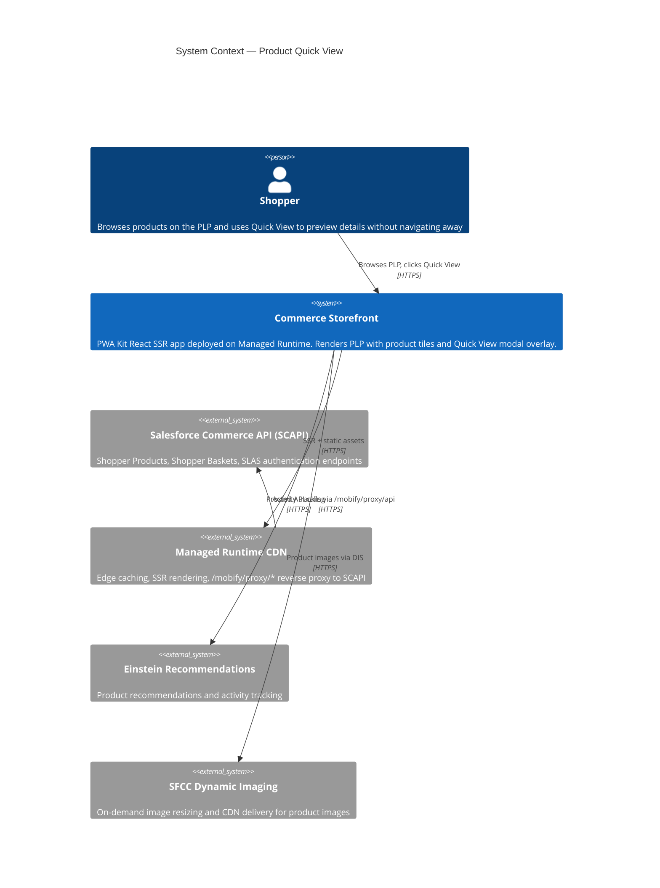
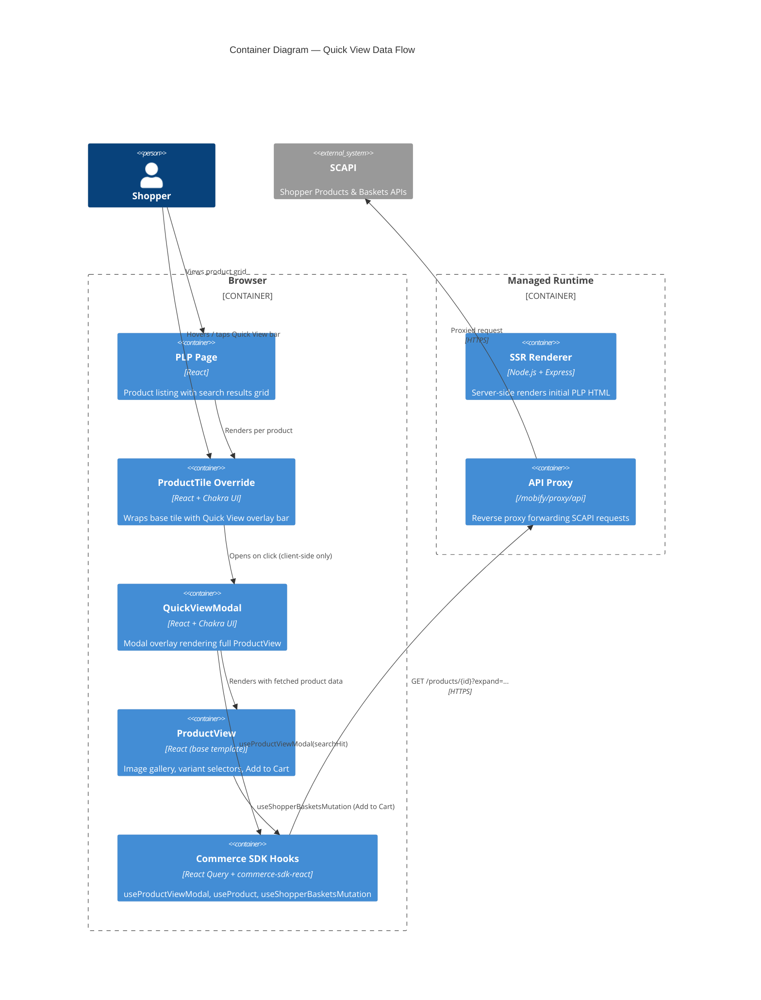
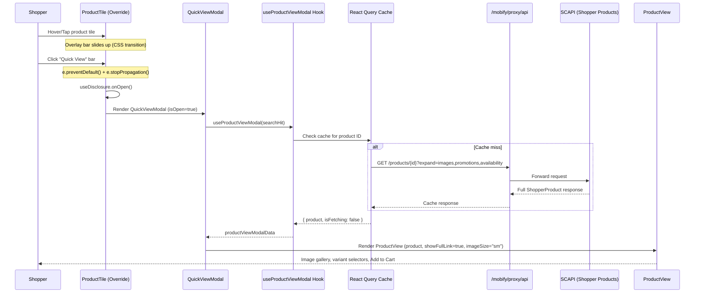
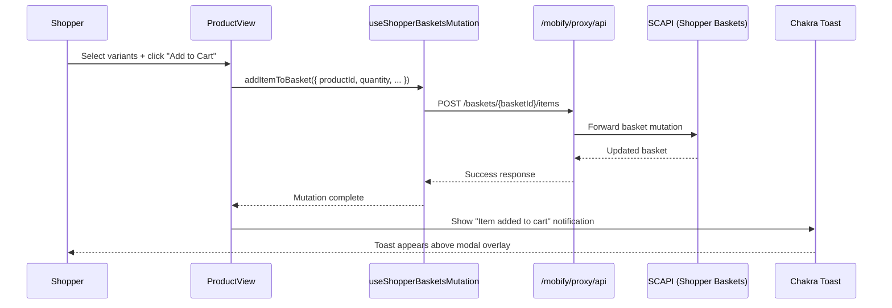
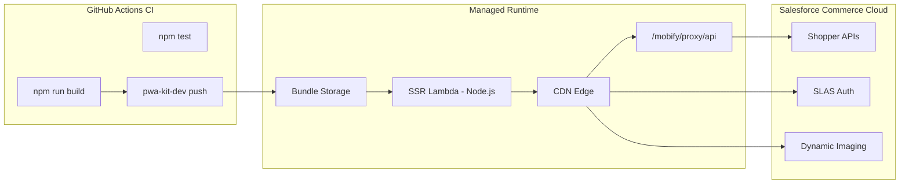

# Architecture Report: Product Quick View

**Feature:** `product-quick-view`
**Date:** 2026-04-20
**App:** `apps/commerce-storefront` (Salesforce PWA Kit / Managed Runtime)

---

## 1. C4 Context Diagram

The Product Quick View feature operates within the existing Salesforce Commerce
storefront ecosystem. The storefront is a React SSR app deployed on Managed
Runtime, communicating with Salesforce Commerce API (SCAPI) through a CDN proxy.



## 2. C4 Container Diagram



## 3. Component Inventory

### 3.1 New Components (Created by Feature)

| Component | Path | Purpose | Dependencies |
|---|---|---|---|
| **ProductTile** (override) | `overrides/app/components/product-tile/index.jsx` | Wraps base `ProductTile` in a group-hover container. Adds Quick View overlay bar with slide-up animation. Controls modal open/close via `useDisclosure`. | `OriginalProductTile` (base), `QuickViewModal`, `ViewIcon`, Chakra `useDisclosure` |
| **QuickViewModal** | `overrides/app/components/quick-view-modal/index.jsx` | Chakra `Modal` shell that fetches full product data via `useProductViewModal` hook and renders `ProductView`. Handles loading, error, and unavailable states. Includes `QuickViewErrorBoundary`. | `ProductView` (base), `useProductViewModal` (base hook), `useIntl`, Chakra Modal components |
| **QuickViewErrorBoundary** | (inline in `quick-view-modal/index.jsx`) | Class-based React error boundary. Catches `ProductView` render failures and shows a graceful error message instead of crashing the page. | None (React core) |

### 3.2 Reused Base Template Components (NOT Modified)

| Component / Hook | Source | Role in Quick View |
|---|---|---|
| `ProductView` | `@salesforce/retail-react-app/app/components/product-view` | Full product detail UI: image gallery, variant selectors (color/size), quantity picker, Add to Cart button. Rendered inside the modal. Handles cart mutations internally. |
| `useProductViewModal` | `@salesforce/retail-react-app/app/hooks/use-product-view-modal` | Hook that accepts a `ProductSearchHit`, calls `useProduct` with correct `expand` params (`images`, `promotions`, `availability`), returns `{ product, isFetching }`. |
| `ProductViewModal` | `@salesforce/retail-react-app/app/components/product-view-modal` | Existing modal used in Cart/Wishlist for editing items. Our `QuickViewModal` follows the same pattern but is tailored for PLP context. |
| `OriginalProductTile` | `@salesforce/retail-react-app/app/components/product-tile` | Base product tile with image, name, price, swatches. Imported directly and wrapped by our override. |
| `Skeleton` | `@salesforce/retail-react-app/app/components/product-tile` | Re-exported from our override for consumers expecting it from the tile module. |

### 3.3 Test Files

| File | Coverage |
|---|---|
| `overrides/app/components/product-tile/index.test.js` | Overlay bar rendering, interaction (click/preventDefault/stopPropagation), product type filtering, prop forwarding |
| `overrides/app/components/quick-view-modal/index.test.js` | Modal loading/error/success states, aria-label, ProductView prop passing, close behavior |
| `e2e/product-quick-view.spec.ts` | Playwright E2E: Quick View bar visibility, modal open/close, product data rendering, mobile viewport, overlay backdrop close |

## 4. Data Flow

### 4.1 Quick View Trigger → Modal → API → Render



### 4.2 Add to Cart (Within Modal)



## 5. Override Mechanism Architecture

The PWA Kit extensibility system resolves component imports through an override chain:

```
Import Resolution Order:
1. overrides/app/components/<name>/index.jsx   ← Our custom code (WINS)
2. @salesforce/retail-react-app/app/components/<name>/index.jsx  ← Base template

Configuration:
  package.json → ccExtensibility.overridesDir: "overrides"
```

```mermaid
graph TD
    A[PLP Page imports ProductTile] -->|Webpack resolves| B{Override exists?}
    B -->|Yes| C[overrides/app/components/product-tile/index.jsx]
    B -->|No| D[@salesforce/retail-react-app/.../product-tile/index.jsx]
    C -->|Explicitly imports base| D
    C --> E[QuickViewModal - new component]
    E -->|Uses base hook| F[useProductViewModal]
    E -->|Renders base component| G[ProductView]
    F -->|Internally calls| H[useProduct from commerce-sdk-react]
    G -->|Internally calls| I[useShopperBasketsMutation]
```

**Key architectural constraint:** Our override imports the base `ProductTile` explicitly via the full package path (`@salesforce/retail-react-app/app/components/product-tile`), wraps it, and adds the overlay bar. This avoids duplicating any base tile logic.

## 6. Deployment Architecture



The Quick View feature requires **no deployment configuration changes**. It uses:
- Existing proxy configuration (`/mobify/proxy/api` → `xfdy2axw.api.commercecloud.salesforce.com`)
- Existing SLAS client ID (`44cfcf31-d64d-4227-9cce-1d9b0716c321`)
- Existing Commerce API org (`f_ecom_aaia_prd`) and site (`RefArch`)
- No new routes, no new API endpoints, no new environment variables

## 7. Technology Stack Summary

| Layer | Technology | Version |
|---|---|---|
| Framework | Salesforce PWA Kit | 9.1.1 (`@salesforce/retail-react-app`) |
| UI Library | Chakra UI | via PWA Kit shared UI |
| State / Data | React Query | via `@salesforce/commerce-sdk-react` |
| API | Salesforce Commerce API (SCAPI) | Shopper Products v1, Shopper Baskets v1 |
| Auth | SLAS (Shopper Login & API Access Service) | Managed by `commerce-sdk-react` |
| i18n | react-intl | ICU message format |
| Testing | Jest + React Testing Library | via `pwa-kit-dev test` |
| E2E | Playwright | Configured in `playwright.config.ts` |
| Runtime | Node.js 22.x on Managed Runtime | SSR + CDN |
| Build | Webpack | via `pwa-kit-dev build` |

---

*Generated by doc-architect agent — 2026-04-20 (rev 2: post-implementation alignment)*
