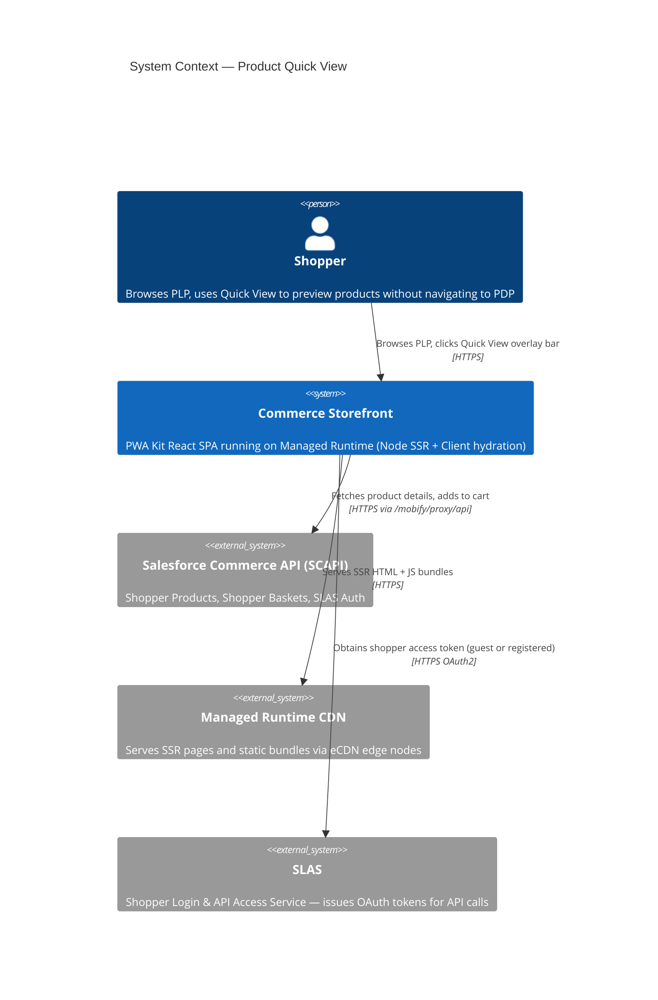
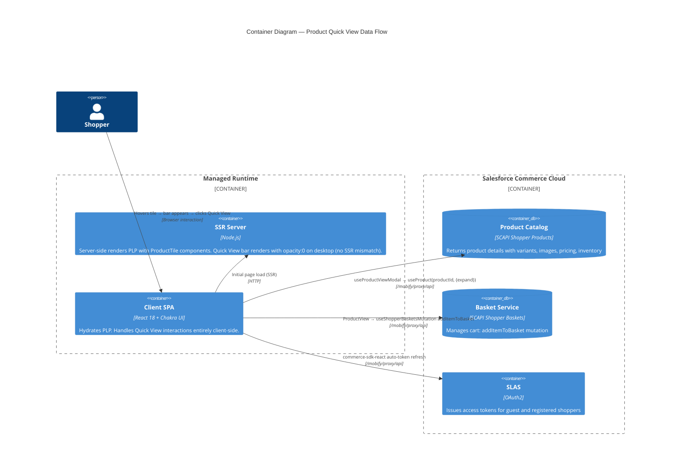
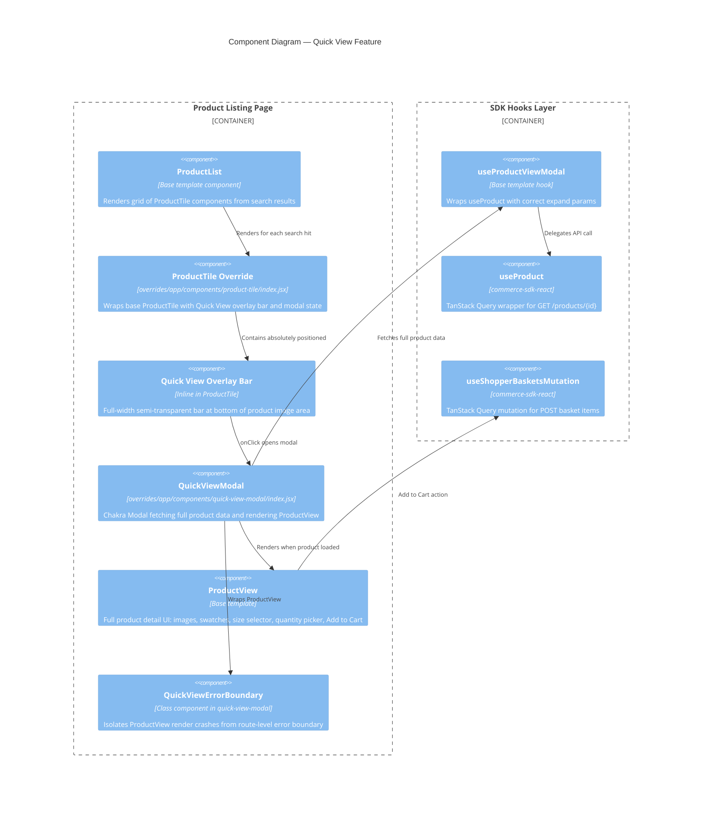
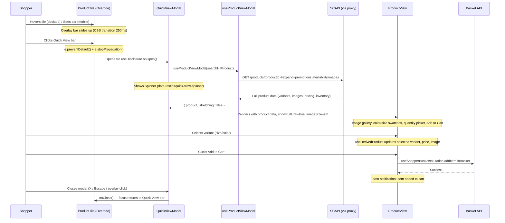

# Architecture Report: Product Quick View

**Feature:** `product-quick-view`
**App:** `apps/commerce-storefront`
**Date:** 2026-04-19
**Author:** Executive Architect (automated)

---

## 1. C4 Context Diagram

The Product Quick View feature operates within the Salesforce PWA Kit Managed Runtime ecosystem. The storefront communicates with SCAPI (Salesforce Commerce API) via a reverse proxy, using SDK hooks for data fetching and mutation.



## 2. C4 Container Diagram



## 3. C4 Component Diagram



## 4. Component Inventory

### 4.1 New Components (Created)

| Component | Path | Lines | Purpose |
|---|---|---|---|
| **ProductTile (Override)** | `overrides/app/components/product-tile/index.jsx` | 153 | Wraps base ProductTile with group-hover container, adds Quick View overlay bar, manages modal state |
| **QuickViewModal** | `overrides/app/components/quick-view-modal/index.jsx` | 137 | Chakra Modal displaying ProductView with loading/error/success states |
| **QuickViewErrorBoundary** | (inline in quick-view-modal/index.jsx) | ~25 | Class-based error boundary preventing ProductView crashes from bubbling up |

### 4.2 Reused Base Template Components (Unmodified)

| Component | Source | Role in Feature |
|---|---|---|
| `ProductView` | `@salesforce/retail-react-app/app/components/product-view` | Renders full product details inside modal (images, variants, cart) |
| `ProductTile` (base) | `@salesforce/retail-react-app/app/components/product-tile` | Original tile rendered inside override wrapper |
| `ProductViewModal` (pattern) | `@salesforce/retail-react-app/app/components/product-view-modal` | Architectural pattern reference (not directly imported) |

### 4.3 Reused Hooks (Unmodified)

| Hook | Source | Role in Feature |
|---|---|---|
| `useProductViewModal` | `@salesforce/retail-react-app/app/hooks/use-product-view-modal` | Fetches full product data with correct expand params |
| `useProduct` | `@salesforce/commerce-sdk-react` | Underlying SCAPI call via TanStack Query |
| `useShopperBasketsMutation` | `@salesforce/commerce-sdk-react` | Cart add-to-basket mutation (used internally by ProductView) |
| `useDisclosure` | Chakra UI (re-exported via shared/ui) | Modal open/close state management in ProductTile |

### 4.4 Test Files

| File | Path | Tests |
|---|---|---|
| ProductTile tests | `overrides/app/components/product-tile/index.test.js` | 243 lines — overlay bar rendering, interaction, accessibility |
| QuickViewModal tests | `overrides/app/components/quick-view-modal/index.test.js` | 279 lines — modal states, ProductView integration, error handling |

## 5. Data Flow

### 5.1 Quick View Interaction Sequence



### 5.2 API Proxy Path

All SCAPI calls are proxied through Managed Runtime's reverse proxy to avoid CORS issues:

```
Browser → /mobify/proxy/api/... → SCAPI endpoint
```

Configuration in `config/default.js`:
- `commerceAPI.proxyPath`: `/mobify/proxy/api`
- `organizationId`: `f_ecom_aaia_prd`
- `shortCode`: `xfdy2axw`
- `siteId`: `RefArch`

### 5.3 SSR Behavior

| Phase | Behavior |
|---|---|
| **Server Render** | ProductTile renders with Quick View bar (opacity: 0 on desktop via responsive prop). Modal is NOT rendered (isOpen defaults to false). No hydration mismatch. |
| **Client Hydration** | React hydrates the tile. useDisclosure initializes with isOpen: false. Hover CSS transitions become active. |
| **User Interaction** | Quick View bar click triggers onOpen(). Modal mounts with QuickViewModal component. useProductViewModal fires the API call. |

## 6. Override Mechanism

The PWA Kit extensibility system is configured in `package.json`:

```json
{
  "ccExtensibility": {
    "extends": "@salesforce/retail-react-app",
    "overridesDir": "overrides"
  }
}
```

**Resolution order:**
1. `overrides/app/components/product-tile/index.jsx` → shadows `@salesforce/retail-react-app/app/components/product-tile/index.jsx`
2. The override imports the base component explicitly: `import OriginalProductTile from '@salesforce/retail-react-app/app/components/product-tile'`
3. All existing pages that render ProductTile (PLPs, search results, wishlists) automatically pick up the override

This means the Quick View feature is **automatically active on every page that uses ProductTile** without modifying any page-level code.

## 7. Technology Stack

| Layer | Technology | Version |
|---|---|---|
| Runtime | Salesforce Managed Runtime | — |
| Framework | PWA Kit (pwa-kit-dev) | Latest |
| Base Template | @salesforce/retail-react-app | 9.1.1 |
| UI Library | Chakra UI | (bundled with PWA Kit) |
| React | React 18 | ^18.2.0 |
| State/Data | TanStack Query via commerce-sdk-react | (bundled) |
| Testing | Jest (via pwa-kit-dev test) | (bundled) |
| E2E | Playwright | (configured) |
| Node.js | 18 / 20 / 22 | Compatible |

---

*This document was auto-generated by the Executive Architect agent as part of the autonomous pipeline.*
