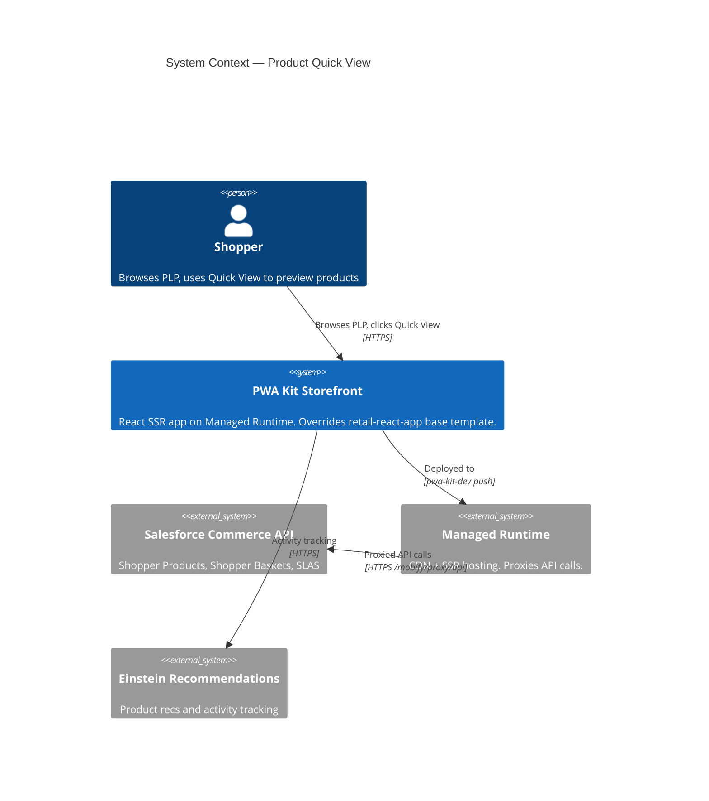
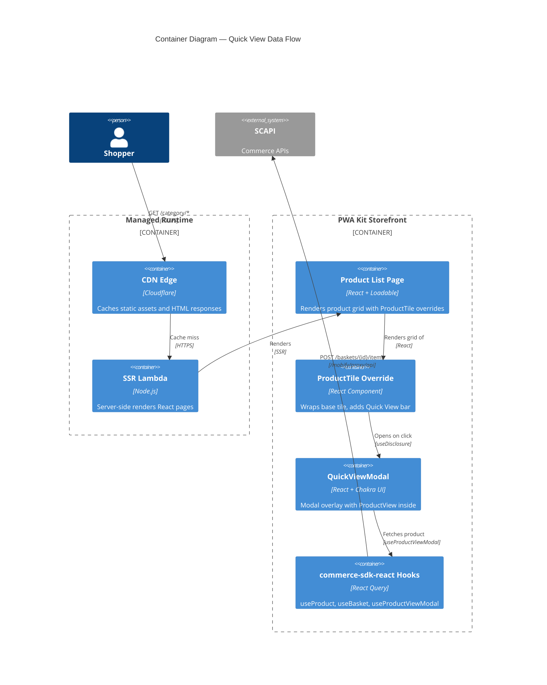
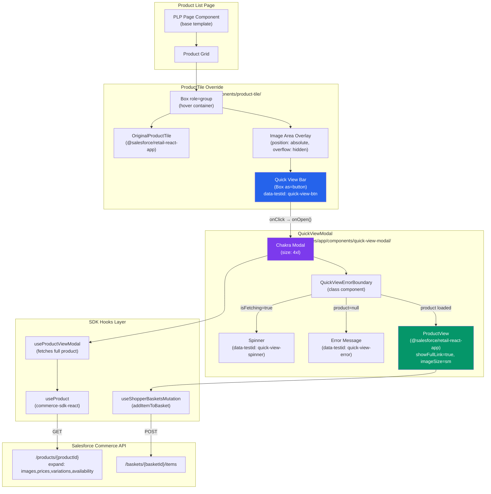
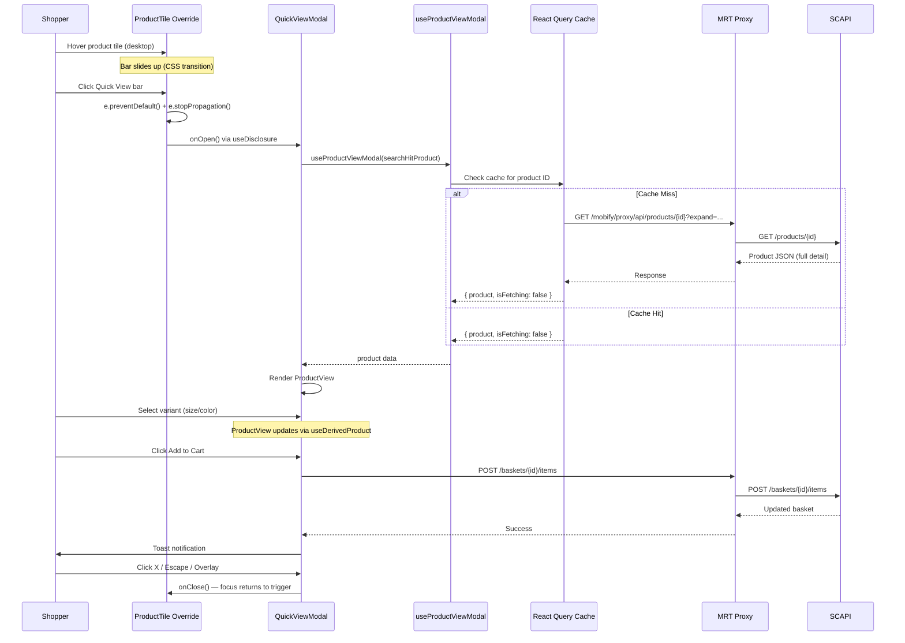
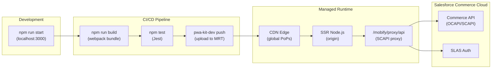

# Architecture Report: Product Quick View

**Feature:** `product-quick-view`
**App:** `apps/commerce-storefront` (Salesforce PWA Kit / Retail React App)
**Date:** 2026-04-19
**Author:** Executive Architect Agent

---

## 1. C4 Context Diagram

The Product Quick View feature operates within the Salesforce Commerce Cloud (SCAPI)
ecosystem. The storefront runs as a server-side rendered React application on
Managed Runtime (MRT), communicating with Commerce APIs through a reverse proxy.



## 2. C4 Container Diagram



## 3. Component Diagram — Quick View Feature



## 4. Data Flow Sequence



## 5. Component Inventory

### New Components (Created)

| Component | Path | Type | Purpose |
|---|---|---|---|
| **ProductTile Override** | `overrides/app/components/product-tile/index.jsx` | Override | Wraps base ProductTile with Quick View overlay bar; manages modal state via useDisclosure |
| **QuickViewModal** | `overrides/app/components/quick-view-modal/index.jsx` | New | Chakra Modal shell that fetches full product data via useProductViewModal and renders ProductView |
| **QuickViewErrorBoundary** | (inside quick-view-modal/index.jsx) | New (class) | Local React error boundary isolating ProductView render failures from the PLP |
| **ProductTile Tests** | `overrides/app/components/product-tile/index.test.js` | Test | Unit tests for overlay bar rendering, interaction, a11y |
| **QuickViewModal Tests** | `overrides/app/components/quick-view-modal/index.test.js` | Test | Unit tests for modal shell, content rendering, error state |

### Reused Components (Unmodified Base Template)

| Component | Source | Role in Quick View |
|---|---|---|
| `ProductView` | `@salesforce/retail-react-app/app/components/product-view` | Full product UI: image gallery, variant selectors, quantity picker, Add to Cart |
| `ProductTile` (base) | `@salesforce/retail-react-app/app/components/product-tile` | Original tile rendered inside override wrapper via prop spread |
| `Shared UI` | `@salesforce/retail-react-app/app/components/shared/ui` | Chakra UI re-exports: Modal, Box, Spinner, Center, etc. |

### Reused Hooks (Unmodified)

| Hook | Source | Role |
|---|---|---|
| `useProductViewModal` | `@salesforce/retail-react-app/app/hooks/use-product-view-modal` | Fetches full ShopperProduct data from a ProductSearchHit |
| `useShopperBasketsMutation` | `@salesforce/commerce-sdk-react` | Add-to-cart mutation, used internally by ProductView |
| `useProduct` | `@salesforce/commerce-sdk-react` | Low-level product fetch, used by useProductViewModal |
| `useDerivedProduct` | `@salesforce/retail-react-app/app/hooks` | Variant selection state, used internally by ProductView |

## 6. Technology Stack

| Layer | Technology | Version |
|---|---|---|
| **UI Framework** | React | ^18.2.0 |
| **Component Library** | Chakra UI | (via retail-react-app) |
| **Base Template** | @salesforce/retail-react-app | 9.1.1 |
| **Commerce SDK** | @salesforce/commerce-sdk-react | (peer dep) |
| **Data Fetching** | React Query (TanStack) | (via commerce-sdk-react) |
| **Routing** | React Router | (via retail-react-app) |
| **SSR Runtime** | PWA Kit / Managed Runtime | Node.js 18/20/22 |
| **i18n** | react-intl | (via retail-react-app) |
| **Testing** | Jest + React Testing Library | (via pwa-kit-dev) |
| **Icons** | @chakra-ui/icons | ViewIcon, WarningIcon |
| **Extensibility** | PWA Kit Override System | ccExtensibility.overridesDir |

## 7. API Surface

All API calls are proxied through Managed Runtime at `/mobify/proxy/api` to avoid CORS issues.

| API Endpoint | Method | Triggered By | Parameters |
|---|---|---|---|
| `/products/{productId}` | GET | useProductViewModal → useProduct | expand=images,prices,variations,availability |
| `/baskets/{basketId}/items` | POST | ProductView → useShopperBasketsMutation | productId, quantity, variantValues |

**Authentication:** SLAS (Shopper Login and API Access Service) via @salesforce/commerce-sdk-react. Client ID configured in `config/default.js`. No additional auth wiring needed — the SDK handles token lifecycle automatically.

**Configuration:**
```
commerceAPI.parameters.clientId: 44cfcf31-d64d-4227-9cce-1d9b0716c321
commerceAPI.parameters.organizationId: f_ecom_aaia_prd
commerceAPI.parameters.shortCode: xfdy2axw
commerceAPI.parameters.siteId: RefArch
commerceAPI.proxyPath: /mobify/proxy/api
```

## 8. Override Architecture

```
overrides/app/components/product-tile/index.jsx    ← SHADOWS base template
    ↓ imports (explicit full path)
@salesforce/retail-react-app/app/components/product-tile/index.jsx  (base)
    ↓ rendered inside override wrapper with spread props

overrides/app/components/quick-view-modal/index.jsx  ← NEW component
    ↓ imports
@salesforce/retail-react-app/app/components/product-view  (base)
@salesforce/retail-react-app/app/hooks/use-product-view-modal  (base)
```

The PWA Kit override system resolves `app/components/product-tile` to the overrides
directory first. The override explicitly imports the **base** component via the
full `@salesforce/retail-react-app/...` path, wraps it, and adds new DOM elements.

## 9. Deployment Topology



---

*This document was auto-generated by the Executive Architect agent for the product-quick-view feature.*
