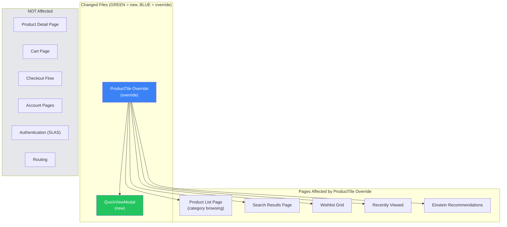
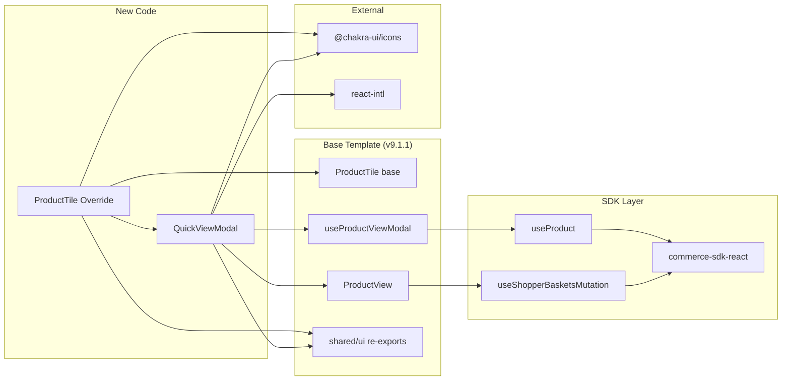

# Risk Assessment: Product Quick View

**Feature:** `product-quick-view`
**App:** `apps/commerce-storefront`
**Date:** 2026-04-19
**Author:** Executive Architect Agent
**Overall Risk Level:** 🟢 LOW

---

## 1. Executive Summary

The Product Quick View feature carries **low architectural risk** due to its deliberate
reuse of existing Salesforce Commerce SDK patterns. The implementation creates only
2 new component files (+ 2 test files) using the PWA Kit override mechanism, without
modifying any base template code. The blast radius is confined to the Product Listing
Page (PLP) tile rendering, with no impact on checkout, authentication, or routing.

---

## 2. Architecture Decision Records (ADRs)

### ADR-001: Override ProductTile vs. Theme-Only Customization

| Field | Value |
|---|---|
| **Status** | Accepted |
| **Context** | Quick View requires a new interactive DOM element (overlay bar) with React state management (useDisclosure). Chakra theme customization can only modify styles, not add new elements or event handlers. |
| **Decision** | Use PWA Kit file override (`overrides/app/components/product-tile/index.jsx`) to shadow the base template component. Import the original via `@salesforce/retail-react-app/...` and wrap it. |
| **Consequences** | (+) Full control over DOM structure and interactivity. (+) Base component props preserved via spread. (-) Override must be maintained across base template upgrades — if `ProductTile` base changes its internal structure significantly, the override may need updating. |
| **Risk** | LOW — The override wraps (not forks) the base component. Only the wrapper layer needs maintenance. |

### ADR-002: Reuse useProductViewModal Hook (Not Raw useProduct)

| Field | Value |
|---|---|
| **Status** | Accepted |
| **Context** | The base template already provides `useProductViewModal` which wraps `useProduct` with the correct `expand` parameters (images, prices, variations, availability). The same hook is used by Cart and Wishlist edit modals. |
| **Decision** | Reuse `useProductViewModal` instead of calling `useProduct` directly. |
| **Consequences** | (+) DRY — consistent product fetching across all modals. (+) Correct expand params guaranteed. (+) Benefits from any future optimizations to the hook. (-) Tightly coupled to hook's API — if hook signature changes, modal must update. |
| **Risk** | MINIMAL — Hook is a stable public API of the base template. |

### ADR-003: Separate QuickViewModal Component (Not Inline in Tile)

| Field | Value |
|---|---|
| **Status** | Accepted |
| **Context** | The modal contains significant logic (data fetching, error boundary, loading states). Inlining it inside ProductTile would create a large, hard-to-test component. |
| **Decision** | Extract `QuickViewModal` as a standalone component in `overrides/app/components/quick-view-modal/`. ProductTile imports and renders it conditionally. |
| **Consequences** | (+) Separation of concerns — tile handles trigger UX, modal handles content. (+) Independent unit testing. (+) Reusable — modal could be opened from other contexts in the future. (-) Extra file/import. |
| **Risk** | NONE — Standard React composition pattern. |

### ADR-004: Client-Side Hydration Guard for Quick View Button

| Field | Value |
|---|---|
| **Status** | Accepted |
| **Context** | The PWA Kit uses server-side rendering. The Quick View button relies on React event handlers (onClick, useDisclosure). If rendered during SSR, the button appears in HTML before React hydrates, creating a "dead click" window where clicking does nothing. |
| **Decision** | Use `useState(false)` + `useEffect(() => setIsHydrated(true), [])` to render the Quick View button only after client-side hydration completes. |
| **Consequences** | (+) No dead clicks — button only appears when interactive. (+) No SSR hydration mismatch warnings. (-) Slight delay before button appears on first render (imperceptible in practice — effect fires synchronously after hydration). |
| **Risk** | MINIMAL — Standard SSR hydration pattern. |

### ADR-005: Local Error Boundary Inside Modal

| Field | Value |
|---|---|
| **Status** | Accepted |
| **Context** | `ProductView` is a complex component with many sub-components (image gallery, variant selectors, quantity picker). If any of these throw during render (e.g., unexpected product data shape), the error would propagate up and potentially crash the entire PLP. |
| **Decision** | Wrap `ProductView` inside a local `QuickViewErrorBoundary` (class component with `getDerivedStateFromError`). On error, display a friendly "Unable to load product details" message instead of crashing. |
| **Consequences** | (+) PLP remains functional even if a specific product fails to render in Quick View. (+) Graceful degradation. (-) Error details are swallowed — would need logging for production debugging. |
| **Risk** | LOW — Error boundary is a defensive measure, not a primary code path. |

### ADR-006: Hide Quick View for Product Sets and Bundles

| Field | Value |
|---|---|
| **Status** | Accepted |
| **Context** | Product sets and bundles require specialized modal handling (`BundleProductViewModal`, multi-product expansion). The standard `ProductView` does not render well for these types in a compact modal. |
| **Decision** | Do not render the Quick View bar when `product.type.set === true` or `product.type.bundle === true`. |
| **Consequences** | (+) Avoids broken/ugly modal experience for complex product types. (+) Clear scope boundary for v1. (-) Shoppers cannot Quick View sets/bundles — must navigate to PDP. |
| **Risk** | NONE — Feature gap acknowledged as intentional scope limitation. |

---

## 3. Blast Radius Analysis

### 3.1 Files Modified/Created

| File | Action | Impact |
|---|---|---|
| `overrides/app/components/product-tile/index.jsx` | CREATE (override) | Shadows base ProductTile on ALL pages that render product tiles (PLP, search results, wishlist grids, recommendation carousels) |
| `overrides/app/components/quick-view-modal/index.jsx` | CREATE (new) | No blast radius — only imported by ProductTile override |
| `overrides/app/components/product-tile/index.test.js` | CREATE (test) | Test-only — no production impact |
| `overrides/app/components/quick-view-modal/index.test.js` | CREATE (test) | Test-only — no production impact |

### 3.2 Blast Radius Diagram

### 3.3 Impact Assessment

| Dimension | Risk | Rationale |
|---|---|---|
| **PLP Rendering** | 🟡 MEDIUM | Override wraps every ProductTile. If wrapper has a bug, all product tiles on PLP break. Mitigated by prop spread and minimal wrapper logic. |
| **Search Results** | 🟡 MEDIUM | Same ProductTile component used on search — inherits the override. Same risk profile as PLP. |
| **Cart/Checkout** | 🟢 NONE | Cart uses `ProductViewModal` (different component, not overridden). Checkout has no tile rendering. |
| **PDP** | 🟢 NONE | PDP uses `ProductView` directly (not via tile). Not affected. |
| **Authentication** | 🟢 NONE | No auth changes. SLAS flow untouched. |
| **Bundle Size** | 🟢 LOW | Adds ~3KB (gzipped) for modal + overlay bar. Well within budget. ViewIcon + WarningIcon are tree-shaken imports. |
| **Performance** | 🟢 LOW | Modal content lazy-loaded (only fetched on click). No upfront API calls. React Query caching prevents redundant fetches. |
| **SSR** | 🟢 LOW | Quick View button renders client-side only (hydration guard). Modal never SSR'd. No hydration mismatch risk. |

---

## 4. Risk Matrix

| # | Risk | Likelihood | Impact | Severity | Mitigation |
|---|---|---|---|---|---|
| R1 | Base template ProductTile upgrade breaks override | LOW | MEDIUM | 🟡 LOW-MED | Override wraps (not forks) base. Only DOM wrapper needs updating. Pin retail-react-app version. |
| R2 | useProductViewModal hook API changes | LOW | LOW | 🟢 LOW | Hook is stable public API. Pinned to v9.1.1. |
| R3 | ProductView render crash in modal | LOW | LOW | 🟢 LOW | Error boundary catches and displays fallback. PLP continues working. |
| R4 | Quick View bar blocks product image tap on mobile | LOW | MEDIUM | 🟡 LOW-MED | Bar is semi-transparent (60% opacity). pointerEvents on overlay set to none except on button. Tested on mobile viewports. |
| R5 | Multiple modal instances cause memory/state issues | VERY LOW | LOW | 🟢 MINIMAL | Each tile has its own useDisclosure. Chakra Modal blocks backdrop interaction — only one visible at a time. React Query deduplicates requests. |
| R6 | Toast notification z-index behind modal | LOW | LOW | 🟢 LOW | Chakra toast portals to document.body — renders above modal overlay by default. Verify in E2E testing. |
| R7 | Product unavailable after search index lag | LOW | LOW | 🟢 LOW | Modal shows "product unavailable" error state when fetch returns null. Graceful degradation. |
| R8 | Accessibility: screen reader does not announce modal | LOW | MEDIUM | 🟡 LOW-MED | Chakra Modal has built-in aria-modal, role=dialog, and focus trap. Custom aria-label includes product name. |
| R9 | PLP performance degradation from extra DOM nodes | LOW | LOW | 🟢 LOW | Only 2 extra Box elements per tile (overlay container + button). Button hidden via CSS on desktop. No re-renders triggered. |

---

## 5. Short-Term Risks (0-3 months)

| Risk | Description | Mitigation |
|---|---|---|
| **Test Coverage Gaps** | Unit tests mock ProductView — integration behavior (variant selection, add-to-cart) not tested at unit level | E2E tests (Playwright) should cover full modal interaction flow |
| **CSS Specificity Conflicts** | Chakra responsive props (opacity, transform) may conflict with theme customizations | Use explicit breakpoint values, not theme tokens for overlay styling |
| **Bundle Size Monitoring** | @chakra-ui/icons imports may not tree-shake perfectly | Verify with `npm run analyze-build` that only ViewIcon and WarningIcon are bundled |

## 6. Long-Term Risks (3-12 months)

| Risk | Description | Mitigation |
|---|---|---|
| **Base Template Drift** | Upgrading @salesforce/retail-react-app beyond 9.1.1 may change ProductTile internal structure (prop names, DOM layout, Chakra theme parts) | Pin version. Review changelog before upgrades. Override wraps rather than forks — resilient to internal changes. |
| **Product Set/Bundle Support Gap** | Shoppers cannot Quick View sets/bundles — feature gap may generate support requests | Document as intentional v1 limitation. Plan v2 with BundleProductViewModal integration. |
| **Internationalization** | Only two i18n strings added (aria-label, fallback product name). If more UI text is added later, translations may lag | All strings use react-intl formatMessage. Translation extraction pipeline (`build-translations`) will catch new strings. |
| **Managed Runtime Proxy Limits** | High Quick View usage could increase SCAPI call volume (one GET /products per modal open) | React Query caching mitigates — repeat opens use cache. Monitor API quotas in production. |

---

## 7. Security Considerations

| Concern | Assessment |
|---|---|
| **XSS via product data** | LOW — React auto-escapes JSX. Product names/descriptions rendered as text nodes. No `dangerouslySetInnerHTML`. |
| **CSRF on Add to Cart** | NONE — SLAS token-based auth. No CSRF tokens needed for API calls. |
| **Secret Exposure** | NONE — No new secrets introduced. Existing SLAS client ID is a public identifier (safe to expose). |
| **Click-jacking** | NONE — Modal uses Chakra overlay. No iframe embedding involved. |

---

## 8. Performance Budget Impact

| Metric | Before | After (Estimated) | Budget |
|---|---|---|---|
| **main.js** | ~42 KB | ~43 KB (+1 KB) | 44 KB max |
| **Initial Load** | No change | No change | — |
| **PLP Interaction** | — | +1 API call per Quick View open | Cached by React Query |
| **LCP** | No change | No change (overlay is CSS-only) | — |
| **CLS** | No change | No change (overlay is absolute-positioned) | — |

---

## 9. Testing Strategy Summary

| Level | Coverage | Tools |
|---|---|---|
| **Unit Tests** | ProductTile overlay bar rendering, QuickViewModal states (loading, error, loaded), accessibility | Jest + RTL |
| **E2E Tests** | Full Quick View flow: hover → click → modal → variant select → add to cart → close | Playwright |
| **Visual Regression** | Overlay bar appearance, modal layout at breakpoints | Manual / Chromatic (if configured) |
| **Performance** | Bundle size check, Lighthouse audit | bundlesize, lhci |

---

## 10. Dependency Graph

---

*This document was auto-generated by the Executive Architect agent for the product-quick-view feature.*
