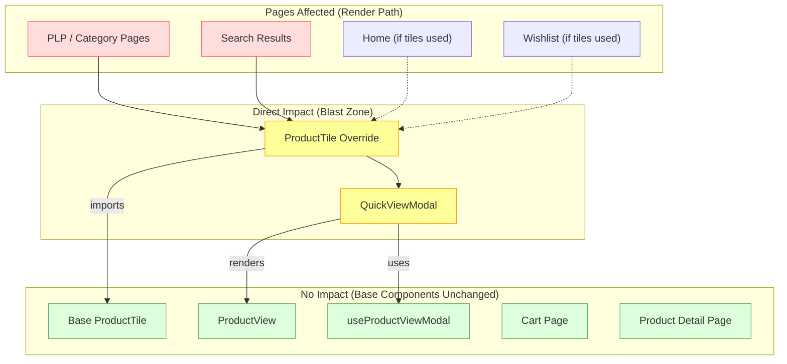

# Risk Assessment: Product Quick View

**Feature:** `product-quick-view`
**Date:** 2026-04-20
**App:** `apps/commerce-storefront`

---

## 1. Architectural Decision Records (ADRs)

### ADR-001: Override ProductTile via PWA Kit Extensibility (Not Theme-Only)

**Status:** Accepted
**Context:** Quick View requires adding a new interactive DOM element (overlay bar with click handler + modal state) to the ProductTile component. CSS/theme-only changes cannot inject new React elements or state hooks.
**Decision:** Use the `overrides/` mechanism (`ccExtensibility.overridesDir: "overrides"`) to shadow `app/components/product-tile/index.jsx`. Import the base component explicitly and wrap it.
**Consequences:**
- (+) Full control over tile DOM and behavior
- (+) Base tile logic/props/styles are preserved via pass-through
- (-) Override must be maintained across PWA Kit upgrades — any breaking change in base `ProductTile` props or DOM structure requires manual reconciliation
- (-) The entire ProductTile module is overridden, not just a slice of it

### ADR-002: Reuse useProductViewModal Hook (Not Raw useProduct)

**Status:** Accepted
**Context:** The base template already ships `useProductViewModal` which wraps `useProduct` with the correct `expand` parameters (`images`, `promotions`, `availability`) for modal contexts. The same hook is used by Cart and Wishlist edit modals.
**Decision:** Reuse the existing hook rather than calling `useProduct` directly.
**Consequences:**
- (+) DRY — consistent data-fetching behavior across all product modals
- (+) React Query cache is shared — if the same product is already fetched (e.g., from Cart modal), no duplicate API call
- (-) If the hook's expand params change in a future PWA Kit version, our modal may receive different data shape
- (-) No ability to customize which product expansions are fetched without overriding the hook itself

### ADR-003: Lazy Modal Mounting (Render Only When Open)

**Status:** Accepted
**Context:** A PLP page can render 25+ product tiles simultaneously. If `QuickViewModal` (and its `useProductViewModal` hook) is mounted for every tile, it would trigger 25+ API calls on page load.
**Decision:** Conditionally render `QuickViewModal` only when `isOpen === true`: `{isOpen && <QuickViewModal ... />}`. The modal and its hooks are unmounted when closed.
**Consequences:**
- (+) Zero unnecessary API calls on page load — hooks only fire when user explicitly opens Quick View
- (+) Lower memory footprint — only one modal instance exists at a time
- (-) Modal mount/unmount on every open/close — small React reconciliation cost (negligible)
- (-) Product data is not pre-fetched — first open shows a loading spinner until the API responds

### ADR-004: Full-Width Overlay Bar (Not Small Button)

**Status:** Accepted
**Context:** The spec requires a full-width semi-transparent dark bar at the bottom of the product image area, matching the reference design mockup.
**Decision:** Implement as a full-width absolutely-positioned bar with `left: 0`, `right: 0`, `bottom: 0` inside the image area. Desktop: slides up on hover via CSS transition. Mobile: always visible.
**Consequences:**
- (+) Large click/tap target — better usability (Fitts's Law)
- (+) Consistent with modern e-commerce Quick View patterns
- (+) Semi-transparent design preserves image visibility
- (-) Overlay bar covers the bottom ~36px of the product image on mobile (always visible)
- (-) Requires `overflow: hidden` on image wrapper to clip the bar during slide animation

### ADR-005: Error Boundary Inside Modal

**Status:** Accepted
**Context:** `ProductView` is a complex base template component with deep dependency chains (`useDerivedProduct`, `useCurrentBasket`, variant resolution). Any render failure would propagate to the route-level error boundary, potentially destroying the entire PLP.
**Decision:** Wrap `ProductView` in a local `QuickViewErrorBoundary` (class component) that catches render errors and shows a graceful fallback message.
**Consequences:**
- (+) Product render failures are contained within the modal — PLP remains functional
- (+) User sees a clear "Unable to load product details" message instead of a crash
- (-) Error boundary cannot catch errors in event handlers or async code (React limitation)
- (-) Class-based component in a mostly functional codebase (necessary — hooks cannot be error boundaries)

### ADR-006: Hide Quick View for Product Sets and Bundles

**Status:** Accepted
**Context:** `ProductView` is designed for standard products. Product sets and bundles require specialized modal handling (`BundleProductViewModal`, `setProducts` expansion) that is not implemented in v1.
**Decision:** Do not render the Quick View overlay bar when `product.type.set === true` or `product.type.bundle === true`.
**Consequences:**
- (+) Avoids broken/incomplete UI for unsupported product types
- (+) Clear scope boundary for v1
- (-) Shoppers cannot Quick View sets/bundles — must navigate to PDP
- (-) Future work required to support these product types

---

## 2. Blast Radius Analysis

### 2.1 Files Modified / Created

| File | Action | Blast Radius |
|---|---|---|
| `overrides/app/components/product-tile/index.jsx` | CREATE (override) | **HIGH** — Affects every product tile rendered on PLP, search results, category pages, and any page using `ProductTile`. This is a high-traffic component (~25 instances per page). |
| `overrides/app/components/quick-view-modal/index.jsx` | CREATE (new) | **LOW** — Only mounted when a user clicks the Quick View bar. No impact on page load or SSR. |
| `overrides/app/components/product-tile/index.test.js` | CREATE (test) | **NONE** — Test file only. |
| `overrides/app/components/quick-view-modal/index.test.js` | CREATE (test) | **NONE** — Test file only. |

### 2.2 Dependency Impact Graph



### 2.3 Impact Summary

| Scope | Impact Level | Details |
|---|---|---|
| **PLP / Category pages** | 🟡 Medium | ProductTile override wraps every tile. Visual regression risk from the overlay bar and group-hover container. |
| **Search results** | 🟡 Medium | Same as PLP — uses ProductTile for search hit rendering. |
| **Cart / Wishlist** | 🟢 None | These pages use `ProductViewModal` (base), not our `QuickViewModal`. Cart tiles may or may not use `ProductTile` (often use `CartItem` instead). |
| **PDP** | 🟢 None | Product Detail Page renders `ProductView` directly, not through a tile. |
| **SSR / Server** | 🟢 None | Modal is never open during SSR. Overlay bar renders with `opacity: 0` / `translateY(100%)` on desktop, `opacity: 1` on mobile — no interactive elements during SSR. |
| **Bundle size** | 🟢 Minimal | `QuickViewModal` is only mounted on client-side click. `ViewIcon` from `@chakra-ui/icons` adds negligible weight (~1KB). No new npm dependencies. |
| **API load** | 🟢 Minimal | One additional `GET /products/{id}` call per Quick View open. React Query caching prevents duplicate calls for the same product. |

---

## 3. Risk Register

### 3.1 Short-Term Risks (Pre-Launch / Sprint)

| # | Risk | Likelihood | Impact | Mitigation |
|---|---|---|---|---|
| R1 | **ProductTile override breaks existing tile styling** | Medium | High | Wrapper `Box` uses `position: relative` + `role="group"` which may interfere with existing absolute-positioned children (fav icon, badges). Validated via unit tests and visual QA. |
| R2 | **`useProductViewModal` hook not firing when modal opens** | Low | High | Hook is called unconditionally inside `QuickViewModal`. Lazy mounting (`{isOpen && <QuickViewModal />}`) ensures hooks fire when component mounts. Tested with loading spinner assertion. |
| R3 | **Event propagation through overlay bar to parent Link** | Medium | Medium | `e.preventDefault()` + `e.stopPropagation()` in `handleQuickView`. Verified by unit test asserting no PDP navigation on Quick View click. |
| R4 | **Mobile overlay bar obscures product image** | Low | Medium | Bar covers ~36px at image bottom. Acceptable tradeoff for discoverability on touch devices. Alternative (hover-only) is inaccessible on mobile. |
| R5 | **Toast notification z-index below modal overlay** | Low | Low | Chakra toast portals to `document.body` with high z-index by default. Should render above modal. Requires manual QA verification. |

### 3.2 Long-Term Risks (Post-Launch / Maintenance)

| # | Risk | Likelihood | Impact | Mitigation |
|---|---|---|---|---|
| R6 | **PWA Kit upgrade breaks ProductTile override** | High | High | Override shadows the entire module. If base `ProductTile` props change, adds new features, or restructures DOM in a future PWA Kit release (>9.1.1), our override won't pick up those changes automatically. **Mitigation:** Pin `@salesforce/retail-react-app` version in `devDependencies`. Review base component changelogs before upgrading. |
| R7 | **`useProductViewModal` hook API changes** | Medium | Medium | We depend on the hook returning `{ product, isFetching }`. If the return shape changes, our modal breaks. **Mitigation:** Unit tests mock the hook — integration tests should verify against real hook behavior. |
| R8 | **Product sets/bundles Quick View demand** | High | Low | v1 explicitly excludes sets/bundles. Customer demand may require supporting these types. **Mitigation:** Documented in ADR-006. Future work should implement `BundleProductViewModal` pattern. |
| R9 | **Performance degradation on large PLPs** | Low | Medium | Each tile now has an additional wrapper `Box` and conditional overlay bar. On PLPs with 60+ tiles (infinite scroll), this adds React reconciliation overhead. **Mitigation:** Overlay bar uses CSS-only animation (no JS). Modal is lazy-mounted. Profile with React DevTools if performance issues arise. |
| R10 | **Accessibility audit findings** | Medium | Medium | Screen reader behavior in modal (focus trap, aria-label) depends on Chakra Modal implementation. Custom overlay bar focus behavior (`_focus` pseudo) may not satisfy all WCAG 2.1 AA criteria. **Mitigation:** `aria-label` on both bar and modal. Semantic `<button>` element. Focus trap via Chakra. Requires formal a11y audit. |

### 3.3 Risk Matrix

```
         │ Low Impact  │ Med Impact  │ High Impact
─────────┼─────────────┼─────────────┼─────────────
High     │             │ R8          │ R6
Likely   │             │             │
─────────┼─────────────┼─────────────┼─────────────
Medium   │             │ R3, R7, R10 │ R1
Likely   │             │             │
─────────┼─────────────┼─────────────┼─────────────
Low      │ R5          │ R4, R9      │ R2
Likely   │             │             │
```

---

## 4. Security Considerations

| Area | Assessment |
|---|---|
| **Authentication** | No change. SLAS auth managed by `commerce-sdk-react`. Quick View uses the same shopper session token as the PLP. |
| **API exposure** | No new API endpoints. Same `GET /products/{id}` and `POST /baskets/{basketId}/items` calls as PDP. |
| **XSS** | Product names rendered via React's built-in escaping. `aria-label` values constructed from product data are safely interpolated by `react-intl`. No `dangerouslySetInnerHTML`. |
| **CSRF** | Basket mutations use SCAPI's built-in CSRF protection (bearer token in Authorization header). No additional CSRF surface. |
| **Secrets** | No new secrets or credentials. Uses existing SLAS client ID from `config/default.js` (public, safe to expose). |

---

## 5. Performance Budget Impact

| Metric | Before | After | Delta | Assessment |
|---|---|---|---|---|
| **JS bundle size** | Baseline | +~2KB (ViewIcon + overlay bar code) | Negligible | Well within `main.js` 44KB budget |
| **SSR render time** | Baseline | +~1ms per tile (wrapper Box) | Negligible | No hooks executed during SSR |
| **API calls on page load** | N (PLP search) | N (unchanged) | 0 | Modal is lazy-mounted — no API calls until clicked |
| **API calls per Quick View** | 0 | 1 (GET /products/{id}) | +1 per interaction | Cached by React Query — subsequent opens for same product are free |
| **Largest Contentful Paint** | Baseline | Unchanged | 0 | Overlay bar is CSS-only, positioned over existing image |
| **Cumulative Layout Shift** | Baseline | Unchanged | 0 | Overlay bar is absolute-positioned, doesn't shift content |

---

## 6. Upgrade Path & Future Considerations

1. **PWA Kit Upgrade (v9.x → v10.x):** Review base `ProductTile` and `ProductView` for breaking changes. The override pattern means we must manually merge upstream changes. Consider contributing Quick View as a first-class PWA Kit feature to reduce maintenance burden.

2. **Product Sets/Bundles Support:** Implement `QuickViewBundleModal` wrapping `BundleProductViewModal` for product sets. Requires `setProducts` expansion in the API call.

3. **Analytics Integration:** Add Einstein activity tracking for Quick View opens (`viewProduct` event). Currently, only PDP visits trigger product view events. Quick View opens should also count.

4. **Prefetching Optimization:** Consider prefetching product data on tile hover (before click) using React Query's `prefetchQuery`. This would eliminate the loading spinner for users with fast hover-to-click patterns.

5. **A/B Testing:** The overlay bar visibility (always-on vs. hover-only on desktop) could be A/B tested to measure conversion impact.

---

*Generated by doc-architect agent — 2026-04-20 (rev 2: post-implementation alignment)*
