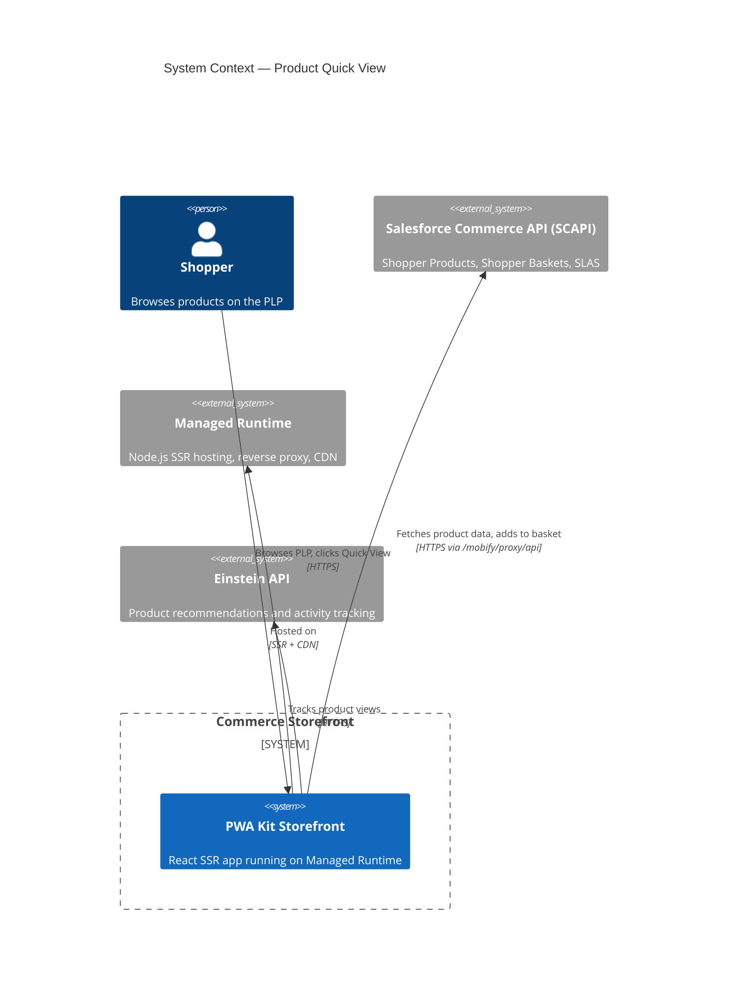
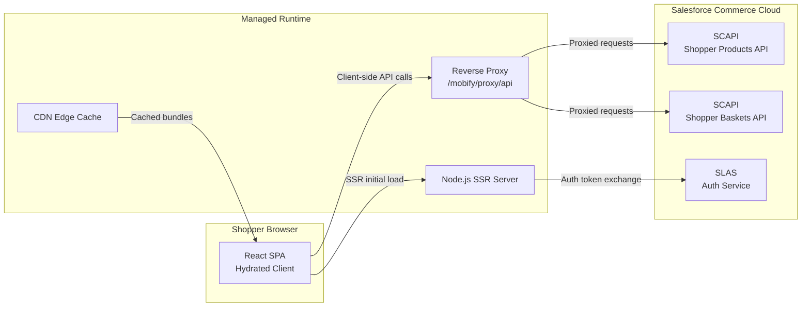
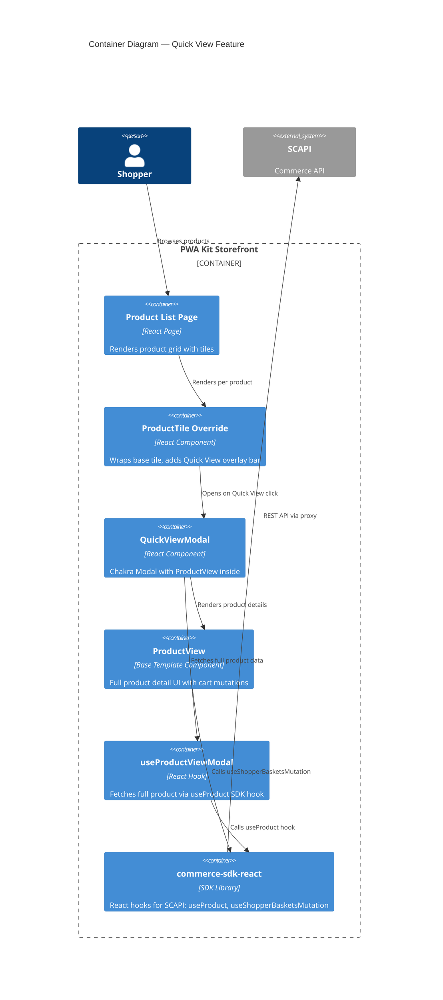
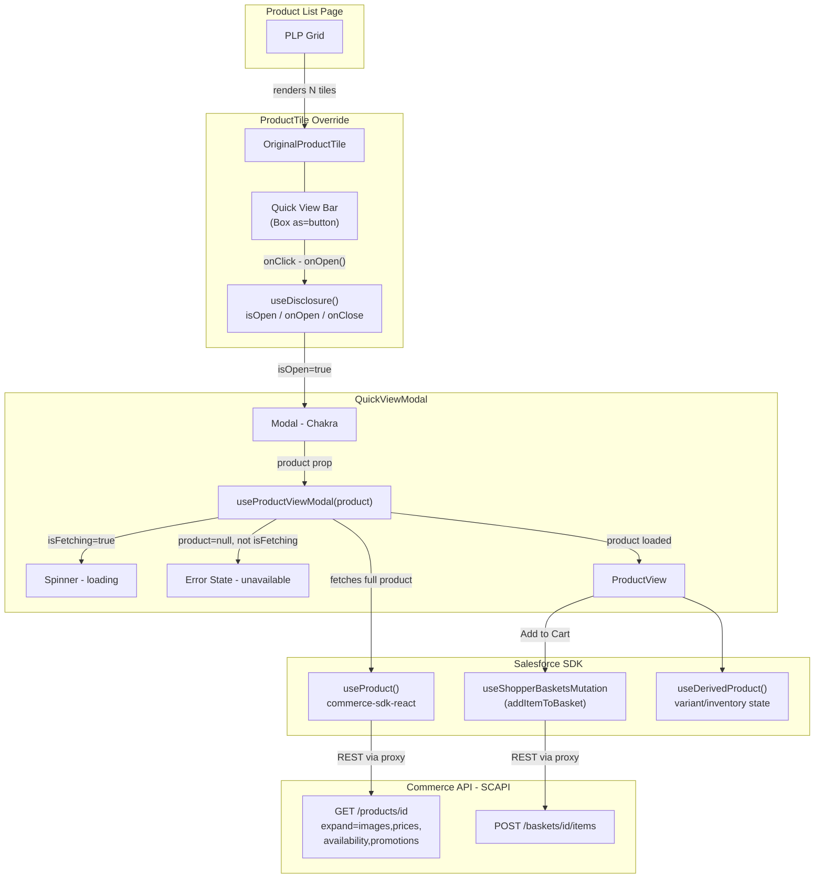
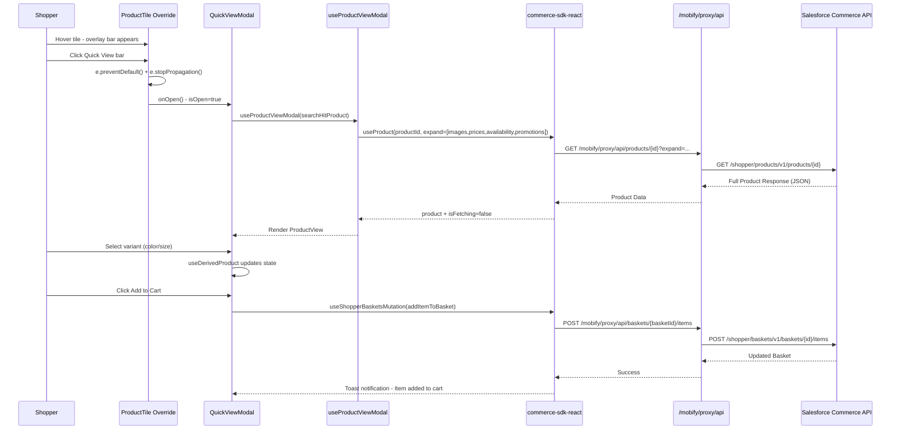

# Architecture Report: Product Quick View

> **Feature:** `product-quick-view`
> **App:** `apps/commerce-storefront`
> **Date:** 2026-04-12
> **Status:** Implementation complete — architecture review

---

## 1. C4 Context Diagram

The Product Quick View feature operates within the Salesforce PWA Kit ecosystem.
The storefront is a server-side rendered React application that communicates with
Salesforce Commerce APIs through a reverse proxy hosted in Managed Runtime.



### Deployment View



---

## 2. C4 Container Diagram — Quick View Feature



---

## 3. Component Diagram — Quick View Data Flow



---

## 4. Component Inventory

### 4.1 New Components (Created)

| Component | Path | Type | Purpose |
|---|---|---|---|
| **ProductTile** (override) | `overrides/app/components/product-tile/index.jsx` | Override | Wraps base ProductTile with Quick View overlay bar. Uses useDisclosure for modal state. Renders QuickViewModal. |
| **QuickViewModal** | `overrides/app/components/quick-view-modal/index.jsx` | New | Chakra Modal that fetches full product data via useProductViewModal hook and renders ProductView inside. Handles loading, error, and success states. |

### 4.2 Reused Base Components (Not Modified)

| Component / Hook | Source | Role in Quick View |
|---|---|---|
| `OriginalProductTile` | `@salesforce/retail-react-app/app/components/product-tile` | Base tile rendering (image, name, price, swatches). Imported and spread-wrapped. |
| `ProductView` | `@salesforce/retail-react-app/app/components/product-view` | Full product detail UI inside modal: images, variant selectors, quantity, Add to Cart. |
| `useProductViewModal` | `@salesforce/retail-react-app/app/hooks/use-product-view-modal` | Hook that accepts a ProductSearchHit, calls useProduct with correct expand params, returns { product, isFetching }. |
| `useDerivedProduct` | Internal to ProductView | Manages variant selection state, inventory checks, price updates. |
| `useShopperBasketsMutation` | `@salesforce/commerce-sdk-react` | Cart mutation — Add to Cart button in ProductView calls this internally. |

### 4.3 Test Files (Created)

| File | Path | Coverage |
|---|---|---|
| ProductTile tests | `overrides/app/components/product-tile/index.test.js` | Overlay bar rendering, interaction (click, preventDefault, stopPropagation), accessibility, visual states, product type exclusions |
| QuickViewModal tests | `overrides/app/components/quick-view-modal/index.test.js` | Modal shell, loading/error/success states, ProductView prop forwarding, accessibility (aria-label, focus trap, Escape) |

---

## 5. Data Flow: SDK Hooks → Proxy → Commerce API

### 5.1 Sequence — Quick View Open to Add-to-Cart



### 5.2 API Endpoints Used

| Endpoint | Method | Trigger | SDK Hook |
|---|---|---|---|
| `/shopper/products/v1/products/{productId}` | GET | Modal opens | `useProduct` (via `useProductViewModal`) |
| `/shopper/baskets/v1/baskets/{basketId}/items` | POST | Add to Cart clicked | `useShopperBasketsMutation('addItemToBasket')` |

### 5.3 Proxy Configuration

All API calls route through the Managed Runtime reverse proxy to avoid CORS:

```
Client → /mobify/proxy/api → xfdy2axw.api.commercecloud.salesforce.com
```

Configured in `config/default.js`:
```javascript
ssrParameters: {
    proxyConfigs: [
        { host: 'xfdy2axw.api.commercecloud.salesforce.com', path: 'api' }
    ]
}
```

### 5.4 Authentication Flow

- **SLAS (Shopper Login and API Access Service)** handles authentication
- `commerce-sdk-react` manages token lifecycle automatically
- Client ID: configured in `commerceAPI.parameters.clientId`
- Guest shoppers receive a guest access token transparently
- No custom auth code needed for Quick View — the SDK handles it

---

## 6. Override Architecture

### 6.1 PWA Kit Extensibility Pattern

```
@salesforce/retail-react-app (base template v9.1.1)
    └── app/components/product-tile/index.jsx      ← shadowed by override
    └── app/components/product-view/index.jsx       ← reused directly
    └── app/hooks/use-product-view-modal.js         ← reused directly

commerce-storefront (this project)
    └── overrides/app/components/product-tile/index.jsx   ← OVERRIDE (created)
    └── overrides/app/components/quick-view-modal/index.jsx ← NEW (created)
```

The `ccExtensibility` config in `package.json` drives module resolution:
```json
{
  "ccExtensibility": {
    "extends": "@salesforce/retail-react-app",
    "overridesDir": "overrides"
  }
}
```

When the build system resolves `app/components/product-tile`, it finds the override
at `overrides/app/components/product-tile/index.jsx` and uses that instead of the
base template's version. The override then imports the original via the full package path.

### 6.2 Override Isolation

The override wraps (not replaces) the base ProductTile:
- All original props are forwarded via spread: `<OriginalProductTile product={product} {...rest} />`
- The `Skeleton` export is re-exported from the base to maintain API compatibility
- No base template files are modified — zero risk to upstream upgrades

---

## 7. Technology Stack Summary

| Layer | Technology | Version |
|---|---|---|
| Framework | Salesforce PWA Kit | v3.x |
| Base Template | `@salesforce/retail-react-app` | 9.1.1 |
| UI Library | Chakra UI | v2.x (via PWA Kit) |
| API Client | `@salesforce/commerce-sdk-react` | Bundled with PWA Kit |
| State Management | React Query (TanStack) | v3.x (via SDK) |
| SSR Runtime | Managed Runtime | Node.js 24.x |
| Test Runner | Jest (via `pwa-kit-dev test`) | Bundled |
| E2E Tests | Playwright | Configured |
| Build Tool | Webpack (via `pwa-kit-dev build`) | Bundled |
