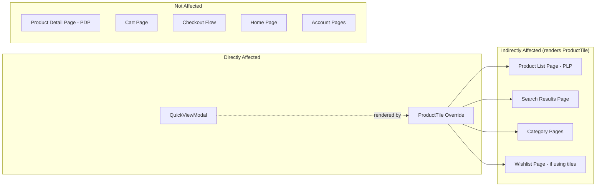

# Risk Assessment: Product Quick View

> **Feature:** `product-quick-view`
> **App:** `apps/commerce-storefront`
> **Date:** 2026-04-12
> **Overall Risk Level:** LOW

---

## 1. Architectural Decision Records (ADRs)

### ADR-001: Override-and-Wrap Pattern for ProductTile

**Status:** Accepted
**Context:** We need to add an interactive Quick View overlay bar to every product tile on the PLP. The base `ProductTile` component ships with `@salesforce/retail-react-app` and cannot be modified directly.
**Decision:** Use the PWA Kit `overridesDir` mechanism to shadow `app/components/product-tile`. The override imports the original component via its full package path and wraps it in a group-hover container with the overlay bar appended.
**Consequences:**
- (+) Zero modification to base template files — clean upgrade path
- (+) All original props forwarded via spread — no API breakage
- (+) `Skeleton` export re-exported to maintain lazy-loading compatibility
- (-) Override must be manually reconciled if base ProductTile API changes in a future PWA Kit upgrade
- (-) Wrapper adds one extra DOM node (`Box role="group"`) around each tile

### ADR-002: Reuse useProductViewModal Hook (Not Raw useProduct)

**Status:** Accepted
**Context:** We need to fetch full product data when the Quick View modal opens. The SDK provides `useProduct` directly, but the base template already ships `useProductViewModal` which wraps `useProduct` with the correct `expand` parameters (images, prices, availability, promotions).
**Decision:** Reuse `useProductViewModal` from `@salesforce/retail-react-app/app/hooks/use-product-view-modal`.
**Consequences:**
- (+) DRY — same hook used by Cart/Wishlist edit modals in the base template
- (+) Correct expand parameters guaranteed without manual configuration
- (+) Consistent data shape across all product modal experiences
- (-) Coupled to the hook's internal implementation — if hook API changes, QuickViewModal must update

### ADR-003: Box-as-Button for Overlay Bar (Not Chakra Button)

**Status:** Accepted
**Context:** The overlay bar needs full custom styling (absolute positioning, semi-transparent background, slide animation) without Chakra Button theme interference.
**Decision:** Use `<Box as="button">` which renders a semantic `<button>` element while allowing unrestricted Chakra style props.
**Consequences:**
- (+) Semantic HTML button — keyboard accessible by default (Tab, Enter, Space)
- (+) Full styling control without fighting Chakra Button theme
- (+) Native focus management — `_focus` pseudo works correctly
- (-) Must manually ensure accessibility attributes (`aria-label`, role) since we bypass Chakra Button defaults

### ADR-004: Hide Quick View for Product Sets and Bundles

**Status:** Accepted
**Context:** Product sets and bundles require specialized modal handling (`BundleProductViewModal`, multi-product expansion). The standard `ProductView` does not render well for these types in a compact modal.
**Decision:** Do not render the Quick View bar when `product.type.set === true` or `product.type.bundle === true`.
**Consequences:**
- (+) Avoids broken UX for complex product types
- (+) Clear scope boundary for v1
- (-) Shoppers cannot Quick View sets/bundles — they must navigate to the PDP
- (Future) Sets/bundles support can be added in v2 by detecting product type and rendering the appropriate modal

### ADR-005: Mobile-First Visibility (Always-Visible Bar on Touch Devices)

**Status:** Accepted
**Context:** Hover-to-reveal does not work on touch devices. Mobile shoppers would never see the Quick View bar if it relied solely on hover.
**Decision:** Use responsive Chakra values: `opacity={{ base: 1, lg: 0 }}` and `transform={{ base: 'translateY(0)', lg: 'translateY(100%)' }}`. The bar is always visible below `lg` breakpoint and slide-reveals on hover above `lg`.
**Consequences:**
- (+) Touch accessibility guaranteed — bar always visible on mobile/tablet
- (+) Desktop elegance preserved — slide-up animation on hover
- (-) On mobile, the bar permanently covers the bottom ~36px of the product image

---

## 2. Blast Radius Analysis

### 2.1 Files Changed

| File | Change Type | Blast Radius |
|---|---|---|
| `overrides/app/components/product-tile/index.jsx` | **OVERRIDE** (shadows base) | **Medium** — affects every product tile rendered on PLPs, search results, and any page using ProductTile. However, wraps base component without modifying its behavior. |
| `overrides/app/components/quick-view-modal/index.jsx` | **NEW** component | **Low** — isolated component, only rendered when Quick View is triggered. No existing code depends on it. |
| `overrides/app/components/product-tile/index.test.js` | **NEW** test file | **None** — test-only, no runtime impact |
| `overrides/app/components/quick-view-modal/index.test.js` | **NEW** test file | **None** — test-only, no runtime impact |

### 2.2 Affected Surfaces



### 2.3 Dependency Graph

```
ProductTile Override
├── imports: @salesforce/retail-react-app/app/components/product-tile (base)
├── imports: @salesforce/retail-react-app/app/components/shared/ui (Box, useDisclosure)
├── imports: @chakra-ui/icons (ViewIcon)
└── imports: QuickViewModal (sibling)
    ├── imports: @salesforce/retail-react-app/app/components/shared/ui (Modal, Spinner, etc.)
    ├── imports: @salesforce/retail-react-app/app/components/product-view (ProductView)
    ├── imports: @salesforce/retail-react-app/app/hooks/use-product-view-modal
    ├── imports: @chakra-ui/icons (WarningIcon)
    └── imports: react-intl (useIntl)
```

### 2.4 Impact Assessment

| Concern | Risk | Mitigation |
|---|---|---|
| **ProductTile rendering on all PLPs** | Medium | Override wraps base component without modifying its behavior. All props forwarded via spread. Skeleton re-exported. |
| **Additional API calls per Quick View open** | Low | Calls happen only on-demand (modal open). React Query caches responses — reopening same product uses cache. |
| **Bundle size increase** | Low | QuickViewModal is in the same chunk as ProductTile (not lazy-loaded separately). ProductView and its dependencies are already in the base bundle. Net addition is minimal (~2KB gzipped for overlay bar + modal shell). |
| **SSR hydration** | Low | `useDisclosure` initializes `isOpen: false` on both server and client. Modal content only renders when `isOpen=true` (client-only toggle). No hydration mismatch risk. |

---

## 3. Risk Register

### 3.1 Short-Term Risks (0–3 months)

| # | Risk | Likelihood | Impact | Severity | Mitigation |
|---|---|---|---|---|---|
| S1 | **Overlay bar obscures product image on mobile** | Medium | Low | Low | Bar height is ~36px with `py={2}`. Product images are in 1:1 aspect ratio (typically 300–500px). ~7–12% occlusion is acceptable. Can reduce padding if feedback is negative. |
| S2 | **Quick View button intercepts intended PDP navigation** | Low | Medium | Low | `e.preventDefault()` + `e.stopPropagation()` are correctly implemented. The bar is a separate clickable element from the tile Link. Only clicking the bar triggers Quick View; clicking elsewhere navigates to PDP. |
| S3 | **useProductViewModal returns stale data** | Low | Low | Low | React Query's stale-while-revalidate handles this. Product data is refetched if stale. Quick View always shows fresh data after the first load. |
| S4 | **Toast notification z-index behind modal** | Low | Low | Low | Chakra toast portals to `document.body` with high z-index by default. Should render above modal overlay. Verified in spec. |

### 3.2 Long-Term Risks (3–12 months)

| # | Risk | Likelihood | Impact | Severity | Mitigation |
|---|---|---|---|---|---|
| L1 | **PWA Kit upgrade breaks ProductTile override** | Medium | Medium | Medium | Override wraps (not forks) the base component. Props are forwarded via spread. Risk is if ProductTile's internal structure changes significantly. **Mitigation:** Pin to `@salesforce/retail-react-app@9.1.1`. Test override compatibility before upgrading. |
| L2 | **useProductViewModal hook API changes** | Low | Medium | Low | Hook is a thin wrapper around `useProduct`. If removed or renamed in a future version, QuickViewModal needs a direct `useProduct` call — straightforward migration. |
| L3 | **Chakra UI v3 migration breaks styling** | Medium | High | Medium | Chakra v3 changes the styling system. All Chakra props (`_groupHover`, `_focus`, responsive objects) may need updates. **Mitigation:** This is a PWA Kit-wide concern, not specific to Quick View. Upgrade when PWA Kit officially supports Chakra v3. |
| L4 | **Product sets/bundles Quick View demand** | High | Low | Low | Currently hidden for sets/bundles (ADR-004). If business requires it, implement a type-aware modal that renders `BundleProductViewModal` or a custom sets view. Architectural pattern is already established. |
| L5 | **Performance degradation with many tiles** | Low | Medium | Low | Each tile creates a `useDisclosure` hook instance (lightweight — just boolean state). QuickViewModal only renders when `isOpen=true`. No performance concern for typical PLP sizes (12–48 tiles). |

### 3.3 Risk Matrix

```
           │ Low Impact │ Medium Impact │ High Impact
───────────┼────────────┼──────────────┼────────────
High       │ L4         │              │
Likelihood │            │              │
───────────┼────────────┼──────────────┼────────────
Medium     │ S1         │ L1           │ L3
Likelihood │            │              │
───────────┼────────────┼──────────────┼────────────
Low        │ S3, S4     │ S2, L2, L5   │
Likelihood │            │              │
```

---

## 4. Security Considerations

| Concern | Assessment |
|---|---|
| **API credentials exposure** | No credentials in component code. SLAS client ID is a public value configured in `config/default.js`. Commerce SDK handles token management internally. |
| **XSS via product data** | React's JSX escaping prevents XSS. Product names/descriptions are rendered as text nodes, not dangerouslySetInnerHTML. |
| **CSRF on Add to Cart** | Commerce SDK uses bearer tokens for API calls. CSRF is mitigated by token-based auth, not cookie-based. |
| **Click-jacking** | Managed Runtime sets appropriate `X-Frame-Options` headers. Not a Quick View concern. |

---

## 5. Accessibility Compliance

| WCAG Criterion | Status | Implementation |
|---|---|---|
| **1.3.1 Info and Relationships** | ✅ Pass | Overlay bar is a semantic `<button>` element. Modal uses Chakra Modal with proper ARIA roles. |
| **2.1.1 Keyboard** | ✅ Pass | Bar is focusable via Tab. `_focus` pseudo reveals bar on keyboard navigation. Enter/Space opens modal. Escape closes modal. |
| **2.4.3 Focus Order** | ✅ Pass | Chakra Modal traps focus. On close, focus returns to trigger element. |
| **4.1.2 Name, Role, Value** | ✅ Pass | Bar has `aria-label="Quick View {productName}"`. Modal has `aria-label="Quick view for {productName}"`. |
| **1.4.3 Contrast (Minimum)** | ✅ Pass | White text on `rgba(0,0,0,0.6)` background exceeds WCAG AA 4.5:1 contrast ratio. |

---

## 6. Performance Impact

| Metric | Impact | Notes |
|---|---|---|
| **Initial bundle size** | +~2KB gzipped | QuickViewModal shell + overlay bar code. ProductView and SDK hooks already in base bundle. |
| **Time to Interactive (TTI)** | Negligible | No additional API calls on page load. Quick View is interaction-driven. |
| **API calls per Quick View** | +1 GET request | `useProduct` fetched on modal open. Cached by React Query for subsequent opens of same product. |
| **Memory** | +1 `useDisclosure` per tile | Lightweight boolean state. ~48 tiles = ~48 hook instances. Negligible. |
| **Largest Contentful Paint (LCP)** | No impact | Overlay bar is absolutely positioned and does not affect layout flow. |
