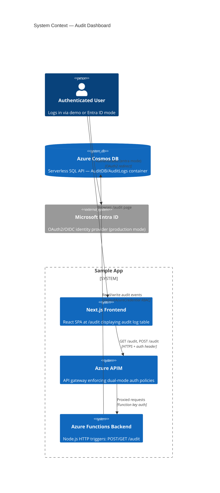
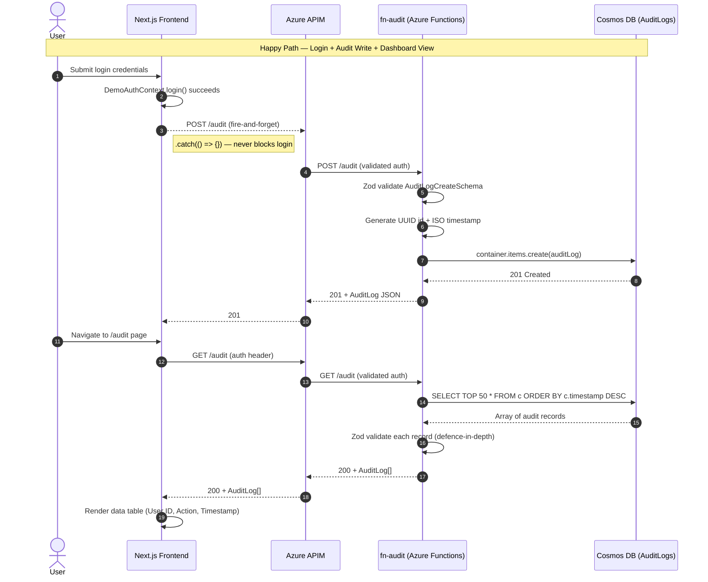
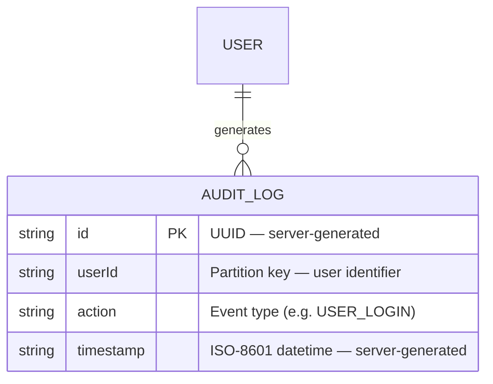

# Architecture Report: audit-dashboard

## Executive Summary

The audit-dashboard feature introduces a full-stack audit logging system that tracks user actions (login, profile views, etc.) and surfaces them through an admin-facing dashboard. It provisions a new Azure Cosmos DB (Serverless, SQL API) for telemetry storage—isolated from transactional data—wired to the backend via Managed Identity RBAC with zero API keys. The key architectural decision is a fire-and-forget write pattern from the login flow, ensuring audit telemetry never blocks the user-critical authentication path.

## System Context Diagram (C4 Level 1)

## Sequence Diagram

## Entity-Relationship Diagram

## Component Inventory

| File | Module | Purpose | Status |
|------|--------|---------|--------|
| `packages/schemas/src/audit.ts` | Shared Schemas | Zod schemas: `AuditLogSchema`, `AuditLogCreateSchema`, and inferred TypeScript types | New |
| `packages/schemas/src/index.ts` | Shared Schemas | Barrel export — re-exports audit schema symbols | Modified |
| `backend/src/functions/fn-audit.ts` | Backend | HTTP triggers for `POST /audit` (write) and `GET /audit` (read) with lazy Cosmos client singleton | New |
| `backend/src/functions/__tests__/fn-audit.test.ts` | Backend Tests | Unit tests with mocked `@azure/cosmos` — covers 201, 400, 500 for POST; 200, 500 for GET | New |
| `backend/package.json` | Backend | Added `@azure/cosmos` and `@azure/identity` dependencies | Modified |
| `frontend/src/app/audit/page.tsx` | Frontend | Client component — data table with loading, error, and empty states | New |
| `frontend/src/app/audit/__tests__/page.test.tsx` | Frontend Tests | Unit tests with mocked `apiFetch` — covers data, error, and empty states | New |
| `frontend/src/components/NavBar.tsx` | Frontend | Added "Audit" navigation link between About and theme toggle | Modified |
| `frontend/src/components/DemoLoginForm.tsx` | Frontend | Fire-and-forget `POST /audit` with `USER_LOGIN` action on successful login | Modified |
| `infra/cosmos.tf` | Infrastructure | Terraform: Cosmos DB account (Serverless), SQL database `AuditDB`, container `AuditLogs`, RBAC role assignment | New |
| `infra/main.tf` | Infrastructure | Added `COSMOS_ENDPOINT` app setting to Function App configuration | Modified |
| `infra/outputs.tf` | Infrastructure | Added `cosmosdb_account_name` and `cosmosdb_endpoint` outputs | Modified |
| `infra/api-specs/api-sample.openapi.yaml` | Infrastructure | Added `/audit` GET and POST path definitions + `AuditLog`/`AuditLogCreate` schemas | Modified |
| `e2e/audit.spec.ts` | E2E Tests | Playwright tests: navigate to `/audit`, verify table renders with audit rows | New |
| `.apm/hooks/validate-infra.sh` | Deployment Hooks | Data-plane reachability check for Cosmos DB endpoint (accept 200/401) | Modified |
| `.apm/hooks/validate-app.sh` | Deployment Hooks | Curl check for `GET /api/audit` endpoint (fail on 000/502/503) | Modified |
