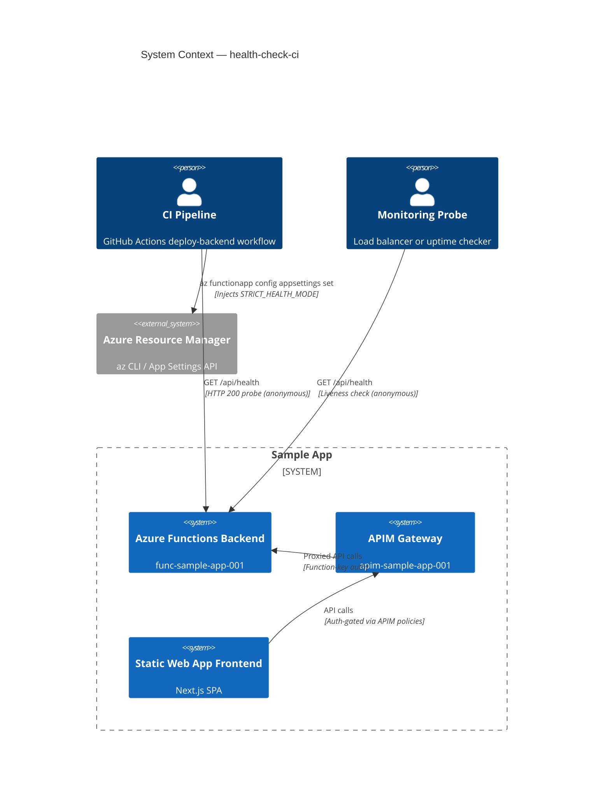
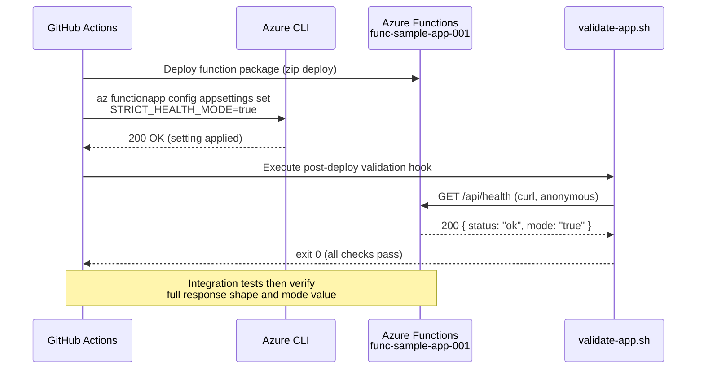

# Architecture Report: health-check-ci

## Executive Summary

A new anonymous `GET /api/health` Azure Functions endpoint was added to the backend, returning deployment status and the `STRICT_HEALTH_MODE` environment variable. The CI/CD pipeline (`deploy-backend.yml`) was extended to inject this setting as an Azure App Setting after each deployment, enabling CI probes to verify that a deployment was successful without requiring authentication credentials. Zod-based health schemas were added to the shared `@branded/schemas` package for future extensibility.

## System Context Diagram (C4 Level 1)

## Sequence Diagram

## Entity-Relationship Diagram

No persistent data models were introduced. The health endpoint is stateless — it reads only from `process.env.STRICT_HEALTH_MODE`. Zod schemas (`HealthStatus`, `HealthCheckEntry`, `HealthCheckResponse`) were added to `packages/schemas` as a forward-looking contract but are not yet consumed by the current minimal `{status, mode}` response.

## Component Inventory

| File | Type | Module | Purpose |
|------|------|--------|---------|
| `backend/src/functions/fn-health.ts` | **New** | Backend | Azure Function: `GET /api/health`, `authLevel: "anonymous"`. Returns `{status: "ok", mode: env.STRICT_HEALTH_MODE \|\| "disabled"}`. |
| `backend/src/functions/__tests__/fn-health.test.ts` | **New** | Backend Tests | 6 unit tests: status code, default mode, env var reflection, logging, response shape. |
| `backend/src/functions/__tests__/health.integration.test.ts` | **New** | Backend Tests | 2 integration tests (gated by `RUN_INTEGRATION=true`): live deployment probe, `STRICT_HEALTH_MODE` assertion. |
| `packages/schemas/src/health.ts` | **New** | Shared Schemas | Zod schemas: `HealthStatusSchema`, `HealthCheckEntrySchema`, `HealthCheckResponseSchema` with exported TypeScript types. |
| `packages/schemas/src/index.ts` | **Modified** | Shared Schemas | Re-exports health schemas from the barrel file. |
| `packages/schemas/src/__tests__/schemas.test.ts` | **Modified** | Shared Schemas | Added validation tests for all three health schemas. |
| `.github/workflows/deploy-backend.yml` | **Modified** | CI/CD | Appended step to inject `STRICT_HEALTH_MODE=true` via `az functionapp config appsettings set` after deployment. |
| `.apm/hooks/validate-app.sh` | **Modified** | DevOps Hooks | Appended `/api/health` reachability check (curl probe, exit 1 on failure). |
