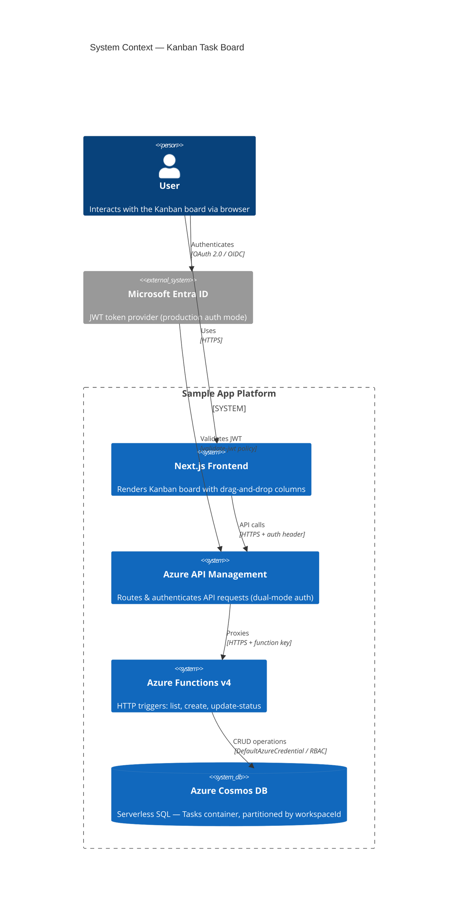
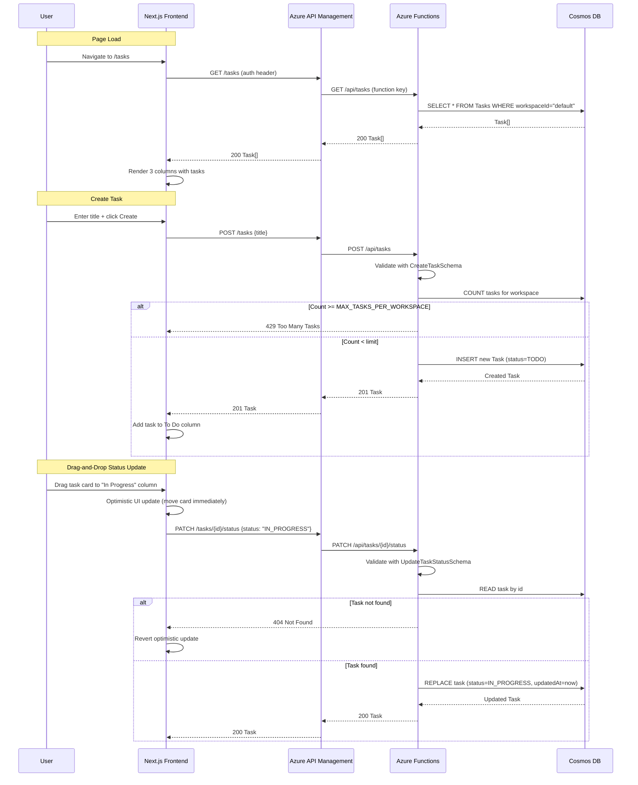
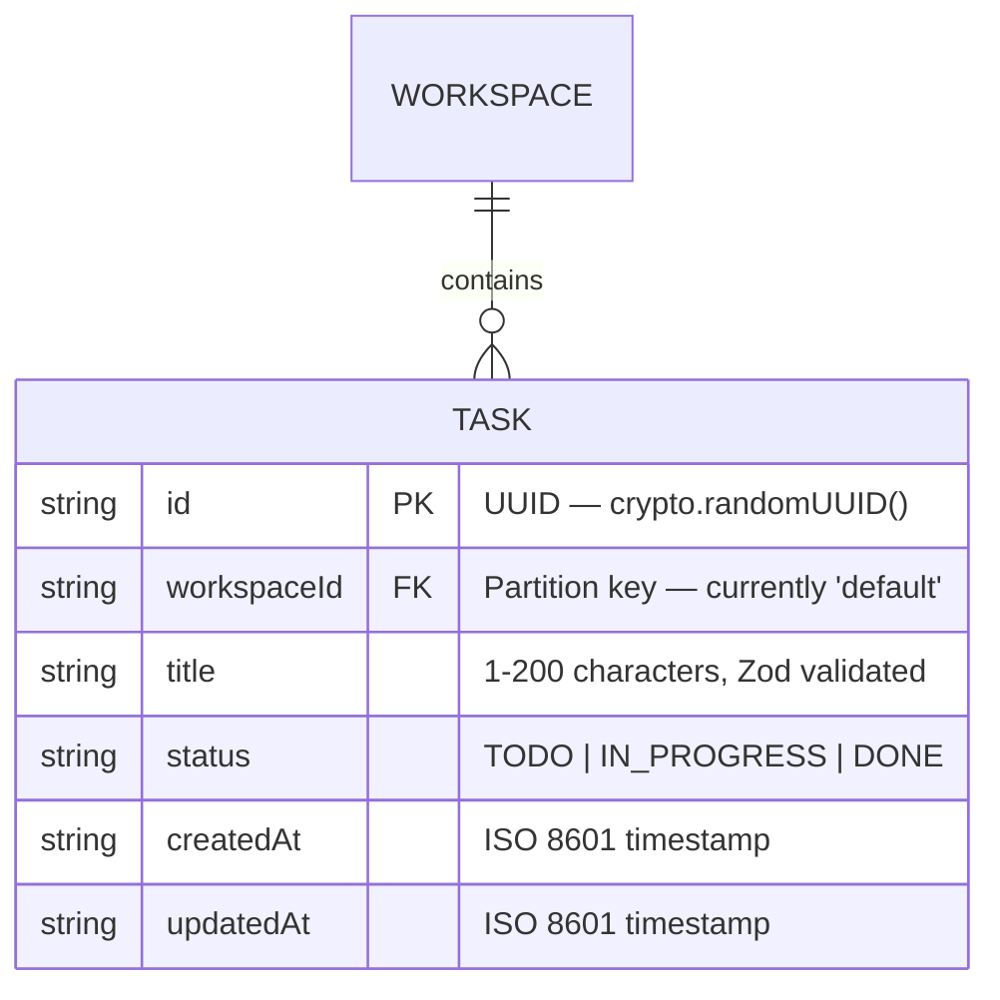

# Architecture Report: kanban-task-board-enhanced-v2

## Executive Summary

This feature delivers a full-stack **Interactive Kanban Task Board** that allows users to create tasks and move them across three status columns (To Do → In Progress → Done) via HTML5 native drag-and-drop and accessible fallback buttons. It is a vertical slice spanning Zod schemas, Azure Functions v4 HTTP triggers backed by Cosmos DB (serverless), APIM gateway routing, a Next.js React UI with optimistic updates, CI/CD pipeline modifications, Playwright E2E tests, and self-mutating deployment validation hooks. The key architectural decision was reusing the Cosmos DB infrastructure from `webhook-dispatcher` (PR #35) — adding only a new `Tasks` container — to avoid resource duplication and leverage the existing `DefaultAzureCredential` RBAC flow.

## System Context Diagram (C4 Level 1)

## Sequence Diagram

## Entity-Relationship Diagram

## Component Inventory

### New Files

| File | Module | Purpose | LOC |
|---|---|---|---|
| `packages/schemas/src/tasks.ts` | Shared Schemas | Zod schemas (`TaskStatusSchema`, `TaskSchema`, `CreateTaskSchema`, `UpdateTaskStatusSchema`) and inferred TypeScript types | 78 |
| `backend/src/functions/fn-tasks.ts` | Backend API | 3 Azure Functions v4 HTTP triggers — `listTasks` (GET), `createTask` (POST), `updateTaskStatus` (PATCH) with Cosmos DB CRUD and rate limiting | 299 |
| `frontend/src/app/tasks/page.tsx` | Frontend UI | Kanban board React component — 3 columns, HTML5 drag-and-drop, fallback buttons, optimistic UI, `apiFetch` integration | 421 |
| `e2e/tasks.spec.ts` | E2E Tests | Playwright tests — create task, drag-and-drop move, button fallback, reload persistence, same-column no-op | 265 |
| `backend/src/functions/__tests__/fn-tasks.test.ts` | Backend Tests | Jest unit tests — input validation, 404 handling, 429 rate limit enforcement | 379 |
| `backend/src/functions/__tests__/tasks.integration.test.ts` | Integration Tests | Live integration tests — CRUD flow against deployed Function App, `MAX_TASKS_PER_WORKSPACE` az CLI validation | 184 |
| `frontend/src/app/tasks/__tests__/page.test.tsx` | Frontend Tests | 46 React Testing Library tests — rendering, drag-and-drop events, status transitions, optimistic UI, error handling | 811 |
| `infra/cosmos.tf` | Infrastructure | Cosmos DB account, database, Webhooks container, **Tasks container** (new), and RBAC role assignment | 90 |

### Modified Files

| File | Module | Change | Impact |
|---|---|---|---|
| `packages/schemas/src/index.ts` | Shared Schemas | Added barrel exports for task schemas and types | Low — additive only |
| `infra/api-specs/api-sample.openapi.yaml` | APIM Gateway | Added `GET /tasks`, `POST /tasks`, `PATCH /tasks/{id}/status` with OpenAPI schemas | Medium — new API surface |
| `frontend/src/components/NavBar.tsx` | Frontend UI | Added "Task Board" link (`<Link href="/tasks">`) after "About" | Low — additive nav entry |
| `.apm/hooks/validate-app.sh` | DevOps | Appended `GET /api/tasks` curl reachability check | Low — deployment validation |
| `.github/workflows/deploy-backend.yml` | CI/CD | Added `az functionapp config appsettings set` step for `MAX_TASKS_PER_WORKSPACE=500` | Medium — deployment config |
| `packages/schemas/src/__tests__/schemas.test.ts` | Schema Tests | Extended coverage for new task schemas | Low — test-only |

### Architecture Layers

| Layer | Technology | Files | Notes |
|---|---|---|---|
| **Presentation** | Next.js 14 / React / HTML5 DnD API | `page.tsx`, `NavBar.tsx` | Zero external DnD library — uses native browser APIs |
| **API Gateway** | Azure API Management | `api-sample.openapi.yaml` | Dual-mode auth (demo token / Entra JWT), auto-imported spec |
| **Application** | Azure Functions v4 (Node.js) | `fn-tasks.ts` | Stateless HTTP triggers, Zod validation, rate limiting |
| **Data** | Azure Cosmos DB (Serverless, SQL API) | `cosmos.tf` | Tasks container, `/workspaceId` partition, Session consistency |
| **Shared Contracts** | Zod v3 schemas | `tasks.ts`, `index.ts` | Single source of truth for frontend + backend validation |
| **CI/CD** | GitHub Actions | `deploy-backend.yml` | App setting injection for `MAX_TASKS_PER_WORKSPACE` |
| **Observability** | Self-mutating hooks | `validate-app.sh` | Post-deploy reachability check for `/api/tasks` |

### Key Design Patterns

1. **Shared Schema Validation** — Zod schemas in `packages/schemas` are the single source of truth consumed by both the backend (server-side `safeParse`) and frontend (runtime response validation via `apiFetch`).
2. **Optimistic UI with Revert** — Frontend immediately updates local state on drag-drop/button click, reverting to the previous snapshot if the API call fails. This provides instant visual feedback without waiting for network round-trips.
3. **Lazy Singleton Cosmos Client** — Backend initializes the `CosmosClient` on first request and reuses it across invocations within the same Function App instance (warm starts), avoiding per-request authentication overhead.
4. **Zero API Keys (DefaultAzureCredential)** — Cosmos DB authentication uses RBAC role assignments exclusively; no connection strings or API keys appear in code or configuration.
5. **Rate Limiting via Active Count** — `POST /api/tasks` queries the task count per workspace before insertion and returns `429` if the count exceeds `MAX_TASKS_PER_WORKSPACE`, providing a simple but effective per-workspace guardrail.
6. **Infrastructure Reuse** — The Cosmos DB account, database, RBAC role, and app settings provisioned by `webhook-dispatcher` (PR #35) are reused. Only a new `Tasks` container was appended to `cosmos.tf`.
