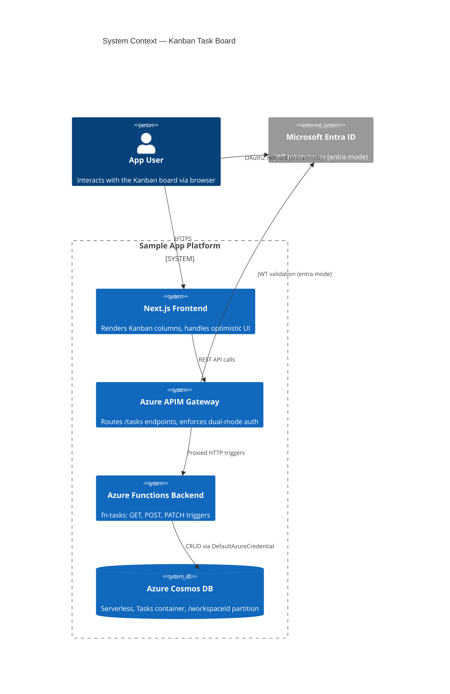
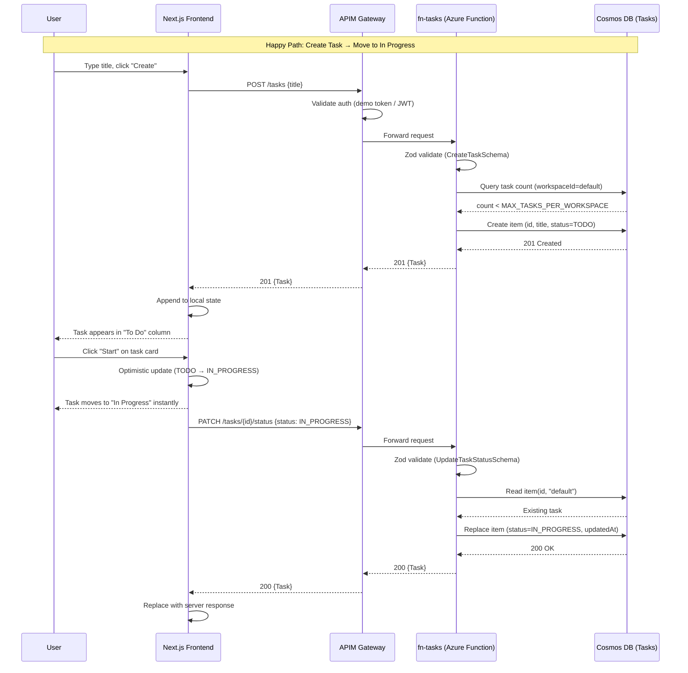
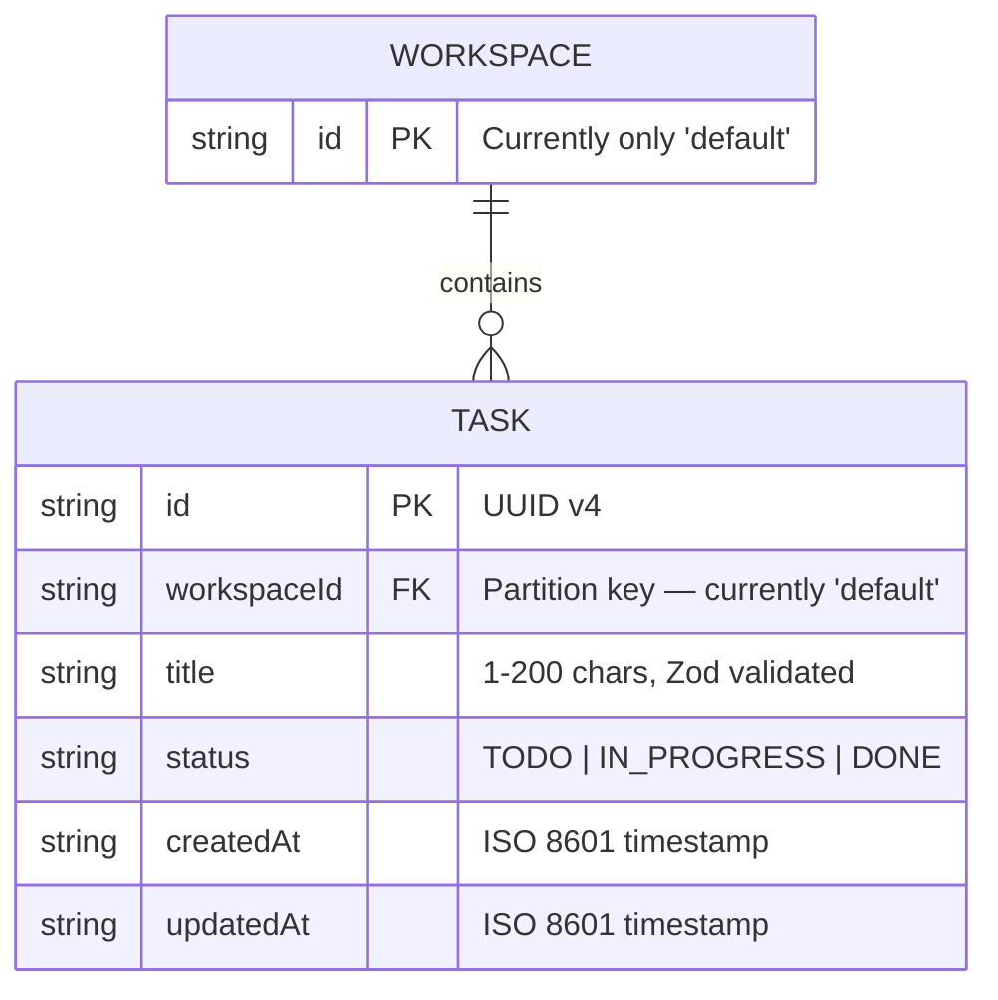

# Architecture Report: kanban-task-board

## Executive Summary

The Kanban Task Board is a full-stack feature that adds workspace-scoped task management with three-column workflow visualization (To Do → In Progress → Done). It introduces a shared Zod schema layer, three Azure Functions HTTP triggers backed by Cosmos DB (serverless), a React client-side page with optimistic UI updates, and APIM gateway routing — all wired together through the existing dual-mode auth system and CI/CD pipeline. The key architectural decisions are zero-API-key Cosmos DB auth via `DefaultAzureCredential`, a `workspaceId` partition key pre-positioned for multi-tenancy, and configurable per-workspace task limits enforced server-side.

## System Context Diagram (C4 Level 1)

## Sequence Diagram

## Entity-Relationship Diagram

## Component Inventory

### New Files

| File | Module | Purpose |
|------|--------|---------|
| `packages/schemas/src/tasks.ts` | Shared Schemas | Zod schemas (TaskStatusSchema, TaskSchema, CreateTaskSchema, UpdateTaskStatusSchema) and inferred TypeScript types |
| `backend/src/functions/fn-tasks.ts` | Backend API | 3 HTTP triggers: listTasks (GET), createTask (POST), updateTaskStatus (PATCH) with Cosmos DB CRUD |
| `backend/src/functions/__tests__/fn-tasks.test.ts` | Backend Tests | Unit tests for input validation, 404 handling, 429 limit enforcement |
| `backend/src/functions/__tests__/tasks.integration.test.ts` | Backend Tests | Integration tests: CRUD flow + MAX_TASKS_PER_WORKSPACE az CLI validation |
| `frontend/src/app/tasks/page.tsx` | Frontend UI | Kanban board: TaskCard, KanbanColumn, TasksPage components with optimistic UI |
| `frontend/src/app/tasks/__tests__/page.test.tsx` | Frontend Tests | 32 unit tests for columns, create, move, optimistic rollback, error handling |
| `e2e/tasks.spec.ts` | E2E Tests | Playwright: create → move → reload → persistence verification |

### Modified Files

| File | Module | Change |
|------|--------|--------|
| `packages/schemas/src/index.ts` | Shared Schemas | Added barrel exports for task schemas and types |
| `infra/cosmos.tf` | Infrastructure | Appended `azurerm_cosmosdb_sql_container.tasks` (Tasks container, /workspaceId partition) |
| `infra/api-specs/api-sample.openapi.yaml` | APIM Gateway | Added GET/POST/PATCH /tasks paths + Task, CreateTask, UpdateTaskStatus, ErrorResponse schemas |
| `frontend/src/components/NavBar.tsx` | Frontend UI | Added "Task Board" nav link after "About" |
| `.apm/hooks/validate-app.sh` | Validation Hooks | Appended curl health check for GET /api/tasks |
| `.github/workflows/deploy-backend.yml` | CI/CD | Added `az functionapp config appsettings set` step for MAX_TASKS_PER_WORKSPACE=500 |

### Architectural Layers

| Layer | Technology | Files |
|-------|-----------|-------|
| **Schema (shared)** | Zod v3 + TypeScript | `packages/schemas/src/tasks.ts` |
| **Gateway** | Azure APIM + OpenAPI 3.0 | `infra/api-specs/api-sample.openapi.yaml` |
| **Backend** | Azure Functions v4 + Cosmos DB SDK | `backend/src/functions/fn-tasks.ts` |
| **Frontend** | Next.js 14 + React 18 | `frontend/src/app/tasks/page.tsx` |
| **Infrastructure** | Terraform (HCL) | `infra/cosmos.tf` |
| **CI/CD** | GitHub Actions | `.github/workflows/deploy-backend.yml` |
