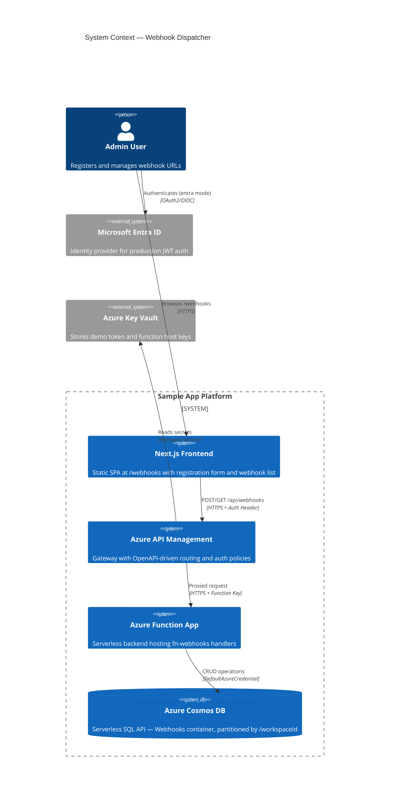
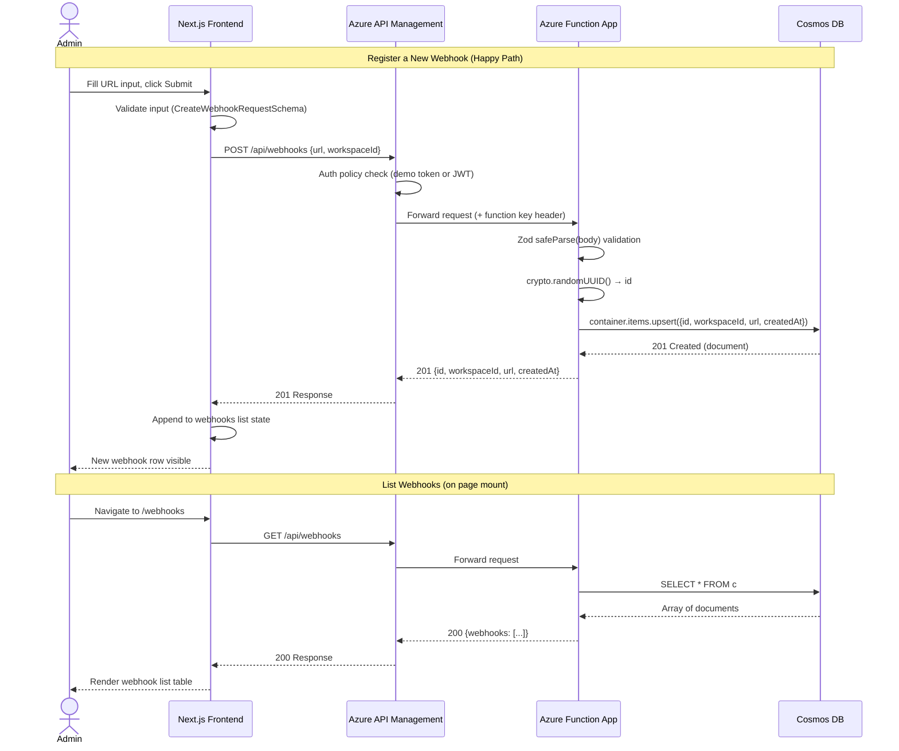
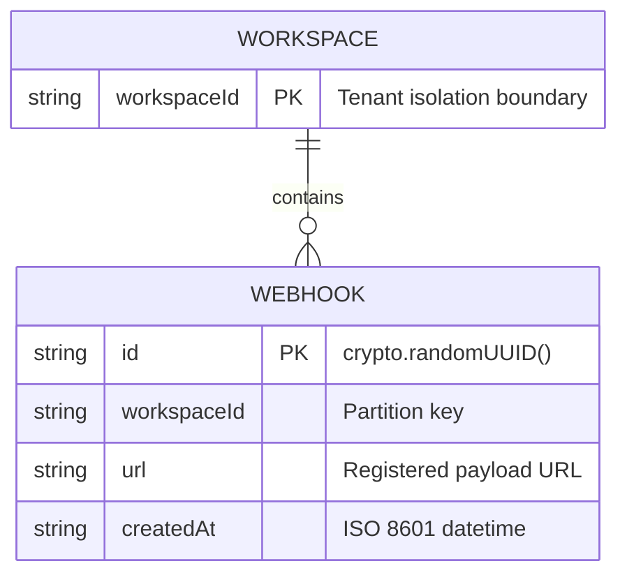

# Architecture Report: webhook-dispatcher

## Executive Summary

The webhook-dispatcher feature introduces a full-stack webhook management system enabling admins to register payload URLs and list registered webhooks. It provisions a new Azure Cosmos DB (serverless, SQL API) data tier with zero-key authentication via `DefaultAzureCredential`, exposes `POST /api/webhooks` and `GET /api/webhooks` endpoints through Azure Functions behind APIM gateway routing, and delivers a client-side React UI at `/webhooks`. The architecture follows the existing APIM → Function App → data-store pattern, extending it with a new Cosmos DB persistence layer while maintaining strict infrastructure-as-code and shared Zod schema validation across the stack.

## System Context Diagram (C4 Level 1)

## Sequence Diagram

## Entity-Relationship Diagram

## Component Inventory

| File | Status | Module | Purpose | LOC |
|------|--------|--------|---------|-----|
| `packages/schemas/src/webhooks.ts` | **NEW** | Shared Schemas | Zod schemas: `WebhookSchema`, `CreateWebhookRequestSchema`, `WebhookListResponseSchema` + inferred types | 59 |
| `packages/schemas/src/index.ts` | Modified | Shared Schemas | Barrel re-export of webhook schemas/types | +12 |
| `backend/src/functions/fn-webhooks.ts` | **NEW** | Backend API | `POST /api/webhooks` (createWebhook) and `GET /api/webhooks` (listWebhooks) Azure Function handlers with lazy Cosmos client singleton | 221 |
| `backend/src/functions/__tests__/fn-webhooks.test.ts` | **NEW** | Backend Tests | Unit tests: mocked Cosmos, POST 201/400, GET 200 | — |
| `backend/src/functions/__tests__/webhooks.integration.test.ts` | **NEW** | Backend Tests | Integration tests: live endpoint validation + WEBHOOK_TIMEOUT_MS env assertion | — |
| `backend/package.json` | Modified | Backend | Added `@azure/cosmos` and `@azure/identity` dependencies | — |
| `frontend/src/app/webhooks/page.tsx` | **NEW** | Frontend UI | Client-side SPA page: registration form + webhook list with `apiFetch` | 185 |
| `frontend/src/components/NavBar.tsx` | Modified | Frontend UI | Added "Webhooks" navigation link | — |
| `e2e/webhooks.spec.ts` | **NEW** | E2E Tests | Playwright: form render, registration, persistence, NavBar navigation | — |
| `infra/cosmos.tf` | **NEW** | Infrastructure | Cosmos DB account (serverless), database, Webhooks container, RBAC role assignment | 73 |
| `infra/main.tf` | Modified | Infrastructure | Added `COSMOSDB_ENDPOINT` app setting to Function App | — |
| `infra/outputs.tf` | Modified | Infrastructure | Added `cosmosdb_endpoint` and `cosmosdb_account_name` outputs | — |
| `infra/api-specs/api-sample.openapi.yaml` | Modified | Infrastructure | Added `GET /webhooks` and `POST /webhooks` APIM paths | — |
| `.github/workflows/deploy-backend.yml` | Modified | CI/CD | Injects `WEBHOOK_TIMEOUT_MS=5000` app setting during deployment | — |
| `.apm/hooks/validate-app.sh` | Modified | Validation Hooks | Appended curl reachability check for `GET ${BACKEND_URL}/webhooks` | — |

**Totals:** 35 files changed, 5,613 lines inserted across 6 modules (schemas, backend, frontend, infra, CI/CD, E2E).

## Key Architectural Patterns

### 1. Shared Zod Schema Validation
Schemas defined once in `@branded/schemas` are consumed by both backend (request validation via `safeParse`) and frontend (response validation via `apiFetch` generic). This eliminates API contract drift.

### 2. Zero-Key Data-Plane Authentication
Cosmos DB access uses `DefaultAzureCredential` with a Cosmos DB Built-in Data Contributor RBAC role assignment scoped to the Function App's managed identity. No connection strings or API keys appear in code or configuration.

### 3. Lazy Singleton Cosmos Client
`fn-webhooks.ts` initializes the `CosmosClient` lazily on first invocation, cached in module scope. This avoids cold-start overhead on subsequent invocations while ensuring the client is not created at import time.

### 4. APIM Gateway Contract
The frontend never communicates directly with the Function App. All API traffic is routed through APIM, which enforces auth policies and requires explicit OpenAPI path declarations. Missing paths result in 404 at the gateway level.

### 5. Static Export SPA Pattern
The frontend uses Next.js `output: "export"` for static hosting on Azure Static Web Apps. The `/webhooks` page is a `"use client"` component that performs all data fetching client-side via `apiFetch`.
