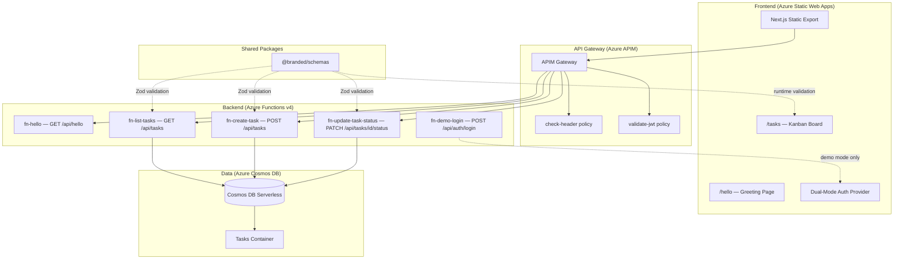

# System Overview — Sample App

## Architecture

The sample app is an Azure serverless web application with dual-mode authentication, a Next.js static frontend, Azure Functions backend, Cosmos DB persistence, and APIM gateway routing.

## Components

| Component | Technology | Purpose |
|-----------|-----------|---------|
| Frontend | Next.js 15 (static export) | SPA with dual-mode auth, Kanban board UI |
| Backend | Azure Functions v4 (Node.js) | HTTP triggers for API endpoints |
| API Gateway | Azure APIM | Auth policy enforcement, OpenAPI-driven routing |
| Database | Azure Cosmos DB (serverless) | Task persistence with workspace partitioning |
| Schemas | `@branded/schemas` (Zod v3) | Shared validation across frontend and backend |
| Infrastructure | Terraform | All Azure resources provisioned declaratively |

## Authentication

Dual-mode auth controlled by `AUTH_MODE` / `NEXT_PUBLIC_AUTH_MODE`:

| Mode | Backend | Frontend | APIM Policy |
|------|---------|----------|-------------|
| `demo` | POST /auth/login returns token | DemoAuthContext + sessionStorage | `check-header` (X-Demo-Token) |
| `entra` | Login disabled (404) | MSAL v5 redirect to Entra ID | `validate-jwt` (Bearer JWT) |

## Data Model

### Cosmos DB Containers

| Container | Partition Key | Purpose |
|-----------|--------------|---------|
| Tasks | `/workspaceId` | Kanban board task storage |

### Task Entity

| Field | Type | Description |
|-------|------|-------------|
| `id` | `string (UUID)` | Unique task identifier |
| `workspaceId` | `string` | Partition key — currently `"default"` |
| `title` | `string (1–200 chars)` | Task title |
| `status` | `"TODO" \| "IN_PROGRESS" \| "DONE"` | Current Kanban column |
| `createdAt` | `string (ISO 8601)` | Creation timestamp |
| `updatedAt` | `string (ISO 8601)` | Last modification timestamp |

## API Endpoints

| Method | Path | Description |
|--------|------|-------------|
| GET | `/api/hello` | Returns a greeting message |
| POST | `/api/auth/login` | Demo-mode authentication (disabled in entra mode) |
| GET | `/api/tasks` | List all tasks for the default workspace |
| POST | `/api/tasks` | Create a new task (429 if workspace limit exceeded) |
| PATCH | `/api/tasks/{id}/status` | Update task status (404 if not found) |

Full API contracts: [api-contracts.md](../specs/api-contracts.md)

## Environment Variables

### Backend (Azure Functions)

| Variable | Required | Default | Description |
|----------|----------|---------|-------------|
| `COSMOSDB_ENDPOINT` | Yes | — | Cosmos DB account endpoint |
| `COSMOSDB_DATABASE_NAME` | Yes | — | Database name (`sample-app-db`) |
| `MAX_TASKS_PER_WORKSPACE` | No | `500` | Maximum tasks per workspace partition |
| `AUTH_MODE` | No | `demo` | Authentication mode (`demo` or `entra`) |
| `DEMO_TOKEN` | Conditional | — | Required when `AUTH_MODE=demo` |

### Frontend

| Variable | Required | Default | Description |
|----------|----------|---------|-------------|
| `NEXT_PUBLIC_AUTH_MODE` | No | `demo` | Authentication mode |
| `NEXT_PUBLIC_API_BASE_URL` | Yes | — | APIM gateway base URL |
| `NEXT_PUBLIC_ENTRA_CLIENT_ID` | Conditional | — | Required when auth mode is `entra` |
| `NEXT_PUBLIC_ENTRA_TENANT_ID` | Conditional | — | Required when auth mode is `entra` |
