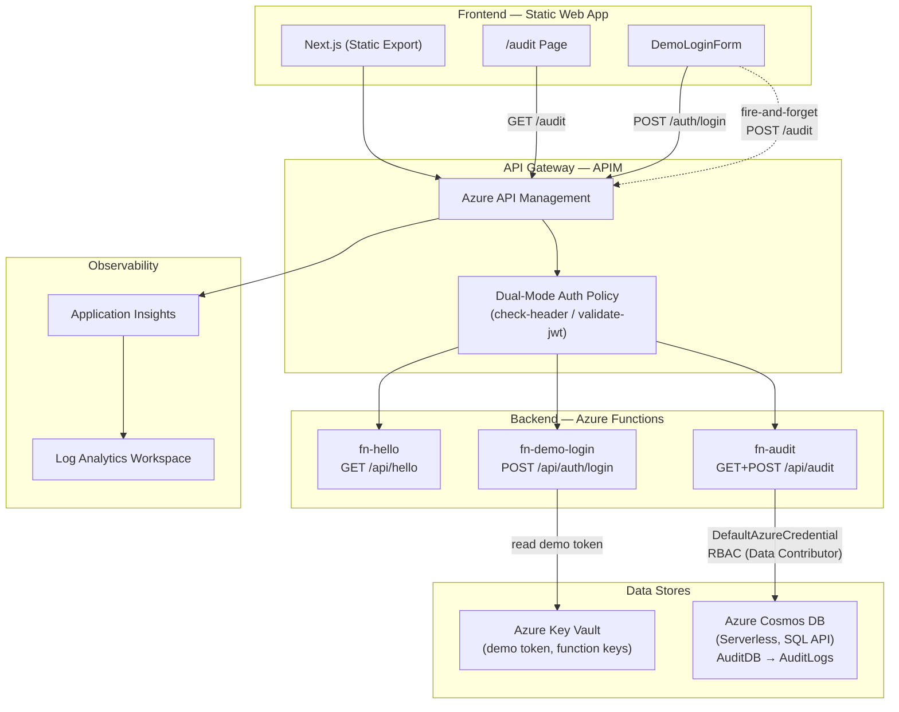
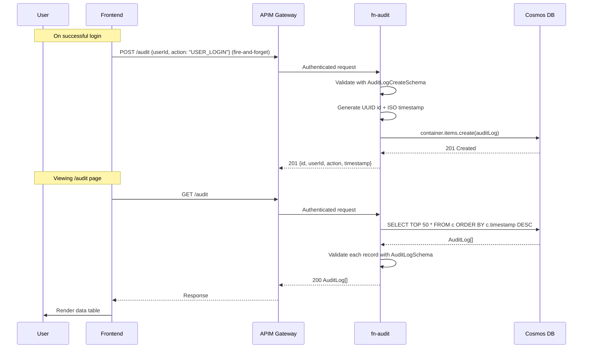

# System Architecture — Sample App

## Overview

The sample app is an Azure serverless web application demonstrating dual-mode authentication (demo + Entra ID), shared schema validation, and an audit event pipeline backed by Cosmos DB. It is deployed and managed by the [Autonomous Factory](../../../tools/autonomous-factory/) agentic pipeline.

## Component Diagram

## Data Flow — Audit Events

## API Endpoints

| Method | Path | Handler | Auth | Description |
|--------|------|---------|------|-------------|
| `GET` | `/api/hello` | `fn-hello` | APIM dual-mode | Returns greeting message |
| `POST` | `/api/auth/login` | `fn-demo-login` | None (demo mode only) | Demo credential validation |
| `GET` | `/api/audit` | `fn-audit` | APIM dual-mode | Returns latest 50 audit events |
| `POST` | `/api/audit` | `fn-audit` | APIM dual-mode | Records a new audit event |

## Frontend Routes

| Route | Component | Auth Required | Description |
|-------|-----------|---------------|-------------|
| `/` | Home | Yes | Greeting page with `/hello` API call |
| `/about` | About | Yes | Static about page |
| `/audit` | AuditPage | Yes | Data table of recent audit events |

## Infrastructure

All resources are provisioned via Terraform. See [`infra/README.md`](../../infra/README.md) for the full resource inventory.

### Key Resources

| Resource | Purpose |
|----------|---------|
| Azure Functions (Flex Consumption) | Backend API runtime |
| Static Web App | Frontend hosting |
| API Management | Gateway with auth policies |
| Key Vault | Secrets storage (demo token, function keys) |
| Cosmos DB (Serverless, SQL API) | Audit event storage (`AuditDB.AuditLogs`, partition: `/userId`) |
| Application Insights + Log Analytics | Observability |

### Security Model

- **Zero API keys in code.** All Azure data-plane access uses `DefaultAzureCredential`.
- **Cosmos DB:** Function App Managed Identity has `Cosmos DB Built-in Data Contributor` RBAC role. `local_authentication_disabled = true` enforces RBAC-only access.
- **Key Vault:** RBAC-based access (Secrets Officer/User roles).
- **APIM:** Dual-mode auth policy applies `check-header` (demo) or `validate-jwt` (Entra ID).
- **Functions:** `authLevel: "function"` ensures only APIM (with function key) can invoke handlers directly.

## Shared Schema Layer

All API request/response types are defined as Zod schemas in `packages/schemas/` (`@branded/schemas`). Both backend and frontend import from this single source of truth for runtime validation and TypeScript type inference.

| Schema | File | Used By |
|--------|------|---------|
| `HelloResponseSchema` | `hello.ts` | GET /hello response |
| `DemoLoginRequestSchema` | `auth.ts` | POST /auth/login request |
| `DemoLoginResponseSchema` | `auth.ts` | POST /auth/login response |
| `AuditLogSchema` | `audit.ts` | GET /audit response items, POST /audit response |
| `AuditLogCreateSchema` | `audit.ts` | POST /audit request body |
| `ApiErrorResponseSchema` | `errors.ts` | All error responses |

## Test Coverage

| Package | Unit Tests | Description |
|---------|-----------|-------------|
| `packages/schemas` | 50 | Schema validation (HelloResponse, Auth, Errors, AuditLog) |
| `backend` | 34 | Endpoint logic (fn-hello, fn-demo-login, fn-audit) |
| `frontend` | 18 | Component rendering, API client, audit page states |
| **Total** | **102** | |

E2E tests (Playwright): `e2e/login.spec.ts`, `e2e/authenticated-hello.spec.ts`, `e2e/audit.spec.ts` — authenticated flows including audit table rendering.
