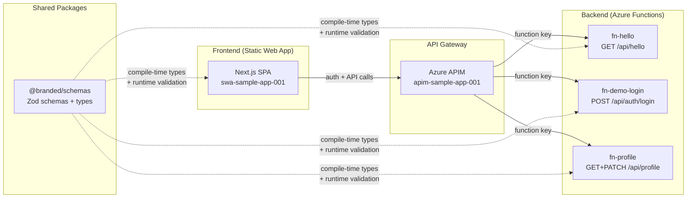

# System Overview

The sample app is a full-stack Azure serverless application demonstrating dual-mode authentication, shared schema validation, and an agentic CI/CD pipeline.

## High-Level Architecture



## Auth Flow (Dual-Mode)

| Mode | Frontend | APIM Policy | Backend |
|------|----------|-------------|---------|
| `demo` | `DemoAuthContext` → `X-Demo-Token` | `check-header` | Function-level `authLevel: "function"` |
| `entra` | MSAL redirect → `Authorization: Bearer <jwt>` | `validate-jwt` | Function-level `authLevel: "function"` |

**Defense-in-depth chain:**
```
Demo:  X-Demo-Token → APIM check-header → Function Key → authLevel:"function"
Entra: MSAL JWT     → APIM validate-jwt → Function Key → authLevel:"function"
```

The `/profile` endpoint adds an additional in-function auth layer: it validates `X-Demo-Token` directly via `crypto.timingSafeEqual` to enable fine-grained 401 responses for unit testing.

## Deployed Resources

| Layer | Resource | Azure Name |
|-------|----------|------------|
| Frontend | Static Web App | `swa-sample-app-001` |
| Gateway | API Management | `apim-sample-app-001` |
| Backend | Function App (Flex Consumption) | `func-sample-app-001` |
| Storage | Function runtime storage | `stsampleapp001` |
| Secrets | Key Vault | `kv-sampleapp-001` |
| Monitoring | Log Analytics + App Insights | `log-sample-app-001` / `appi-sample-app-001` |

## Pages & Routes

| Route | Component | Auth Required | Description |
|-------|-----------|---------------|-------------|
| `/` | `page.tsx` | Yes | Home — Hello endpoint demo |
| `/about` | `about/page.tsx` | Yes | About page |
| `/profile` | `profile/page.tsx` | Yes | User profile & preferences |

## Shared Schema Packages

`@branded/schemas` provides Zod schemas shared between backend and frontend:

| Schema | Used By |
|--------|---------|
| `HelloResponseSchema` | `fn-hello`, frontend home page |
| `DemoLoginRequestSchema` / `DemoLoginResponseSchema` | `fn-demo-login`, `demoAuthContext` |
| `ApiErrorResponseSchema` / `ApiErrorCodeSchema` | All endpoints, `apiClient` |
| `UserProfileSchema` / `ProfileUpdateSchema` / `ThemeSchema` | `fn-profile`, profile page |
