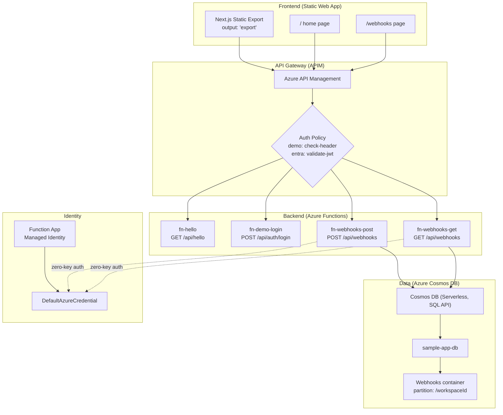

# System Overview — Sample App

## Architecture

The sample app is an Azure serverless web application with dual-mode authentication, APIM gateway routing, and Cosmos DB persistence.

## Components

| Component | Technology | Purpose |
|-----------|-----------|---------|
| Frontend | Next.js (static export) | Client-side SPA with dual-mode auth |
| API Gateway | Azure API Management | Auth enforcement, route management, OpenAPI-driven |
| Backend | Azure Functions (Node.js) | HTTP triggers for business logic |
| Database | Azure Cosmos DB (serverless, SQL API) | Webhook URL persistence |
| Identity | Managed Identity + DefaultAzureCredential | Zero-key authentication for data-plane access |
| Schemas | `@branded/schemas` (Zod) | Shared request/response validation across frontend and backend |
| Infrastructure | Terraform | Declarative provisioning of all Azure resources |

## Request Flow

1. **Frontend** makes API calls through the authenticated `apiFetch()` client
2. **APIM** validates the auth token (demo header or Entra JWT) and forwards to the Function App
3. **Azure Functions** process the request with Zod schema validation
4. **Cosmos DB** is accessed via `DefaultAzureCredential` — no API keys in code

## Authentication

Dual-mode authentication controlled by `AUTH_MODE` / `NEXT_PUBLIC_AUTH_MODE`:

| Mode | Frontend | Backend | APIM Policy |
|------|----------|---------|-------------|
| `demo` | `DemoAuthContext` + sessionStorage | POST /auth/login validates shared credentials | `check-header` (X-Demo-Token) |
| `entra` | MSAL v5 redirect to Entra ID | Login endpoint returns 404 | `validate-jwt` (Bearer JWT) |

## Endpoints

| Method | Route | Function | Description |
|--------|-------|----------|-------------|
| GET | `/api/hello` | fn-hello | Greeting endpoint with optional `name` param |
| POST | `/api/auth/login` | fn-demo-login | Demo-mode credential validation |
| POST | `/api/webhooks` | fn-webhooks-post | Register a webhook URL in Cosmos DB |
| GET | `/api/webhooks` | fn-webhooks-get | List registered webhooks (optional `workspaceId` filter) |

## Infrastructure

Terraform manages all resources in separate files:

| File | Resources |
|------|-----------|
| `infra/main.tf` | Resource group, Function App (with `COSMOSDB_ENDPOINT` app setting) |
| `infra/swa.tf` | Static Web App |
| `infra/apim.tf` | API Management instance and policies |
| `infra/cosmos.tf` | Cosmos DB account (serverless), `sample-app-db` database, `Webhooks` container, RBAC role assignment |
| `infra/cicd.tf` | GitHub OIDC and CI/CD identity |
| `infra/api-specs/api-sample.openapi.yaml` | OpenAPI spec governing APIM route registration |

## CI/CD

Deployment is managed by GitHub Actions workflows:

- `deploy-backend.yml` — Builds and deploys Azure Functions. Injects `WEBHOOK_TIMEOUT_MS=5000` app setting.
- `deploy-frontend.yml` — Builds and deploys static frontend to SWA.
- `deploy-infra.yml` — Runs `terraform apply` for infrastructure changes.

## Validation Hooks

Self-mutating hooks in `.apm/hooks/` verify deployment health:

- `validate-app.sh` — Curl checks for `/hello` and `/webhooks` endpoint reachability
- `validate-infra.sh` — Infrastructure resource verification
