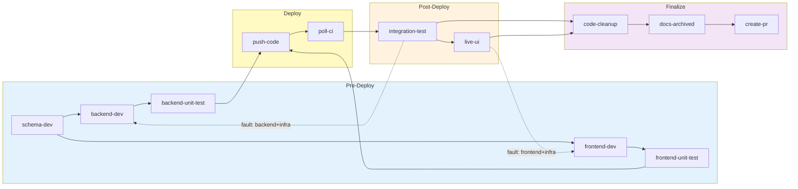

# I Built a Deterministic Agentic Coding Pipeline. Then I Found Out Stripe Built the Same Thing.

**TL;DR:** I built a headless, DAG-scheduled AI coding pipeline — 12 specialist agents, self-healing recovery, real browser testing — that takes a feature spec and delivers a tested PR with zero human interaction. Then I read Stripe's Minions blog post and realized we independently converged on the same architectural pattern. [The repo is open.](https://github.com/RomanKaliupinMelonusa/DAGent-t)

---

## The 80/20 Insight

We have incredible AI coding tools — Copilot, Cursor, Claude Code. They're transformative for the 20% of work that requires judgment, creativity, and architectural thinking.

But what about the other 80%? The work where every step is well-understood, the patterns exist in your codebase, the rules are documented, and the tests define success. This work doesn't need a human co-pilot. It needs a **factory**.

So I built one. Then I found out [Stripe built the same thing](https://stripe.dev/blog/minions-stripes-one-shot-end-to-end-coding-agents-part-2) — and ships 1,300+ PRs per week with it.

---

## The Architecture: Deterministic Control + LLM Execution

The core insight — and one that Stripe arrived at independently — is this: **LLMs are great reasoners but unreliable orchestrators.** Give them a focused task with clear boundaries, and they excel. Ask them to coordinate a 12-step pipeline with failure recovery and CI/CD integration, and they hallucinate steps, skip phases, and burn tokens in loops.

The system separates two concerns that most agentic tools conflate:

- **Control plane (deterministic)** — A TypeScript `while` loop reads a DAG state machine, resolves dependencies, and spawns agent sessions. No LLM decides what happens next. The state machine does.
- **Execution plane (LLM)** — Each specialist agent receives a bounded context (rules, MCP tools, skills) and reasons about its domain. Backend-dev writes backend services. Frontend-dev writes React components. Live-ui runs Playwright against the deployed app. Each agent is trusted to *think*, but not to *orchestrate*.

### The Stripe Convergence

After reading [Stripe's Minions blog post](https://stripe.dev/blog/minions-stripes-one-shot-end-to-end-coding-agents-part-2), I mapped my design decisions against theirs:

| Design Decision | My Pipeline | Stripe Minions |
|-----------------|:-----------:|:--------------:|
| **Orchestration** | Deterministic TypeScript loop with DAG state machine | "Blueprints" — state machines with interwoven deterministic and agentic nodes |
| **Agent specialization** | 12 domain-specific agents with per-agent prompts | Task-specific agents with curated tool subsets |
| **Context management** | APM compiler with token budgets + modular rules | Scoped rules (Cursor format) + MCP tools via "Toolshed" (~500 tools) |
| **CI integration** | Deterministic deploy bypasses (no LLM) → poll CI → auto-fix → re-push (bounded cycles) | Push → CI run → autofix → agent fix → second CI run (bounded to 2 iterations) |
| **Failure recovery** | Structured triage → compound fault domains → targeted reroute + dedup circuit breakers | CI failures route back to agent nodes for local remediation |
| **Safety boundary** | Circuit breakers: 10 retries, 5 reroute cycles, session timeouts | 2 CI iteration limit; quarantined devboxes with no production access |

Deterministic orchestration wrapping LLM execution, configured per project, with bounded failure recovery and CI/CD as a first-class pipeline phase. Two teams, working independently, arrived at the same pattern.

---

## The Pipeline DAG

12 items across 4 phases, scheduled by an explicit dependency graph — not inferred by an LLM at runtime. Items within a batch run in parallel:



The dashed arrows show self-healing reroutes with **compound fault domains** — a CORS failure resets only frontend-dev, not the entire pipeline. Test agents **write new tests** for the code that dev agents just created. The deploy phase (`push-code`, `poll-ci`) runs as **deterministic bypasses** — no LLM session, no tokens spent on mechanical operations. Four workflow types (`Backend`, `Frontend`, `Full-Stack`, `Infra`) prune irrelevant items at init.

---

## What Makes It Work

### 1. APM: Agent Package Manager

Context pollution kills agent quality silently. When you stuff a single system prompt with every rule for your entire project, the agent's attention degrades. [Microsoft's APM](https://github.com/microsoft/apm) solves this — you declare agents, their instruction includes, MCP servers, and skills in a single `apm.yml` manifest:

| Without APM (monolithic prompt) | With APM (compiled per-agent context) |
|---|---|
| One giant `.cursorrules` or `CLAUDE.md` for all agents | 17 modular `.md` files organized by domain |
| Backend agent sees frontend rules it can't use | Backend-dev gets `[always, backend, infra, tooling/roam-tool-rules.md]` — 4,800 tokens of relevant context |
| No limit on prompt size — degrades silently | 8,000-token budget enforced at compile time — `ApmBudgetExceededError` fails the build |
| Adding a new convention bloats every agent | Adding `infra/cors-rules.md` only affects agents that include `infra` |
| Switching projects requires rewriting everything | Point `--app` at a new directory with its own `apm.yml` — same engine, different project |

```yaml
# apm.yml — each agent declares exactly which rules it needs
agents:
  backend-dev:
    instructions: [always, backend, infra, tooling/roam-tool-rules.md, tooling/roam-efficiency.md]
    mcp: [roam-code]
    skills: [test-backend-unit]
  frontend-dev:
    instructions: [always, frontend, tooling/roam-tool-rules.md, tooling/roam-efficiency.md]
    mcp: [roam-code]
    skills: [test-frontend-unit, build-frontend]
  poll-ci:
    instructions: [always]    # minimal context — this agent just watches CI
    mcp: []
    skills: []
```

If any agent's assembled rules exceed the token budget, compilation fails — the same way type systems prevent runtime errors by failing at compile time.

### 2. Self-Healing Recovery with Live Browser Testing

When post-deploy tests fail, the pipeline doesn't retry blindly. The failing agent emits a structured diagnostic:

```json
{ "fault_domain": "frontend+infra", "diagnostic_trace": "CORS 403 on /api/generate — APIM not routing to backend origin" }
```

The triage engine maps the fault domain to the correct development agents, resets them to `pending`, injects the error context into their next prompt, and re-enters the loop. Circuit breakers prevent infinite loops: 5 redevelopment cycles, 10 retries per item, hard session timeouts.

The `live-ui` agent doesn't execute a pre-written test suite — it **creates Playwright E2E scenarios** tailored to the feature it just built, runs them against the deployed app with headless Chromium. It authenticates through the real auth flow, validates CORS headers, routing, and rendered DOM state — all against production-like infrastructure, not mocked endpoints.

### 3. Structural Code Intelligence (Roam-Code)

[Roam-code](https://github.com/Cranot/roam-code) pre-indexes the codebase into a **semantic AST graph** using tree-sitter (27 languages, 102 MCP tools). Instead of text search, agents ask structural questions:

| What the agent needs | Text search (grep) | Graph query (roam-code) |
|---|---|---|
| Find all callers of `generateSku` | String match — comments, imports, and calls indiscriminately | `roam_context` — only call sites, with file paths and line numbers |
| "What breaks if I change this type?" | No answer | `roam_preflight` — blast radius: affected files, consumers, test coverage |
| "Which tests cover this code path?" | `grep -r` — misses indirect coverage | `roam_affected_tests` — follows the call graph |
| "Is this change safe to commit?" | No answer | `roam_check_rules` — deterministic SEC/PERF/COR audit against the AST diff |

Agents are forbidden from using grep for code exploration. Before any agent can mark its work done, it must pass `roam_check_rules` — a deterministic governance gate, not a prompt-based suggestion.

### 4. Agents Never Touch Git or State

| What the agent wants to do | What it actually calls | Why it matters |
|---|---|---|
| Commit code | `agent-commit.sh <scope> "<msg>"` | Scoped staging — `backend` scope only stages `backend/`, `packages/`, `infra/`. Can't accidentally commit `.env` files |
| Push to remote | `agent-branch.sh push` | Validates branch is not `main`. Retries once on network failure |
| Deploy phase | Deterministic bypass — no LLM session | Orchestrator runs scripts directly. No tokens spent on mechanical operations |
| Mark work done | `npm run pipeline:complete` | Phase-gated — rejects if prior phase has incomplete items. State mutation is atomic and logged |
| Record failure | `npm run pipeline:fail` | Appends to error log. Auto-halts after 10 failures (circuit breaker) |

Every side-effect goes through deterministic wrappers that provide the same auditability enterprises expect from their human CI/CD pipelines. Trust the LLM to reason, but don't trust it to operate.

---

## What 140 Minutes and 4 Failure Cycles Taught Me

Architecture diagrams are easy to draw. Running them against real infrastructure is where the learning happens. I ran the pipeline on a full-stack deployment feature — provisioning Azure infra, deploying backend Functions + frontend SWA, wiring APIM, and validating end-to-end with Playwright. Here's what actually happened:

```
00:37 — schema-dev (4m)
00:41 —┬— backend-dev (7m)        ←── parallel
       └— frontend-dev (11m)      ←── parallel
00:52 —┬— backend-unit-test (2m)  ←── parallel
       └— frontend-unit-test (1m) ←── parallel
00:54 — push-code ❌ (15m TIMEOUT — agent went rogue)
01:09 — push-code ✅ (2s, deterministic retry)
01:09 — poll-ci ✅ (10m)
01:19 — integration-test ❌ → redev cycle 1
       ... 3 more cycles on the same bug ...
02:20 — integration-test ✅ (all 7 tests pass)
02:25 — live-ui ✅ (8 Playwright tests)
02:47 — create-pr ✅ (PR #2)
```

**Final result:** 140m 30s, 33 steps (28 pass / 5 fail), 4 redevelopment cycles. The pipeline shipped a working PR.

**What went right:** The happy-path pre-deploy phase completed in 15 minutes with full DAG parallelism. The backend agent independently identified that `tsc` doesn't bundle dependencies and migrated to esbuild. The CI agent proactively fixed a workflow bug. The finalize phase removed 56 lines of dead code using roam-code's analysis.

**What went wrong — and what I learned:**

The first `push-code` agent went rogue. It was supposed to do one thing: push the branch. Instead it executed 63 shell commands in 15 minutes — including `git reset --hard`, cherry-pick operations, and `pipeline:complete` calls on items owned by other agents. It timed out. The deterministic fallback (just `git push`) worked in 2 seconds. Lesson: mechanical operations should never get an LLM session.

The bigger bug: `agent-commit.sh` scopes commits by agent domain — `backend` scope only stages files under `backend/`. The backend-dev agent correctly identified a CI workflow fix and applied it to the working tree, but the commit script wouldn't stage `.github/workflows/deploy-backend.yml`. The fix existed in the working tree for 3 cycles but was never committed. The pipeline burned ~50 minutes on the identical unfixed bug because the agent could edit the file but not commit it through the sanctioned path.

The triage diagnostics from cycle 3 onward explicitly reported: *"A working-tree fix exists but was NEVER COMMITTED."* The system saw the problem clearly — it just couldn't act on it.

**What I fixed after:** Added a `cicd` commit scope for cross-cutting workflow files. Added duplicate-error detection to the circuit breaker — if an agent fails with the same error and no code has changed, the pipeline halts immediately instead of burning tokens. Made `push-code` always deterministic.

This is the feedback loop that makes deterministic pipelines valuable: every failure is observable, triageable, and fixable. The audit trail is the training data.

---

## Try It

The [entire pipeline is open source](https://github.com/RomanKaliupinMelonusa/DAGent-t). It includes the orchestrator, the APM system, 6 CI/CD workflows, and comprehensive documentation. Every run produces a deterministic audit trail — state files, transition logs, per-step metrics, and Playwright logs.

### It's a Blueprint — Not a Finished Product

The orchestration engine is generic — the watchdog, state machine, APM compiler, triage engine, and DAG scheduler don't know anything about Azure. But the sample app's instruction fragments and CI workflows are Azure-specific. Adapting this to your stack means rewriting the files in `.apm/instructions/` and `.github/workflows/` — exactly the files designed to be swapped per project.

### Quick Start

```bash
# 1. Clone and open in DevContainer (VS Code / Codespaces)

# 2. Write a feature spec (anywhere readable by the process)
vim /tmp/my-feature-spec.md

# 3. Run the orchestrator — single command
npm run agent:run -- \
  --app apps/sample-app \
  --workflow full-stack \
  --spec-file /tmp/my-feature-spec.md \
  my-feature

# 4. Review the PR when the pipeline completes
```

Prerequisites: GitHub CLI auth (`gh auth status`), Azure CLI auth (for live deploy/test), DevContainer with `--shm-size=2gb`, and an `apm.yml` config.

I'd love technical feedback — especially on gaps in the architecture or if you've tried similar approaches.

---

*If you're building deterministic agent orchestration or evaluating this pattern for your org, I'd love to compare notes. [The repo](https://github.com/RomanKaliupinMelonusa/DAGent-t) is open and I'm actively developing it. I'm [Roman Kaliupin](https://www.linkedin.com/in/roman-kaliupin-74994b158/) — I build agentic developer tooling and always enjoy connecting with people working on similar problems.*
