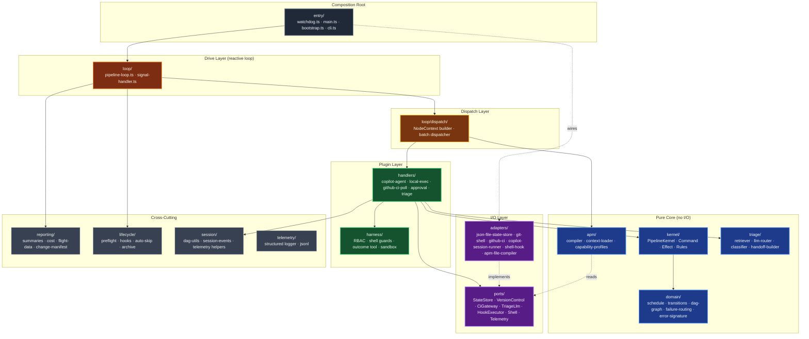

# Autonomous Factory — Engine Architecture

> The orchestration engine that drives the agentic pipeline. This document is the **single source of truth for how the engine is structured**: layers, paradigm, data flow, extension points, and rough edges.
>
> Audience: senior engineers wanting to understand, modify, or extend the engine. For a user-facing tour of the platform see the [repo README](../../README.md). For operational runbook (CI secrets, ChatOps, commands) see [.github/AGENTIC-WORKFLOW.md](../../.github/AGENTIC-WORKFLOW.md).

---

## Paradigm

Four mutually reinforcing patterns. Understand these and the rest follows.

| Pattern | What it means here |
|---|---|
| **Command-sourced kernel** | All pipeline state lives in one object (`PipelineKernel`). Nothing else mutates state. Callers submit typed `Command`s; the kernel returns a `CommandResult` plus a list of `Effect`s describing I/O the caller must perform. Kernel is synchronous and pure. |
| **Hexagonal ports & adapters** | Business logic depends on [ports](src/ports/) (interfaces). I/O concretions live in [adapters](src/adapters/). Swapping GitHub for GitLab, JSON files for SQLite, or the Copilot SDK for another LLM provider is a composition-root change, not a rewrite. |
| **Handler plugin system** | DAG nodes are executed by [handlers](src/handlers/) (`copilot-agent`, `local-exec`, `github-ci-poll`, `approval`, `triage`). New node types register a new handler; the kernel does not know what a "backend-dev" is. |
| **Reactive DAG loop** | The orchestrator is a deterministic `while` loop ([pipeline-loop.ts](src/loop/pipeline-loop.ts)) — ask the kernel for ready items, dispatch them to handlers in parallel, translate results back into commands, repeat. No LLM decides what runs next. |

**The design invariant**: deterministic orchestration wraps LLM execution. Agents are untrusted workers; the kernel is the brain.

---

## Layer Stack

**Dependency direction rules** (enforced by ESLint `no-restricted-imports` in [domain/](src/domain/) and [kernel/](src/kernel/)):

- `domain/` and `ports/` import nothing from the rest of the engine.
- `kernel/` imports from `domain/` and `ports/` only.
- `adapters/` implements `ports/`; imports I/O libs (`node:fs`, `@github/copilot-sdk`, `gh`, `git`).
- `handlers/` coordinates the above; calls `kernel/` via commands, uses `ports/` for I/O.
- `entry/main.ts` is the only place where adapters are wired.

Violations of this direction are the main source of tech debt (see [Rough edges](#rough-edges)).

---

## Data Flow — One Feature, End to End

1. **Bootstrap** ([entry/bootstrap.ts](src/entry/bootstrap.ts))
   Preflight auth → compile APM (`apm/compiler.ts`) → build `PipelineRunConfig`. Fatal if agent token budgets exceed manifest limits.
2. **Composition** ([entry/main.ts](src/entry/main.ts))
   Adapters are instantiated and wired: `JsonFileStateStore`, `GitShellAdapter`, `GithubCiAdapter`, `CopilotTriageLlm`, `ShellHookExecutor`, etc. A `PipelineKernel` is created with `DefaultKernelRules` (which delegate to `domain/`).
3. **Loop** ([loop/pipeline-loop.ts](src/loop/pipeline-loop.ts))
   `while (true)` → `kernel.getNextBatch()` → if items ready, dispatch.
4. **Dispatch** ([loop/dispatch/](src/loop/dispatch/))
   For each ready item: build `NodeContext` (item key, slug, APM config, previous attempt, environment). Resolve handler via [handlers/registry.ts](src/handlers/registry.ts).
5. **Handler execution** ([handlers/](src/handlers/))
   - `copilot-agent`: spin up a Copilot SDK session with a compiled prompt; agent calls `report_outcome` SDK tool on completion.
   - `local-exec`: run a bash script (push, poll, publish).
   - `github-ci-poll`: watch a GitHub Actions run for a pinned SHA.
   - `approval`: wait on a human gate (elevated-infra).
   - `triage`: classify a prior failure, emit DAG reset commands.
6. **Commands back to kernel**
   Handler returns a `NodeResult` containing `DagCommand[]` (e.g. `reset-nodes`, `set-pending-context`). Dispatch wraps these into kernel `Command`s; `kernel.process()` returns the updated state + `Effect[]`.
7. **Effect execution** ([kernel/effect-executor.ts](src/kernel/effect-executor.ts))
   `persist-state`, `persist-execution-record`, `telemetry-event`, `reindex`, `write-halt-artifact` flow to adapters.
8. **Advance** — next iteration. When the kernel reports `complete`/`blocked`/`halt`, the loop exits; `lifecycle/archive.ts` moves feature artifacts out of `in-progress/`.

**Failure path**: if post-deploy verification (`integration-test`, `live-ui`) fails, the `triage` handler runs the [2-layer classifier](src/triage/index.ts) (RAG substring → optional LLM fallback), emits a `reset-nodes` command with the responsible domain's items, and the loop picks them up on the next batch. Bounded by 5 redevelopment cycles.

---

## How Each Layer Scales and Extends

| Add this | Touch these | Do NOT touch |
|---|---|---|
| **New agent** (e.g. `security-reviewer`) | `apps/<app>/.apm/apm.yml` agents block; instruction fragments in `.apm/instructions/`; entry in `.apm/workflows.yml`. | Engine source. |
| **New pipeline node** | `.apm/workflows.yml` (`nodes:` with `depends_on`, `handler`); optional `.apm/skills/*.skill.md`. | Engine source (provided an existing handler fits). |
| **New handler type** (e.g. `grpc-health-poll`) | [handlers/registry.ts](src/handlers/registry.ts) `BUILTIN_HANDLERS` map; new file under `handlers/`; declare in workflow node's `handler:`. | Kernel, loop. |
| **New adapter** (e.g. `SqliteStateStore`) | New file under `adapters/`; swap instantiation in [entry/main.ts](src/entry/main.ts). | Ports, kernel, domain. |
| **New error classification rule** | [triage/contract-classifier.ts](src/triage/contract-classifier.ts) patterns, or `.apm/triage-packs/*.json` (no code change). | Kernel, handlers. |
| **New command / effect type** | `kernel/commands.ts` + `kernel/effects.ts` + `kernel/pipeline-kernel.ts` handler; `kernel/effect-executor.ts` for the effect side. | Domain, ports, adapters. |
| **Non-Azure cloud target** | `apps/<app>/.apm/hooks/*.sh` (validateApp, validateInfra, preflightAuth); `.apm/instructions/` identity docs; `config.environment` in `apm.yml`. | Engine source. |

**Scaling properties:**

- **Horizontal (per feature)**: one engine process per feature slug; state files and git branches are isolated. Features on the same repo do not share state.
- **Parallelism within a feature**: the DAG scheduler returns every item whose deps are `done` or `na`; the loop dispatches them concurrently. Typical wave size: 2–4 items. Bound by Copilot SDK rate limits and GitHub Actions concurrency.
- **Per-agent token budgets**: enforced at APM compile time ([apm/compiler.ts](src/apm/compiler.ts)). Budget overruns are fatal at startup, not runtime — you cannot ship a pipeline whose prompts exceed their declared limits.
- **Cognitive circuit breaker**: [harness/limits.ts](src/harness/limits.ts) caps tool calls per session. Soft limit injects a frustration prompt into the tool result; hard limit force-disconnects the session.

---

## Paradigm Guarantees

These are invariants the engine currently upholds. If you change code in a way that violates one, you have introduced a regression.

1. **Kernel is the sole state writer.** No adapter, handler, or loop module mutates `PipelineState` directly. Enforce: grep for `state.items[...] =` outside `kernel/` and `domain/transitions.ts`.
2. **Kernel is synchronous and pure.** No `async`, no I/O. `PipelineKernel.process()` returns within microseconds.
3. **Handlers are observers, not writers.** Handlers return `DagCommand[]` describing desired state changes; the kernel decides whether to apply them. Agents never call `pipeline:complete` / `pipeline:fail` directly from within a session — they use the `report_outcome` SDK tool, which the handler translates into a command.
4. **Ports define I/O boundaries.** Every file-system, subprocess, or network call in the engine flows through a port. The domain and kernel layers have zero `node:fs` / `node:child_process` imports.
5. **APM manifest is the single source of truth for agent context.** No agent prompt text is hardcoded in the engine. `agents.ts` is a generic prompt assembler; all identity, rules, and MCP bindings come from `.apm/apm.yml`.
6. **Git operations go through wrappers.** `agent-commit.sh` and `agent-branch.sh` are the only sanctioned git entry points for agents. The engine's own git calls go through `ports/version-control.ts` → `adapters/git-shell-adapter.ts`.

---

## Rough Edges

Candid tech-debt notes based on a code audit. These are real; each cites a file so you can see for yourself.

### Layering

- **`loop/dispatch/` location drift.** Historically referenced as `src/dispatch/` (see the older project docs). It currently lives nested under [src/loop/dispatch/](src/loop/dispatch/), which makes the dependency arrow "loop → dispatch" implicit rather than explicit. Candidate for promotion to a sibling folder.
- **Dual supervisor entry points.** Both [entry/supervise.ts](src/entry/supervise.ts) and [entry/supervisor.ts](src/entry/supervisor.ts) exist alongside [entry/watchdog.ts](src/entry/watchdog.ts). At least one is legacy; consolidating would clarify the composition-root story.
- **`src/agents.ts` lives in [src/apm/agents.ts](src/apm/agents.ts).** The top-level `agents.ts` referenced in older docs has moved; external docs still point to the old path.

### Adapter boundary leaks

- **Copilot SDK reference in handlers/types.ts.** [handlers/types.ts](src/handlers/types.ts) imports `CopilotClient` from `@github/copilot-sdk`. The handler layer should depend on `ports/copilot-session-runner.ts`, not on the SDK type directly. In practice the SDK leaks through `NodeContext`.
- **`adapters/copilot-session-runner.ts` is invoked from `handlers/copilot-agent.ts`** (documented as such in `adapters/index.ts`). There is no runtime-port indirection for the Copilot session runner — a deliberate simplification, but it means swapping LLM providers requires a handler edit, not just an adapter swap.
- **GitHub CLI coupling.** `gh` commands are invoked from adapters and, in a few places, directly from scripts (`poll-ci.sh`, `hooks/publish-pr.sh`). There is no `ScmProvider` port — moving to GitLab or Bitbucket is a larger task than the hexagonal diagram suggests.

### Overlap between `handlers/middleware/` and `harness/`

Both layers wrap handler execution with safety concerns. [handlers/middleware.ts](src/handlers/middleware.ts) + [handlers/middlewares/](src/handlers/middlewares/) implement a plugin chain; [harness/](src/harness/) contains RBAC, shell guards, and the outcome tool. The division of labour is "middleware = per-dispatch concerns, harness = per-session concerns" but this is not documented in code and the line is fuzzy — `harness/hooks.ts` and middleware overlap in what they can intercept.

### Schema validation gaps

- **`workflows.yml` has no schema validation**. `apm.yml` is Zod-validated ([apm-types.ts](src/app-types.ts)); `workflows.yml` is parsed but not type-checked at load time. Malformed `depends_on` or missing nodes surface as runtime errors deep in `domain/scheduling.ts`.
- **Triage pack JSON** (`.apm/triage-packs/*.json`) has a schema ([apm/types.ts](src/apm/types.ts) `CompiledTriageProfile`) but authoring errors are caught late.

### Other

- **Telemetry coverage is partial.** [telemetry/factory.ts](src/telemetry/factory.ts) produces a structured logger, but many adapters still `console.log` directly (grep for `console.log` under `adapters/`).
- **In-memory vs persisted state.** `PipelineRunState` (in-memory counters, bypass tracking) and `PipelineState` (durable DAG) are two separate state systems. Restarting the orchestrator resets run state, which is intentional but subtle — `computeEffectiveDevAttempts()` in [triage/context-builder.ts](src/triage/context-builder.ts) exists specifically to paper over this by merging persisted redev cycles with the in-memory attempt counter.
- **Auto-skip evaluator is complex.** [handlers/support/auto-skip-evaluator.ts](src/handlers/support/auto-skip-evaluator.ts) uses git-merge-base heuristics that are easy to get wrong on shallow clones (CI) — has been iterated on multiple times.
- **`__tests__` folders scattered through layers.** Inconsistent placement — some layers have them, some don't. Coverage is uneven.

---

## Evolution Notes

### Stack decoupling (spring 2026)

The engine was originally coupled to Azure: inline `az` CLI calls in session-runner, hardcoded "Azure Functions v4" identity strings, hardcoded workflow filenames. This was unwound as follows — all orchestrator TS is now cloud-agnostic.

- **Cloud CLI calls** → `.apm/hooks/*.sh` per app (`validateApp`, `validateInfra`, `preflightAuth`). Scripts are self-mutating: agents append new `curl` checks when they provision new endpoints/resources.
- **Agent identity** → `.apm/instructions/<persona>/identity.md`. The engine's `agents.ts` renders a generic `## Environment` block from `config.environment` dict in `apm.yml`.
- **CI workflow filenames** → `config.ciWorkflows.filePatterns` / `config.ciWorkflows.infraPlanFile` in `apm.yml`; the engine reads these for triage signal detection.

### Command-sourced kernel (winter 2026)

Originally, state mutation was scattered across `session-runner.ts` (direct `state.items[key].status = "done"` calls). This was consolidated into the [kernel](src/kernel/) with the Command/Effect model, eliminating TOCTOU races between parallel handlers and making state transitions reviewable in one file.

### Adapting to a non-Azure stack

To port to AWS Lambda + CloudFront (or any other stack):

1. Swap `.apm/hooks/*.sh` — `validate-infra.sh` uses `aws sts`, `validate-app.sh` curls CloudFront + API Gateway, `preflight-auth.sh` runs `aws sts get-caller-identity`.
2. Swap `.apm/instructions/{backend,infra}/identity.md` — declare your runtime, SDK, IaC tool.
3. Update `config.environment` keys in `apm.yml` (`FRONTEND_URL`, `BACKEND_URL`, cloud-specific resource names).
4. Point `config.ciWorkflows` at your GitHub Actions workflow filenames.

Zero engine source changes.

---

## Reference — Where to Go Next

**Contributor-level docs** (one README per layer boundary — file purposes, public interface, extension recipes):

- [src/kernel/README.md](src/kernel/README.md) — Command-sourced state machine.
- [src/domain/README.md](src/domain/README.md) — Pure DAG math, transitions, routing.
- [src/ports/README.md](src/ports/README.md) — Hexagonal interfaces.
- [src/adapters/README.md](src/adapters/README.md) — I/O concretions.
- [src/handlers/README.md](src/handlers/README.md) — Handler plugin system.
- [src/apm/README.md](src/apm/README.md) — Manifest compiler & context loader.
- [src/triage/README.md](src/triage/README.md) — 2-layer failure classifier.
- [src/entry/README.md](src/entry/README.md) — Composition root & bootstrap.

**Subject deep dives** (narrative — complement the layer READMEs):

- [docs/01-watchdog.md](docs/01-watchdog.md) — Orchestrator loop internals.
- [docs/02-roam-code.md](docs/02-roam-code.md) — Structural code intelligence.
- [docs/03-apm-context.md](docs/03-apm-context.md) — APM manifest schema, rule assembly.
- [docs/04-state-machine.md](docs/04-state-machine.md) — DAG, workflow types, status lifecycle.
- [docs/05-agents.md](docs/05-agents.md) — Agent catalog.
- [docs/07-mental-model.md](docs/07-mental-model.md) — SDLC → agentic mapping.
- [docs/06-roadmap/](docs/06-roadmap/) — Standing feature deep-dives.

**Reference:**

- [KERNEL-API.md](KERNEL-API.md) — State-machine CLI primitives.
- [.github/AGENTIC-WORKFLOW.md](../../.github/AGENTIC-WORKFLOW.md) — Operational hub: CI/CD setup, ChatOps, commands.
