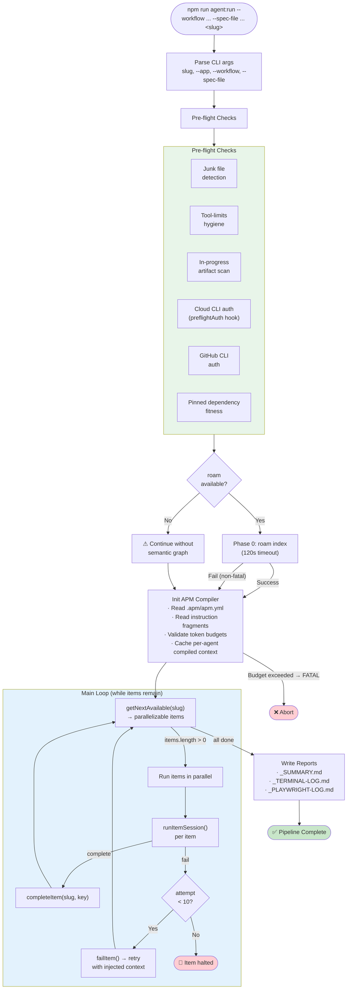
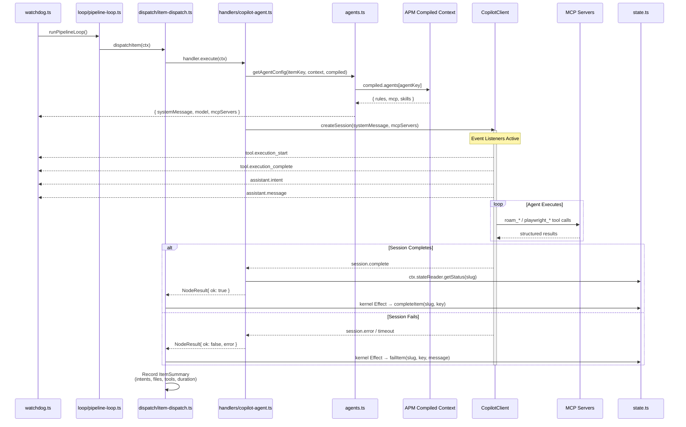
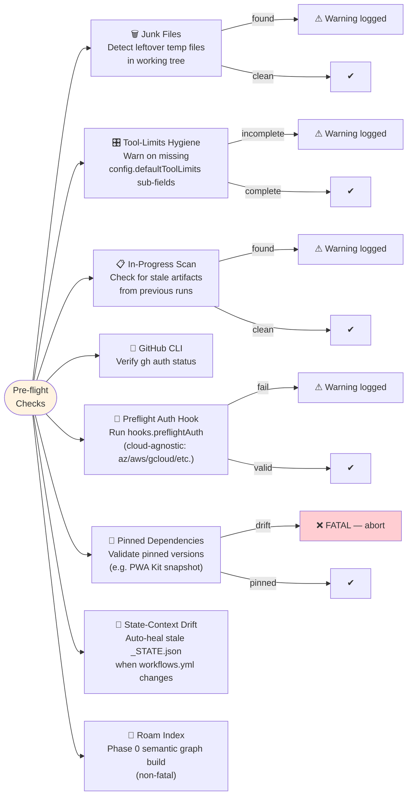
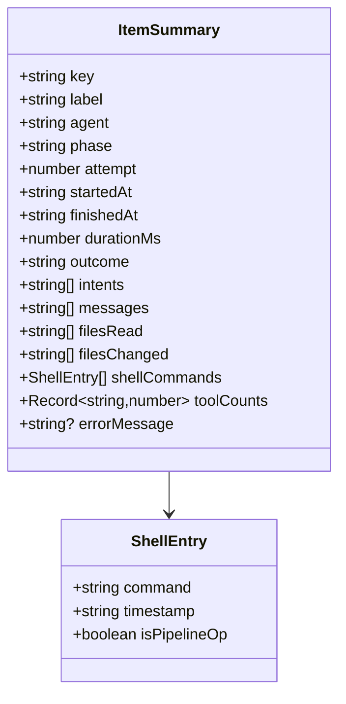

# Orchestrator — watchdog.ts & Pipeline Layers

> The deterministic headless loop that drives the entire pipeline.
> Thin entry: `tools/autonomous-factory/src/entry/watchdog.ts`
> Composition root: `tools/autonomous-factory/src/entry/main.ts`
> Bootstrap (preflight + APM compile + config): `tools/autonomous-factory/src/entry/bootstrap.ts`
> Pipeline Kernel (Command/Effect, sole state owner): `tools/autonomous-factory/src/kernel/`
> Pure domain (DAG math, transitions, scheduling): `tools/autonomous-factory/src/domain/`
> Ports / adapters: `tools/autonomous-factory/src/ports/` · `tools/autonomous-factory/src/adapters/`
> Reactive DAG loop + dispatch: `tools/autonomous-factory/src/loop/` · `tools/autonomous-factory/src/loop/dispatch/`
> Handler plugins: `tools/autonomous-factory/src/handlers/` (copilot-agent, local-exec, github-ci-poll, approval, triage-handler)
> Handler support helpers: `tools/autonomous-factory/src/handlers/support/` (agent-context, agent-limits, agent-post-session)
> Harness: `tools/autonomous-factory/src/harness/` (RBAC, circuit breaker, tool wiring)
> Supporting modules: `preflight.ts`, `reporting/index.ts`, `auto-skip.ts`, `hooks.ts`, `archive.ts`
> Hub: [AGENTIC-WORKFLOW.md](../../.github/AGENTIC-WORKFLOW.md)

> **Note (2026-04):** The orchestrator has been refactored into a hexagonal / Command-Sourced Kernel architecture. `watchdog.ts` is now a thin entry that delegates to `main.ts` (composition root), which wires ports/adapters, the kernel, and the reactive loop. The legacy `session-runner.ts` monolith has been replaced by `loop/pipeline-loop.ts` + `dispatch/` + `handlers/`. Layering is enforced by `npm run arch:check`.

---

## Main Loop Flowchart



---

## Session Lifecycle



---

## Failure Recovery State Machine

```mermaid
stateDiagram-v2
    [*] --> Running: dispatched by\nloop/pipeline-loop.ts

    Running --> Completed: session completes
    Running --> Failed: session error/timeout

    Failed --> RetryPending: attempt < 10
    Failed --> ItemHalted: attempt = 10

    RetryPending --> Running: next loop iteration\n(injected failure context)

    state PostDeployCheck <<choice>>
    Completed --> PostDeployCheck: post-deploy item?
    PostDeployCheck --> Done: tests pass
    PostDeployCheck --> TriageFailure: tests fail

    state PollCICheck <<choice>>
    Running --> PollCICheck: poll-app-ci /
poll-infra-plan item?
    PollCICheck --> PollCISuccess: all workflows pass
    PollCICheck --> PollCITriage: CI failure or cancelled

    PollCISuccess --> Done
    PollCITriage --> TriageFailure: deterministic triage\n(no agent session)

    TriageFailure --> BackendReroute: fault: backend\nor backend+infra
    TriageFailure --> FrontendReroute: fault: frontend\nor frontend+infra
    TriageFailure --> SchemaReroute: fault: schema
    TriageFailure --> DeployStaleReroute: fault: deployment-stale
    TriageFailure --> EnvPause: fault: environment\nor cancelled/timeout

    state CycleCheck <<choice>>
    BackendReroute --> CycleCheck
    FrontendReroute --> CycleCheck
    SchemaReroute --> CycleCheck
    DeployStaleReroute --> CycleCheck
    CycleCheck --> Redevelopment: cycle < 5
    CycleCheck --> PipelineHalted: cycle = 5

    EnvPause --> RetryPending: retry poll item only

    Redevelopment --> ReIndex: roam index (re-index)
    ReIndex --> Running: resetForDev()\n→ dev items re-enter loop

    state RevertCheck <<choice>>
    RetryPending --> RevertCheck: dev item retry?
    RevertCheck --> CleanSlate: attempts ≥ 3\n(in-memory or persisted)
    RevertCheck --> Running: attempts < 3

    CleanSlate --> Running: inject revert warning\n+ circuit breaker bypass\n(agent-branch.sh revert)

    Done --> [*]
    ItemHalted --> [*]
    PipelineHalted --> [*]
```

---

## Session Timeout Configuration

> Timeouts are declared per-node via `timeout_minutes` in `.apm/workflows.yml`. These are the values for the sample-app pipeline.

| Item Type | Timeout | Rationale |
|-----------|---------|-----------|
| **Infra dev items** (schema-dev, infra-architect) | 20 min | Complex implementation, Terraform planning |
| **App dev items** (backend-dev, frontend-dev) | 20 min | Complex implementation, multi-file changes |
| **Test items** (backend-unit-test, frontend-unit-test) | 10 min | Scoped to test writing, fewer files |
| **Infra push/poll** (push-infra, poll-infra-plan) | 15 min | Deterministic handler bypasses (no LLM). `poll-infra-plan` captures CI failure logs via `gh run view --log-failed \| tail -n 250` and routes directly to `triage.ts` for `resetForDev` — no agent session fallback |
| **Draft PR** (create-draft-pr) | 15 min | LLM agent session — creates Draft PR (requires agentic reasoning, not a shell bypass) |
| **Approval gate** (await-infra-approval) | ∞ | Human gate — pipeline pauses until `/dagent approve-infra` |
| **Infra handoff** (infra-handoff) | 20 min | Capture Terraform outputs, write infra-interfaces.md |
| **App deploy items** (push-app, poll-app-ci) | 15 min | Deterministic handler bypasses (no LLM). `poll-app-ci` captures CI failure logs and routes to triage |
| **Post-deploy items** (integration-test, live-ui) | 20 min | Run against live endpoints, may need retries. 60-second propagation delay before first attempt |
| **Finalize items** (code-cleanup, docs-archived, doc-architect) | 20 min | Cleanup, documentation, and architecture assessment |
| **Script handlers** (publish-pr) | 15 min | Deterministic PR promotion (no LLM) |

---

## Pre-flight Checks Detail



> Most pre-flight checks are **non-fatal** — failures are logged as warnings and the pipeline continues. `checkPinnedDependencies` is the exception: a pinned-version drift aborts the run so agents cannot silently build against an upgraded framework. APIM-specific route coverage is no longer a built-in check; apps that need endpoint validation wire it into `.apm/hooks/preflight-auth.sh` (or an analogous hook) and the preflight dispatcher runs it.

---

## Reporting Outputs

| Report | File | Content |
|--------|------|---------|
| **Pipeline Summary** | `_SUMMARY.md` | Phase-grouped results, per-step metrics, tool counts, intents, duration |
| **Terminal Log** | `_TERMINAL-LOG.md` | Chronological events: shell commands, file ops, intents with timestamps |
| **Playwright Log** | `_PLAYWRIGHT-LOG.md` | Structured Playwright tool calls with args and results (live-ui phase only) |

All reports saved under `.dagent/<slug>/` and stay tracked in Git for PR review and retro analysis.

### Cross-Session Summary Merging

When the orchestrator resumes a feature (e.g., after an approval gate or crash), it must include telemetry from the prior session. The merge strategy is **boot-time parse, unconditional add**:

1. **Boot**: `watchdog.ts` calls `parsePreviousSummary()` once against the existing `_SUMMARY.md`, extracting step count, duration, tokens, cost, and files changed into a `baseTelemetry` object stored on `PipelineRunState`.
2. **Every flush**: `writePipelineSummary()` and `writeTerminalLog()` receive `baseTelemetry` as a parameter and unconditionally add it to the current session’s totals: `mergedSteps = currentSteps + baseTelemetry.steps`.
3. **Round-trip safe**: The next boot parses the merged totals, so telemetry snowballs correctly across any number of sessions.

This replaces an earlier `shouldMerge` guard that compared step counts between the file and memory — that approach failed when Wave 2 reached the same step count as Wave 1, dropping prior history.

---

## Key Data Structures



---

## Key Functions Reference

| Function | Module | Purpose | Called By |
|----------|--------|---------|----------|
| `main()` | watchdog.ts | Thin entry — parse args, delegate to `runWithKernel()` in `main.ts` | CLI |
| `runWithKernel()` | main.ts | Composition root — wire ports/adapters, kernel, and reactive loop; run the pipeline | `watchdog.ts` |
| `bootstrap()` | bootstrap.ts | Preflight checks, Phase 0 roam index, APM compile, config freeze | `runWithKernel()` |
| `runPipelineLoop()` | loop/pipeline-loop.ts | Reactive DAG driver — drains ready items, dispatches in parallel, advances on completion/fail | `runWithKernel()` |
| `dispatchBatch()` | dispatch/batch-dispatcher.ts | Build `NodeContext` for each ready item and run the chosen handler concurrently | `runPipelineLoop()` |
| `buildNodeContext()` | dispatch/context-builder.ts | Assemble per-item context: config, compiled APM, upstream artifacts, `vcs`, `stateReader` port references | `dispatchBatch()` |
| `dispatchItem()` | dispatch/item-dispatch.ts | Per-item lifecycle — circuit breaker → auto-skip → resolve handler → execute → translate result into kernel Commands | `dispatchBatch()` |
| `translateResult()` | dispatch/result-translator.ts | Map `NodeResult` into kernel Commands (`CompleteItem`, `FailItem`, `ResetForDev`, etc.) | `dispatchItem()` |
| `handleAgent()` | handlers/copilot-agent.ts | Copilot SDK session execution. No direct I/O — uses `ctx.vcs` + `ctx.stateReader`. Delegates context build / limits / post-session enrichment to `handlers/support/` | Handler registry |
| `buildAgentContext()` | handlers/support/agent-context.ts | Collect upstream artifacts and shape the agent prompt context from `NodeContext` | `handleAgent()` |
| `resolveAgentLimits()` | handlers/support/agent-limits.ts | APM cascade → tool limits, harness limits, sandbox config, filtered tool list | `handleAgent()` |
| `enrichPostSessionTelemetry()` | handlers/support/agent-post-session.ts | Post-session git diff + HEAD via `ctx.vcs` for `filesChanged` attribution | `handleAgent()` |
| `handleLocalExec()` | handlers/local-exec.ts | Shell out to local scripts (push, publish, tests, builds). Returns structured `NodeResult` | Handler registry |
| `handleCiPoll()` | handlers/github-ci-poll.ts | Poll GitHub CI status via `poll-ci.sh` | Handler registry |
| `handleTriage()` | handlers/triage-handler.ts | Multi-tier fault classification and redevelopment reroute (renamed from `handlers/triage.ts` on 2026-04-18) | `runPipelineLoop()` |
| `resolveHandler()` / `inferHandler()` | handlers/registry.ts | Look up / infer a handler by name or by node `type` + `script_type` | `dispatchItem()` |
| `shouldSkipRetry()` | session/dag-utils.ts | Circuit breaker — normalizes diagnostic traces via `normalizeDiagnosticTrace()` to detect semantically identical errors across retries | `dispatchItem()` |
| `normalizeDiagnosticTrace()` | session/dag-utils.ts | Strip dynamic metadata (SHAs, timestamps, run IDs) from diagnostic traces | `shouldSkipRetry()` |
| `getAgentDirectoryPrefixes()` | session/dag-utils.ts | Map agent item keys to owned directory prefixes for scoped git-diff attribution | Post-session `filesChanged` fallback |
| `getTimeout()` | session/dag-utils.ts, handlers/copilot-agent.ts | Session timeout by item type (from `timeout_minutes` in `workflows.yml`) | Copilot agent handler |
| `wireToolLogging()` | harness/ | Tool call logging + cognitive circuit breaker (soft inject + hard kill) + pre-timeout wrap-up signal at 80% of session timeout | Copilot agent handler |
| `checkJunkFiles()` / `checkInProgressArtifacts()` / `checkToolLimitsHygiene()` / `checkGitHubLogin()` / `checkPreflightAuth()` / `checkPinnedDependencies()` / `checkStateContextDrift()` / `buildRoamIndex()` / `runPreflightBaseline()` | lifecycle/preflight.ts | Pre-flight guards — all non-fatal except `checkPinnedDependencies` (FATAL on drift). Feature-branch creation is a DAG node (`create-branch`), not a preflight step. | `bootstrap()` |
| `getAutoSkipBaseRef()` / `getGitChangedFiles()` | auto-skip.ts | Git-diff change detection for the auto-skip optimization | `dispatchItem()` |
| `writePipelineSummary()` / `writeTerminalLog()` / `writePlaywrightLog()` / `parsePreviousSummary()` | reporting/index.ts | Generate/merge `_SUMMARY.md`, `_TERMINAL-LOG.md`, `_PLAYWRIGHT-LOG.md` | `runPipelineLoop()` / Copilot agent handler |
| `triageFailure()` | handlers/triage-handler.ts | Multi-tier routing of post-deploy failures to dev items (unfixable → JSON → DOMAIN: → RAG retriever → LLM router) | `runPipelineLoop()` on downstream failure |
| `validateFaultDomain()` | handlers/triage-handler.ts | Defense-in-Depth: detect CI/CD root-cause indicators and augment reset list with deploy items | `triageFailure()` Tier 1 |
| `retrieveTopMatches()` | triage/retriever.ts | Local substring matcher against pre-compiled triage pack signatures (Tier 4) | `triageFailure()`, `validateFaultDomain()` |
| `askLlmRouter()` | triage/llm-router.ts | LLM-based fault domain classification fallback for novel errors; persists to `_NOVEL_TRIAGE.jsonl` (Tier 5) | `triageFailure()` |
| `computeErrorFingerprint()` | triage/error-fingerprint.ts | Stable SHA-256 fingerprint for error dedup across cycles | kernel failure handling |
| `evaluateAutoSkip()` | handlers/support/auto-skip-evaluator.ts | Evaluate `auto_skip_if_no_changes_in` + `force_run_if_changed` from `workflows.yml` | `dispatchItem()` |

---

*← [Engine README](../README.md) · [02 Roam-Code →](02-roam-code.md)*
