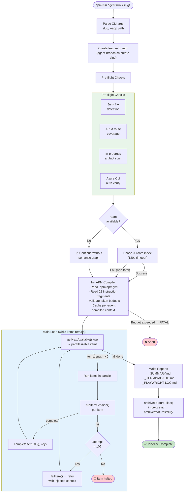
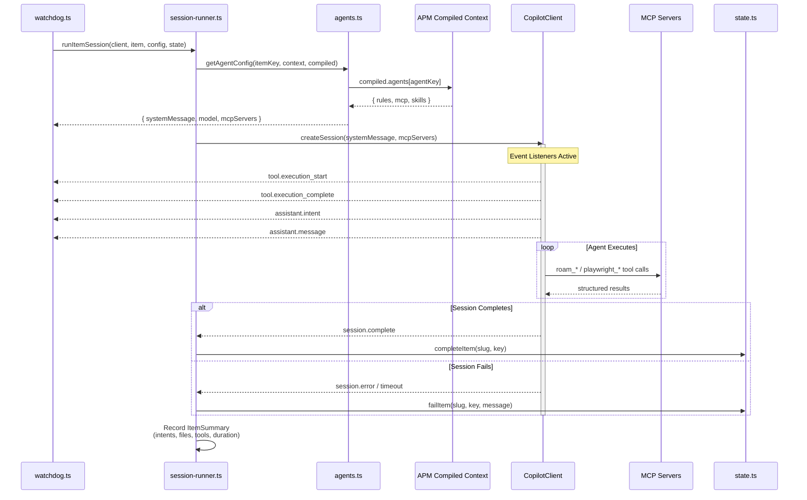
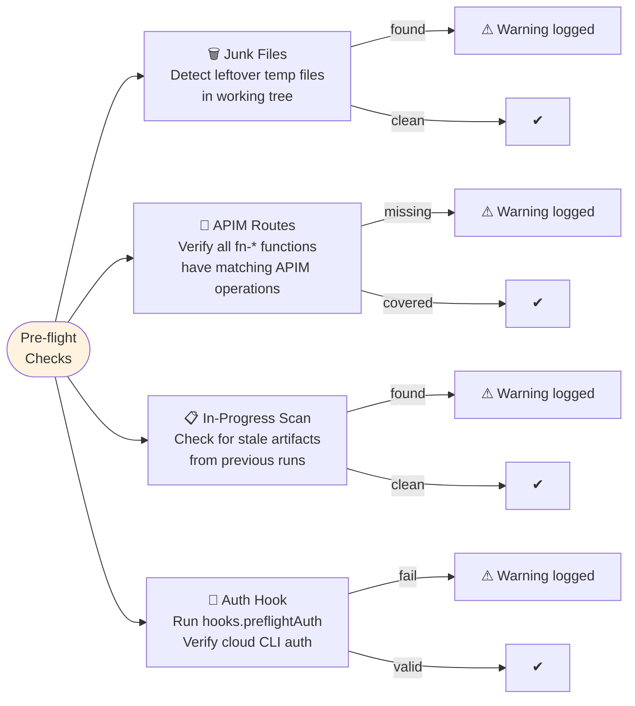
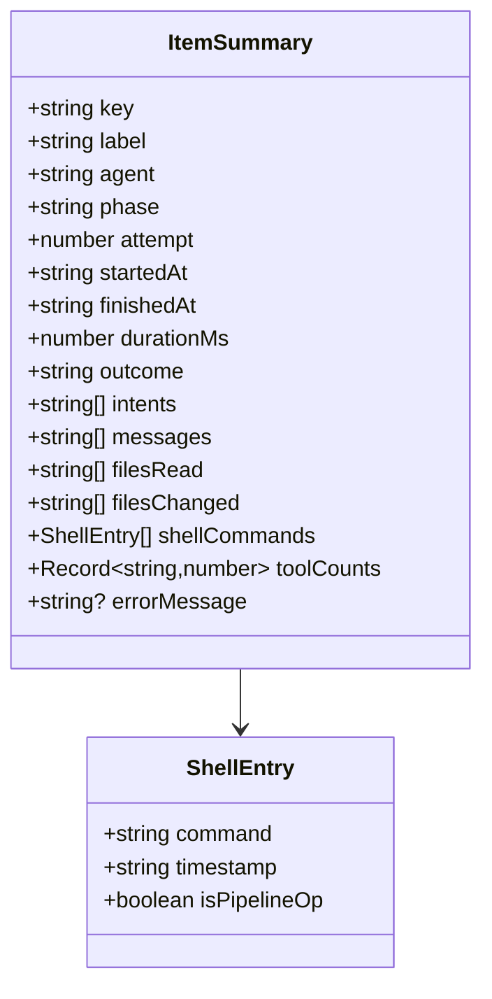

# Orchestrator — watchdog.ts & Session Modules

> The deterministic headless loop that drives the entire pipeline.
> Entry point: `tools/autonomous-factory/src/watchdog.ts` (~360 lines)
> Session runner: `tools/autonomous-factory/src/session-runner.ts` (~1546 lines)
> Supporting modules: `preflight.ts`, `reporting.ts`, `auto-skip.ts`, `context-injection.ts`
> Hub: [AGENTIC-WORKFLOW.md](../../.github/AGENTIC-WORKFLOW.md)

---

## Main Loop Flowchart



---

## Session Lifecycle



---

## Failure Recovery State Machine

```mermaid
stateDiagram-v2
    [*] --> Running: runItemSession()\nin session-runner.ts

    Running --> Completed: session completes
    Running --> Failed: session error/timeout

    Failed --> RetryPending: attempt < 10
    Failed --> ItemHalted: attempt = 10

    RetryPending --> Running: next loop iteration\n(injected failure context)

    state PostDeployCheck <<choice>>
    Completed --> PostDeployCheck: post-deploy item?
    PostDeployCheck --> Done: tests pass
    PostDeployCheck --> TriageFailure: tests fail

    state PollCICheck <<choice>>
    Running --> PollCICheck: poll-app-ci /
poll-infra-plan item?
    PollCICheck --> PollCISuccess: all workflows pass
    PollCICheck --> PollCITriage: CI failure or cancelled

    PollCISuccess --> Done
    PollCITriage --> TriageFailure: deterministic triage\n(no agent session)

    TriageFailure --> BackendReroute: fault: backend\nor backend+infra
    TriageFailure --> FrontendReroute: fault: frontend\nor frontend+infra
    TriageFailure --> SchemaReroute: fault: schema
    TriageFailure --> DeployStaleReroute: fault: deployment-stale
    TriageFailure --> EnvPause: fault: environment\nor cancelled/timeout

    state CycleCheck <<choice>>
    BackendReroute --> CycleCheck
    FrontendReroute --> CycleCheck
    SchemaReroute --> CycleCheck
    DeployStaleReroute --> CycleCheck
    CycleCheck --> Redevelopment: cycle < 5
    CycleCheck --> PipelineHalted: cycle = 5

    EnvPause --> RetryPending: retry poll item only

    Redevelopment --> ReIndex: roam index (re-index)
    ReIndex --> Running: resetForDev()\n→ dev items re-enter loop

    state RevertCheck <<choice>>
    RetryPending --> RevertCheck: dev item retry?
    RevertCheck --> CleanSlate: attempts ≥ 3\n(in-memory or persisted)
    RevertCheck --> Running: attempts < 3

    CleanSlate --> Running: inject revert warning\n+ circuit breaker bypass\n(agent-branch.sh revert)

    Done --> [*]
    ItemHalted --> [*]
    PipelineHalted --> [*]
```

---

## Session Timeout Configuration

| Item Type | Timeout | Rationale |
|-----------|---------|-----------|
| **Infra dev items** (schema-dev, infra-architect) | 20 min | Complex implementation, Terraform planning |
| **App dev items** (backend-dev, frontend-dev) | 20 min | Complex implementation, multi-file changes |
| **Test items** (backend-unit-test, frontend-unit-test) | 10 min | Scoped to test writing, fewer files |
| **Infra push/poll** (push-infra, poll-infra-plan) | 15 min | Deterministic shell bypasses (no LLM). `poll-infra-plan` captures CI failure logs via `gh run view --log-failed \| tail -n 250` and routes directly to `triage.ts` for `resetForDev` — no agent session fallback |
| **Draft PR** (create-draft-pr) | 15 min | LLM agent session — creates Draft PR (requires agentic reasoning, not a shell bypass) |
| **Approval gate** (await-infra-approval) | ∞ | Human gate — pipeline pauses until `/dagent approve-infra` |
| **Infra handoff** (infra-handoff) | 15 min | Capture Terraform outputs, write infra-interfaces.md |
| **App deploy items** (push-app, poll-app-ci) | 15 min | Deterministic shell bypasses (no LLM). `poll-app-ci` captures CI failure logs and routes to triage |
| **Post-deploy items** (integration-test, live-ui) | 15 min | Run against live endpoints, may need retries. 60-second propagation delay before first attempt |
| **Finalize items** (code-cleanup, docs-archived, publish-pr) | 15 min | Scoped cleanup and documentation tasks |

---

## Pre-flight Checks Detail



> All pre-flight checks are **non-fatal** — failures are logged as warnings and the pipeline continues.

---

## Reporting Outputs

| Report | File | Content |
|--------|------|---------|
| **Pipeline Summary** | `_SUMMARY.md` | Phase-grouped results, per-step metrics, tool counts, intents, duration |
| **Terminal Log** | `_TERMINAL-LOG.md` | Chronological events: shell commands, file ops, intents with timestamps |
| **Playwright Log** | `_PLAYWRIGHT-LOG.md` | Structured Playwright tool calls with args and results (live-ui phase only) |

All reports saved to `in-progress/<slug>_*.md` before archiving to `archive/features/<slug>/`.

### Cross-Session Summary Merging

When the orchestrator resumes a feature (e.g., after an approval gate or crash), it must include telemetry from the prior session. The merge strategy is **boot-time parse, unconditional add**:

1. **Boot**: `watchdog.ts` calls `parsePreviousSummary()` once against the existing `_SUMMARY.md`, extracting step count, duration, tokens, cost, and files changed into a `baseTelemetry` object stored on `PipelineRunState`.
2. **Every flush**: `writePipelineSummary()` and `writeTerminalLog()` receive `baseTelemetry` as a parameter and unconditionally add it to the current session’s totals: `mergedSteps = currentSteps + baseTelemetry.steps`.
3. **Round-trip safe**: The next boot parses the merged totals, so telemetry snowballs correctly across any number of sessions.

This replaces an earlier `shouldMerge` guard that compared step counts between the file and memory — that approach failed when Wave 2 reached the same step count as Wave 1, dropping prior history.

---

## Key Data Structures



---

## Key Functions Reference

| Function | Module | Purpose | Called By |
|----------|--------|---------|----------|
| `main()` | watchdog.ts | Entry point — init, pre-flight, Phase 0, main loop | CLI |
| `archiveFeatureFiles()` | watchdog.ts | Move `in-progress/` → `archive/features/slug/` | After publish-pr |
| `commitAndPushState()` | watchdog.ts | Commit state files + conditional push (push guard: skips push if unpushed code files exist outside `in-progress/` or `archive/`) | Main loop |
| `runItemSession()` | session-runner.ts | Execute one pipeline item (auto-skip, bypass, or SDK session) | Main loop |
| `shouldSkipRetry()` | session-runner.ts | Circuit breaker — normalizes diagnostic traces via `normalizeDiagnosticTrace()` before comparing. Strips git SHAs, timestamps, run IDs, and line numbers to detect semantically identical errors across retries | `runItemSession()` |
| `normalizeDiagnosticTrace()` | session-runner.ts | Strip dynamic metadata (SHAs, timestamps, run IDs) from diagnostic traces for semantic circuit breaker comparison | `shouldSkipRetry()` |
| `getAgentDirectoryPrefixes()` | session-runner.ts | Map agent item keys to owned directory prefixes for scoped git-diff attribution (prevents cross-agent pollution in parallel runs) | Post-session `filesChanged` fallback |
| `handleFailureReroute()` | session-runner.ts | Unified post-deploy failure triage and redevelopment reroute | `runItemSession()` |
| `runValidateApp()` | session-runner.ts | Post-poll-app-ci self-mutating validation — delegates to `hooks.validateApp` command; exit 1 → `deployment-stale` reroute | `runPollCi()` |
| `runValidateInfra()` | session-runner.ts | Post-infra-handoff self-mutating validation — delegates to `hooks.validateInfra` command; exit 1 → `infra` fault domain reroute | `runAgentSession()` |
| `getTimeout()` | session-runner.ts | Session timeout by item type | `runAgentSession()` |
| `checkJunkFiles()` | preflight.ts | Detect leftover temp files in working tree | `main()` |
| `checkApimRoutes()` | preflight.ts | Verify fn-* functions have matching APIM operations | `main()` |
| `checkInProgressArtifacts()` | preflight.ts | Check for stale artifacts from previous runs | `main()` |
| `checkPreflightAuth()` | preflight.ts | Run configured `hooks.preflightAuth` command before pipeline start | `main()` |
| `buildRoamIndex()` | preflight.ts | Phase 0 semantic graph build | `main()` |
| `getAutoSkipBaseRef()` | auto-skip.ts | Git ref for change detection (auto-skip optimization) | `tryAutoSkip()` |
| `getGitChangedFiles()` | auto-skip.ts | Files changed since a git ref via `git diff --name-only` | Auto-skip |
| `buildRetryContext()` | context-injection.ts | Prompt augmentation for retry attempts | `runAgentSession()` |
| `buildDownstreamFailureContext()` | context-injection.ts | Inject post-deploy errors into dev agent prompts | `runAgentSession()` |
| `buildRevertWarning()` | context-injection.ts | Clean-slate revert warning for stuck dev agents | `runAgentSession()` |
| `computeEffectiveDevAttempts()` | context-injection.ts | Unified attempt counter resilient to restarts | `runAgentSession()` |
| `writeChangeManifest()` | context-injection.ts | Write `_CHANGES.json` for docs-archived | `runAgentSession()` |
| `writePipelineSummary()` | reporting.ts | Generate `_SUMMARY.md` (merges `baseTelemetry` from prior sessions) | `flushReports()` |
| `writeTerminalLog()` | reporting.ts | Generate `_TERMINAL-LOG.md` (merges `baseTelemetry` from prior sessions) | `flushReports()` |
| `writePlaywrightLog()` | reporting.ts | Generate `_PLAYWRIGHT-LOG.md` | `runAgentSession()` |
| `parsePreviousSummary()` | reporting.ts | Parse existing `_SUMMARY.md` into `PreviousSummaryTotals` (boot-time only) | `main()` in watchdog.ts |
| `wireToolLogging()` | session-runner.ts | Tool call logging + cognitive circuit breaker (soft inject + hard kill) + pre-timeout wrap-up signal at 80% of session timeout | `runAgentSession()` |
| `triageFailure()` | triage.ts | Multi-tier routing of post-deploy failures to dev items (unfixable → JSON → DOMAIN: → RAG retriever → LLM router). Tier 1 runs `validateFaultDomain()` to detect CI/CD root causes and augment reset keys with deploy items | `handleFailureReroute()` |
| `validateFaultDomain()` | triage.ts | Defense-in-Depth: detect CI/CD root-cause indicators in agent-classified errors and augment reset list with deploy items (keeps original domain so dev agent can fix `.github/` files). Uses `retrieveTopMatches()` for cicd KB matching + hardcoded `CICD_ROOT_CAUSE_INDICATORS` | `triageFailure()` Tier 1 |
| `retrieveTopMatches()` | triage/retriever.ts | Local substring matcher against pre-compiled triage pack signatures. Normalizes trace via `normalizeDiagnosticTrace()`, returns top 3 hits ranked by snippet length (Tier 4) | `triageFailure()`, `validateFaultDomain()` |
| `askLlmRouter()` | triage/llm-router.ts | LLM-based fault domain classification fallback for novel errors. Persists novel classifications to `_NOVEL_TRIAGE.jsonl` (Data Flywheel) (Tier 5) | `triageFailure()` |

---

*← [00 Overview](00-overview.md) · [02 Roam-Code →](02-roam-code.md)*
