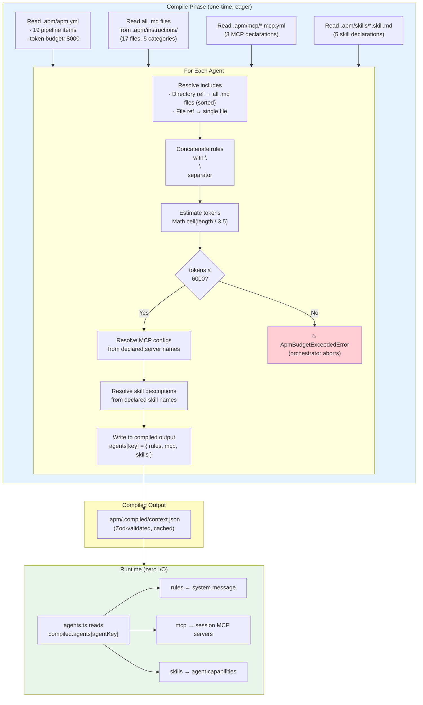
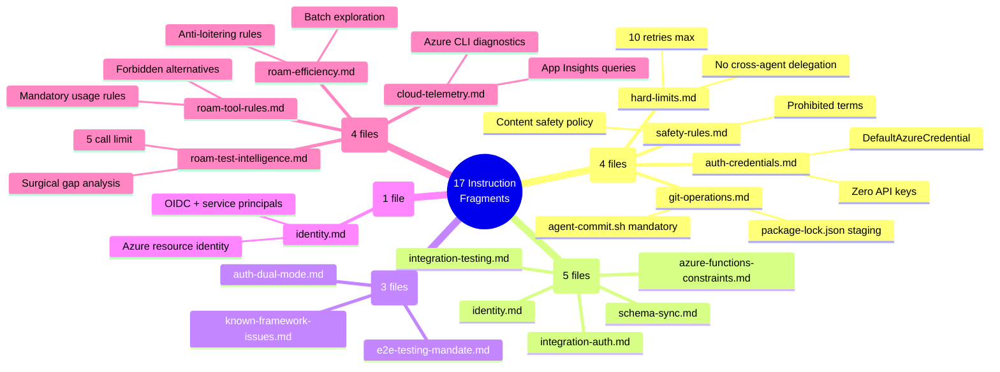
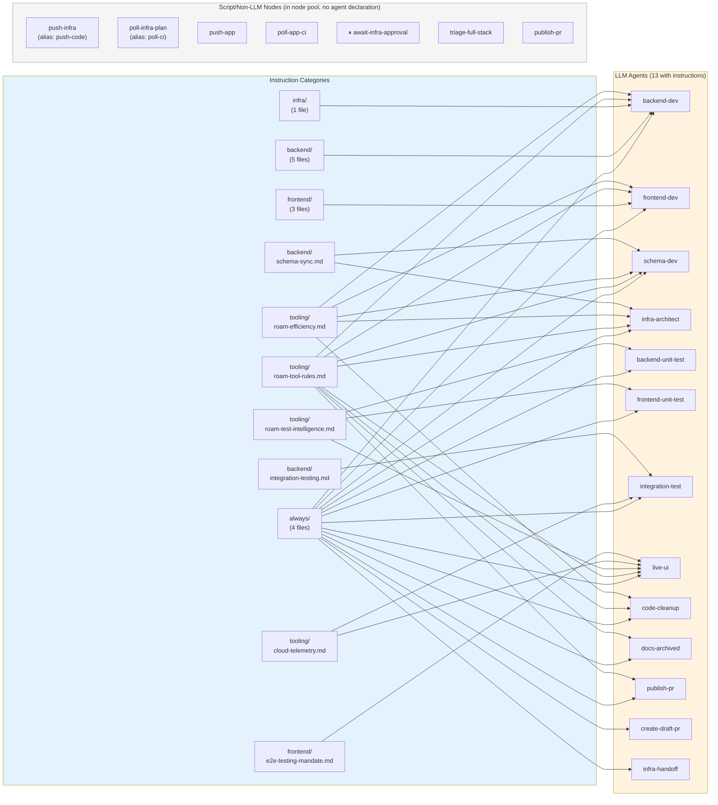
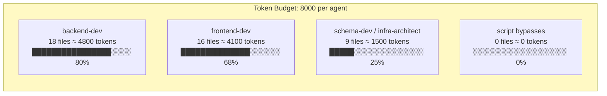
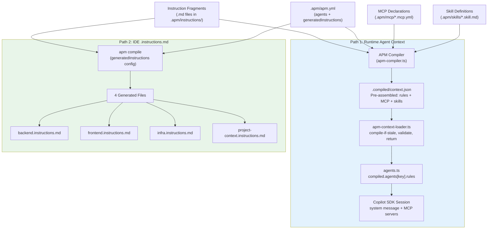
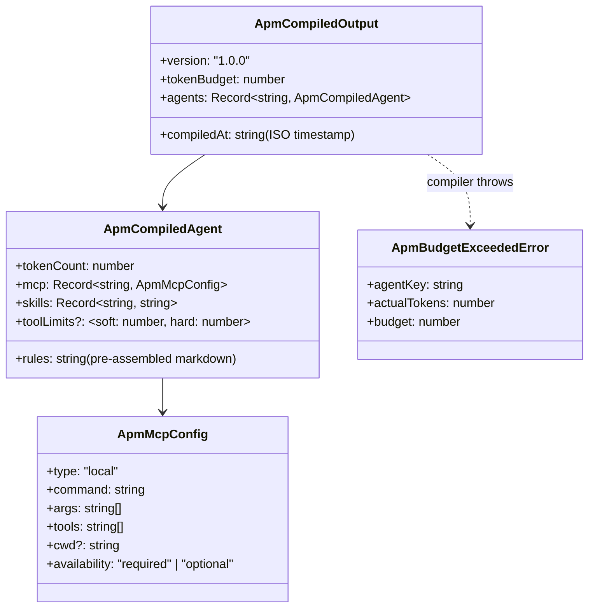

# APM Context System — Dynamic Rule Engine

> Loads coding rule fragments at startup, assembles per-agent prompts, validates token budgets eagerly.
> Source: `tools/autonomous-factory/src/apm-compiler.ts` + `apm-context-loader.ts` + `apm-types.ts`
> Hub: [AGENTIC-WORKFLOW.md](../../.github/AGENTIC-WORKFLOW.md)

---

## How It Works (End-to-End)



---

## APM Manifest (`apm.yml`)

The APM manifest is the **single source of truth** for context delivery. It lives at `<appRoot>/.apm/apm.yml` and declares:

| Field | Purpose |
|-------|---------|
| `name` | App identifier |
| `version` | Semantic version for the context contract |
| `tokenBudget` | Max estimated tokens per agent's assembled instructions |
| `agents` | Maps each LLM agent key to its instruction includes, MCP servers, skills, and tool limits |
| `nodes` | Reusable node pool — all node types (agent, script, barrier, triage, approval). Replaces `_templates` |
| `generatedInstructions` | IDE `.instructions.md` files to generate via `apm compile` |
| `config` | App runtime config (environment, hooks, directories, kernel tuning) |

```yaml
# Example from sample-app (abbreviated)
name: sample-app
version: 1.0.0
tokenBudget: 8000

agents:
  backend-dev:
    instructions: [always, backend, tooling/roam-tool-rules.md, tooling/roam-efficiency.md]
    promptFile: backend-dev.agent.md
    mcp: [roam-code]
    skills: [test-backend-unit]
    toolLimits: { soft: 80, hard: 110 }
    security:
      allowedWritePaths: ["^backend/", "^packages/schemas/"]
      blockedCommandRegexes: ["(^|\\s)(az|aws|terraform)($|\\s)"]
    tools:
      core: [read_file, write_file, bash, shell, grep_search, list_dir, semantic_search]
      mcp: { roam-code: "*" }
  live-ui:
    instructions: [always, frontend/e2e-testing-mandate.md, ...]
    promptFile: frontend-unit-test.agent.md
    mcp: [roam-code, playwright]
    skills: []
    toolLimits: { soft: 100, hard: 130 }
  # ... 11 more LLM agents

nodes:
  backend-dev:
    type: agent
    category: dev
    agent: "@backend-dev"
    timeout_minutes: 20
    commit_scope: backend
    diff_attribution_dirs: [backend, packages, infra, .github/]
    circuit_breaker: { allows_revert_bypass: true, allows_timeout_salvage: true }
  push-app:
    type: script
    category: deploy
    script_type: local-exec
    command: "bash ${REPO_ROOT}/tools/autonomous-factory/hooks/push-and-sentinel.sh"
    captures_head_sha: true
    circuit_breaker: { halt_on_identical: true }
  triage-node:
    type: triage
    category: finalize
    timeout_minutes: 5
  # ... 17 more nodes
    mcp: []
    skills: []
    toolLimits: { soft: 10, hard: 15 }  # deterministic script agent
  # ... 13 more agents
```

---

## Directory Structure

```
apps/<app>/.apm/
  apm.yml                     # Root manifest (context SSOT)
  instructions/               # Rule fragments (varies per app)
    always/                   # Injected into ALL agents
    backend/                  # Backend-specific rules
    frontend/                 # Frontend-specific rules
    infra/                    # Terraform/Azure rules
    tooling/                  # Roam, telemetry, test intelligence
  mcp/                        # MCP server declarations
    roam-code.mcp.yml
    playwright.mcp.yml
  skills/                     # Capability definitions
    test-backend-unit.skill.md
    test-frontend-unit.skill.md
    test-integration.skill.md
    test-schema-validation.skill.md
    build-frontend.skill.md
  .compiled/                  # Generated output (gitignored)
    context.json
```

---

## Instruction Fragment Inventory

> The example below reflects the **sample-app** (17 fragments across 5 categories). Each app has its own instruction set — the commerce-storefront has different fragments tailored to PWA Kit development.



---

## Agent → Instruction Mapping



> Script, poll, approval, triage, and barrier nodes live in the **node pool** (`apm.yml → nodes:`). They have no `agents:` declaration and consume zero LLM tokens.

### Detailed Include Map

> Reflects the **sample-app** `apm.yml`. Fragment counts: `always/` = 4, `backend/` = 5, `frontend/` = 3, `infra/` = 1, `tooling/` = 4 individual files.

| Agent | Includes | Files Loaded |
|-------|----------|-------------|
| `backend-dev` | `always`, `backend`, `tooling/roam-tool-rules.md`, `tooling/roam-efficiency.md` | 4 + 5 + 1 + 1 = **11** |
| `frontend-dev` | `always`, `frontend`, `tooling/roam-tool-rules.md`, `tooling/roam-efficiency.md` | 4 + 3 + 1 + 1 = **9** |
| `schema-dev` | `always`, `backend/schema-sync.md`, `tooling/roam-tool-rules.md`, `tooling/roam-efficiency.md` | 4 + 1 + 1 + 1 = **7** |
| `infra-architect` | `always`, `infra`, `backend/schema-sync.md`, `tooling/roam-tool-rules.md` | 4 + 1 + 1 + 1 = **7** |
| `backend-unit-test` | `always`, `tooling/roam-test-intelligence.md` | 4 + 1 = **5** |
| `frontend-unit-test` | `always`, `frontend/known-framework-issues.md`, `tooling/roam-test-intelligence.md` | 4 + 1 + 1 = **6** |
| `integration-test` | `always`, `backend/integration-auth.md`, `tooling/roam-test-intelligence.md` | 4 + 1 + 1 = **6** |
| `live-ui` | `always`, `frontend/e2e-testing-mandate.md`, `frontend/known-framework-issues.md`, `tooling/roam-tool-rules.md`, `tooling/roam-test-intelligence.md`, `tooling/cloud-telemetry.md` | 4 + 1 + 1 + 1 + 1 + 1 = **9** |
| `code-cleanup` | `always`, `tooling/roam-tool-rules.md`, `tooling/roam-efficiency.md` | 4 + 1 + 1 = **6** |
| `doc-architect` | `always`, `tooling/roam-tool-rules.md`, `tooling/roam-efficiency.md` | 4 + 1 + 1 = **6** |
| `docs-archived` | `always`, `tooling/roam-tool-rules.md` | 4 + 1 = **5** |
| `infra-handoff` | `always`, `tooling/roam-tool-rules.md` | 4 + 1 = **5** |
| `publish-pr` | `always` | **4** |
| `create-draft-pr` | `always` | **4** |
| Non-LLM nodes | — (no agent declaration) | **0** |

---

## Token Budget Management



| Agent | Est. Tokens | Budget Used | Headroom |
|-------|------------|-------------|----------|
| `backend-dev` | ~4,800 | 60% | ~3,200 tokens |
| `frontend-dev` | ~4,100 | 51% | ~3,900 tokens |
| `schema-dev` / `infra-architect` | ~1,500 | 19% | ~6,500 tokens |
| `test agents` | ~800–1,200 | 10–15% | ~6,800+ tokens |
| `create-draft-pr` / `infra-handoff` | ~800 | 10% | ~7,200 tokens |
| Script bypasses (push/poll) | 0 | 0% | N/A (no LLM session) |

**Estimation formula:** `Math.ceil(text.length / 3.5)` — conservative estimate matching Claude's tokenization pattern.

**Enforcement — dual layer:**
1. **Compile time** (primary): `apm-compiler.ts` validates during compilation. If ANY agent exceeds the token budget, `ApmBudgetExceededError` is thrown and the pipeline aborts before any agent session starts.
2. **Load time** (defense-in-depth): `apm-context-loader.ts` re-validates all `tokenCount` values against `tokenBudget` when loading cached output.

---

## MCP & Skill Declarations

### MCP Servers

Declared in `.apm/mcp/*.mcp.yml`. Each file specifies:

| Field | Purpose |
|-------|---------|
| `command` | Executable (may contain `{repoRoot}`, `{appRoot}` placeholders) |
| `args` | Command-line arguments |
| `tools` | Tool whitelist (`["*"]` = all) |
| `availability` | `"required"` (fail if missing) or `"optional"` (degrade gracefully) |

| MCP Server | Used By | Availability |
|------------|---------|--------------|
| `roam-code` | 9 agents | `optional` — agents degrade to basic tools if roam unavailable |
| `playwright` | `live-ui` only | `required` — session fails if playwright-mcp not installed |

### Skills

Declared in `.apm/skills/*.skill.md` with YAML frontmatter:

```yaml
---
name: test-backend-unit
command: "cd {appRoot}/backend && npx jest --verbose"
description: "Run Jest backend unit tests..."
---
```

| Skill | Used By |
|-------|---------|
| `test-backend-unit` | `backend-dev`, `backend-unit-test` |
| `test-frontend-unit` | `frontend-dev`, `frontend-unit-test` |
| `test-schema-validation` | `backend-dev`, `schema-dev` |
| `test-integration` | `integration-test` |
| `build-frontend` | `frontend-dev` |

---

## Dual Output Paths



Both paths use **identical include resolution logic**:
- Directory refs (e.g., `"always"`) → all `.md` files in that dir, alphabetically sorted
- File refs (e.g., `"tooling/roam-tool-rules.md"`) → single specific file
- Concatenated with `\n\n` separator

### Generated IDE Files

| Generated File | Includes | Used For |
|---------------|----------|----------|
| `backend.instructions.md` | `always` + `backend` | VS Code Copilot inline suggestions for backend |
| `frontend.instructions.md` | `always` + `frontend` | VS Code Copilot inline suggestions for frontend |
| `infra.instructions.md` | `always` + `infra` | VS Code Copilot inline suggestions for Terraform |
| `project-context.instructions.md` | `always` + `backend` + `frontend` + `infra` | Full project context for Copilot |

All wrapped in `<!-- AUTO-GENERATED -->` headers. Regenerate after editing instructions: `apm compile`.

---

## Compiled Output Contract

**File:** `.apm/.compiled/context.json` (gitignored, regenerated on demand)



All schemas validated by Zod (`ApmCompiledOutputSchema` in `apm-types.ts`).

---

## Key Design Decisions

| Decision | Rationale |
|----------|-----------|
| **Eager compile + validate** (all rules at startup) | Fail fast on budget violations before any agent runs |
| **Cached compiled output** (`.compiled/context.json`) | Zero disk I/O during agent sessions — load once, read from memory |
| **Same resolution for both paths** | Eliminates drift between agent prompts and IDE `.instructions.md` |
| **Global token budget** (8,000) | Prevents prompt bloat that degrades agent reasoning quality |
| **Alphabetical sort for directories** | Deterministic include order across environments |
| **MCP `availability` field** | `optional` = graceful degradation (roam), `required` = fail fast (playwright) |
| **Skill declarations separate from instructions** | Skills are capabilities (commands + descriptions), not governance rules |
| **App-agnostic manifest** | Any app provides `.apm/apm.yml` — orchestrator doesn't know language or framework |
| **Lifecycle hooks** | `config.hooks` delegates cloud-specific operations (auth, smoke checks, deployment verification) to app-provided scripts in `.apm/hooks/` — engine stays stack-agnostic |
| **Per-agent tool limits** | `toolLimits: { soft, hard }` — optional per-agent circuit breaker overrides. Resolution: per-agent → `config.defaultToolLimits` (currently 60/80) → code fallback (30/40) |
| **3-layer architecture** | Node Pool (what), Agent Configs (brain), Workflow DAGs (how connected) — eliminates config duplication |
| **Type-agnostic node pool** | All node types (agent, script, barrier, triage, approval) are equal pool citizens. Only `type: agent` needs an `agents:` declaration |
| **Workflow-level `default_on_failure`** | Common triage routes declared once per workflow, merged into per-node `on_failure`. Scales O(1) instead of O(nodes) |
| **`_node` directive** | Explicit catalog reference for aliased nodes (e.g. `push-infra: { _node: push-code }`). Replaces implicit `_template` |

---

## Schema Reference — `apm.yml`

The manifest has 4 top-level sections: metadata, `agents`, `nodes`, and `config`.

### Top-Level Fields

| Field | Type | Required | Description |
|---|---|---|---|
| `name` | string | yes | App identifier (e.g. `sample-app`, `commerce-storefront`) |
| `version` | string | yes | Semantic version for the context contract |
| `description` | string | no | Human-readable app description |
| `tokenBudget` | number | yes | Max estimated tokens per agent's assembled instructions. Enforced at compile time |
| `agents` | map | yes | LLM agent configurations (keyed by agent name) |
| `nodes` | map | no | Reusable node pool — all node types (agent, script, barrier, triage, approval) |
| `generatedInstructions` | map | no | IDE `.instructions.md` generation config |
| `config` | object | no | App runtime config (environment, hooks, directories, kernel tuning) |

### `agents.<key>` — LLM Agent Declaration

Only nodes with `type: agent` need an entry here. This is the "brain" config — instructions, MCP, skills.

| Field | Type | Required | Description |
|---|---|---|---|
| `instructions` | string[] | yes | Include list — directory refs (all `.md` files sorted) or file refs (single `.md`). Paths relative to `.apm/instructions/` |
| `promptFile` | string | yes | Handlebars template file relative to `.apm/agents/` |
| `mcp` | string[] | yes | MCP server names to attach (references `.apm/mcp/<name>.mcp.yml`). `[]` for none |
| `skills` | string[] | no | Skill names to attach (references `.apm/skills/<name>.skill.md`). Default: `[]` |
| `toolLimits` | object | no | Per-agent cognitive circuit breaker. Overrides `config.defaultToolLimits` |
| `toolLimits.soft` | number | no | Tool call count that triggers a structured warning |
| `toolLimits.hard` | number | no | Tool call count that force-disconnects the session |
| `toolLimits.writeThreshold` | number | no | Writes to the same file before injecting a thrashing warning |
| `toolLimits.preTimeoutPercent` | number | no | Fraction of session timeout (0–1) at which to inject a wrap-up directive |
| `tools` | object | no | Tool allow-lists for Zero-Trust sandboxing |
| `tools.core` | string[] | no | Allowed built-in tools (e.g. `read_file`, `shell`, `write_file`). Omit for allow-all |
| `tools.mcp` | map | no | Per-MCP-server tool allow-lists. Value: string array or `"*"` for wildcard |
| `security` | object | no | Config-driven path sandboxing |
| `security.allowedWritePaths` | string[] | no | Regex strings for allowed file write paths (app-relative). Empty array = read-only |
| `security.blockedCommandRegexes` | string[] | no | Regex strings matching shell commands to block |

### `nodes.<key>` — Node Pool Entry

Defines WHAT a node does (execution config). Workflows define HOW nodes connect (graph).
All node types are first-class pool citizens — agent, script, barrier, triage, approval.

| Field | Type | Default | Description |
|---|---|---|---|
| `type` | string | `"agent"` | Execution type: `agent`, `script`, `approval`, `barrier`, `triage`. Custom types allowed |
| `category` | string | **required** | Semantic category: `dev`, `test`, `deploy`, `finalize`. Custom categories allowed |
| `agent` | string | — | Agent key from `agents:` section. Required when `type: agent` (e.g. `"@backend-dev"`) |
| `handler` | string | — | Explicit handler key. If omitted, inferred from `type` + `script_type` |
| `timeout_minutes` | number | `15` | Session/execution timeout in minutes |
| `commit_scope` | string | `"all"` | Commit scope for `agent-commit.sh`. Scopes defined in `config.commitScopes` |
| `script_type` | string | — | For `type: script`: `"local-exec"` (shell command) or `"poll"` (CI polling) |
| `command` | string | — | Shell command. Required when `script_type: local-exec` |
| `ci_workflow_key` | string | — | Key into `config.ciWorkflows` for CI poll filtering (e.g. `"infra"`, `"app"`) |
| `pre` | string | — | Shell command to run BEFORE the handler. Exit non-zero = node fails immediately |
| `post` | string | — | Shell command to run AFTER handler success. Exit non-zero = node fails |
| `diff_attribution_dirs` | string[] | `[]` | Directory keys for scoped git-diff attribution. Empty = all files |
| `auto_skip_if_no_changes_in` | string[] | `[]` | Directory keys to check for git changes; skip if none changed |
| `auto_skip_if_no_deletions` | bool | `false` | Skip if feature has zero file deletions (purely additive) |
| `force_run_if_changed` | string[] | `[]` | Directory keys that force execution even when primary auto-skip dirs unchanged |
| `template_flags` | string[] | `[]` | Handlebars template flags injected as `true` booleans (e.g. `["isPostDeploy"]`) |
| `requires_data_plane_ready` | bool | `false` | Whether `pollReadiness()` must pass before the agent session starts |
| `captures_head_sha` | bool | `false` | Auto-capture git HEAD SHA after post-hook for downstream poll nodes |
| `signals_create_pr` | bool | `false` | Triggers post-pipeline archiving on success (used by publish-pr) |
| `generates_change_manifest` | bool | `false` | Triggers `writeChangeManifest()` before the agent session |
| `salvage_survivor` | bool | — | Node survives graceful degradation (salvageForDraft). Used by docs + publish |
| `injects_infra_rollback` | bool | `false` | Injects `buildPhaseRejectionContext()` during redevelopment cycles |
| `produces` | string[] | `[]` | Data keys this node produces in `handlerOutput` (for validation + tracing) |
| `consumes` | object[] | `[]` | Data keys expected from upstream. Each: `{ key, from: "*", required: true }` |
| `circuit_breaker` | object | — | Per-node retry/failure escalation config (see below) |

#### `circuit_breaker` Fields

| Field | Type | Default | Description |
|---|---|---|---|
| `min_attempts_before_skip` | number | `3` | Minimum attempts before identical-error detector activates |
| `allows_revert_bypass` | bool | — | When CB fires, defer once for `agent-branch.sh revert` opportunity |
| `allows_timeout_salvage` | bool | — | Timeout loop triggers salvageForDraft instead of halting |
| `halt_on_identical` | bool | — | Identical error + identical HEAD → immediate halt on attempt 2+. For deterministic scripts |
| `revert_warning_at` | number | `3` | Attempt count at which revert warning is injected (when `allows_revert_bypass: true`) |

#### Node Type Constraints

These are enforced at compile time by the constraint system:

| Type | Required | Forbidden |
|---|---|---|
| `agent` | `agent` field | — |
| `script` (poll) | `poll_target` (in workflow) | — |
| `script` (local-exec) | `command` | — |
| `barrier` | `depends_on` ≥ 2 entries (in workflow) | `agent`, `command`, `script_type` |
| `triage` | `triage_profile` (in workflow) | `agent`, `command` |
| `approval` | — | — |

### `config` — App Runtime Configuration

| Field | Type | Default | Description |
|---|---|---|---|
| `defaultToolLimits` | object | — | Default cognitive circuit breaker for all agents. Per-agent `toolLimits` override |
| `environment` | map | — | Key-value env dictionary. Values support `${ENV_VAR}` interpolation |
| `directories` | map | **required** | Logical directory names → paths (e.g. `backend: backend`). Used by `auto_skip_if_no_changes_in` |
| `testCommands` | map | — | Named test commands. `{appRoot}` placeholder supported |
| `commitScopes` | map | — | Commit scope → directory paths mapping |
| `ciJobs` | map | — | Logical job names → CI display names |
| `ciWorkflows` | object | — | CI workflow configuration |
| `ciWorkflows.app` | string | — | App deploy workflow names (comma-separated) |
| `ciWorkflows.infra` | string | — | Infra deploy workflow names |
| `ciWorkflows.filePatterns` | string[] | — | Workflow filenames for triage signal matching |
| `ciWorkflows.infraPlanFile` | string | — | Exact workflow filename for `gh run list --workflow` |
| `ciWorkflows.pr_comment_template` | string | — | PR comment template for approval instructions |
| `hooks` | object | — | Lifecycle hook shell commands (scripts in `.apm/hooks/`) |
| `hooks.resolveEnvironment` | string | — | Resolve env vars from infra outputs. Runs first. Prints `KEY=VALUE` to stdout |
| `hooks.validateInfra` | string | — | Validate deployed infrastructure. Exit 0 = pass |
| `hooks.validateApp` | string | — | Validate deployed application. Exit 0 = pass |
| `hooks.preflightAuth` | string | — | Pre-flight auth check. Exit 0 = authenticated |
| `ci_scope_warning` | string | — | Commit scope warning injected when CI/CD files are involved |
| `cycle_limits` | object | — | Pipeline cycle limits |
| `cycle_limits.reroute` | number | `5` | Max triage reroute cycles |
| `cycle_limits.phases` | number | `5` | Max phase-level reset cycles |
| `cycle_limits.scripts` | number | `10` | Max script-only reset cycles per phase |
| `max_same_error_cycles` | number | `3` | Identical error signatures before death spiral → salvage to draft |
| `transient_retry` | object | — | Transient retry policy for CI poll and script handlers |
| `transient_retry.max` | number | `5` | Max retry attempts for transient errors |
| `transient_retry.backoff_ms` | number | `30000` | Backoff delay between retries (ms) |
| `fatal_sdk_errors` | string[] | — | Error substrings that halt the pipeline immediately (no retry) |
| `model_pricing` | object | — | LLM token pricing (USD per million tokens) for cost estimation |
| `model_pricing.inputPerMillion` | number | `15` | Input token cost |
| `model_pricing.outputPerMillion` | number | `75` | Output token cost |
| `model_pricing.cacheReadPerMillion` | number | `1.5` | Cache read cost |
| `model_pricing.cacheWritePerMillion` | number | `3.75` | Cache write cost |
| `redevelopment_categories` | string[] | `["test"]` | Node categories whose failures trigger redevelopment context injection |
| `phase_labels` | map | — | Human-readable labels for phase slugs (e.g. `{ "pre-deploy": "Pre-Deploy" }`) |
| `handler_defaults` | map | — | Type → handler key inference map. Extends built-in defaults |
| `handlers` | map | — | Custom handler declarations with metadata |
| `reindex_categories` | string[] | `["dev", "test"]` | Categories that trigger roam-code re-index after triage reroute |

---

## Schema Reference — `workflows.yml`

Each top-level key (except `_templates` which is deprecated) is a workflow name. Lowercase kebab-case required.

### Workflow Fields

| Field | Type | Required | Description |
|---|---|---|---|
| `description` | string | no | Human-readable description |
| `phases` | string[] | yes | Ordered phase names. Every node's `phase` must appear in this list |
| `nodes` | map | yes | Pipeline nodes keyed by item key |
| `default_on_failure` | object | no | Workflow-level default failure routing (see below) |
| `unfixable_signals` | string[] | no | Error substrings that halt the pipeline immediately for human intervention |
| `triage` | map | no | Triage profiles keyed by profile name |

### `nodes.<key>` — Workflow Node Reference

Workflow nodes are primarily **graph wiring**. Execution config comes from the node pool (`apm.yml → nodes:`).
The compiler merges: pool defaults + workflow overrides (workflow wins).

#### Graph-Only Fields (never inherited from pool)

| Field | Type | Default | Description |
|---|---|---|---|
| `phase` | string | **required** | Phase this node belongs to (must exist in `phases` array) |
| `depends_on` | string[] | `[]` | DAG edges — node keys that must complete before this one runs |
| `on_failure` | object | — | Failure routing config (see below). Only nodes with this field connect to triage |
| `on_failure.triage` | string | — | Key of the triage node that classifies failures |
| `on_failure.routes` | map | `{}` | Domain → target node key. `"$SELF"` = retry, `null` = halt |
| `poll_target` | string | — | For poll nodes — key of the push node whose SHA to look up |
| `triage_profile` | string | — | For triage nodes — profile name from the workflow's `triage` section |
| `post_ci_artifact_to_pr` | string | — | CI artifact name to download and post to the PR (e.g. `"plan-output"`) |

#### Compiler Directives

| Field | Type | Description |
|---|---|---|
| `_node` | string | Explicit reference to a node pool entry by key. For aliased nodes (e.g. `push-infra: { _node: push-code }`) |

#### Override Fields

Any field from the node pool (`nodes.<key>` in `apm.yml`) can be overridden per-workflow-node. Common overrides:

```yaml
nodes:
  poll-infra-plan:
    _node: poll-ci             # Use pool entry "poll-ci"
    phase: infra
    depends_on: [create-draft-pr]
    ci_workflow_key: infra      # Override: poll infra CI instead of app CI
    post_ci_artifact_to_pr: "plan-output"
```

### `default_on_failure` — Workflow-Level Failure Routing

Declares default failure routing inherited by nodes that have `on_failure`. Per-node `on_failure.routes` override/extend defaults. Nodes **without** `on_failure` are unaffected (no implicit opt-in).

| Field | Type | Description |
|---|---|---|
| `triage` | string | Default triage node key. Inherited when per-node `on_failure` omits `triage` |
| `routes` | map | Default domain → target routes. Per-node routes override on key collision |

**Merge semantics:**
```
merged.triage = node.on_failure.triage ?? default_on_failure.triage
merged.routes = { ...default_on_failure.routes, ...node.on_failure.routes }
```

**Example — DRY failure routing:**
```yaml
# Workflow declares shared routes once
default_on_failure:
  triage: triage-full-stack
  routes:
    schemas: schema-dev
    cicd: push-app
    test-code: "$SELF"
    environment: "$SELF"
    blocked: null

nodes:
  # Node only declares unique routes; triage + shared routes inherited
  integration-test:
    phase: post-deploy
    depends_on: [poll-app-ci]
    on_failure:
      routes:
        backend: backend-dev          # unique to this node
        infra: infra-architect        # unique to this node
    # Merged result: triage=triage-full-stack, routes={schemas, cicd, test-code, environment, blocked, backend, infra}

  # Node without on_failure — no triage connection
  code-cleanup:
    phase: finalize
    depends_on: [integration-test]
    # No on_failure → circuit breaker handles failures, no triage routing
```

### `triage.<profile>` — Triage Profile

Triage profiles configure the error classification engine. Referenced by triage nodes via `triage_profile`.

| Field | Type | Default | Description |
|---|---|---|---|
| `packs` | string[] | `[]` | Triage pack names (from `.apm/triage-packs/<name>.json`) for RAG matching |
| `llm_fallback` | bool | `true` | **Deprecated.** Use `classifier` instead. Enable LLM fallback when RAG has no match |
| `classifier` | string | — | Classification strategy: `"rag+llm"` (default), `"rag-only"`, `"llm-only"` |
| `max_reroutes` | number | `5` | Maximum total reroutes before the pipeline halts |
| `routing` | map | **required** | Domain → routing entry. Domain keys are profile-defined (no global enum) |

### `triage.<profile>.routing.<domain>` — Routing Entry

| Field | Type | Description |
|---|---|---|
| `description` | string | Human-readable hint injected into the triage LLM prompt |
| `retries` | number | Max consecutive times this domain can trigger a reroute before escalating |

---

## Handler Inference

When a node doesn't declare an explicit `handler` field, the kernel infers it:

| `type` | `script_type` | Handler | Behavior |
|---|---|---|---|
| `agent` | — | `copilot-agent` | LLM session via `@github/copilot-sdk` |
| `script` | `local-exec` | `local-exec` | Shell command execution |
| `script` | `poll` | `github-ci-poll` | Polls GitHub Actions for CI run status |
| `approval` | — | `approval` | Waits for human ChatOps command |
| `barrier` | — | `barrier` | No-op DAG sync point |
| `triage` | — | `triage` | Error classification via RAG + LLM |

Custom types extend this via `config.handler_defaults` or per-node `handler` fields.

---

*← [02 Roam-Code](02-roam-code.md) · [04 State Machine →](04-state-machine.md)*
