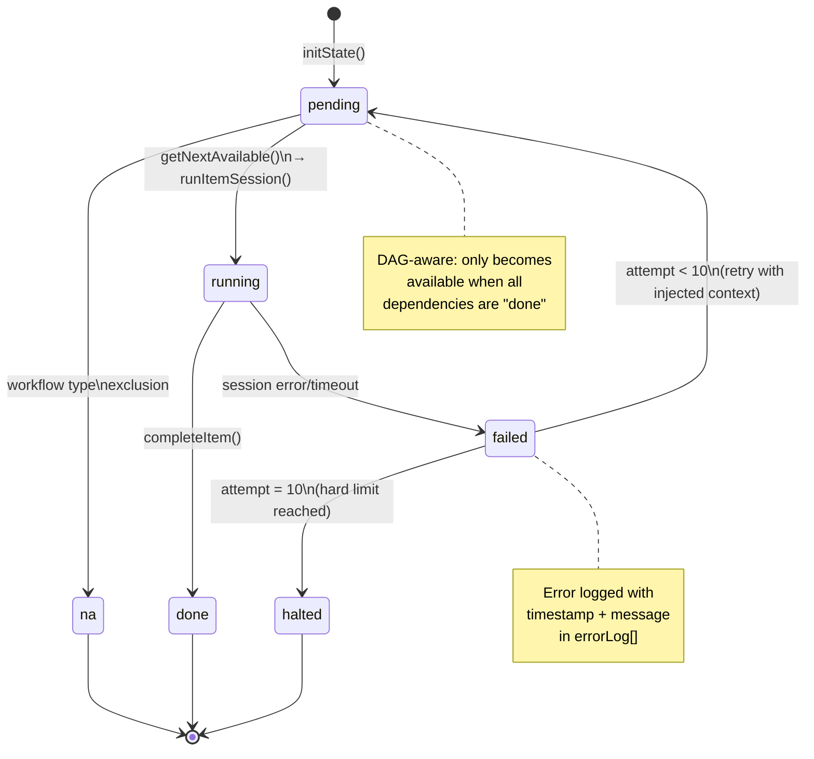
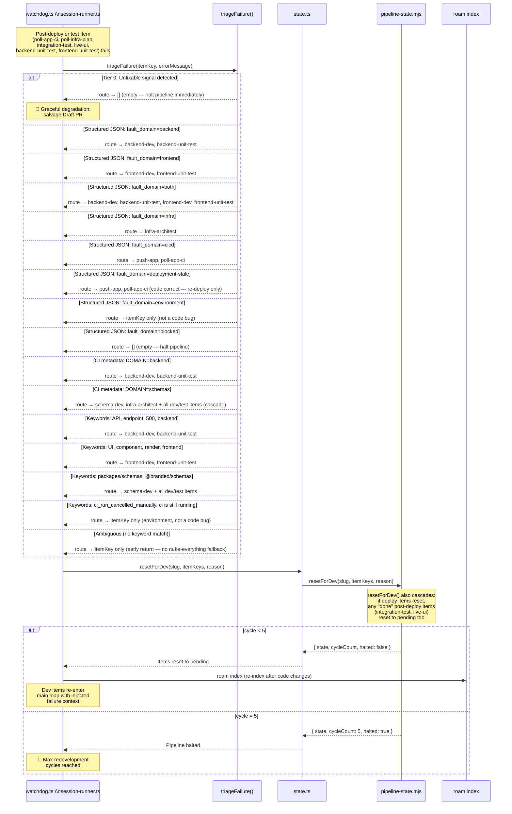
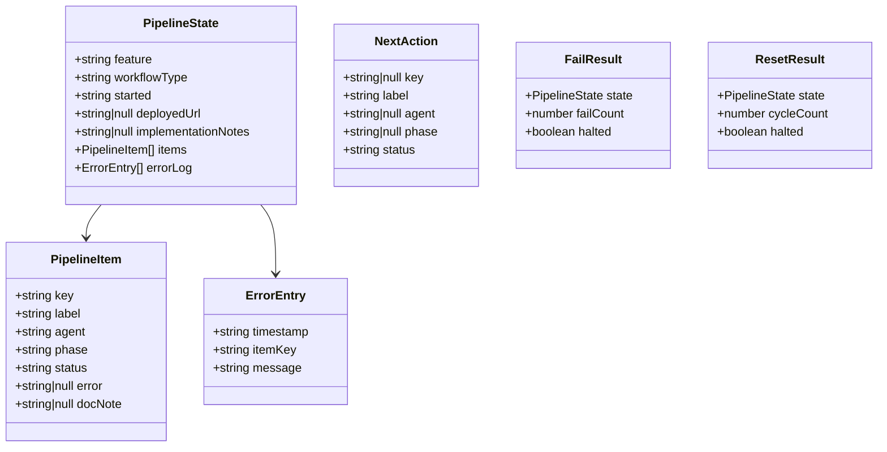
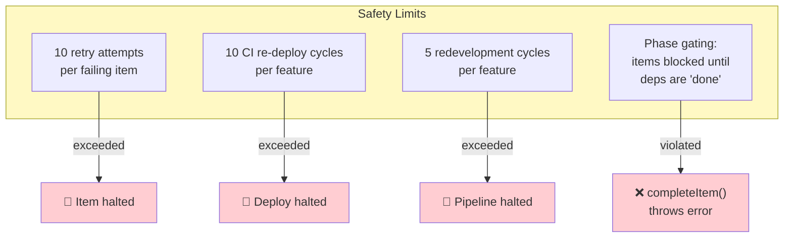
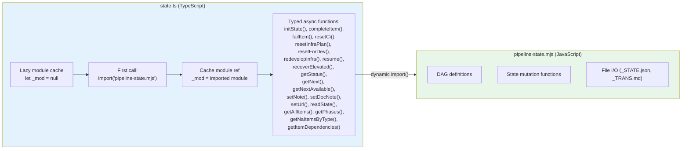

# Pipeline State Machine — DAG & Lifecycle

> 18 items across 6 phases, two-wave DAG with infrastructure-first approval gate, dependency-aware parallel scheduling, workflow type variations.
> Source: `tools/autonomous-factory/pipeline-state.mjs` (~468 lines) · `tools/autonomous-factory/src/state.ts` (~110 lines)
> Hub: [AGENTIC-WORKFLOW.md](../../.github/AGENTIC-WORKFLOW.md)

---

## Full DAG — 18 Pipeline Items (Two-Wave Architecture)

> This is the **dependency-level** view — which items depend on which and what can run in parallel. For the system-level architecture showing how the orchestrator, MCP servers, and state management connect, see [00-overview.md](00-overview.md). For how these items map to traditional SDLC stages, see [07-mental-model.md](07-mental-model.md).

The pipeline is split into **two waves** separated by a **human approval gate**:

- **Wave 1 (Infrastructure)** — Schemas, Terraform, push, Draft PR, plan CI, human approval, handoff
- **Wave 2 (Application)** — Backend + frontend dev/test, deploy, post-deploy verification, finalize

Wave 2 cannot start until the infrastructure approval gate is cleared and `infra-handoff` has written `infra-interfaces.md` with deployed resource URLs.

```mermaid
flowchart LR
    subgraph INFRA["Wave 1: Infrastructure"]
        SD["schema-dev\n(no deps)"]
        IA["infra-architect"]
        PI["push-infra"]
        DPR["create-draft-pr"]
        PIP["poll-infra-plan"]
    end

    subgraph APPROVAL["Approval Gate"]
        AIA["⏸ await-infra-approval\n(human gate)"]
        IH["infra-handoff"]
    end

    subgraph PRE["Wave 2: Pre-Deploy"]
        BD["backend-dev"]
        FD["frontend-dev"]
        BUT["backend-unit-test"]
        FUT["frontend-unit-test"]
    end

    subgraph DEPLOY["Deploy"]
        PA["push-app"]
        PAC["poll-app-ci"]
    end

    subgraph POST["Post-Deploy"]
        IT["integration-test"]
        IT --> LU["live-ui"]
    end

    subgraph FINAL["Finalize"]
        CC["code-cleanup"]
        DA["docs-archived"]
        PPR["publish-pr"]
    end

    SD --> IA --> PI --> DPR --> PIP --> AIA --> IH
    SD & IH --> BD & FD
    BD --> BUT
    FD --> FUT
    BUT & FUT --> PA --> PAC
    PAC --> IT
    IT & LU --> CC
    CC --> DA --> PPR

    style INFRA fill:#e8f5e9
    style APPROVAL fill:#fff9c4,stroke:#f9a825,stroke-width:2px
    style PRE fill:#e3f2fd
    style DEPLOY fill:#fff9c4
    style POST fill:#fff3e0
    style FINAL fill:#f3e5f5
```

### Dependency Table

| Item | Phase | Depends On | Can Run In Parallel With |
|------|-------|-----------|------------------------|
| `schema-dev` | infra | — | (first) |
| `infra-architect` | infra | schema-dev | — |
| `push-infra` | infra | infra-architect | — |
| `create-draft-pr` | infra | push-infra | — |
| `poll-infra-plan` | infra | create-draft-pr | — |
| `await-infra-approval` | approval | poll-infra-plan | — ⏸ human gate |
| `infra-handoff` | approval | await-infra-approval | — |
| `backend-dev` | pre-deploy | schema-dev, infra-handoff | frontend-dev |
| `frontend-dev` | pre-deploy | schema-dev, infra-handoff | backend-dev |
| `backend-unit-test` | pre-deploy | backend-dev | frontend-unit-test |
| `frontend-unit-test` | pre-deploy | frontend-dev | backend-unit-test |
| `push-app` | deploy | backend-unit-test, frontend-unit-test | — |
| `poll-app-ci` | deploy | push-app | — |
| `integration-test` | post-deploy | poll-app-ci | — |
| `live-ui` | post-deploy | poll-app-ci, integration-test | — |
| `code-cleanup` | finalize | integration-test, live-ui | — |
| `docs-archived` | finalize | code-cleanup | — |
| `publish-pr` | finalize | docs-archived | — |

---

## Workflow Types

Each workflow type prunes irrelevant items at `pipeline:init`. All types run Wave 1 (infra), approval gate, and finalize phases — the pruning targets Wave 2 app items.

```mermaid
flowchart TB
    subgraph FS["Full-Stack (all 18 items)"]
        direction LR
        FS1["schema-dev"] --> FS_IA["infra-architect"] --> FS_PI["push-infra"] --> FS_DPR["create-draft-pr"] --> FS_PIP["poll-infra-plan"] --> FS_AIA["⏸ approval"] --> FS_IH["infra-handoff"]
        FS1 & FS_IH --> FS2["backend-dev"] & FS3["frontend-dev"]
        FS2 --> FS4["backend-unit-test"]
        FS3 --> FS5["frontend-unit-test"]
        FS4 & FS5 --> FS6["push-app"] --> FS7["poll-app-ci"]
        FS7 --> FS8["integration-test"] --> FS9["live-ui"]
        FS8 & FS9 --> FS10["code-cleanup"] --> FS11["docs-archived"] --> FS12["publish-pr"]
    end

    subgraph BE["Backend (N/A: frontend-dev, frontend-unit-test, live-ui)"]
        direction LR
        BE1["schema-dev"] --> BE_IA["infra-architect"] --> BE_PI["push-infra"] --> BE_DPR["create-draft-pr"] --> BE_PIP["poll-infra-plan"] --> BE_AIA["⏸ approval"] --> BE_IH["infra-handoff"]
        BE1 & BE_IH --> BE2["backend-dev"]
        BE2 --> BE4["backend-unit-test"]
        BE4 --> BE6["push-app"] --> BE7["poll-app-ci"]
        BE7 --> BE8["integration-test"]
        BE8 --> BE10["code-cleanup"] --> BE11["docs-archived"] --> BE12["publish-pr"]
    end

    subgraph FE["Frontend (N/A: schema-dev, backend-dev, backend-unit-test, integration-test)"]
        direction LR
        FE_IA["infra-architect"] --> FE_PI["push-infra"] --> FE_DPR["create-draft-pr"] --> FE_PIP["poll-infra-plan"] --> FE_AIA["⏸ approval"] --> FE_IH["infra-handoff"]
        FE_IH --> FE3["frontend-dev"]
        FE3 --> FE5["frontend-unit-test"]
        FE5 --> FE6["push-app"] --> FE7["poll-app-ci"]
        FE7 --> FE9["live-ui"]
        FE9 --> FE10["code-cleanup"] --> FE11["docs-archived"] --> FE12["publish-pr"]
    end

    subgraph INF["Infra (N/A: all Wave 2 app items)"]
        direction LR
        INF1["schema-dev"] --> INF_IA["infra-architect"] --> INF_PI["push-infra"] --> INF_DPR["create-draft-pr"] --> INF_PIP["poll-infra-plan"] --> INF_AIA["⏸ approval"] --> INF_IH["infra-handoff"]
        INF_IH --> INF11["docs-archived"] --> INF12["publish-pr"]
    end

    style FS fill:#e8f5e9
    style BE fill:#e3f2fd
    style FE fill:#fff3e0
    style INF fill:#f3e5f5
```

### N/A Items Per Workflow Type

| Workflow | Skipped Items (auto-N/A) | Active Count |
|----------|-------------------------|:---:|
| **Full-Stack** | (none) | 18 |
| **Backend** | `frontend-dev`, `frontend-unit-test`, `live-ui` | 15 |
| **Frontend** | `backend-dev`, `backend-unit-test`, `integration-test`, `schema-dev` | 14 |
| **Infra** | `frontend-dev`, `frontend-unit-test`, `backend-dev`, `backend-unit-test`, `integration-test`, `live-ui`, `schema-dev`, `code-cleanup`, `push-app`, `poll-app-ci` | 8 |

> **Note:** Wave 1 infra items (`infra-architect` through `infra-handoff`), `docs-archived`, and `publish-pr` are always active for **all** workflow types. The Infra workflow type skips all Wave 2 app items — only the infra wave + docs + PR run.

---

## Item Status Lifecycle

---

## Redevelopment Reroute Flow

> This is the **implementation-level** view showing function calls between modules. For the failure recovery state machine with all transition states, see [01-watchdog.md](01-watchdog.md#failure-recovery). For how this replaces traditional manual debugging, see [07-mental-model.md](07-mental-model.md#what-the-recovery-loop-replaces).

### poll-app-ci / poll-infra-plan Deterministic Triage Path

When `poll-app-ci` or `poll-infra-plan` fails, the orchestrator handles triage **inline** — no Copilot agent session is created. The flow is:

1. `poll-ci.sh` runs with `stdio: "pipe"` and `maxBuffer: 5MB`, filtered to the relevant workflows (app or infra) via `CI_WORKFLOW_FILTER`
2. On failure, the script fetches truncated runner logs (`gh run view --log-failed | tail -n 250`) and writes a `CI_FAILURE.log` with a `DOMAIN:` header
3. Node's `execSync` throws — the catch block extracts `err.stdout` (CI logs) and `err.stderr`
4. `failItem(slug, itemKey, capturedLogs)` persists the failure
5. `triageFailure(itemKey, capturedLogs, naItems)` routes to the correct dev items
6. `resetForDev(slug, resetKeys, errorMsg)` resets the pipeline
7. The function returns directly — no fall-through to the SDK session path

**Cancelled runs** emit `CI_RUN_CANCELLED_MANUALLY`, which matches `envSignals` in `triageByKeywords()` → routes to environment fault domain (retry the poll item only, don't reset dev items).

**Poll timeouts** (exit code 2) trigger a transient retry loop — the polling item is retried without resetting any dev items.

**Post-deploy freshness checks:** After `poll-app-ci` succeeds, `verifyDeploymentFreshness()` compares deployed Azure Function endpoints against the last pushed SHA. If the live deployment is stale (serving old code), the orchestrator emits `deployment-stale` fault domain — reruns `push-app` + `poll-app-ci` without resetting dev items. A pre-deploy smoke check (`runPreDeploySmokeCheck()`) runs the same staleness detection *before* agent sessions to fail fast.

---

## State File Structure

### State Files

| File | Format | Purpose |
|------|--------|---------|
| `in-progress/<slug>_STATE.json` | JSON | Machine-readable state (read by orchestrator) |
| `in-progress/<slug>_TRANS.md` | Markdown | Human-readable view (auto-generated from state) |

> **Never edit state files directly.** Use pipeline commands via `npm run pipeline:*`.

---

## Hard Limits & Safety

---

## Pipeline Commands (npm scripts)

| Command | Purpose |
|---------|---------|
| `npm run pipeline:init <slug> <type>` | Initialize state for a new feature |
| `npm run pipeline:complete <slug> <key>` | Mark item as done |
| `npm run pipeline:fail <slug> <key> <msg>` | Mark item as failed |
| `npm run pipeline:reset-ci <slug>` | Reset deploy items (`push-app` + `poll-app-ci`) for CI retry |
| `npm run pipeline:reset-infra-plan <slug>` | Reset infra deploy items (`push-infra` + `poll-infra-plan`) for re-push |
| `npm run pipeline:redevelop-infra <slug> <reason>` | Reset Wave 1 infra items for redevelopment cycle |
| `npm run pipeline:resume <slug>` | Resume pipeline after successful elevated apply |
| `npm run pipeline:recover-elevated <slug> <msg>` | Recover pipeline after failed elevated apply |
| `npm run pipeline:status <slug>` | Show current pipeline state |
| `npm run pipeline:next <slug>` | Get next single item (naive order) |
| `npm run pipeline:next-available <slug>` | Get all parallelizable items (DAG-aware) |
| `npm run pipeline:set-note <slug> <note>` | Set implementation notes |
| `npm run pipeline:doc-note <slug> <key> <note>` | Set per-item doc-note for docs handoff |
| `npm run pipeline:set-url <slug> <url>` | Set deployed URL after deployment |

---

## state.ts — Typed Wrapper

> `state.ts` exists because the pipeline state machine is written in JavaScript (`.mjs`) for CLI use, but the orchestrator needs TypeScript types. The lazy-loaded dynamic import bridges the gap with zero re-imports after first call.

---

## Triage Tier Summary

| Tier | Signal Source | Example | Action |
|:---:|---|---|---|
| **0** | Unfixable patterns | `authorization_requestdenied`, `error acquiring state lock`, `resource already exists` | Return `[]` — halt pipeline, salvage Draft PR |
| **1** | Agent-emitted JSON | `{"fault_domain":"backend","diagnostic_trace":"..."}` | Deterministic routing by `fault_domain` |
| **2** | CI metadata header | `DOMAIN: backend,frontend` (from `poll-ci.sh`) | Job-name-based routing; schemas cascade to all |
| **3** | Legacy keywords | `api`, `500`, `cors`, `/backend/`, `/frontend/` | Fallback for SDK crashes; no-match → itemKey only |

> **Ambiguous fallback changed:** The zero-match keyword fallback now returns `[itemKey]` only (early return) — it no longer resets all dev items. This prevents a single ambiguous error from triggering a full pipeline reset.

---

*← [03 APM Context](03-apm-context.md) · [05 Agents →](05-agents.md)*
