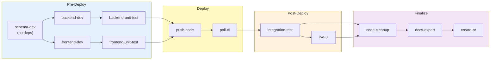
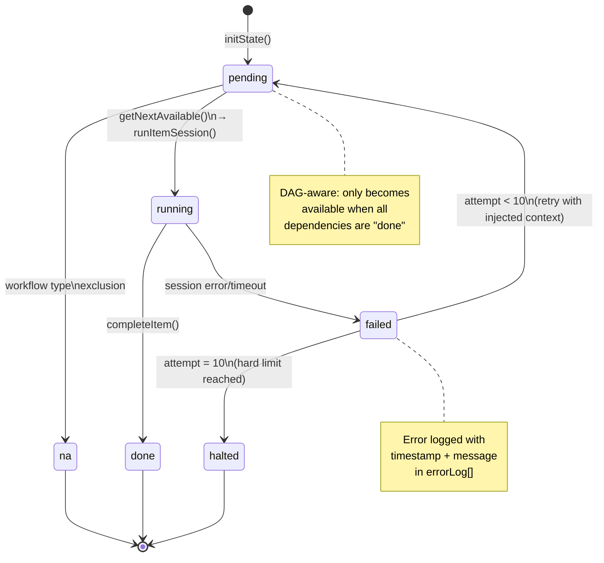
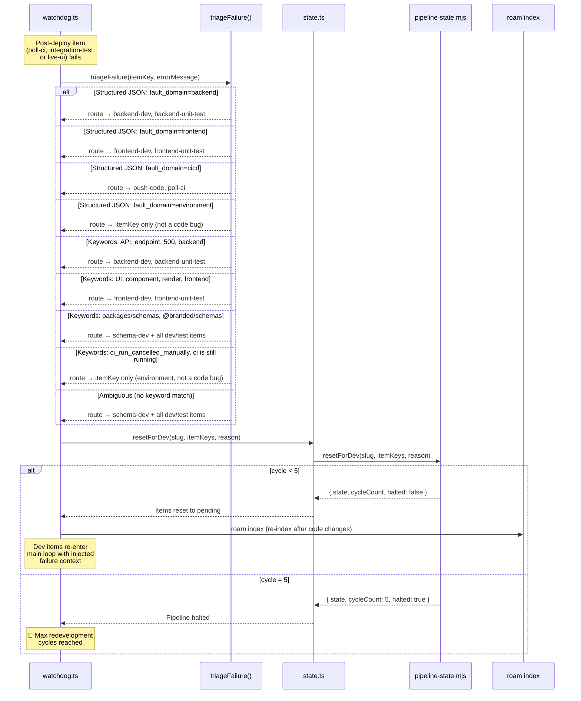
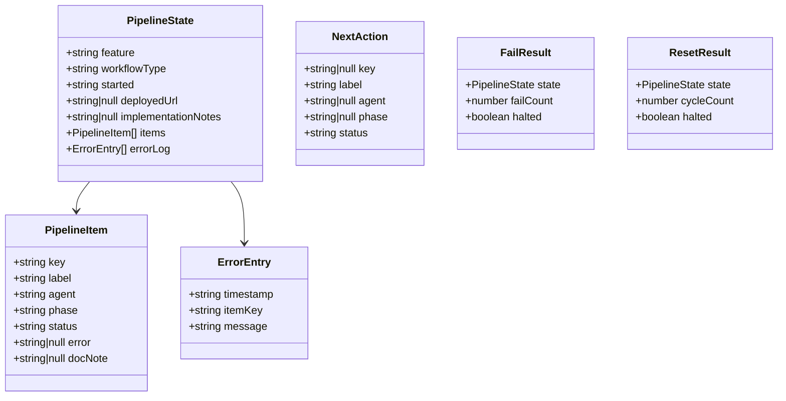
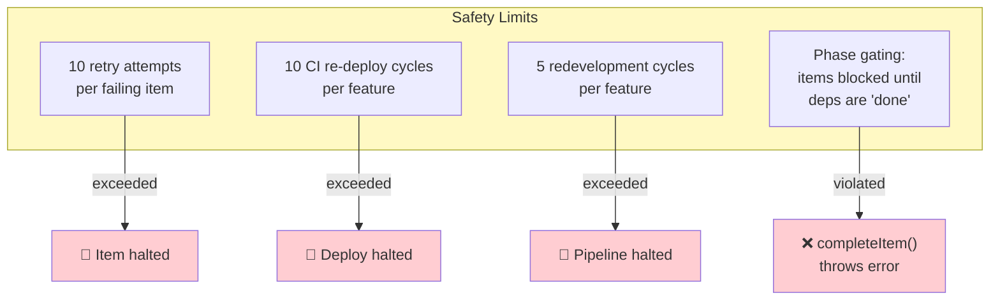
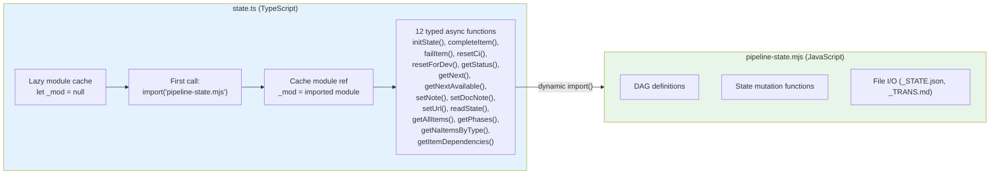

# Pipeline State Machine — DAG & Lifecycle

> 12 items across 4 phases, dependency-aware parallel scheduling, workflow type variations.
> Source: `tools/autonomous-factory/pipeline-state.mjs` (~468 lines) · `tools/autonomous-factory/src/state.ts` (~110 lines)
> Hub: [AGENTIC-WORKFLOW.md](../../.github/AGENTIC-WORKFLOW.md)

---

## Full DAG — 12 Pipeline Items

> This is the **dependency-level** view — which items depend on which and what can run in parallel. For the system-level architecture showing how the orchestrator, MCP servers, and state management connect, see [00-overview.md](00-overview.md). For how these items map to traditional SDLC stages, see [07-mental-model.md](07-mental-model.md).

### Dependency Table

| Item | Depends On | Can Run In Parallel With |
|------|-----------|------------------------|
| `schema-dev` | — | (first) |
| `backend-dev` | schema-dev | frontend-dev |
| `frontend-dev` | schema-dev | backend-dev |
| `backend-unit-test` | backend-dev | frontend-unit-test |
| `frontend-unit-test` | frontend-dev | backend-unit-test |
| `push-code` | backend-unit-test, frontend-unit-test | — |
| `poll-ci` | push-code | — |
| `integration-test` | poll-ci | — |
| `live-ui` | poll-ci, integration-test | — |
| `code-cleanup` | integration-test, live-ui | — |
| `docs-expert` | code-cleanup | — |
| `create-pr` | docs-expert | — |

---

## Workflow Types

```mermaid
flowchart TB
    subgraph FS["Full-Stack (all 12 items)"]
        direction LR
        FS1["schema-dev"] --> FS2["backend-dev"] & FS3["frontend-dev"]
        FS2 --> FS4["backend-unit-test"]
        FS3 --> FS5["frontend-unit-test"]
        FS4 & FS5 --> FS6["push-code"] --> FS7["poll-ci"]
        FS7 --> FS8["integration-test"]
        FS8 --> FS9["live-ui"]
        FS8 & FS9 --> FS10["code-cleanup"] --> FS11["docs-expert"] --> FS12["create-pr"]
    end

    subgraph BE["Backend (N/A: frontend-dev, frontend-unit-test, live-ui)"]
        direction LR
        BE1["schema-dev"] --> BE2["backend-dev"]
        BE2 --> BE4["backend-unit-test"]
        BE4 --> BE6["push-code"] --> BE7["poll-ci"]
        BE7 --> BE8["integration-test"]
        BE8 --> BE10["code-cleanup"] --> BE11["docs-expert"] --> BE12["create-pr"]
    end

    subgraph FE["Frontend (N/A: backend-dev, backend-unit-test, integration-test, schema-dev)"]
        direction LR
        FE3["frontend-dev"]
        FE3 --> FE5["frontend-unit-test"]
        FE5 --> FE6["push-code"] --> FE7["poll-ci"]
        FE7 --> FE9["live-ui"]
        FE9 --> FE10["code-cleanup"] --> FE11["docs-expert"] --> FE12["create-pr"]
    end

    subgraph INF["Infra (N/A: most dev & test items)"]
        direction LR
        INF2["backend-dev"]
        INF2 --> INF6["push-code"] --> INF7["poll-ci"]
        INF7 --> INF11["docs-expert"] --> INF12["create-pr"]
    end

    style FS fill:#e8f5e9
    style BE fill:#e3f2fd
    style FE fill:#fff3e0
    style INF fill:#f3e5f5
```

### N/A Items Per Workflow Type

| Workflow | Skipped Items (auto-N/A) |
|----------|-------------------------|
| **Full-Stack** | (none) |
| **Backend** | `frontend-dev`, `frontend-unit-test`, `live-ui` |
| **Frontend** | `backend-dev`, `backend-unit-test`, `integration-test`, `schema-dev` |
| **Infra** | `frontend-dev`, `frontend-unit-test`, `backend-unit-test`, `integration-test`, `live-ui`, `schema-dev`, `code-cleanup` |

---

## Item Status Lifecycle

---

## Redevelopment Reroute Flow

> This is the **implementation-level** view showing function calls between modules. For the failure recovery state machine with all transition states, see [01-watchdog.md](01-watchdog.md#failure-recovery). For how this replaces traditional manual debugging, see [07-mental-model.md](07-mental-model.md#what-the-recovery-loop-replaces).

### poll-ci Deterministic Triage Path

When `poll-ci` fails, the orchestrator handles triage **inline** — no Copilot agent session is created. The flow is:

1. `poll-ci.sh` runs with `stdio: "pipe"` and `maxBuffer: 5MB`
2. On failure, the script fetches truncated runner logs (`gh run view --log-failed | tail -n 250`) and echoes them to stdout
3. Node's `execSync` throws — the catch block extracts `err.stdout` (CI logs) and `err.stderr`
4. `failItem(slug, "poll-ci", capturedLogs)` persists the failure
5. `triageFailure("poll-ci", capturedLogs, naItems)` routes to the correct dev items
6. `resetForDev(slug, resetKeys, errorMsg)` resets the pipeline
7. The function returns directly — no fall-through to the SDK session path

**Cancelled runs** emit `CI_RUN_CANCELLED_MANUALLY`, which matches `envSignals` in `triageByKeywords()` → routes to environment fault domain (retry `poll-ci` only, don't reset dev items).

**Poll timeouts** (exit code 2) emit `"CI is still running"`, which also matches `envSignals` → same retry-only behavior.

---

## State File Structure

### State Files

| File | Format | Purpose |
|------|--------|---------|
| `in-progress/<slug>_STATE.json` | JSON | Machine-readable state (read by orchestrator) |
| `in-progress/<slug>_TRANS.md` | Markdown | Human-readable view (auto-generated from state) |

> **Never edit state files directly.** Use pipeline commands via `npm run pipeline:*`.

---

## Hard Limits & Safety

---

## Pipeline Commands (npm scripts)

| Command | Purpose |
|---------|---------|
| `npm run pipeline:init <slug> <type>` | Initialize state for a new feature |
| `npm run pipeline:complete <slug> <key>` | Mark item as done |
| `npm run pipeline:fail <slug> <key> <msg>` | Mark item as failed |
| `npm run pipeline:reset-ci <slug>` | Reset deploy items for CI retry |
| `npm run pipeline:status <slug>` | Show current pipeline state |
| `npm run pipeline:next <slug>` | Get next single item (naive order) |
| `npm run pipeline:next-available <slug>` | Get all parallelizable items (DAG-aware) |
| `npm run pipeline:set-note <slug> <note>` | Set implementation notes |
| `npm run pipeline:doc-note <slug> <key> <note>` | Set per-item doc-note for docs handoff |
| `npm run pipeline:set-url <slug> <url>` | Set deployed URL after deployment |

---

## state.ts — Typed Wrapper

> `state.ts` exists because the pipeline state machine is written in JavaScript (`.mjs`) for CLI use, but the orchestrator needs TypeScript types. The lazy-loaded dynamic import bridges the gap with zero re-imports after first call.

---

*← [03 APM Context](03-apm-context.md) · [05 Agents →](05-agents.md)*
