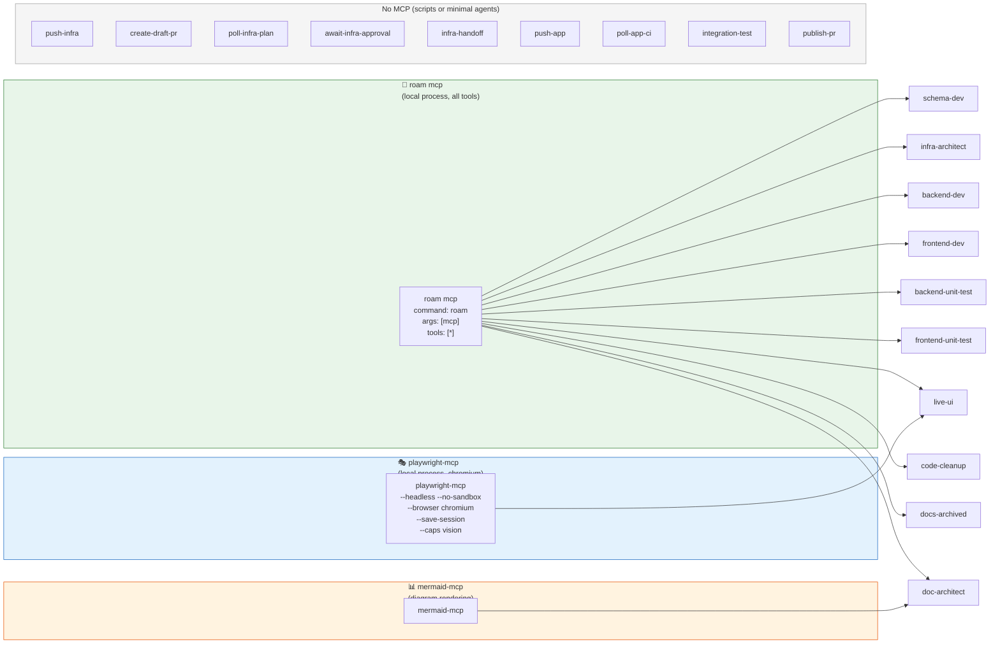
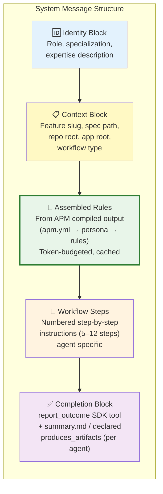
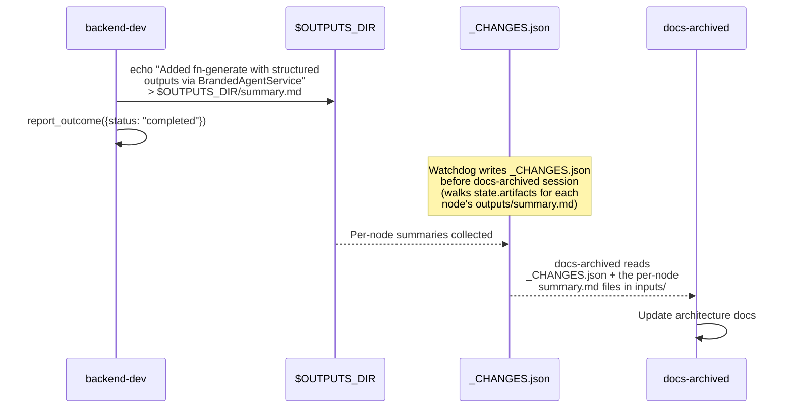
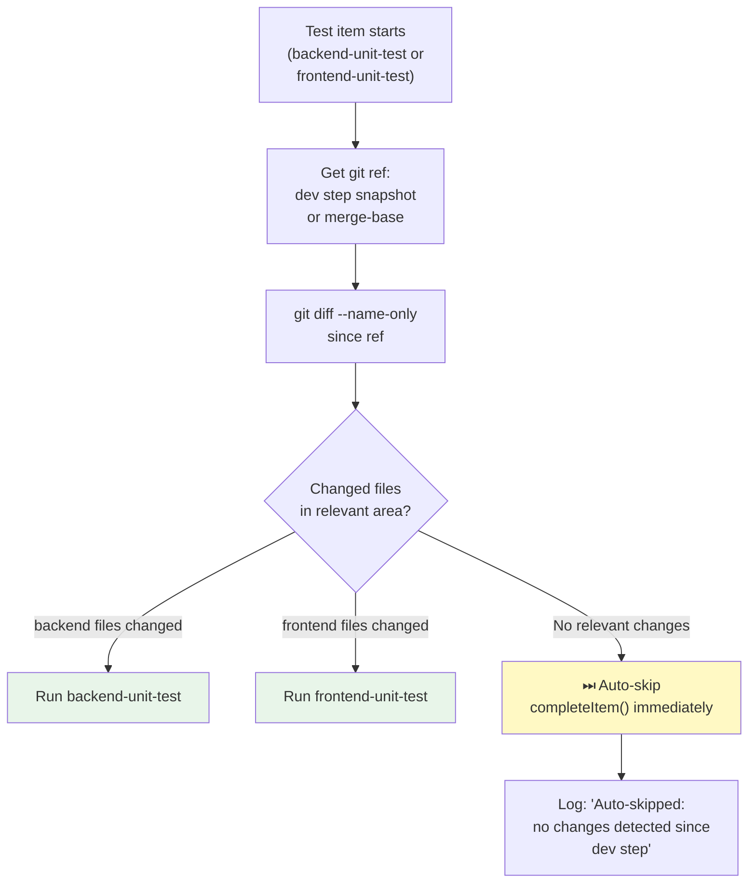
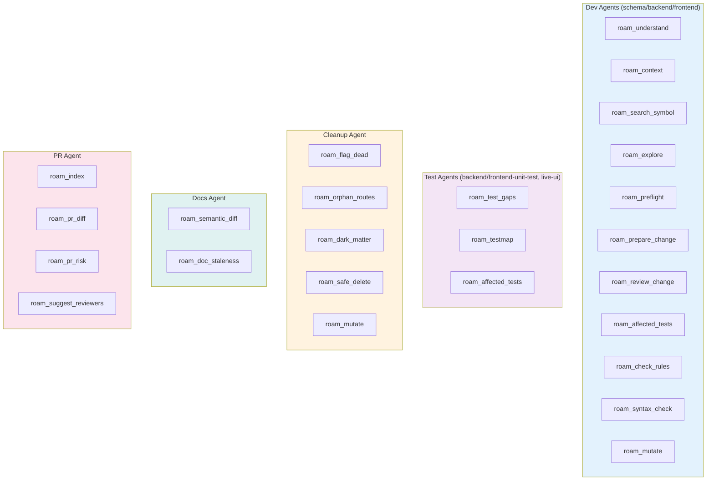
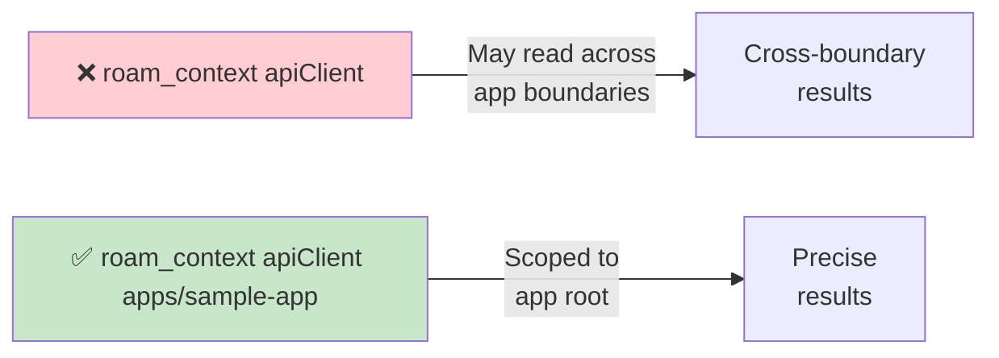
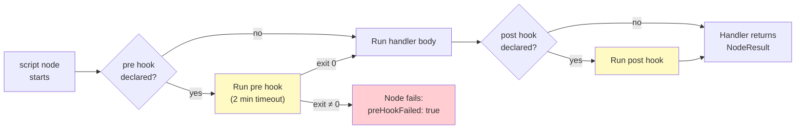

# Specialist Agents — Catalog & Configuration

> 19 pipeline items across 6 phases (two-wave architecture). 13 LLM-driven agents, 5 deterministic script bypasses, and one human approval gate. Each LLM agent gets its own Copilot SDK session with tailored prompt, model, and MCP servers.
> Source: `tools/autonomous-factory/src/apm/agents.ts` (prompt factory) · `tools/autonomous-factory/src/handlers/` (execution handlers)

---

## Agent-to-Phase Map

```mermaid
flowchart TB
    subgraph INFRA["Wave 1: Infrastructure"]
        direction LR
        A1["🔧 schema-dev\nShared Zod v4 schemas\n(@branded/schemas)"]
        A2["🏗️ infra-architect\nTerraform HCL\n+ validate + plan"]
        A3["🚀 push-infra\nDeterministic push\n(no LLM)"]
        A4["📋 create-draft-pr\nDraft PR + TF plan\nposted as comment"]
        A5["⏳ poll-infra-plan\nPoll deploy-infra CI\n(no LLM)"]
    end

    subgraph APPROVAL["Approval Gate"]
        direction LR
        A6["⏸ await-infra-approval\nHuman reviews TF plan\n/dagent approve-infra"]
        A7["📦 infra-handoff\nCapture TF outputs →\ninfra-interfaces.md"]
    end

    subgraph PRE["Wave 2: Pre-Deploy"]
        direction LR
        A8["⚙️ backend-dev\nBackend + Infra Dev"]
        A9["🎨 frontend-dev\nNext.js 16 + React 19\n+ Playwright E2E tests"]
        A10["🧪 backend-unit-test\nJest unit tests\n+ schema validation"]
        A11["🧪 frontend-unit-test\nJest unit tests\n+ RTL"]
    end

    subgraph DEP["Deploy"]
        direction LR
        A12["🚀 push-app\nDeterministic push\n(no LLM)"]
        A13["⏳ poll-app-ci\nPoll deploy CI\n(no LLM)"]
    end

    subgraph POST["Post-Deploy"]
        direction LR
        A14["🔌 integration-test\nLive API tests\nvia APIM endpoint"]
        A15["🖥️ live-ui\nAST-driven E2E + deep\ndiagnostic interception"]
    end

    subgraph FIN["Finalize"]
        direction LR
        A16["🧹 code-cleanup\nDead code removal"]
        A17["📝 docs-archived\nArchitecture docs\nupdate"]
        A17B["📐 doc-architect\nArchitecture &\nRisk Assessment"]
        A18["📦 publish-pr\nPromote Draft PR\n+ risk assessment"]
    end

    INFRA --> APPROVAL --> PRE --> DEP --> POST --> FIN

    style INFRA fill:#e8f5e9
    style APPROVAL fill:#fff9c4,stroke:#f9a825,stroke-width:2px
    style PRE fill:#e3f2fd
    style DEP fill:#fff9c4
    style POST fill:#fff3e0
    style FIN fill:#f3e5f5
```



---

## Agent Capability Matrix

| # | Agent | Phase | Type | MCP Servers | Timeout | Model | Roam Rules |
|---|-------|-------|------|-------------|---------|-------|------------|
| 1 | `schema-dev` | infra | LLM | roam | 20 min | claude-opus-4.6 | roam-tool-rules |
| 2 | `infra-architect` | infra | LLM | roam | 20 min | claude-opus-4.6 | roam-tool-rules |
| 3 | `push-infra` | infra | **Script** | — | 15 min | — | (deterministic bypass) |
| 4 | `create-draft-pr` | infra | LLM | — | 15 min | claude-opus-4.6 | (always only) |
| 5 | `poll-infra-plan` | infra | **Script** | — | 15 min | — | (deterministic bypass) |
| 6 | `await-infra-approval` | approval | **Human gate** | — | ∞ | — | (no agent — pipeline pauses) |
| 7 | `infra-handoff` | approval | LLM | — | 20 min | claude-opus-4.6 | (always only) |
| 8 | `backend-dev` | pre-deploy | LLM | roam | 20 min | claude-opus-4.6 | roam-tool-rules, roam-efficiency |
| 9 | `frontend-dev` | pre-deploy | LLM | roam | 20 min | claude-opus-4.6 | roam-tool-rules, roam-efficiency |
| 10 | `backend-unit-test` | pre-deploy | LLM | roam | 10 min | claude-opus-4.6 | roam-test-intelligence |
| 11 | `frontend-unit-test` | pre-deploy | LLM | roam | 10 min | claude-opus-4.6 | roam-test-intelligence |
| 12 | `push-app` | deploy | **Script** | — | 15 min | — | (deterministic bypass) |
| 13 | `poll-app-ci` | deploy | **Script** | — | 15 min | — | (deterministic bypass) |
| 14 | `integration-test` | post-deploy | LLM | — | 20 min | claude-opus-4.6 | integration-testing |
| 15 | `live-ui` | post-deploy | LLM | playwright, roam | 20 min | claude-opus-4.6 | roam-tool-rules, roam-test-intelligence, e2e-testing-mandate |
| 16 | `code-cleanup` | finalize | LLM | roam | 20 min | claude-opus-4.6 | roam-tool-rules |
| 17 | `docs-archived` | finalize | LLM | roam | 20 min | claude-opus-4.6 | roam-tool-rules |
| 18 | `doc-architect` | finalize | LLM | roam, mermaid | 20 min | claude-opus-4.6 | roam-tool-rules |
| 19 | `publish-pr` | finalize | **Script** | — | 15 min | — | (deterministic bypass) |

> **Script** items execute deterministic shell commands — zero LLM tokens consumed. **Human gate** pauses the orchestrator and logs a message prompting for `/dagent approve-infra` on the Draft PR.
>
> **Scripts:** `push-infra`, `poll-infra-plan`, `push-app`, `poll-app-ci`, `publish-pr`
>
> **Handler Plugin System:** Each item type is dispatched to a registered handler in `handlers/`: `copilot-agent.ts` (LLM sessions), `local-exec.ts` (script execution — push, publish, tests, builds), `github-ci-poll.ts` (CI polling), `approval.ts` / `barrier.ts` (gates), `triage-handler.ts` (failure routing). Handlers implement the `NodeHandler` interface and return structured `NodeResult` objects — the reactive loop (`loop/pipeline-loop.ts`) + dispatch layer (`dispatch/`) manage all state transitions via the Pipeline Kernel.

---

## MCP Server Assignments



---

## System Prompt Anatomy

Every agent's system message follows a consistent 5-block structure:



### Example: backend-dev Workflow Steps

| Step | Action |
|------|--------|
| 1 | Read feature spec from `in-progress/` |
| 2 | `roam_understand` — codebase briefing |
| 3 | `roam_context` — locate relevant symbols |
| 4 | `roam_preflight` — blast radius check |
| 5 | Implement changes (Azure Functions + Terraform) |
| 6 | `roam_review_change` — verify impact |
| 7 | Write/update tests |
| 8 | `roam_check_rules` — SEC/PERF/COR/ARCH gate |
| 9 | `agent-commit.sh` — scoped commit |
| 10 | Write architectural summary to `$OUTPUTS_DIR/summary.md`; call `report_outcome({status: "completed"})` |

---

## Summary Handoff Pattern



> Dev agents leave 1–2 sentence architectural summaries as a declared `summary` artifact (`outputs/summary.md`). The `docs-archived` agent declares `consumes_artifacts: [{from: <each-dev-node>, kind: summary}]`; the dispatcher copies each upstream summary into `docs-archived`'s `inputs/` before the session starts. No CLI verb — the file *is* the handoff.

### Typed Handoff Artifacts

For structured inter-agent contracts beyond free-text summaries, dev agents emit **typed JSON handoff artifacts** as declared `produces_artifacts`. Unlike `summary.md` (human-readable), typed artifacts carry machine-parseable data — testid maps, affected routes, SSR-safety flags, deployment URLs — that downstream agents (SDET, test runners, deploy pollers) consume programmatically.

```mermaid
sequenceDiagram
    participant SD as storefront-dev
    participant FS as $OUTPUTS_DIR
    participant DISP as dispatcher<br/>(invocation-builder)
    participant SDET as @sdet-expert

    SD->>FS: write $OUTPUTS_DIR/storefront-handoff.json<br/>{"affectedRoutes":["/list","/detail"],<br/>"newTestIds":["widget-open-button","widget-modal"]}
    SD->>SD: report_outcome({status: "completed"})

    Note over DISP: Kernel validates declared<br/>produces_artifacts; SDET node<br/>declares consumes_artifacts: [{from: storefront-dev,<br/>kind: storefront-handoff}]

    DISP-->>SDET: Copies storefront-handoff.json<br/>into SDET's inputs/<br/>+ inputs/params.in.json manifest
    SDET->>SDET: Read inputs/storefront-handoff.json<br/>→ generate E2E tests targeting<br/>exact routes + testids
```

| Mechanism | Declared `produces_artifacts: [<kind>]` on the producer + `consumes_artifacts: [{from, kind}]` on the consumer |
|-----------|--------------------------------------------------------------------------------------------------------------|
| **Validation** | Kernel verifies `outputs/<kind>.<ext>` exists on `report_outcome(completed)`; missing → `errorSignature: missing_required_output:<kind>` |
| **Storage** | `<inv>/outputs/<kind>.<ext>` (canonical) → copied into next dispatch's `<inv>/inputs/<kind>.<ext>` |
| **Consumers** | Downstream agents read from `inputs/`; script handlers via `$INPUTS_DIR/<kind>.<ext>` |

> Triage handoff uses this same channel: triage emits `outputs/triage-handoff.json`; rerouted dev nodes declare `consumes_reroute: [triage-handoff]` and read from `inputs/triage-handoff.json`. No `pendingContext` string — the JSON artifact is the only re-entrance contract.

---

## Auto-Skip Optimization



> Auto-skip prevents running test suites when the corresponding dev step made no changes. Detects this via `git diff --name-only` against a per-step snapshot or merge-base ref.

---

## Agent Prompt Builders

| Function | Agent(s) | Key Content |
|----------|----------|-------------|
| `schemaDevPrompt()` | schema-dev | Zod v4 schemas, @branded/schemas, validate:schemas |
| `infraArchitectPrompt()` | infra-architect | IaC validate + plan, infra-interfaces.md (identity from APM instructions) |
| `infraHandoffPrompt()` | infra-handoff | Capture `terraform output -json`, write infra-interfaces.md |
| `backendDevPrompt()` | backend-dev | Backend + infra dev, TypeScript (identity from APM instructions). **Dual-scope commits:** app changes via `backend` scope, `.github/workflows/` changes via `cicd` scope |
| `frontendDevPrompt()` | frontend-dev | Next.js 16, React 19, Playwright E2E mandate. **Dual-scope commits:** app changes via `frontend` scope, `.github/workflows/` changes via `cicd` scope |
| `backendTestPrompt()` | backend-unit-test, integration-test | Jest unit tests (pre-deploy) OR integration tests (post-deploy) |
| `frontendUiTestPrompt()` | frontend-unit-test, live-ui | Jest (pre-deploy) OR AST-driven Playwright E2E with deep diagnostic interception (post-deploy) |
| `deployManagerPrompt()` | push-infra, push-app | Deterministic push via `agent-commit.sh` (no LLM fallback) |
| `pollCiPrompt()` | poll-infra-plan, poll-app-ci | Deterministic CI polling via `poll-ci.sh` (no LLM fallback) |
| `prCreatorPrompt()` | create-draft-pr, publish-pr | Draft PR creation (Wave 1) or promote to ready-for-review + risk assessment (finalize) |
| `codeCleanupPrompt()` | code-cleanup | roam_flag_dead, roam_orphan_routes, roam_dark_matter |
| `docsExpertPrompt()` | docs-archived | _CHANGES.json, doc-notes, architecture docs |
| `docArchitectPrompt()` | doc-architect | Executive Architect — _ARCHITECTURE.md + _RISK-ASSESSMENT.md (Mermaid diagrams) |

---

## Agent Roam Tool Usage Summary



---

## Monorepo Scoping Rule



> All dev agents must append `${appRoot}` (e.g., `apps/sample-app`) to roam commands to avoid reading symbols from other apps in the monorepo.

---

## Failure Classification & Triage Routing

When post-deploy or test items fail, `triageFailure()` in `handlers/triage-handler.ts` (invoked from `loop/pipeline-loop.ts`) routes the fix to the responsible dev agent. Triage is **4-tiered** — evaluated in order:

| Tier | Source | Example | Routing |
|:---:|---|---|---|
| **0** | Unfixable signals | `authorization_requestdenied`, `error acquiring state lock` | `[]` — halt pipeline, salvage Draft PR |
| **1** | Agent JSON `fault_domain` | `{"fault_domain":"backend"}` | Deterministic: backend-dev + backend-unit-test |
| **2** | CI `DOMAIN:` header | `DOMAIN: backend,frontend` | Job-based: schemas cascade to all |
| **3** | Legacy keywords | `api`, `500`, `cors`, `/backend/` | Fallback; no-match → `[itemKey]` only |

### Fault Domain Routing

| Fault Domain | Items Reset |
|---|---|
| `backend` | backend-dev, backend-unit-test |
| `frontend` | frontend-dev, frontend-unit-test |
| `both` | backend-dev, backend-unit-test, frontend-dev, frontend-unit-test |
| `backend+infra` | backend-dev, backend-unit-test |
| `frontend+infra` | frontend-dev, frontend-unit-test |
| `infra` | infra-architect |
| `cicd` | push-app, poll-app-ci |
| `deployment-stale` | push-app, poll-app-ci (code correct — re-deploy only) |
| `environment` | itemKey only (retry, not a code bug) |
| `blocked` | `[]` — halt pipeline (unfixable) |

---

## Local-Exec Script Nodes

Script-type nodes with `script_type: local-exec` execute shell commands natively (zero LLM cost). The `local-exec` handler supports `pre` and `post` hooks for lifecycle management:

### Pre/Post Hooks

All script-type nodes support optional `pre` and `post` hooks — shell commands that run before and after the handler body.

- **`pre`** — Runs before the main command on every attempt (including first). If it exits non-zero, the node fails immediately without running the expensive body command. Timeout: 2 minutes. Use for: killing stale processes from previous runs, validating environment health (SSR smoke check, dev server startup).
- **`post`** — Runs after the handler body completes successfully. Use for: cleanup (killing dev servers, browser processes), validation hooks. For local-exec nodes, post-hook failure is non-fatal (logged as warning).



> **Framework knowledge stays in workflows.yml.** The kernel executes `pre`/`post` hooks blindly — it contains no awareness of what they check. Each project declares its own hook logic.

---

*← [04 State Machine](04-state-machine.md) · [06 Roadmap →](06-roadmap/)*
