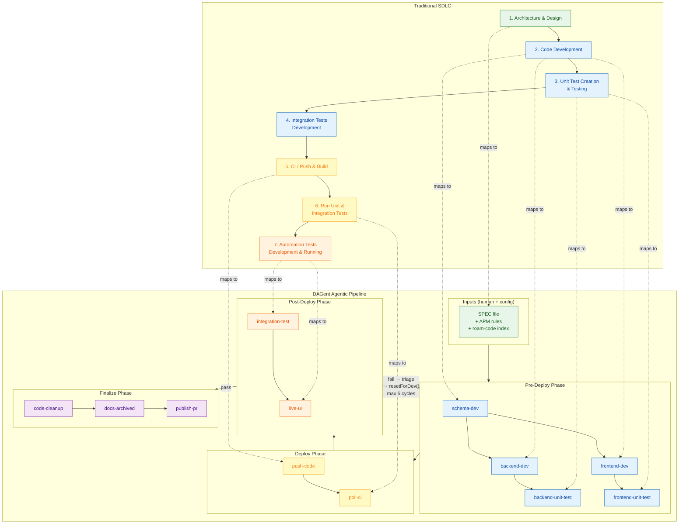
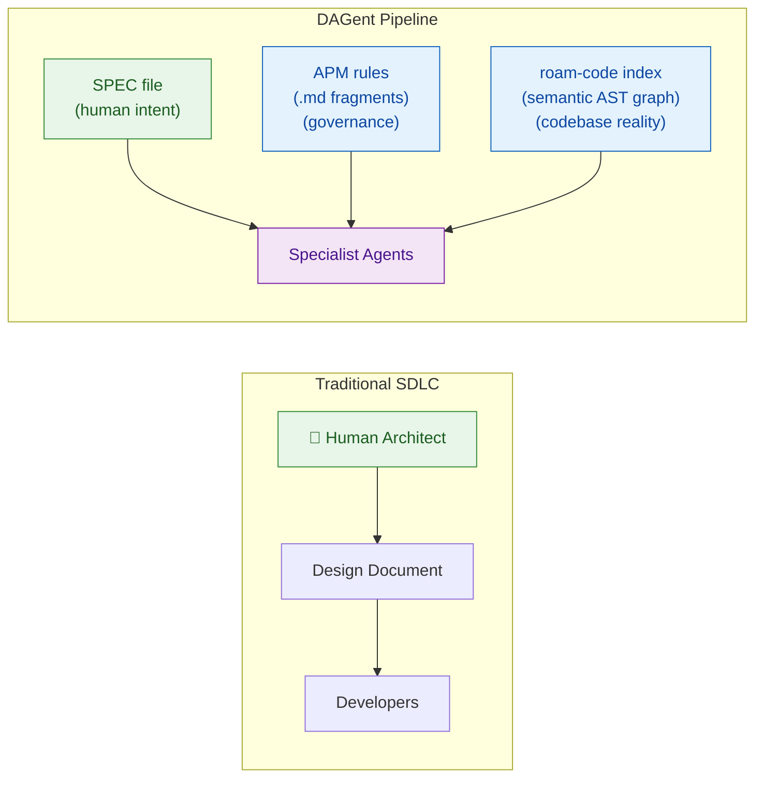
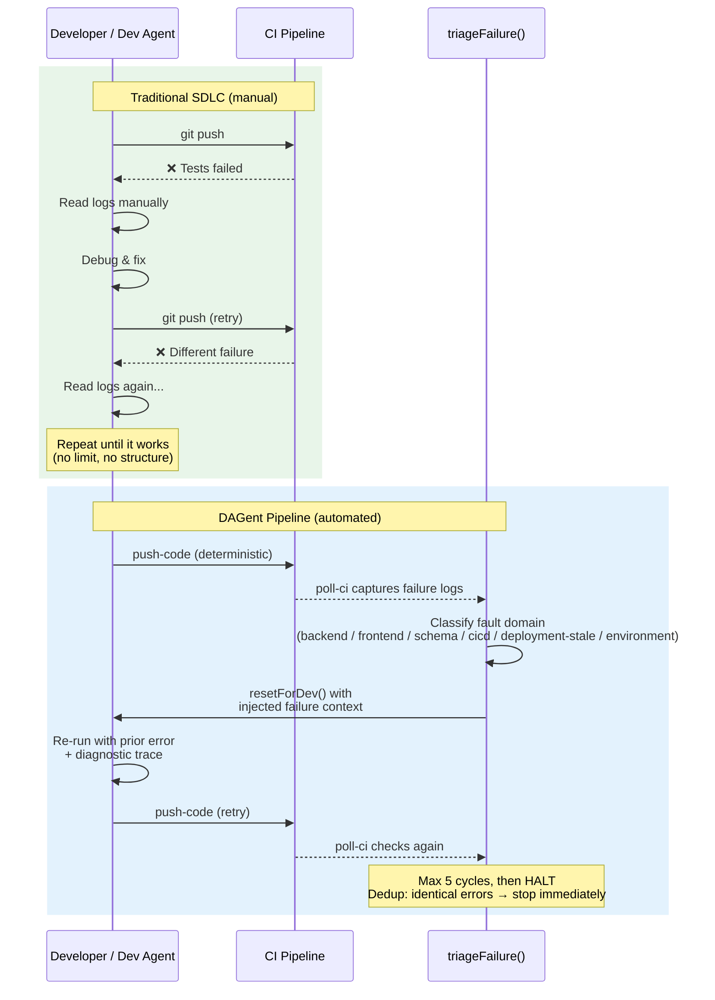

# Mental Model — From Traditional SDLC to Agentic Pipeline

> The pipeline mirrors the stages of human software development — design, develop, test, deploy, verify — but replaces human judgment with deterministic orchestration and specialist agents. This document maps the familiar to the unfamiliar.
>
> Hub: [AGENTIC-WORKFLOW.md](../../.github/AGENTIC-WORKFLOW.md)

---

## The Two Flows Side by Side

Both flows follow the same fundamental progression: **Design → Develop → Test → Deploy → Verify**. The agentic pipeline preserves this structure but adds parallelism, automated recovery, and mandatory finalization.

> **Go deeper:** For the full system architecture with MCP servers and state management, see [00-overview.md](00-overview.md). For the DAG dependency graph with parallel scheduling details, see [04-state-machine.md](04-state-machine.md). For the 13 LLM specialist agents and their capabilities, see [05-agents.md](05-agents.md).

---

## Stage-by-Stage Mapping

| # | Traditional Stage | Agentic Equivalent | Who / What Does It | Key Difference |
|---|---|---|---|---|
| 1 | **Architecture & Design** | SPEC file + APM rules + roam-code index | Human writes SPEC; APM manifest declares governance rules; roam-code builds structural graph | Architecture is **declarative** (SPEC + config), not a design meeting. Roam-code provides the structural intelligence a human architect carries in memory |
| 2 | **Code Development** (sequential) | `schema-dev` → `backend-dev` + `frontend-dev` (parallel) | 3 specialist LLM agents with roam MCP tools | **Parallelism**: backend and frontend develop simultaneously. **Schema-first**: shared types established before either consumer starts |
| 3 | **Unit Test Creation & Testing** | `backend-unit-test` + `frontend-unit-test` | 2 specialist test agents (separate from dev agents) | Tests written by **separate agents** with test-specific intelligence (`roam_test_gaps`, `roam_testmap`), not by the same developer who wrote the code |
| 4 | **Integration Tests Development** | `integration-test` | Specialist agent running against **live** Azure deployment | Tests hit real deployed infrastructure through APIM — not local mocks or stubs. Development and execution happen in one step |
| 5 | **CI / Push & Build** | `push-code` + `poll-ci` | Deterministic shell scripts (no LLM) | No human "git push" + tab-switch-to-CI. Deterministic lockfile validation, automated failure log capture |
| 6 | **Run Unit & Integration Tests** | `poll-ci` (captures CI results) | `poll-ci.sh` polls GitHub Actions, `triage.ts` classifies failures | CI failures are **automatically triaged** by fault domain and routed back to the responsible dev agent |
| 7 | **Automation Tests (E2E)** | `live-ui` | Specialist agent with Playwright MCP + roam | Real browser against real deployment. AST-driven E2E with deep diagnostic interception (console, network, localStorage) |
| — | *(does not exist)* | **Self-healing recovery loop** | `triageFailure()` → `resetForDev()` | Up to 5 redevelopment cycles. Post-deploy failures route back to the correct dev agent with injected failure context |
| — | *(manual / often skipped)* | **Finalize**: `code-cleanup`, `docs-archived`, `doc-architect`, `publish-pr` | 4 specialist agents | Dead code removal, doc updates, architecture & risk assessment, and PR creation are **mandatory automated stages**, not afterthoughts |

---

## Where Architecture Lives

In traditional development, a human architect holds context in their head and communicates it through design documents and meetings. In the agentic pipeline, that role is distributed across three machine-readable inputs:

- **SPEC** carries **intent** — what the feature should do (written by the human)
- **APM rules** carry **governance** — how code must be written (auth patterns, error codes, test mandates)
- **roam-code** carries **structural reality** — what the codebase actually looks like right now (AST graph, dependencies, blast radius)

Together, these three inputs give each agent the same contextual grounding a human architect would provide — without a design meeting.

---

## What the Recovery Loop Replaces

The most novel aspect of the agentic pipeline is the **self-healing recovery loop**. In traditional development, a developer manually reads CI logs, debugs, and retries. The agentic pipeline automates this entire cycle:

**Key differences:**
- Traditional: unstructured, unlimited manual retries
- Agentic: **structured triage** classifies failures by fault domain → routes to the correct agent → injects failure context → bounded retries (max 5 cycles) → deduplication circuit breaker stops identical errors immediately

---

## Parallelism Compared

Traditional development is largely sequential — one developer (or team) context-switches between tasks. The agentic pipeline exploits parallelism wherever dependencies allow:

```mermaid
gantt
    title Time Comparison: Traditional vs. Agentic
    dateFormat X
    axisFormat %s

    section Traditional SDLC
    Architecture & Design          :t1, 0, 20
    Backend Development            :t2, after t1, 30
    Frontend Development           :t3, after t2, 30
    Backend Unit Tests             :t4, after t3, 15
    Frontend Unit Tests            :t5, after t4, 15
    CI / Push                      :t6, after t5, 5
    Run Tests in CI                :t7, after t6, 10
    Integration Tests              :t8, after t7, 20
    E2E / Automation Tests         :t9, after t8, 20

    section DAGent Pipeline
    SPEC + APM + roam index        :a0, 0, 10
    schema-dev                     :a1, after a0, 10
    backend-dev                    :a2, after a1, 20
    frontend-dev                   :a3, after a1, 20
    backend-unit-test              :a4, after a2, 10
    frontend-unit-test             :a5, after a3, 10
    push-code                      :a6, after a4, 2
    poll-ci                        :a7, after a6, 8
    integration-test               :a8, after a7, 15
    live-ui                        :a9, after a8, 15
    code-cleanup + docs + PR       :a10, after a9, 10
```

The agentic pipeline is faster not because agents code faster than humans, but because **independent work runs in parallel** — `backend-dev` and `frontend-dev` execute simultaneously, as do their unit test agents. The traditional flow forces these into a serial queue.

---

## Key Principles

| Principle | Traditional SDLC | DAGent Pipeline |
|---|---|---|
| **Orchestration** | Human judgment + project board | Deterministic TypeScript `while`-loop with DAG scheduler |
| **Parallelism** | Limited (one developer context-switches) | DAG-scheduled (independent items run simultaneously) |
| **Architecture source** | Human architect's memory + design docs | SPEC (intent) + APM rules (governance) + roam-code (structural reality) |
| **Test authorship** | Same developer writes code and tests | Separate specialist test agents with dedicated test intelligence |
| **Failure response** | Human reads logs, debugs, retries manually | Automated triage → fault classification → targeted reroute → bounded retry |
| **CI interaction** | Manual push, manual monitoring | Deterministic push, automated polling + log capture |
| **Post-deploy verification** | Manual QA or scheduled test suite | Live integration + Playwright E2E as mandatory pipeline stages |
| **Code cleanup** | Optional, often skipped | Mandatory pipeline stage (roam-powered dead-code analysis) |
| **Documentation** | Often skipped or deferred | Mandatory pipeline stage (`docs-archived` reads all change manifests) |
| **PR creation** | Manual with copy-paste description | Automated with risk assessment, change manifest, and reviewer suggestions |
| **Recovery from failure** | Ad-hoc human debugging (no limit) | Structured: triage → classify → reset → retry (max 5 cycles, dedup circuit breaker) |

---

## The Core Insight

The traditional SDLC stages exist because they work — decades of software engineering have proven the **Design → Develop → Test → Deploy → Verify** progression. The agentic pipeline doesn't replace this progression; it **preserves the stages while changing who executes them and how they connect**.

What changes:

1. **Serial becomes parallel** — independent work runs simultaneously
2. **Manual becomes deterministic** — CI push, polling, and triage are shell scripts, not LLM decisions
3. **Optional becomes mandatory** — cleanup, docs, and post-deploy testing are pipeline stages, not afterthoughts
4. **Unstructured retry becomes structured recovery** — fault domain classification replaces "read the logs and figure it out"
5. **Human architect becomes distributed context** — SPEC + APM + roam-code replace design meetings

What stays the same:

1. **A human defines what to build** — the SPEC file is the starting point
2. **A human reviews the result** — the PR is the ending point
3. **Tests gate deployment** — CI must pass before post-deploy runs
4. **Integration tests hit real infrastructure** — no mocking the deploy target
5. **The progression is sequential at the phase level** — you can't verify before you deploy

---

*<- [06 Roadmap](06-roadmap/) . [AGENTIC-WORKFLOW.md ->](../../.github/AGENTIC-WORKFLOW.md)*
