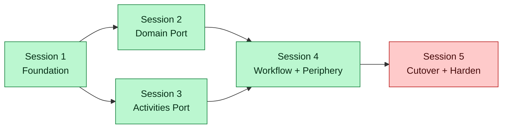

# Temporal Migration — Master Plan

> Engineering plan to migrate the DAGent orchestration kernel from the in-process `PipelineKernel` to Temporal OSS (self-hosted).
> Audience: GitHub Copilot Planning Agents supervising the migration, and human reviewers approving cutover.
> Strategic context: see [../../../narrative/](../../../narrative/) and the principal-architect notes for partner-readiness rationale.

---

## Why this plan exists

The current orchestrator works for single-tenant in-process use. To productize for org-wide use and partner integrations (Salesforce, Google Antigravity), we need:

- Durable execution with replay-based recovery
- First-class signals/queries for human-in-the-loop gates
- Standard observability surface (Temporal Web UI + OpenTelemetry)
- Multi-tenant operational model

Temporal OSS (MIT licensed, self-hosted) provides all four. The migration replaces ~30% of the engine (kernel, loop, state-store, resume logic) while preserving the IP-bearing layers (APM, handlers, triage, artifact contracts).

See [00-spec.md](00-spec.md) for the full architectural mapping and risk register.

---

## Session-Based Execution Model

The migration is decomposed into **5 GitHub Copilot Planning Agent sessions**. Each session:

- Has a single Planning Agent supervising 1–2 implementing Copilot Agents
- Is independently committable (the project remains functional after each session ends)
- Has explicit go/no-go criteria gating the next session
- Maps to a clear PR or stack of PRs

| # | Session | Phases | Scope summary | Reversible? | Effort (1 eng) |
|---|---|---|---|---|---|
| 1 | [Foundation](session-1-foundation.md) | 0 · 1 · 2 | Spec, Temporal infra, SDK introduction (additive) | Yes — pure addition | 9–12 days |
| 2 | [Domain Port](session-2-domain-port.md) | 3 | Pure domain logic copied into workflow scope; `DagState` class | Yes — old code untouched | 4–5 days |
| 3 | [Activities Port](session-3-activities.md) | 4 | Each handler → Temporal activity (5 activities) | Yes — old handlers still exist | 10–14 days |
| 4 | [Workflow & Periphery](session-4-workflow-and-periphery.md) | 5 · 6 | Full workflow body, signals, queries, OTel, admin CLI rewrite | Yes (running both paths) | 9–13 days |
| 5 | [Cutover & Hardening](session-5-cutover-and-harden.md) | 7 · 8 | Delete legacy kernel/loop/state-store; production hardening | **No — irreversible** | 8–11 days |

**Total: 40–55 working days** for one engineer; ~6–7 calendar weeks for two engineers running parallel work where the dependency graph allows.

---

## Session Dependency Graph



Sessions 2 and 3 can run in parallel by separate engineers/agents — they touch disjoint code areas (domain logic vs handler/activity wrapping).

---

## Hard Rules for Implementing Agents

These constraints apply to every session. Planning Agents should enforce them.

1. **No production behaviour change until Session 5.** Sessions 1–4 add code beside existing code; the legacy `npm run agent:run` path keeps working throughout.
2. **Determinism scope is enforced by ESLint.** Files under `src/temporal/workflow/` cannot import `node:fs`, `node:child_process`, `Date.now`-using code, or any adapter directly. This rule lands in Session 1 and remains enforced.
3. **Activities never mutate workflow state directly.** Activities return `NodeResult`; the workflow applies the result to its in-memory `DagState`. Same observer-pattern invariant as today's handlers.
4. **No `_state.json` reads inside workflows.** Workflow state lives in Temporal history; legacy state files are read-only legacy until Session 7.
5. **Every PR runs the existing test suite *plus* the new Temporal integration tests.** No regression in the legacy path while it still exists.
6. **Workflow versioning starts at v1.** Use `patched()` from the moment Session 5 ships; treat each post-cutover code change as a versioned migration.

---

## Session Doc Structure

Each session doc follows the same template so Planning Agents can supervise consistently:

```
1. Session Goal — one paragraph
2. Phases Included — list with cross-links
3. Pre-flight Checks — what must be true before kickoff
4. Planning Agent Prompt — copy-pasteable supervisor brief
5. Implementation Tasks — broken down for Copilot Agent dispatch
6. Files Affected — listed by create/modify/delete
7. Test Strategy — what proves the session succeeded
8. Exit Criteria — go/no-go for next session
9. Rollback Plan — if this session goes wrong
```

---

## Operating Rhythm

Recommended cadence per session:

1. **Kickoff** — human reviewer + Planning Agent confirm pre-flight, paste Planning Agent prompt
2. **Daily standup checkpoint** — Planning Agent reports progress against tasks
3. **Mid-session review** — at ~50% task completion, human reviews PR stack
4. **Exit review** — human signs off on exit criteria; gate to next session

---

## Reference Documents

- [00-spec.md](00-spec.md) — Architectural mapping (current → Temporal), risk register, ADR
- [session-1-foundation.md](session-1-foundation.md) — Phases 0-2
- [session-2-domain-port.md](session-2-domain-port.md) — Phase 3
- [session-3-activities.md](session-3-activities.md) — Phase 4
- [session-4-workflow-and-periphery.md](session-4-workflow-and-periphery.md) — Phases 5-6
- [session-5-cutover-and-harden.md](session-5-cutover-and-harden.md) — Phases 7-8

External:
- Temporal docs: https://docs.temporal.io/
- Temporal TypeScript SDK: https://typescript.temporal.io/
- Self-hosting guide: https://docs.temporal.io/self-hosted-guide

---

## Out of Scope

Tracked elsewhere; do **not** mix into this migration:

- `LlmSessionRunner` port refactor (close the Copilot SDK leak in handlers)
- A2A protocol adoption
- Web UI / dashboard
- APM spec publication as a public standard
- Multi-tenancy product features (RBAC, audit log, customer-export)

These are strategic workstreams. Each is independently valuable, but bundling them with the runtime migration would inflate the timeline 50%+ and dilute review focus.
